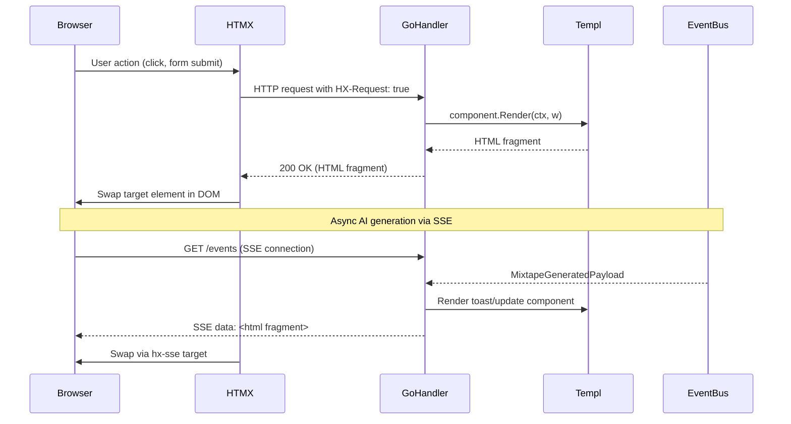

# ADR-0001: Chose HTMX + Templ over React SPA for Server-Driven UI

## Context and Problem Statement

Spotter is a Go application that aggregates listening history, syncs playlists across music services, and generates AI-powered mixtapes. How should the UI layer be implemented? The project needed an approach that kept business logic in Go (where integrations already live), minimized JavaScript complexity, and delivered reactive, partial-page updates for long-running async operations (AI generation, sync status).

## Decision Drivers

* All application logic lives in Go — a separate JavaScript frontend would split concerns across languages
* Long-running AI operations (mixtape generation, playlist enhancement) require real-time progress feedback without full-page reloads
* The application is self-hosted for personal use; bundle sizes, build complexity, and frontend toolchain overhead should be minimal
* Type safety and compile-time template correctness are preferred over runtime string interpolation
* The developer has Go expertise, not React/Vue ecosystem expertise

## Considered Options

* **HTMX + Templ** — server-rendered HTML fragments with hypermedia-driven interactions
* **React SPA** (with a Go JSON API backend) — full client-side rendering framework
* **Vue.js / Alpine.js** (lightweight SPA) — lighter client-side framework over React

## Decision Outcome

Chosen option: **HTMX + Templ**, because it keeps all rendering logic in Go, provides compile-time type safety for templates, and delivers reactive partial-page updates without a separate frontend build pipeline. HTMX's SSE extension directly integrates with the Go event bus for real-time AI operation feedback.

### Consequences

* Good, because all view logic stays in Go — no context switching between languages for backend developers
* Good, because Templ compiles templates to Go functions, catching template errors at build time rather than runtime
* Good, because HTMX `hx-swap`, `hx-target`, and SSE extension replace hundreds of lines of React state management
* Good, because no separate JavaScript build pipeline, API schema, or serialization layer is needed
* Bad, because complex client-side interactions (drag-and-drop, rich text editing) require Alpine.js or plain JS shims
* Bad, because HTMX's hypermedia model may feel unfamiliar to developers expecting a JSON API
* Bad, because CDN-loaded HTMX (unpkg.com) introduces an external dependency for script loading

### Confirmation

Compliance is confirmed by the presence of `.templ` files in `internal/views/` and `HX-Request`/`HX-Redirect`/`HX-Retarget` headers in handler code. No `package.json` React/Vue dependencies should exist — only `tailwindcss` and `daisyui` (CSS-only tooling).

## Pros and Cons of the Options

### HTMX + Templ

Server renders full HTML pages and partial HTML fragments. HTMX declaratively swaps DOM elements in response to HTTP responses. Templ provides a Go DSL that compiles to typed `templ.Component` functions.

* Good, because `h.Render(w, r, component)` is the entire rendering contract — no serialization layer
* Good, because Templ components are composable (e.g., `toast.templ`, `track_table.templ`) and reusable across pages
* Good, because HTMX SSE extension (`sse.js`) directly consumes the Go event bus for real-time updates
* Good, because 38 template files cover the full UI with no runtime reflection or string-based templates
* Neutral, because Alpine.js is still loaded for lightweight client interactions (modals, toggles)
* Bad, because HTMX 1.9.10 is loaded from CDN (`unpkg.com`) — no offline or self-hosted asset guarantee

### React SPA (with Go JSON API)

Client-side React application consuming a Go-served JSON API. All rendering in the browser, state managed in React.

* Good, because React has a large ecosystem, rich component libraries, and well-understood patterns
* Good, because the JSON API could be reused by mobile clients or third-party integrations
* Bad, because requires maintaining a separate frontend build (Vite/Webpack, npm, TypeScript) alongside Go
* Bad, because requires defining and maintaining a JSON API schema duplicating Go domain types
* Bad, because WebSockets or SSE would require additional client-side state management (Redux, Zustand)
* Bad, because introduces a second language/runtime (Node.js) into the development and deployment pipeline

### Vue.js / Alpine.js (Lightweight SPA)

Lighter client-side framework — Vue for components, or Alpine.js for minimal interactivity sprinkled onto server-rendered HTML.

* Good, because Alpine.js is already loaded in the base layout for existing interactive widgets
* Good, because lighter than React — smaller bundle, simpler tooling
* Neutral, because Alpine.js is used today as a complement to HTMX, not a replacement
* Bad, because still requires a JavaScript-centric rendering model for complex views
* Bad, because partial-page updates (e.g., sync status tiles) would require manual DOM diffing or Vue reactivity wiring

## Architecture Diagram

## More Information

* HTMX version: 1.9.10 (loaded from `unpkg.com` in `internal/views/layouts/base.templ:22`)
* Templ version: v0.3.977 (`go.mod:7`)
* Alpine.js: v3.x (CDN) — used for modal toggles and client-side widget state
* 38 `.templ` files across `internal/views/` covering all pages and reusable components
* SSE integration: `internal/handlers/sse.go` streams Templ-rendered fragments from `internal/events/bus.go`
* Related decision: The event bus design (in-memory pub/sub) was chosen to complement this SSE streaming pattern — see [ADR-0007](./ADR-0007-in-memory-event-bus.md)
