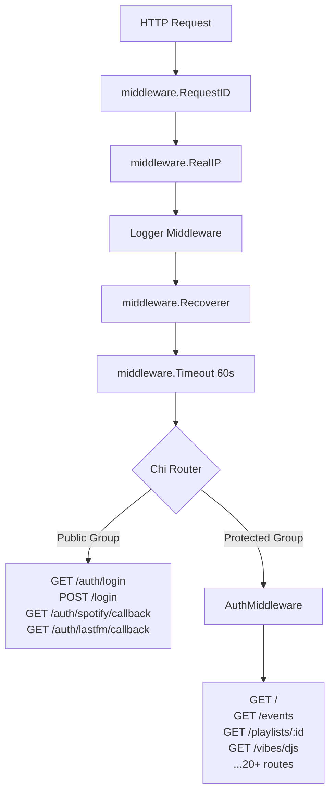

# ADR-0002: Chose Chi Router for Composable Middleware over Gin or Echo

## Context and Problem Statement

Spotter is a Go web application requiring HTTP routing, middleware composition (auth, logging, request IDs, timeouts), and grouped route hierarchies (public vs. protected). Which HTTP router/framework should be used to support these needs while remaining idiomatic and minimally opinionated?

## Decision Drivers

* Must support grouped routes with middleware applied at group scope (public auth routes vs. session-protected routes)
* Must be compatible with standard `net/http` handlers — the team doesn't want framework-specific handler signatures
* Middleware chain should be composable and easy to reason about
* No need for a full framework (templating, ORM, config) — those concerns are handled by dedicated libraries
* Lightweight footprint — avoid pulling in large transitive dependency trees for routing alone

## Considered Options

* **Chi** — lightweight, `net/http`-compatible router with composable middleware
* **Gin** — high-performance full-featured framework with its own context type
* **Echo** — similar to Gin; fast, feature-rich, own context type
* **Standard `net/http` + `gorilla/mux`** — stdlib-only with pattern-matching mux

## Decision Outcome

Chosen option: **Chi**, because it is fully compatible with `net/http.Handler` and `net/http.HandlerFunc`, supports grouped subrouters with per-group middleware, and ships with a high-quality middleware package covering all required cross-cutting concerns (request ID, real IP, logging, recovery, timeout) without requiring adoption of a framework-specific context type.

### Consequences

* Good, because all handlers use standard `http.ResponseWriter` + `*http.Request` — no framework-specific abstractions to learn or unwrap
* Good, because `r.Group(func(r chi.Router) { r.Use(AuthMiddleware) })` provides clean auth-gated route grouping
* Good, because Chi middleware is compatible with any `net/http`-compatible middleware from the broader Go ecosystem
* Good, because Chi's built-in middleware (`RequestID`, `RealIP`, `Recoverer`, `Timeout`) covers all cross-cutting concerns without additional dependencies
* Bad, because Chi has less built-in scaffolding than Gin/Echo — no automatic request binding or validation helpers (these are implemented manually in `handlers.go`)
* Bad, because Chi's smaller community means fewer third-party plugins compared to Gin/Echo ecosystems

### Confirmation

Compliance is confirmed by `go.mod` containing `github.com/go-chi/chi/v5` and all route handlers implementing the standard `func(http.ResponseWriter, *http.Request)` signature. No Gin or Echo imports should appear in the codebase.

## Pros and Cons of the Options

### Chi

Thin routing layer over `net/http`. Middleware is plain `func(http.Handler) http.Handler`. URL parameters via `chi.URLParam(r, "id")`.

* Good, because 100% `net/http` compatible — handlers work with any Go HTTP library unchanged
* Good, because `r.Group()` and `r.Route()` enable clean hierarchical route organization matching the auth model
* Good, because `middleware.Timeout(60 * time.Second)` and `middleware.Recoverer` are production-ready out of the box
* Good, because Chi's `chi.URLParam` integrates naturally with the handler pattern used throughout Spotter
* Neutral, because requires manual request body parsing — no automatic JSON binding
* Bad, because no built-in request validation or response helpers beyond the standard library

### Gin

Full-featured, high-performance HTTP framework with `*gin.Context` replacing `(w, r)`.

* Good, because built-in JSON binding, validation, and response helpers reduce boilerplate
* Good, because large ecosystem and extensive documentation
* Bad, because `*gin.Context` creates a hard dependency — all handlers and middleware must accept Gin's type
* Bad, because mixing `net/http` middleware from the ecosystem requires adapter wrappers
* Bad, because Spotter uses Templ (not JSON) for responses — Gin's binding/rendering helpers are unused overhead

### Echo

Similar to Gin — fast, full-featured, own `echo.Context`.

* Good, because similar performance profile to Gin with a slightly cleaner API
* Bad, because same `net/http` incompatibility concerns as Gin
* Bad, because framework lock-in without corresponding benefit for a Templ-based server-rendered app

### Standard `net/http` + `gorilla/mux`

Minimal routing over stdlib `http.ServeMux` or gorilla/mux pattern matching.

* Good, because zero additional dependencies with stdlib mux
* Good, because gorilla/mux is battle-tested and supports URL parameters and method routing
* Bad, because no built-in middleware composition — would require manual chaining or adopting a middleware library anyway
* Bad, because gorilla/mux has been in maintenance mode; no active development

## Architecture Diagram

## More Information

* Chi version: v5.2.3 (`go.mod`)
* Route definitions: `cmd/server/main.go:202-333`
* Middleware stack: `cmd/server/main.go:206-210`
* Custom auth middleware: `cmd/server/main.go:360-389`
* URL parameter usage: `chi.URLParam(r, "id")` in `internal/handlers/playlists.go`, `artists.go`, `albums.go`
