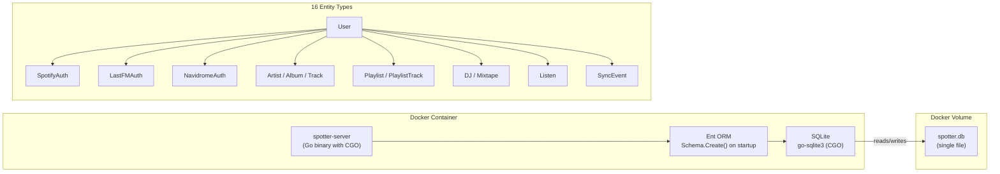

# ADR-0003: Chose SQLite as Embedded Database over PostgreSQL

## Context and Problem Statement

Spotter is a self-hosted personal music server companion. It requires a relational database to store 16 entity types spanning music catalog (artists, albums, tracks), listening history, playlist management, AI-generated mixtapes, OAuth credentials, and sync audit logs. Which database engine best fits a self-hosted, personal-use deployment model?

## Decision Drivers

* Spotter is designed for single-user, self-hosted deployment — it runs alongside a personal Navidrome server
* No external database service should be required; the app should run from a single Docker container or binary
* The data model is relational with complex foreign key relationships (user → playlists → tracks, artist → albums → listens)
* Concurrent write load is low — one user, periodic background syncs, not high-throughput
* Data persistence across container restarts requires only a mounted volume, not a separate service

## Considered Options

* **SQLite** — embedded file-based relational database, no server process required
* **PostgreSQL** — full-featured client-server RDBMS
* **MySQL / MariaDB** — alternative client-server RDBMS

## Decision Outcome

Chosen option: **SQLite**, because it requires no external process, runs embedded in the Go binary via CGO (`go-sqlite3`), supports the full relational schema via Ent ORM with foreign key enforcement (`_fk=1`), and reduces deployment to a single container mounting a volume for `spotter.db`. The single-user personal-use context means SQLite's write serialization limitations have no practical impact.

### Consequences

* Good, because deployment requires no external database service — one container, one volume mount
* Good, because foreign keys enabled (`_fk=1` in connection string) provide full relational integrity
* Good, because `client.Schema.Create()` auto-migrates schema on startup — no migration tooling needed for personal use
* Good, because SQLite is ACID-compliant with WAL mode available for improved read concurrency
* Bad, because CGO dependency (`mattn/go-sqlite3`) complicates cross-compilation and requires a C toolchain in the build environment (addressed via the multi-stage Dockerfile with a builder stage)
* Bad, because SQLite serializes writes — concurrent background syncs (sync, metadata, playlist sync tickers) must tolerate write contention or use connection pooling carefully
* Bad, because horizontal scaling (multiple app instances sharing one database) is not possible with SQLite

### Confirmation

Compliance is confirmed by `go.mod` containing `github.com/mattn/go-sqlite3` and `internal/database/db.go` opening the connection with the `sqlite3` driver. No PostgreSQL or MySQL driver imports should exist. The `SPOTTER_DATABASE_DRIVER` config key defaults to `sqlite3`.

## Pros and Cons of the Options

### SQLite

Embedded database accessed via CGO. Database is a single file (`spotter.db` by default). Full SQL support with foreign key enforcement.

* Good, because zero infrastructure — no additional container, port, or service in docker-compose
* Good, because `file:spotter.db?cache=shared&_fk=1` connection string enables shared cache and foreign key constraints
* Good, because Ent ORM's `Schema.Create()` handles all DDL automatically on startup
* Good, because data is a single portable file — backup is as simple as copying `spotter.db`
* Neutral, because CGO required — handled by the multi-stage Docker build (`golang:1.24` builder with C toolchain)
* Bad, because no built-in replication or read replicas
* Bad, because write lock contention possible during concurrent background sync tickers

### PostgreSQL

Full-featured RDBMS with client-server architecture, connection pooling, full-text search, JSON operators, and replication support.

* Good, because production-grade concurrency, connection pooling, and horizontal read scaling
* Good, because rich ecosystem — pgAdmin, managed cloud options (RDS, Cloud SQL, Supabase)
* Good, because advanced features (JSONB, CTEs, window functions) useful if data analysis features grow
* Bad, because requires a separate service in deployment — additional container, credentials, and network configuration
* Bad, because over-engineered for single-user personal-use with low write throughput
* Bad, because adds operational burden (backups, upgrades, monitoring a separate process)

### MySQL / MariaDB

Similar trade-offs to PostgreSQL but with a different feature set and default behaviors.

* Good, because wide hosting support and familiar to many developers
* Bad, because same deployment complexity concerns as PostgreSQL
* Bad, because foreign key behavior differences from PostgreSQL can cause subtle migration issues
* Bad, because no meaningful advantage over PostgreSQL for this use case

## Architecture Diagram

## More Information

* SQLite driver: `github.com/mattn/go-sqlite3` v1.14.17 (`go.mod`)
* Connection string: `sqlite3://file:spotter.db?cache=shared&_fk=1` (default in `.env.example`)
* Database initialization: `internal/database/db.go` — opens connection, registers encryption hooks, runs `Schema.Create()`
* Entity schema: `ent/schema/` — 16 `.go` files defining the full data model
* CGO requirement addressed by multi-stage Docker build: `golang:1.24` builder image includes C toolchain (see ADR-0003 and `Dockerfile`)
* Ent ORM choice is documented in ADR-0004
