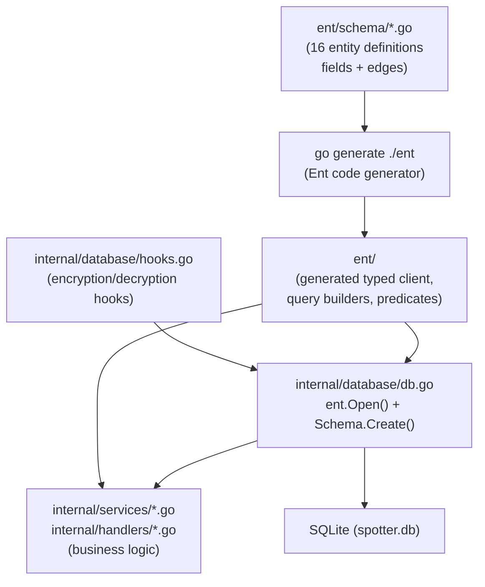

# ADR-0004: Chose Ent ORM for Type-Safe Schema-Driven Data Access over GORM or sqlc

## Context and Problem Statement

Spotter has a complex relational data model spanning 16 entity types with many-to-many relationships, encrypted fields, and evolving schema requirements. Which Go data access layer provides type safety, schema evolution, and support for relationship traversal without requiring manual SQL for every query?

## Decision Drivers

* The data model is a connected graph (User → Playlists → Tracks → Artists → Albums → Listens) requiring relationship traversal in multiple directions
* Schema must evolve as new features are added (e.g., Mixtapes, SimilarArtists) without manual migration SQL
* Sensitive fields (OAuth tokens) must be transparently encrypted/decrypted — this should not require changes to every call site
* Type safety at the query layer prevents runtime type-assertion errors on query results
* Code generation means the compiler catches incorrect field names or relationship traversals before runtime

## Considered Options

* **Ent** — Facebook-originated code-generation ORM with schema-as-Go-code and typed query builders
* **GORM** — popular Go ORM with struct tags and reflection-based queries
* **sqlc** — SQL-first code generation: write SQL, get typed Go functions
* **Raw `database/sql`** — stdlib with manual query writing and scanning

## Decision Outcome

Chosen option: **Ent**, because its schema-as-code approach in `ent/schema/` generates fully typed query builders, relationship traversal, and automatic DDL migration — all verified at compile time. The hook system enables transparent AES-256 encryption on sensitive fields without modifying any query call site. The 16-entity graph with bidirectional edges is a natural fit for Ent's edge-centric schema model.

### Consequences

* Good, because schema changes in `ent/schema/*.go` automatically generate updated query builders, client code, and migration DDL via `go generate ./ent`
* Good, because Ent hooks (`internal/database/hooks.go`) intercept Create/Update mutations to transparently encrypt/decrypt OAuth token fields
* Good, because relationship traversal uses typed edge methods (e.g., `user.QueryPlaylists().All(ctx)`) rather than manual JOIN SQL
* Good, because `client.Schema.Create(ctx)` performs non-destructive auto-migration on startup — no migration files to manage for personal use
* Bad, because Ent's generated code is verbose — `ent/` directory contains thousands of lines of generated Go
* Bad, because complex aggregate queries (e.g., listen counts by time period) require dropping to raw SQL or Ent's predicate system
* Bad, because Ent's learning curve is steeper than GORM for developers already familiar with ActiveRecord-style ORMs

### Confirmation

Compliance is confirmed by `go.mod` containing `entgo.io/ent`, the presence of `ent/schema/` with `.go` schema definitions, and the Makefile `generate` target running `go generate ./ent`. No GORM imports or raw `database/sql` query scanning should appear in business logic — only in `internal/database/db.go`.

## Pros and Cons of the Options

### Ent

Schema defined as Go structs with `Fields()` and `Edges()` methods. Code generator produces typed client, query builders, and predicates.

* Good, because all fields are typed — `field.String("username").Unique().NotEmpty().MaxLen(255)` generates validation and typed accessors
* Good, because edges define relationships — `edge.To("playlists", Playlist.Type)` generates `user.QueryPlaylists()` with full type safety
* Good, because hooks intercept mutations — `RegisterEncryptionHooks(client, encryptor)` in `db.go` adds transparent encryption to all OAuth token mutations
* Good, because `Schema.Create()` provides automatic, non-destructive DDL migration — no separate migration tooling needed
* Neutral, because generated code in `ent/` is large but never hand-edited
* Bad, because Ent is less idiomatic to developers expecting SQL-first or struct-tag-based patterns

### GORM

Reflection-based ORM where Go structs with tags define both schema and queries. Widely used in the Go ecosystem.

* Good, because familiar to developers coming from ActiveRecord, Django ORM, or other reflection-based ORMs
* Good, because large community and extensive documentation
* Bad, because reflection-based — field names are strings at runtime, typos cause runtime errors rather than compile errors
* Bad, because GORM hooks for transparent field encryption require more invasive struct-level callbacks
* Bad, because GORM's auto-migrate is less safe for complex schemas with foreign key constraints

### sqlc

SQL-first: write `.sql` queries, `sqlc generate` produces typed Go functions. No ORM abstractions.

* Good, because SQL is the source of truth — no abstraction layer between developer intent and database behavior
* Good, because generated functions are idiomatic Go with minimal magic
* Bad, because relationship traversal requires manual JOIN queries — no edge-based navigation
* Bad, because transparent field encryption would require wrapping every generated function
* Bad, because schema evolution requires writing both DDL migration SQL and new query SQL — more manual work

### Raw `database/sql`

Stdlib database access with manual `db.Query()`, `rows.Scan()`, and SQL strings.

* Good, because no dependencies — maximum control and transparency
* Bad, because maximum boilerplate — every query requires manual scanning into structs
* Bad, because no compile-time safety on field names, types, or relationships
* Bad, because transparent encryption must be manually applied at every read/write call site

## Architecture Diagram

## More Information

* Ent version: v0.14.5 (`go.mod`)
* Schema directory: `ent/schema/` — 16 entity files including `user.go`, `artist.go`, `mixtape.go`, `listen.go`
* Hook registration: `internal/database/db.go:21` — `RegisterEncryptionHooks(client, encryptor)`
* Hook implementation: `internal/database/hooks.go` — intercepts `SpotifyAuth`, `LastFMAuth`, `NavidromeAuth` mutations
* Code generation command: `go generate ./ent` (Makefile `generate` target)
* Encryption decision: see ADR-0006
* Database engine decision: see ADR-0003
