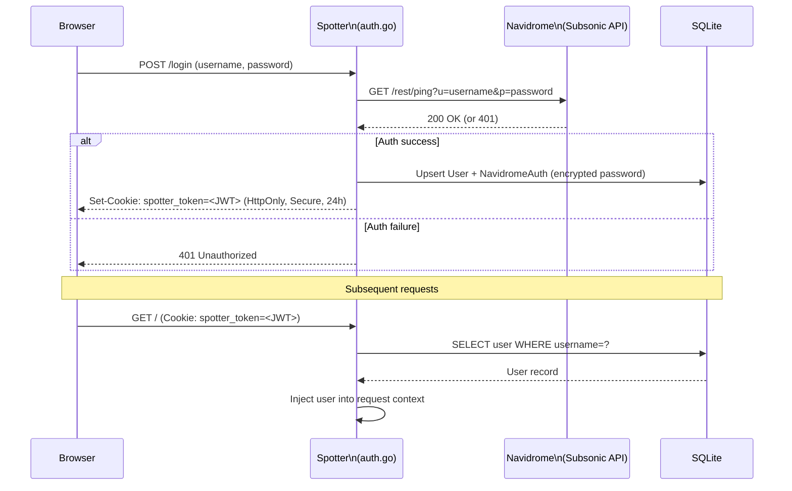

# ADR-0005: Delegate Primary Authentication to Navidrome Instead of Native User Accounts

## Context and Problem Statement

Spotter is a companion application for Navidrome, a self-hosted music server. Users who run Spotter already have a Navidrome account. How should Spotter authenticate users? Should it maintain its own credential store, or delegate to the existing Navidrome identity?

## Decision Drivers

* Every Spotter user already has a Navidrome account — creating a separate credential store would require users to manage two sets of credentials
* Spotter has no business owning passwords or managing password reset flows for a personal-use tool
* The Navidrome Subsonic API can validate username/password credentials — this can serve as an authentication proxy
* A JWT token cookie persisting the authenticated session is sufficient for a personal, single-user deployment
* Token expiry (24h) provides a reasonable re-authentication prompt without complex token refresh logic

## Considered Options

* **Navidrome passthrough authentication** — validate credentials against Navidrome's Subsonic API; store session as a signed cookie
* **Native user accounts** — manage hashed passwords in the local database, independent of Navidrome
* **OAuth2 / OpenID Connect** — delegate to an external identity provider (Google, GitHub, or a self-hosted IdP like Authentik)

## Decision Outcome

Chosen option: **Navidrome passthrough authentication**, because Spotter is explicitly designed as a Navidrome companion. Users already trust Navidrome with their credentials, Navidrome's Subsonic API validates them synchronously, and eliminating a second credential store removes both complexity and security risk. The JWT token cookie approach (HttpOnly, Secure, SameSite=Lax, 24h expiry) is appropriate for a personal LAN-accessible application.

### Consequences

* Good, because users have a single set of credentials — the Navidrome username/password works for both services
* Good, because Spotter never stores raw passwords — the Navidrome password is validated, then stored encrypted (AES-256) as `NavidromeAuth` for background API calls (syncing, metadata)
* Good, because no password hashing, reset flows, email verification, or user registration to implement or maintain
* Good, because authentication failure behavior (wrong password) is delegated to Navidrome's response
* Bad, because Spotter cannot authenticate if Navidrome is unreachable — auth is coupled to Navidrome availability
* Bad, because session cookies do not expire on Navidrome password change — a user changing their Navidrome password must also log out of Spotter
* Bad, because the session validation (AuthMiddleware) only checks that the JWT token is valid and the user exists in the local database, not that the Navidrome credentials are still valid

### Confirmation

Compliance is confirmed by the login flow in `internal/handlers/auth.go` calling `h.authenticateNavidrome(username, password)` before setting the session cookie. No bcrypt or argon2 imports should appear. The `NavidromeAuth` entity stores the encrypted password used by background sync services, not for login validation.

## Pros and Cons of the Options

### Navidrome Passthrough Authentication

On login: validate credentials against Navidrome Subsonic API → create/update local `User` and `NavidromeAuth` records → set `spotter_token` JWT cookie. On each request: `AuthMiddleware` reads and validates the JWT token cookie, looks up user in local DB, injects user into context.

* Good, because zero credential management — no hashing, salting, reset flows, or email required
* Good, because Navidrome already validates the credentials and manages the password store
* Good, because the encrypted `NavidromeAuth.Password` stored locally enables background API calls (sync, metadata) without requiring the user to be online
* Neutral, because JWT token validation is local (signature verification + user lookup in database) — Navidrome is not called on every request
* Bad, because Navidrome downtime blocks new logins (existing sessions continue to work)
* Bad, because session not invalidated on Navidrome password change

### Native User Accounts

Store bcrypt-hashed passwords in the database. Implement registration, password reset, and session management independently.

* Good, because fully independent of Navidrome availability for authentication
* Good, because standard, well-understood pattern with good library support (`golang.org/x/crypto/bcrypt`)
* Bad, because users must manage two sets of credentials (Navidrome + Spotter)
* Bad, because requires implementing password reset (email or recovery codes), registration, and account management UI
* Bad, because adds security responsibility — Spotter now owns credential storage and must handle breaches appropriately

### OAuth2 / OpenID Connect

Delegate to an external IdP. Users log in via Google, GitHub, or a self-hosted IdP like Authentik or Authelia.

* Good, because industry-standard, battle-tested authentication with strong security properties
* Good, because no credential storage whatsoever — fully delegated
* Bad, because requires either a cloud account (Google/GitHub) or operating yet another self-hosted service (Authentik)
* Bad, because significantly more complex to implement and configure than the personal-use context warrants
* Bad, because introduces an external dependency that may not be available in all self-hosted network configurations

## Architecture Diagram

## More Information

* Login handler: `internal/handlers/auth.go:PostLogin` — validates against Navidrome, sets cookie
* Auth middleware: `cmd/server/main.go:360-389` — reads cookie, queries local DB, injects context
* Cookie settings: HttpOnly=true, Secure=`config.Security.SecureCookies`, SameSite=Lax, Expires=24h (`internal/handlers/auth.go:119-127`)
* `NavidromeAuth` entity: stores encrypted Navidrome password for background API calls by sync/enrichment services
* Encryption of stored credentials: see [ADR-0006](./ADR-0006-aes256-gcm-application-layer-encryption.md)
