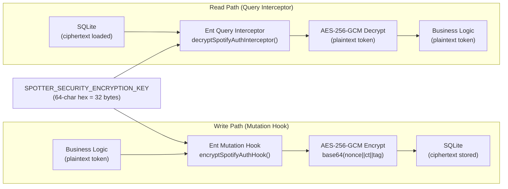

# ADR-0006: Application-Layer AES-256-GCM Encryption for OAuth Credentials at Rest

## Context and Problem Statement

Spotter stores OAuth access tokens, refresh tokens, and the Navidrome password in SQLite. These credentials grant access to users' music libraries and listening histories across Spotify, Last.fm, and Navidrome. If the SQLite database file is exposed (e.g., through a misconfigured volume mount, backup leak, or unauthorized host access), these credentials must not be readable in plaintext. How should sensitive credentials be protected at rest?

## Decision Drivers

* SQLite is an embedded file — the database file can be copied or read by anyone with filesystem access to the Docker volume
* OAuth tokens (Spotify access/refresh tokens, Last.fm session key) and the Navidrome password must be stored for use by background sync and enrichment services
* Encryption must be transparent to business logic — handlers and services should read/write plaintext credentials without knowing about encryption
* Key rotation should be possible without a full database migration
* The solution must use only the Go standard library (`crypto/aes`, `crypto/cipher`) to avoid additional dependencies
* SQLite Transparent Data Encryption (TDE) is not natively supported without third-party patched SQLite builds

## Considered Options

* **Application-layer AES-256-GCM** — encrypt fields in Go before writing to SQLite, decrypt after reading; implemented as Ent ORM hooks
* **SQLite TDE** (e.g., SQLCipher) — full-database encryption at the storage engine level
* **Plaintext storage** — store credentials unencrypted, rely on filesystem/OS permissions
* **Vault / external secrets manager** — store credentials in HashiCorp Vault or similar

## Decision Outcome

Chosen option: **Application-layer AES-256-GCM**, because it uses only Go standard library primitives (no additional binary dependencies), integrates transparently via Ent ORM hooks so all call sites read/write plaintext, provides authenticated encryption (GCM tag detects tampering), and enables key rotation by updating `SPOTTER_SECURITY_ENCRYPTION_KEY` and re-encrypting stored values. The hook-based approach in `internal/database/hooks.go` ensures encryption is applied consistently on every write and decryption on every read, with no risk of a call site accidentally storing plaintext.

### Consequences

* Good, because encryption is enforced at the ORM layer — no business logic code touches encrypted data, preventing accidental plaintext storage
* Good, because AES-256-GCM provides authenticated encryption — the GCM tag detects ciphertext tampering or corruption
* Good, because each ciphertext has a unique random nonce — identical plaintext values produce different ciphertexts (prevents frequency analysis)
* Good, because uses only `crypto/aes` and `crypto/cipher` from the Go standard library — no additional binary or CGO dependency
* Good, because `IsEncrypted()` heuristic enables backward-compatible migration of previously unencrypted values — they are encrypted on next write
* Bad, because if the encryption key (`SPOTTER_SECURITY_ENCRYPTION_KEY`) is lost, all stored credentials are irrecoverable
* Bad, because key rotation requires re-encrypting all stored credential rows (not automated — requires a migration step)
* Bad, because application-layer encryption does not protect against an attacker who has compromised the running process (they can call the same decrypt functions)

### Confirmation

Compliance is confirmed by `internal/database/hooks.go` registering encrypt hooks on `NavidromeAuth`, `SpotifyAuth`, and `LastFMAuth` mutations, and decrypt interceptors on their queries. No raw string values for passwords or tokens should appear unencrypted in `spotter.db`. The encryption key must be a 64-character hex string (32 bytes) configured in `SPOTTER_SECURITY_ENCRYPTION_KEY`.

## Pros and Cons of the Options

### Application-layer AES-256-GCM (via Ent Hooks)

Encrypt in `Encryptor.Encrypt()`, store base64(nonce || ciphertext || GCM-tag). Decrypt in `Encryptor.Decrypt()`. Hooks fire on every Ent mutation and query for the three auth entity types.

* Good, because standard library only — `crypto/aes`, `crypto/cipher`, `crypto/rand`, `encoding/base64`
* Good, because random 12-byte nonce per encryption — identical tokens produce distinct ciphertexts
* Good, because GCM authentication tag prevents undetected ciphertext modification
* Good, because Ent hooks ensure every code path encrypts/decrypts consistently
* Good, because `IsEncrypted()` heuristic allows backward-compatible migration of legacy plaintext rows
* Neutral, because encrypted values are larger than plaintext (base64 overhead + 12-byte nonce + 16-byte tag)
* Bad, because key is held in memory for the lifetime of the process — a process memory dump exposes the key

### SQLite TDE (SQLCipher)

Full-database encryption using a patched SQLite with built-in encryption support.

* Good, because entire database file is encrypted — no need to identify individual fields
* Good, because protects all data including future entities without per-field hook additions
* Bad, because requires a custom SQLite build (SQLCipher or similar) replacing the standard `mattn/go-sqlite3`
* Bad, because adds a significant binary dependency and complicates the Docker build
* Bad, because the database password must still be provided at runtime — key management problem is the same

### Plaintext Storage

Store OAuth tokens and passwords as plain strings in SQLite.

* Good, because zero implementation complexity
* Bad, because any user with filesystem access to `spotter.db` can read all OAuth tokens and the Navidrome password
* Bad, because a leaked backup file immediately compromises all connected services
* Unacceptable for a production deployment

### Vault / External Secrets Manager

Store credentials in HashiCorp Vault, AWS Secrets Manager, or similar.

* Good, because centralized secrets management with audit logs, rotation policies, and fine-grained ACLs
* Good, because credentials never touch the SQLite database at all
* Bad, because requires operating (or paying for) an additional service — antithetical to a simple self-hosted personal tool
* Bad, because significantly more complex to integrate and configure than the personal-use context warrants

## Architecture Diagram

## More Information

* Encryption implementation: `internal/crypto/encrypt.go` — `Encryptor` struct with `Encrypt()` / `Decrypt()` / `IsEncrypted()`
* Hook registration: `internal/database/hooks.go:13` — `RegisterEncryptionHooks(client, encryptor)`
* Encrypted entities: `NavidromeAuth.Password`, `SpotifyAuth.AccessToken`, `SpotifyAuth.RefreshToken`, `LastFMAuth.SessionKey`
* Key configuration: `SPOTTER_SECURITY_ENCRYPTION_KEY` — 64 hex characters (32 bytes) in `.env` / environment
* Encryptor initialization: `cmd/server/main.go:50-60`
* Authentication decision (session cookies): see ADR-0005
* Database choice: see ADR-0003
