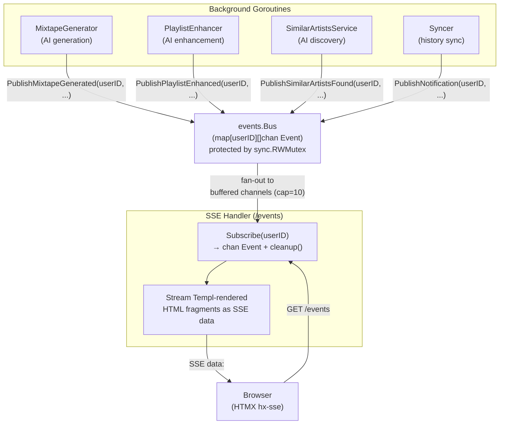

# ADR-0007: In-Memory Event Bus over Persistent Message Queue Accepting Single-Instance Constraint

## Context and Problem Statement

Spotter's AI operations (mixtape generation, playlist enhancement, similar artist discovery) run asynchronously in background goroutines and must communicate their progress and results to the HTTP layer for real-time SSE streaming to the browser. How should asynchronous services publish events to active browser sessions without coupling goroutines directly to HTTP handlers?

## Decision Drivers

* AI generation takes seconds to minutes — HTTP handlers must not block waiting for completion
* Multiple browser tabs for the same user must all receive the same events (fan-out required)
* The event consumer is an SSE endpoint streaming HTML fragments via Templ components
* Events are ephemeral — if no browser is connected when an event fires, it's acceptable to drop it
* Spotter is designed for single-instance deployment alongside a personal Navidrome server
* Adding an external message broker (Redis, RabbitMQ, NATS) would require operating another service

## Considered Options

* **In-memory channel-based event bus** — Go channels in a mutex-protected map, keyed by user ID; non-blocking publish
* **Redis pub/sub** — external in-memory message broker with pub/sub primitives
* **Database polling** — SSE handlers poll the SQLite database for new events on an interval
* **WebSockets with in-process broker** — persistent bidirectional connections with in-process fan-out

## Decision Outcome

Chosen option: **In-memory channel-based event bus**, because it requires no external infrastructure, integrates naturally with Go's concurrency primitives, delivers events with zero serialization overhead (typed Go structs), and is perfectly suited for the single-instance, personal-use deployment model. Dropped events (when subscriber channels are full) are acceptable — the UI will show the final state when the user next loads the page. The trade-off of no horizontal scaling is intentional and aligned with the SQLite single-instance constraint documented in ADR-0003.

### Consequences

* Good, because no external infrastructure — the bus is a plain Go struct, created in `main()` and injected
* Good, because events are strongly-typed Go structs — no serialization/deserialization overhead or schema versioning
* Good, because supports multiple subscribers per user (multiple browser tabs) via per-user channel slices
* Good, because non-blocking publish (`select { case ch <- event: default: }`) prevents publisher goroutines from stalling when a browser disconnects
* Good, because buffered channels (capacity 10) absorb burst events without dropping during normal operation
* Bad, because events are lost on process restart — in-flight AI operations that complete after a restart will not notify the browser
* Bad, because single-instance only — multiple app instances cannot share one bus (consistent with SQLite constraint)
* Bad, because a slow or disconnected browser subscriber will have events silently dropped once the buffer fills

### Confirmation

Compliance is confirmed by `internal/events/bus.go` containing the `Bus` struct with `subscribers map[int][]chan Event` and non-blocking `Publish()`. No Redis, NATS, or RabbitMQ imports should appear. The bus instance is created once in `cmd/server/main.go` and passed to handlers and services.

## Pros and Cons of the Options

### In-Memory Channel-Based Event Bus

`Bus` struct with a `sync.RWMutex`-protected `map[userID][]chan Event`. `Subscribe(userID)` returns a buffered channel and cleanup function. `Publish(userID, event)` fans out to all channels for that user with non-blocking send.

* Good, because pure Go — `sync`, `chan` — zero additional dependencies
* Good, because cleanup function returned by `Subscribe()` is called by the SSE handler on connection close, preventing channel leaks
* Good, because typed `Event` struct with `EventType` constants provides compile-time safety on event kinds
* Good, because convenience publish methods (`PublishMixtapeCreated`, `PublishNotification`, etc.) encapsulate payload construction
* Neutral, because buffer size of 10 events per subscriber is sufficient for normal usage but arbitrary
* Bad, because no persistence — process restart loses all in-flight events
* Bad, because no delivery guarantees — `default` branch in `Publish()` silently drops events when channel is full

### Redis Pub/Sub

External Redis instance used as a message broker. Publishers call `PUBLISH channel message`, subscribers use `SUBSCRIBE`.

* Good, because enables horizontal scaling — multiple app instances share one Redis bus
* Good, because durable enough for short-lived events; Redis is fast and reliable
* Bad, because requires operating a Redis service alongside the app — docker-compose complexity increases
* Bad, because events must be serialized to/from JSON or protobuf — losing Go type safety
* Bad, because Redis pub/sub has no persistence — messages are lost if no subscriber is connected (same as in-memory, but with more infrastructure)

### Database Polling

SSE handlers execute `SELECT * FROM events WHERE user_id=? AND created_at > ?` on a timer.

* Good, because uses existing SQLite infrastructure — no new components
* Good, because events survive process restart if written to the database
* Bad, because polling interval introduces latency — AI generation completion would have 1-5 second notification delay
* Bad, because polling at 1-second intervals across multiple connections creates unnecessary SQLite read load
* Bad, because requires a new `events` database table with time-based cleanup

### WebSockets with In-Process Broker

Replace SSE with WebSocket connections. Maintain an in-process broker routing messages to open WebSocket connections.

* Good, because bidirectional — browser could send commands back over the same connection
* Good, because lower overhead than SSE for high-frequency updates
* Bad, because HTMX's SSE extension is already integrated and working — WebSockets would require a different HTMX extension and more JavaScript
* Bad, because in-process broker has the same scalability limitations as the channel bus, with more complexity

## Architecture Diagram

## More Information

* Event bus implementation: `internal/events/bus.go` — `Bus`, `Subscribe()`, `Publish()`, typed event constants
* SSE handler: `internal/handlers/sse.go` — calls `bus.Subscribe(userID)` and streams HTML fragments
* HTMX SSE integration: `internal/views/layouts/base.templ:23` — loads `htmx.org/dist/ext/sse.js`
* Bus initialization: `cmd/server/main.go` — `events.NewBus()` passed to handler and all services
* Event types: 14 typed constants covering mixtape lifecycle, playlist enhancement, similar artists, notifications
* HTMX + Templ UI decision: see ADR-0001
* Single-instance constraint: see ADR-0003 (SQLite)
