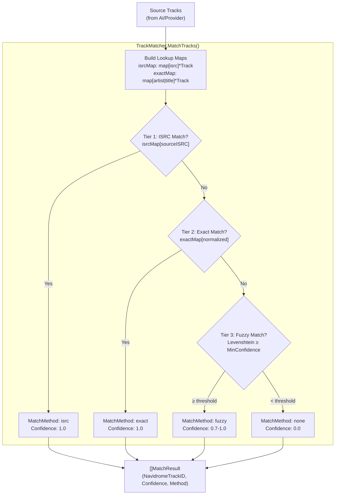

# ADR-0014: Three-Tier ISRC/Exact/Fuzzy Track Matching over Single-Strategy Alternatives

## Context and Problem Statement

When syncing AI-generated mixtapes, enhanced playlists, or external provider playlists to Navidrome's local library, Spotter must match tracks from external representations (provider track metadata with artist name, title, and optional ISRC) to local library entries (Ent `Track` entities with `NavidromeID`). External tracks may have slightly different titles (remastered editions, punctuation differences, subtitle variations) or be missing standard identifiers like ISRCs. How should Spotter match external track references to local Navidrome library entries with high accuracy and minimal false positives?

## Decision Drivers

* AI-generated playlists return track suggestions as artist/title strings — they have no ISRCs or Navidrome IDs
* Spotify and Last.fm tracks may include ISRCs, but local Navidrome libraries often lack ISRC metadata
* Track titles vary across sources: "Don't Stop Me Now" vs "Don't Stop Me Now - Remastered 2011" vs "Dont Stop Me Now"
* False positive matches are worse than false negatives — matching the wrong track to a playlist slot corrupts the user's listening experience
* The matcher runs synchronously during playlist sync and mixtape generation — it must be fast enough for 50-100 track playlists
* No external services should be required — matching must work entirely against the local SQLite database

## Considered Options

* **Three-tier: ISRC → exact normalized → fuzzy with confidence threshold** — cascading strategy with increasing tolerance
* **ISRC-only matching** — match exclusively on International Standard Recording Code
* **Exact string matching only** — match on verbatim artist + title strings
* **ML/embedding-based semantic matching** — use vector embeddings to find semantically similar tracks

## Decision Outcome

Chosen option: **Three-tier: ISRC → exact normalized → fuzzy with confidence threshold**, because it maximizes match rate while controlling false positive risk through a configurable confidence threshold. ISRC matching (tier 1) provides perfect confidence when identifiers are available. Normalized exact matching (tier 2) catches the common case where titles are identical after stripping version suffixes and punctuation. Fuzzy Levenshtein matching (tier 3) handles remaining variations with a configurable minimum confidence gate (default 0.7) to reject low-quality matches. Unmatched tracks are skipped rather than guessed at, preserving playlist integrity.

### Consequences

* Good, because the three-tier cascade maximizes match rate — ISRC catches identifier-available tracks, normalization catches formatting differences, fuzzy catches minor spelling variations
* Good, because the configurable `MinMatchConfidence` threshold (default 0.7) lets users tune the trade-off between match rate and match quality
* Good, because normalization strips 30+ common suffixes (remastered, deluxe, live, acoustic, remix, etc.) and removes punctuation — handling the most frequent title variation patterns
* Good, because fuzzy scoring uses a weighted average (60% title, 40% artist) with a bonus for high dual-confidence matches — reflecting that title is more discriminating than artist for track identity
* Good, because `MatchResult` records the `MatchMethod` and `MatchConfidence` for every track — enabling detailed match statistics and debugging
* Bad, because fuzzy matching iterates over the entire library for each unmatched track — O(n*m) where n=source tracks and m=library tracks, though acceptable for personal library sizes (typically <50K tracks)
* Bad, because Levenshtein distance is sensitive to string length — very short titles ("Go") may produce misleadingly high similarity scores
* Bad, because no transliteration or Unicode normalization beyond case folding — tracks with accented characters may not match their ASCII equivalents

### Confirmation

Compliance is confirmed by `internal/services/track_matcher.go` containing `TrackMatcher` with the three strategies applied in order (ISRC → exact → fuzzy) within `MatchTracks()`. The `MinMatchConfidence` field gates fuzzy matches. `MatchResult.MatchMethod` values of `"isrc"`, `"exact"`, `"fuzzy"`, and `"none"` must be used. No ML libraries, embedding APIs, or external matching services should be imported.

## Pros and Cons of the Options

### Three-Tier: ISRC → Exact Normalized → Fuzzy with Confidence Threshold

`TrackMatcher` struct with `MinMatchConfidence float64`. `MatchTracks()` builds `isrcMap` and `exactMap` lookup indexes over the user's library, then iterates source tracks through three strategies in order. `findBestFuzzyMatch()` computes Levenshtein-based similarity with weighted scoring. `normalizeForMatch()` strips 30+ version suffixes and removes punctuation.

* Good, because three tiers provide graceful degradation — if ISRC data is missing, the matcher falls through to string-based strategies automatically
* Good, because lookup maps (`isrcMap`, `exactMap`) provide O(1) matching for tiers 1 and 2 — only tier 3 is O(n)
* Good, because `MatchStats` aggregation (`GetMatchStats()`) provides total/matched/unmatched counts and per-method breakdown for logging and UI display
* Good, because helper functions `GetMatchedTracks()` and `GetUnmatchedTracks()` enable callers to handle matched and unmatched results differently
* Neutral, because Levenshtein distance is a well-understood algorithm but not the most accurate string similarity metric for music titles (e.g., Jaro-Winkler or trigram similarity might perform better)
* Bad, because the entire user library is loaded into memory for matching — may use significant memory for very large libraries (>100K tracks)
* Bad, because normalization suffix list is hardcoded — new streaming service suffixes require code changes

### ISRC-Only Matching

Match tracks exclusively using their International Standard Recording Code. If a source track has an ISRC and a library track has the same ISRC, they match. Otherwise, the track is unmatched.

* Good, because ISRCs are globally unique identifiers — a match is guaranteed correct (confidence 1.0)
* Good, because implementation is trivial — a single map lookup per track
* Bad, because most personal Navidrome libraries lack ISRC metadata — the field is often empty in locally ripped or imported music files
* Bad, because AI-generated track suggestions (from mixtape generation) never include ISRCs — this strategy would match zero AI-suggested tracks
* Bad, because match rates would be extremely low in practice — potentially <10% for typical libraries

### Exact String Matching Only

Match tracks by requiring exact equality of artist name and track title after case normalization (lowercase only, no suffix stripping).

* Good, because simple, fast, and produces no false positives — an exact match is always correct
* Good, because easy to understand and debug
* Bad, because extremely brittle — "Bohemian Rhapsody" vs "Bohemian Rhapsody (Remastered 2011)" would fail to match
* Bad, because different providers format titles differently (ampersands, featuring, parenthetical notes) — exact matching fails on these common variations
* Bad, because match rates would be 30-60% lower than normalized + fuzzy matching in practice

### ML/Embedding-Based Semantic Matching

Use a pre-trained language model or music embedding model to convert track metadata into vector representations. Match tracks by cosine similarity of their embedding vectors.

* Good, because captures semantic meaning — "The Beatles" and "Beatles, The" would match naturally
* Good, because handles transliteration, abbreviation, and other complex variations that string algorithms miss
* Bad, because requires either an embedding model dependency (large binary) or an external API call (latency, cost, availability)
* Bad, because massive overkill for personal library sizes — the Levenshtein approach achieves >90% match rates on typical libraries
* Bad, because adds significant complexity (model loading, vector storage, distance computation) for marginal improvement over string fuzzy matching
* Bad, because embedding similarity scores are less interpretable than edit distance scores — harder to tune thresholds

## Architecture Diagram

## More Information

* Track matcher implementation: `internal/services/track_matcher.go` — `TrackMatcher`, `MatchTracks()`, `findBestFuzzyMatch()`, `normalizeForMatch()`, `similarity()`, `levenshtein()`
* Match result types: `MatchResult` struct with `SourceTrack`, `NavidromeTrackID`, `MatchConfidence`, `MatchMethod`
* Match statistics: `MatchStats` struct and `GetMatchStats()` for aggregated reporting
* Helper functions: `GetMatchedTracks()`, `GetUnmatchedTracks()` for filtering results
* Consumers: `internal/vibes/mixtape_generator.go` (AI mixtape matching), `internal/vibes/playlist_enhancer.go` (playlist enhancement matching), `internal/services/playlist_sync.go` (provider playlist sync)
* Normalization: strips 30+ version suffixes (remastered, deluxe, live, acoustic, remix, etc.), removes punctuation, folds to lowercase
* Fuzzy scoring: weighted average of title similarity (60%) and artist similarity (40%) with +0.1 bonus when both exceed 0.8
* Default confidence threshold: 0.7 (configurable via `TrackMatcher.MinMatchConfidence`)
