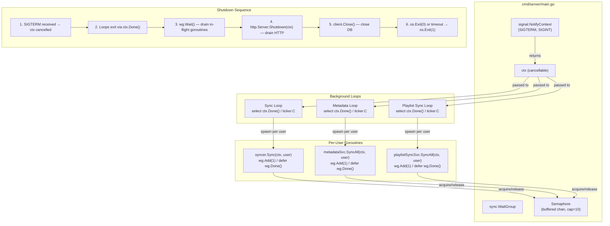

# ADR-0018: signal.NotifyContext + sync.WaitGroup for Graceful Shutdown over Raw Signal Channels or Lifecycle Managers

## Context and Problem Statement

Spotter runs three background goroutine loops in `cmd/server/main.go` — listen/playlist sync (every 5 minutes), metadata enrichment (every 1 hour), and Navidrome playlist write-back (every 1 hour). Each loop creates a `context.Background()` on every tick and spawns unbounded per-user goroutines. There is no shutdown path: when the process receives SIGTERM (e.g., container restart, `docker stop`), goroutines are killed mid-execution. This can leave partial data in SQLite (e.g., half-synced listen history, incomplete metadata enrichment) and prevents clean resource cleanup (database connections, event bus subscribers). How should Spotter propagate a shutdown signal to all background goroutines and wait for in-flight operations to complete before exiting?

## Decision Drivers

* Container orchestrators (Docker, Kubernetes) send SIGTERM and expect the process to exit within a configurable grace period (default 30 seconds in Docker)
* Three ticker loops use `context.Background()` — there is no parent context to cancel when shutdown is requested
* Per-user goroutines spawned by each loop are unbounded and untracked — there is no mechanism to wait for them to finish
* SQLite writes are atomic per transaction (ADR-0003) but a sync operation may span multiple transactions — partial completion is possible
* The event bus (ADR-0007) should stop accepting new subscriptions and drain existing ones during shutdown
* The HTTP server (`http.ListenAndServe`) has no built-in graceful shutdown — it must be replaced with `http.Server.Shutdown()`
* Spotter is a single binary with no external coordination — shutdown logic must be self-contained

## Considered Options

* **`signal.NotifyContext` + `sync.WaitGroup` + buffered semaphore** — stdlib context cancellation with WaitGroup drain and bounded concurrency
* **Raw `os.Signal` channel** — manual signal handling with a `chan os.Signal` and imperative shutdown sequence
* **Third-party lifecycle manager (`oklog/run`, `uber-go/fx`)** — framework-managed goroutine lifecycle with dependency injection
* **No graceful shutdown** — accept that container restarts may interrupt in-flight operations

## Decision Outcome

Chosen option: **`signal.NotifyContext` + `sync.WaitGroup` + buffered semaphore**, because it uses only Go standard library primitives (`os/signal`, `context`, `sync`), integrates naturally with the existing ticker loop pattern (ADR-0013), and provides a clear shutdown sequence: (1) `signal.NotifyContext` creates a context that is cancelled on SIGTERM/SIGINT, (2) all background loops select on `ctx.Done()` to stop ticking, (3) a `sync.WaitGroup` tracks in-flight per-user goroutines so the main function can wait for them to complete, (4) a buffered channel semaphore bounds per-user concurrency to prevent goroutine explosion during shutdown drain. The HTTP server is migrated from `http.ListenAndServe` to `http.Server{}.Shutdown(ctx)` for graceful connection draining.

### Consequences

* Good, because zero external dependencies — uses only `os/signal`, `context`, `sync`, and `net/http` from the standard library
* Good, because `signal.NotifyContext` is idiomatic Go (introduced in Go 1.16) and returns a standard `context.Context` compatible with all existing service methods that accept contexts
* Good, because `sync.WaitGroup` provides a simple, race-free mechanism to wait for all in-flight goroutines before process exit
* Good, because the buffered semaphore pattern (`make(chan struct{}, N)`) bounds per-user concurrency, addressing the unbounded goroutine concern from ADR-0013
* Good, because `http.Server.Shutdown()` drains active HTTP connections gracefully, ensuring in-progress SSE streams and API requests complete
* Good, because the 30-second timeout budget aligns with Docker's default `stop_grace_period`, ensuring the process exits before the container runtime sends SIGKILL
* Bad, because adds complexity to `cmd/server/main.go` — the three simple `go func()` blocks must now coordinate through shared context and WaitGroup
* Bad, because long-running operations (e.g., AI generation via OpenAI API that takes 60+ seconds) may exceed the 30-second timeout and be forcefully terminated
* Bad, because the semaphore concurrency limit must be tuned — too low starves throughput, too high provides insufficient back-pressure during shutdown

### Confirmation

Compliance is confirmed by `cmd/server/main.go` using `signal.NotifyContext(context.Background(), syscall.SIGTERM, syscall.SIGINT)` to create the root context. All three ticker loops must select on `ctx.Done()` alongside `ticker.C`. A `sync.WaitGroup` must be passed to or shared by the goroutine-spawning loops, with `wg.Add(1)` before each per-user goroutine and `defer wg.Done()` inside. The main function must call `wg.Wait()` after context cancellation, with a `time.AfterFunc(30*time.Second, ...)` hard exit fallback. The HTTP server must use `http.Server{}` with explicit `Shutdown(ctx)` call instead of `http.ListenAndServe`.

## Pros and Cons of the Options

### signal.NotifyContext + sync.WaitGroup + Buffered Semaphore

Root context created via `signal.NotifyContext(context.Background(), syscall.SIGTERM, syscall.SIGINT)`. This context is passed to all background loops. Each loop uses `select { case <-ctx.Done(): return; case <-ticker.C: ... }` to exit on shutdown. Per-user goroutines call `wg.Add(1)` / `defer wg.Done()` and acquire a semaphore slot before starting work. Main function calls `wg.Wait()` with a 30-second hard deadline.

* Good, because `signal.NotifyContext` is a single function call that returns a cancellable context — no manual channel management
* Good, because the cancelled context propagates to service methods like `syncer.Sync(ctx, user)` — services that respect context cancellation will stop early
* Good, because `sync.WaitGroup` is the standard Go primitive for waiting on goroutine completion — well-understood by all Go developers
* Good, because the buffered semaphore limits concurrent per-user goroutines (e.g., `make(chan struct{}, 10)`) — prevents resource exhaustion during normal operation and bounds the number of goroutines that must drain during shutdown
* Neutral, because the 30-second timeout is a policy decision — may need adjustment for deployments with longer AI generation times
* Bad, because requires touching all three goroutine loops — a moderate refactor of `main.go`

### Raw os.Signal Channel

`ch := make(chan os.Signal, 1); signal.Notify(ch, syscall.SIGTERM, syscall.SIGINT)`. A dedicated goroutine listens on `ch` and triggers shutdown logic imperatively.

* Good, because explicit signal handling gives full control over the shutdown sequence
* Good, because predates `signal.NotifyContext` — works on Go versions prior to 1.16
* Bad, because requires manual context creation and cancellation — `signal.NotifyContext` does this automatically
* Bad, because the signal-handling goroutine must coordinate with background loops via shared state (channels or atomic flags) — more error-prone than context propagation
* Bad, because the imperative shutdown sequence (stop tickers, cancel contexts, wait for goroutines) must be written and maintained manually

### Third-Party Lifecycle Manager (oklog/run, uber-go/fx)

Frameworks that manage goroutine lifecycles with structured start/stop semantics. `oklog/run` uses an actor model where each goroutine registers an `execute` and `interrupt` function. `uber-go/fx` provides dependency injection with lifecycle hooks.

* Good, because `oklog/run.Group` provides a clean pattern: when any actor returns, all other actors are interrupted — natural for "shutdown when any component fails"
* Good, because `uber-go/fx` manages startup/shutdown ordering automatically based on the dependency graph
* Bad, because adds an external dependency for functionality achievable with ~20 lines of standard library code
* Bad, because `uber-go/fx` is a full dependency injection framework — adopting it for shutdown alone would be using a sledgehammer to crack a nut
* Bad, because both libraries introduce their own abstractions and patterns that new contributors must learn
* Bad, because lifecycle managers work best when adopted project-wide from the start — retrofitting them onto existing code requires significant restructuring

### No Graceful Shutdown

Accept that SIGTERM kills the process immediately. Rely on SQLite's transaction atomicity (ADR-0003) to prevent database corruption. Accept that in-flight sync operations may produce partial results.

* Good, because zero implementation effort — no code changes required
* Good, because SQLite transactions are atomic — individual write operations are never half-committed
* Bad, because multi-transaction sync operations (e.g., syncing 500 listens across multiple batches) can leave partial data that must be reconciled on the next sync
* Bad, because HTTP connections are dropped abruptly — SSE clients see a connection error instead of a clean close
* Bad, because the event bus may have subscribers that leak (channels not cleaned up) — though this is moot if the process is about to exit
* Bad, because Docker logs will show ungraceful exit codes, making debugging and alerting harder
* Bad, because this is the current state and the problem statement specifically identifies it as inadequate

## Architecture Diagram

## More Information

* Current background loops: `cmd/server/main.go:123-200` — three `go func()` blocks with `time.NewTicker` and `context.Background()`
* Current HTTP server: `cmd/server/main.go:337-340` — `http.ListenAndServe` with no shutdown path
* Ticker loop pattern: see ADR-0013 (goroutine ticker background scheduling)
* SQLite transaction atomicity: see ADR-0003 (SQLite embedded database)
* Event bus cleanup on shutdown: see ADR-0007 (in-memory event bus)
* `signal.NotifyContext` documentation: Go stdlib `os/signal` package, available since Go 1.16
* Docker stop grace period: default 10 seconds (`docker stop`), configurable via `--stop-timeout` or `stop_grace_period` in Compose
