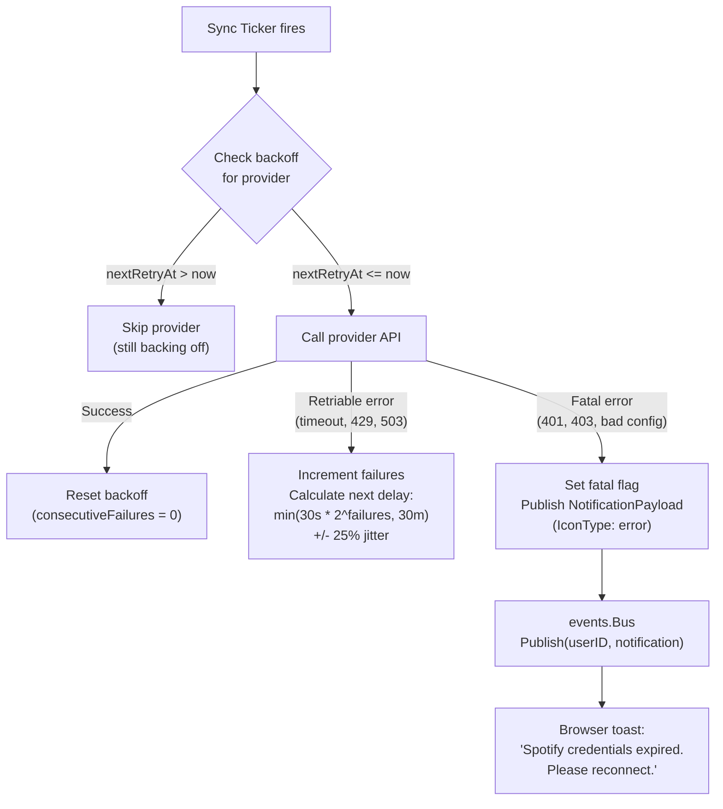

# ADR-0020: Exponential Backoff and Circuit Breaker for External Service Errors

## Context and Problem Statement

Spotter's background sync loops (listen history, playlists, metadata enrichment) call external APIs (Navidrome, Spotify, Last.fm, MusicBrainz, Fanart.tv, OpenAI) on fixed timer intervals. When an external service returns an error, the current behavior is to log the error, skip the provider, and wait for the next tick. This means transient failures (network timeouts, 429 rate limits, 503 service unavailable) are retried only at the next sync interval (typically 5 minutes to 1 hour later), while permanent failures (revoked credentials, 401/403 authorization errors) are retried identically, generating noisy logs without any user notification.

How should Spotter classify and respond to external service errors to improve reliability for transient failures and provide actionable feedback for permanent ones?

## Decision Drivers

* Background sync runs unattended — the user may not check logs for hours or days after a credential expires
* External APIs have varying rate limit and error behaviors — Spotify uses 429 with `Retry-After`, Last.fm returns XML errors, Navidrome uses Subsonic error codes
* Spotter is a single-user personal server — a simple in-memory backoff counter per provider is sufficient (no distributed state needed)
* The event bus (ADR-0007) already supports `NotificationPayload` with `IconType` — fatal errors can be surfaced to the browser as toast notifications
* Overly aggressive retry on transient errors risks hitting rate limits and making the situation worse

## Considered Options

* **Two-tier error classification with exponential backoff** — classify errors as retriable or fatal; apply exponential backoff with jitter for retriable errors; surface fatal errors to the user via event bus notification
* **Always retry immediately** — retry failed requests in a tight loop with a maximum retry count
* **No retry (current behavior)** — log and wait for the next scheduled tick
* **Full circuit breaker library** — use a library like `sony/gobreaker` with open/half-open/closed state machine

## Decision Outcome

Chosen option: **Two-tier error classification with exponential backoff**, because it provides proportionate response to both transient and permanent failures without introducing external dependencies or over-engineering for a single-user deployment. A simple in-memory backoff counter per provider per user (stored in the `Syncer` or a shared `BackoffState` struct) is reset on success. Fatal errors publish a `NotificationPayload` to the event bus so the user sees them in the browser without checking logs.

### Consequences

* Good, because transient errors are retried with increasing delays (30s, 60s, 120s, ... up to 30 minutes) — avoids hammering failing services
* Good, because fatal errors (401/403, revoked credentials) immediately notify the user via the event bus — no more silent log-only failures
* Good, because backoff state is per-provider per-user — a Spotify outage does not affect Last.fm sync
* Good, because backoff resets on the next successful sync — recovery is automatic
* Good, because no external dependencies — the backoff counter is a simple Go struct with a mutex
* Bad, because in-memory state is lost on process restart — a service that was backing off will retry immediately after restart
* Bad, because error classification requires mapping each provider's error codes to retriable/fatal categories — new providers need explicit error mapping

### Confirmation

Compliance is confirmed by a `BackoffState` struct (or equivalent) in the sync/services layer that tracks `lastError`, `consecutiveFailures`, and `nextRetryAt` per provider per user. The `Sync` method must check `nextRetryAt` before calling a provider and skip if the backoff window has not elapsed. Fatal errors must call `bus.Publish()` with `EventTypeNotification` and `IconType: "error"`.

## Pros and Cons of the Options

### Two-Tier Error Classification with Exponential Backoff

Classify errors as retriable (network timeout, 429, 503, OAuth token refresh succeeded then retry once) or fatal (401/403 with revoked credentials, invalid configuration, unparseable response). Maintain per-provider backoff state: base delay 30 seconds, multiplied by 2 on each consecutive failure, capped at 30 minutes, with random jitter of +/-25% to prevent thundering herd.

* Good, because proportionate — transient errors get progressively longer delays, fatal errors get immediate user notification
* Good, because simple — a struct with a counter and a timestamp, no state machine
* Good, because jitter prevents synchronized retries if multiple providers fail simultaneously
* Neutral, because error classification must be maintained per provider as error formats differ
* Bad, because in-memory only — state lost on restart

### Always Retry Immediately

On error, retry the same request up to N times with no delay or a fixed short delay.

* Good, because fast recovery from very brief transient errors (sub-second network glitches)
* Bad, because hammers failing services — can trigger rate limiting or IP bans
* Bad, because wastes resources on permanent failures (retrying 401 N times changes nothing)
* Bad, because blocks the sync goroutine for the retry duration

### No Retry (Current Behavior)

Log the error, skip the provider, continue to the next. The provider is retried at the next scheduled tick.

* Good, because zero additional complexity
* Bad, because transient errors wait the full sync interval (5 minutes to 1 hour) before retry
* Bad, because permanent errors (revoked credentials) generate noisy log entries indefinitely with no user notification
* Bad, because the user has no visibility into provider health without reading logs

### Full Circuit Breaker Library (e.g., sony/gobreaker)

Use a circuit breaker with open/half-open/closed states. Open state rejects all calls for a configured window, half-open allows a single probe request.

* Good, because well-tested pattern with clear state transitions and monitoring hooks
* Good, because prevents any calls to a confirmed-failing service during the open window
* Bad, because adds an external dependency for a pattern that can be implemented in ~50 lines of Go
* Bad, because circuit breaker state machines are designed for high-throughput microservice architectures — overkill for a personal server with 3-5 provider calls per sync cycle
* Bad, because the open/half-open model does not naturally distinguish between retriable and fatal errors

## Architecture Diagram

## More Information

* Current error handling: `internal/services/sync.go:235-244` — logs error, continues to next provider
* Background sync loop: `cmd/server/main.go:123-141` — `time.NewTicker` with configurable interval
* Event bus notification: `internal/events/bus.go` — `Publish()` with `NotificationPayload`
* Provider factory pattern: see ADR-0016
* Background scheduling: see ADR-0013
* Event bus: see ADR-0007
