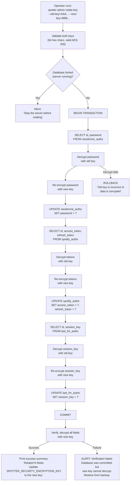

# ADR-0021: Encryption Key Rotation via Admin Subcommand

## Context and Problem Statement

Spotter encrypts sensitive credentials at rest using AES-256-GCM (ADR-0006). The encryption key is a 64-character hex string stored in the `SPOTTER_SECURITY_ENCRYPTION_KEY` environment variable. If this key is compromised, leaked, or needs to be rotated per a security policy, all encrypted fields in the database must be re-encrypted with a new key. Currently, there is no supported mechanism for key rotation — an operator would need to manually decrypt and re-encrypt database rows, which is error-prone and risks leaving the database in a mixed-key state.

How should Spotter support encryption key rotation in a safe, atomic, and operator-friendly manner?

## Decision Drivers

* Key compromise is a realistic scenario — the key might appear in a CI log, a Docker Compose file committed to a public repo, or an exposed `.env` file
* Four encrypted fields exist across three entity types: `NavidromeAuth.Password`, `SpotifyAuth.AccessToken`, `SpotifyAuth.RefreshToken`, `LastFMAuth.SessionKey`
* SQLite supports single-connection transactions — a single transaction can re-encrypt all fields atomically
* The rotation operation is infrequent (likely never for most users) — a separate CLI subcommand is more appropriate than an API endpoint
* Rotating while the server is running risks the server reading with the old key after the database has been updated with the new key

## Considered Options

* **`spotter admin rotate-key` subcommand** — offline CLI tool that decrypts all fields with the old key and re-encrypts with the new key in a single SQLite transaction
* **Manual SQL UPDATE** — document a procedure for manually querying and updating encrypted fields
* **Dual-key mode** — accept both old and new keys simultaneously during a transition period
* **No supported rotation path** — require users to re-enter all credentials if the key changes

## Decision Outcome

Chosen option: **`spotter admin rotate-key` subcommand**, because it provides a safe, atomic, and auditable key rotation path that an operator can execute with a single command. The subcommand connects directly to the SQLite database (bypassing Ent hooks to avoid double-encryption), decrypts all encrypted fields with the old key, re-encrypts with the new key, and commits in a single transaction. A post-commit verification step decrypts all fields with the new key to confirm success.

### Consequences

* Good, because rotation is atomic — either all fields are re-encrypted or none are (SQLite transaction rollback on failure)
* Good, because the subcommand validates both keys before starting — rejects obviously wrong old keys early
* Good, because post-commit verification confirms the new key can decrypt all updated fields
* Good, because the subcommand requires the server to be stopped — eliminates race conditions between the server and the rotation tool
* Good, because the old key is provided as a flag, not read from the environment — avoids requiring two environment variable configurations
* Bad, because the operator must stop the server before running the rotation — brief downtime required
* Bad, because the subcommand bypasses Ent hooks and operates directly on SQL — must be kept in sync with any new encrypted fields added in the future
* Bad, because if the operator forgets to update `SPOTTER_SECURITY_ENCRYPTION_KEY` after rotation, the server will fail to decrypt on next startup

### Confirmation

Compliance is confirmed by a `cmd/admin/rotate_key.go` (or equivalent) implementing the subcommand. The command must accept `--old-key` and `--new-key` flags (both 64 hex chars), verify the server is not running (or the database is not locked), execute all re-encryption in a single `BEGIN/COMMIT` transaction, and verify decryption with the new key before exiting with a success message.

## Pros and Cons of the Options

### `spotter admin rotate-key` Subcommand

CLI command: `spotter admin rotate-key --old-key=<64hex> --new-key=<64hex> --db=spotter.db`. Connects to SQLite directly, iterates all rows with encrypted fields, decrypts with old key, encrypts with new key, commits.

* Good, because single atomic transaction — no mixed-key state possible
* Good, because explicit old-key/new-key flags make the operation clear and auditable
* Good, because pre-rotation validation catches wrong old key before modifying any data
* Good, because post-rotation verification ensures the new key works before the operator updates their environment
* Neutral, because requires server downtime (acceptable for a personal server with infrequent rotation)
* Bad, because operates outside Ent ORM — raw SQL queries must mirror the entity schema

### Manual SQL UPDATE

Document a procedure: dump encrypted values, decrypt with `openssl` or a Go script, re-encrypt, update rows.

* Good, because no code to write or maintain
* Bad, because extremely error-prone — one wrong UPDATE corrupts credentials
* Bad, because requires the operator to understand the encryption format (base64, nonce, GCM tag)
* Bad, because no atomicity guarantee unless the operator manually wraps in a transaction
* Bad, because no verification step

### Dual-Key Mode

Accept both old and new keys. On read, try the new key first; if decryption fails, try the old key. On write, always use the new key. Over time, all values migrate to the new key.

* Good, because zero downtime — server continues running during transition
* Good, because gradual migration — values are re-encrypted on next update
* Bad, because adds complexity to every decrypt path (try two keys)
* Bad, because fields that are never updated (e.g., a user who never re-authenticates Spotify) remain encrypted with the old key indefinitely
* Bad, because the old key must be retained in configuration until all values have been migrated — unclear when that happens

### No Supported Rotation Path

If the key is compromised, require users to re-enter all provider credentials.

* Good, because zero implementation effort
* Bad, because terrible operator experience — user must disconnect and reconnect all providers
* Bad, because OAuth tokens cannot simply be "re-entered" — they require a full re-authentication flow
* Bad, because no recovery path for a key stored in a leaked backup

## Architecture Diagram

## More Information

* Encryption implementation: `internal/crypto/encrypt.go` — `Encryptor.Encrypt()`, `Encryptor.Decrypt()`, `IsEncrypted()`
* Encrypted fields: `internal/database/hooks.go` — `NavidromeAuth.Password`, `SpotifyAuth.AccessToken`, `SpotifyAuth.RefreshToken`, `LastFMAuth.SessionKey`
* Key configuration: `internal/config/config.go:182-197` — `GetEncryptionKeyBytes()` validates 64 hex chars
* Key validation: `internal/config/config.go:294-306` — startup validation of key format
* Encryption decision: see [ADR-0006](./ADR-0006-aes256-gcm-application-layer-encryption.md)
* Database: see [ADR-0003](./ADR-0003-sqlite-embedded-database.md) (SQLite transactions)
