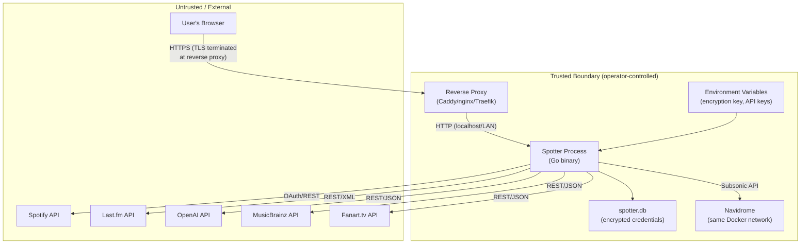

# ADR-0022: Threat Model and Security Assumptions

## Context and Problem Statement

Spotter is a self-hosted, single-user companion application for Navidrome that integrates with multiple external services (Spotify, Last.fm, OpenAI) and stores sensitive credentials (OAuth tokens, passwords, API keys). As the application matures and more ADRs codify security-relevant decisions, a centralized threat model is needed to document what Spotter defends against, what it explicitly does not defend against, and what assumptions underpin its security posture. This ADR serves as the threat model document — no separate spec is needed.

## Decision Drivers

* Security decisions are distributed across multiple ADRs (ADR-0005, ADR-0006, ADR-0020, ADR-0021) — a unified threat model provides a single reference point
* Self-hosted personal software has a different threat profile than multi-tenant SaaS — assumptions about the trust boundary and deployment environment must be explicit
* Contributors and future sessions need to understand what is defended, what is not, and why — prevents over-engineering defenses for out-of-scope threats and under-engineering for in-scope ones
* The operator is both the administrator and the sole user — multi-tenant isolation is not applicable

## Decision Outcome

This ADR documents Spotter's threat model, deployment assumptions, trust boundaries, in-scope threats with mitigations, out-of-scope threats, known undefended gaps, and security assumptions. It is a living document that should be updated as new ADRs introduce security-relevant decisions.

---

## Deployment Model

Spotter is designed for the following deployment configuration:

* **Single instance**: One Spotter process serves one user. There is no multi-instance or multi-tenant deployment mode.
* **Self-hosted**: Spotter runs on hardware controlled by the operator — a home server, NAS, VPS, or local machine.
* **Containerized**: Typically deployed as a Docker container alongside Navidrome, with a shared Docker network.
* **Reverse proxy**: A reverse proxy (Caddy, nginx, Traefik) terminates TLS and forwards traffic to Spotter on localhost or a trusted LAN. Spotter itself listens on HTTP (no TLS termination).
* **SQLite on trusted volume**: The database file (`spotter.db`) resides on a Docker volume or host filesystem directory controlled by the operator.
* **Environment-based configuration**: Secrets (encryption key, API keys, OAuth credentials) are provided via environment variables, not committed to source control.

---

## Trust Boundary

**Within the trust boundary:**
- The operator controls the host OS, container runtime, Docker network, reverse proxy configuration, and filesystem permissions.
- Spotter trusts that the host OS has not been compromised.
- Spotter trusts that the reverse proxy is configured to terminate TLS correctly and forward only to Spotter.
- Spotter trusts that environment variables are not exposed to unauthorized processes.

**Outside the trust boundary:**
- The user's browser communicates over HTTPS (enforced by the reverse proxy).
- External APIs (Spotify, Last.fm, OpenAI, MusicBrainz, Fanart.tv) are accessed over HTTPS by Spotter's HTTP client.
- Responses from external APIs are parsed but not fully trusted (API contract changes, unexpected data).

---

## Threats IN SCOPE

These threats are within Spotter's threat model and have active mitigations:

### T1: Database File Theft

**Threat**: An attacker gains read access to `spotter.db` (e.g., misconfigured volume mount, backup leak, exposed file server).

**Mitigation**: Application-layer AES-256-GCM encryption (ADR-0006) encrypts all sensitive credentials at rest. The encryption key is not stored in the database — it is provided via an environment variable. Without the key, encrypted fields are indistinguishable from random data.

**Residual risk**: Non-credential data (listening history, playlist names, track metadata) is stored in plaintext. An attacker with the database file can read the user's music listening habits.

### T2: OAuth Token Theft via Exposed Logs

**Threat**: OAuth tokens or passwords appear in log output (e.g., structured logging that serializes entire structs, error messages containing credential values).

**Mitigation**: Partial — the logging framework (`log/slog`) is used with explicit field selection (not struct-level serialization). Error messages from authentication flows log error descriptions, not credential values. However, there is no systematic log scrubbing or redaction mechanism.

**Residual risk**: A developer adding a new log statement could inadvertently log a token. Debug-level logging of HTTP responses from external APIs could include authorization headers.

### T3: Session Cookie Theft

**Threat**: An attacker intercepts or steals the `spotter_token` JWT cookie to impersonate the user.

**Mitigation**: The session cookie is set with `HttpOnly` (prevents JavaScript access), `Secure` (requires HTTPS, configurable via `security.secure_cookies`), and `SameSite=Lax` (prevents cross-origin request attachment). Cookie expires after 24 hours (ADR-0005, `internal/handlers/auth.go:119-127`).

**Residual risk**: If `security.secure_cookies` is set to `false` (e.g., for local development without TLS), the cookie is transmitted over plaintext HTTP.

### T4: CSRF on OAuth Callbacks

**Threat**: An attacker tricks the user's browser into completing an OAuth flow that links the attacker's Spotify/Last.fm account to the user's Spotter instance.

**Mitigation**: OAuth flows use a `state` parameter stored in the session. The callback handler validates that the returned `state` matches the stored value before processing the authorization code.

**Residual risk**: The session cookie itself is the session store — if session fixation were possible (it is not, because the cookie is set server-side after Navidrome authentication), the state parameter could be predicted.

### T5: Input Validation and Injection

**Threat**: Malicious input via form fields, URL parameters, or API responses leads to SQL injection, XSS, or command injection.

**Mitigation**: Ent ORM uses parameterized queries (no raw SQL in business logic). Templ components auto-escape HTML output. User input is validated for length and format before processing.

**Residual risk**: AI-generated content (mixtape descriptions, artist bios) is rendered via Templ, which auto-escapes. However, if raw HTML rendering is ever introduced for AI output, XSS becomes possible.

---

## Threats OUT OF SCOPE

These threats are explicitly outside Spotter's threat model. Spotter does not attempt to defend against them:

### T6: Compromised Host OS

If an attacker has root access to the host running Spotter, all defenses are bypassed. The encryption key exists in process memory, the database file is on disk, and environment variables are readable. This is a fundamental limitation of any application that does not use hardware security modules (HSMs).

**Rationale**: Spotter is a personal tool running on operator-controlled hardware. If the host is compromised, the attacker has access to far more valuable targets than music listening history.

### T7: TLS Termination

Spotter does not terminate TLS. HTTPS is delegated to the reverse proxy (Caddy, nginx, Traefik). Misconfigured TLS (expired certificates, weak cipher suites, missing HSTS) is the operator's responsibility.

**Rationale**: TLS termination is a solved problem handled by dedicated reverse proxies. Implementing TLS in Spotter would duplicate infrastructure and increase configuration complexity.

### T8: Denial of Service (DoS)

Spotter does not implement rate limiting, request throttling, or connection limits. A flood of requests could exhaust the single-threaded SQLite write lock or Go runtime resources.

**Rationale**: Spotter is a single-user application on a personal server. The attack surface for DoS is limited to the operator's own network. If exposed to the internet, the reverse proxy should handle rate limiting.

### T9: Multi-Tenant Isolation

Spotter has no concept of tenant isolation, per-user data segregation (beyond the single user), or role-based access control. All data belongs to one user.

**Rationale**: Single-user by design (ADR-0003, ADR-0005). Adding multi-tenancy would fundamentally change the architecture.

---

## NOT DEFENDED (Known Gaps)

These are known security gaps that are documented but not currently mitigated:

### G1: Prompt Injection via DJ Personas

DJ personas (ADR-0008) allow users to define custom AI prompts that are sent to the OpenAI API. A malicious or confused prompt could instruct the AI to produce unexpected output, exfiltrate context from the system prompt, or generate content outside the music domain. Since the DJ persona text is user-authored and directly interpolated into the AI prompt, there is no sanitization boundary.

**Impact**: Low — the user is both the author and consumer of DJ personas. Prompt injection is primarily a concern in multi-user or third-party-prompt scenarios.

**Future mitigation**: Consider prompt sandboxing or output validation if DJ persona sharing is ever implemented.

### G2: OpenAI API Key in Process Memory

The OpenAI API key is loaded from environment variables at startup and held in the `Config` struct for the lifetime of the process. A process memory dump (core dump, `/proc/PID/mem`) would expose the key.

**Impact**: Medium — the key grants access to the operator's OpenAI account and billing. However, this is inherent to any application that uses an API key.

**Future mitigation**: None planned. This is an accepted risk shared by all applications using API keys.

### G3: Nonce Reuse if System Clock Goes Backwards

AES-256-GCM nonces are generated using `crypto/rand.Reader`, not timestamps. However, if `crypto/rand.Reader` is backed by a PRNG that is seeded from the system clock (which is not the case on modern Linux/macOS — it uses `/dev/urandom`), a clock reversal could theoretically produce repeated nonces.

**Impact**: Theoretical — Go's `crypto/rand` uses the OS CSPRNG (`/dev/urandom` or `getrandom(2)`), which is not clock-dependent. This is a non-issue in practice.

**Future mitigation**: None needed.

### G4: JWT Secret Exposure

The `spotter_token` cookie contains a signed JWT. If the JWT signing secret (stored in an environment variable) is leaked, an attacker could forge valid tokens and impersonate any user. The `HttpOnly` and `Secure` flags prevent JavaScript access and plaintext transmission of the token itself, but the signing secret is the root of trust.

**Impact**: Low — the JWT secret is stored as an environment variable, not in code or the database. Tokens are short-lived (24h expiry), limiting the window of exploitation if a secret is compromised.

**Future mitigation**: Consider automatic JWT secret rotation if the deployment environment supports secret management (e.g., Vault, Docker secrets).

---

## Security Assumptions

The following assumptions underpin Spotter's security posture. If any assumption is violated, the associated mitigations may be ineffective:

1. **HTTPS at ingress**: The reverse proxy terminates TLS with a valid certificate. All browser-to-Spotter traffic is encrypted in transit.

2. **Operator does not expose Spotter publicly without authentication**: If Spotter is accessible from the internet, the reverse proxy provides additional authentication (e.g., Authelia, Authentik, Cloudflare Access) or restricts access to a VPN.

3. **Encryption key stored securely**: The `SPOTTER_SECURITY_ENCRYPTION_KEY` environment variable is not committed to version control, not logged, and not accessible to unauthorized processes.

4. **Docker network isolation**: Spotter and Navidrome communicate over a Docker bridge network that is not exposed to the host's external interfaces.

5. **Operating system is patched and trusted**: The host OS and container runtime are maintained with security updates. File permissions on the Docker volume restrict access to the database file.

6. **External API TLS is valid**: Go's `net/http` client verifies TLS certificates for all external API calls. Certificate pinning is not used (not necessary for public APIs with well-maintained certificates).

---

## Related ADRs

| ADR | Security Relevance |
|-----|-------------------|
| ADR-0003 | SQLite as single-instance embedded database — single-file attack surface |
| ADR-0005 | Navidrome passthrough authentication — no native password store |
| ADR-0006 | AES-256-GCM encryption at rest — protects credentials in database file |
| ADR-0007 | In-memory event bus — events are ephemeral, not persisted (no data leak risk) |
| ADR-0008 | OpenAI/LiteLLM backend — prompt injection risk via DJ personas |
| ADR-0013 | Background scheduling — goroutines run with full credential access |
| ADR-0016 | Provider factory — each provider authenticates independently |
| ADR-0020 | Error handling resilience — fatal errors surface credential failures to user |
| ADR-0021 | Key rotation — provides recovery path for compromised encryption key |

## More Information

* Session cookie configuration: `internal/handlers/auth.go:119-127` — HttpOnly, Secure, SameSite, 24h expiry
* Auth middleware: `cmd/server/main.go:360-389` — cookie-based session validation
* Encryption hooks: `internal/database/hooks.go` — transparent encrypt/decrypt via Ent ORM
* Encryption implementation: `internal/crypto/encrypt.go` — AES-256-GCM with random nonces
* OAuth state parameter: `internal/handlers/auth.go` (Spotify/Last.fm callback handlers)
* Config validation: `internal/config/config.go:294-306` — encryption key format validation at startup
