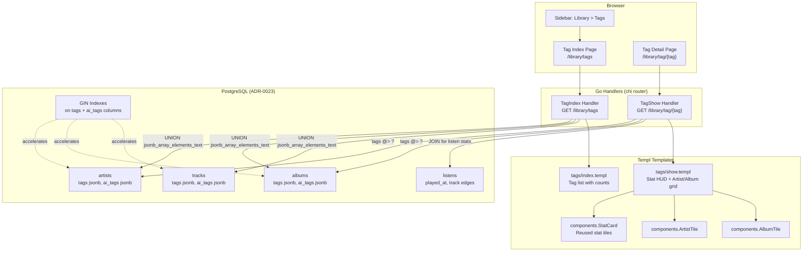

# ADR-0024: Tag Browsing Library Page with Dual Entity View and Stat HUD

> **Superseded by [ADR-0025](./ADR-0025-unified-tag-taxonomy.md).** This ADR's JSONB-at-runtime tag model was never implemented; ADR-0025's first-class Tag entity with a denormalized entity_tags table replaced it as the accepted approach. Any future tag-browsing UI should be specified against the ADR-0025 data model.

## Context and Problem Statement

Spotter's library currently lets users browse by a single entity type: Artists (`/library/artists`), Albums (`/library/albums`), or Tracks (`/library/tracks`). Each entity (Artist, Album, Track) carries both source-provided `tags` and AI-generated `ai_tags` fields stored as JSON string arrays in PostgreSQL (see ADR-0004, ADR-0023). However, there is no way to browse the library by tag -- a user cannot ask "show me everything tagged as 'shoegaze'" and see all matching artists and albums in one view.

A new **Tags** page under Library is needed that:

1. Lists all unique tags across the library as a browsable index.
2. Shows a **tag detail view** that displays both artists and albums matching that tag, deduplicated.
3. Presents a **stat HUD** (6-8 tiles) showing tag-level analytics: listening volume, unique entity counts, consumption share, and top contributors.

The primary challenge is querying JSON arrays efficiently in PostgreSQL to aggregate tags across three entity tables (artists, albums, tracks) and joining them against the listens table for statistics.

## Decision Drivers

* Tags already exist on all three entity types (`tags []string` and `ai_tags []string` on Artist, Album, and Track schemas) -- no schema migration needed for tag data itself
* PostgreSQL provides native JSONB operators (`jsonb_array_elements_text`, `?`, `@>`) for querying JSON arrays efficiently ([ADR-0023](./ADR-0023-multi-database-support-postgresql-mariadb.md))
* The existing browse pages (Artist Index, Album Index) follow a consistent HTMX + Templ pattern with pagination, tile/table views, and stat cards ([ADR-0001](./ADR-0001-htmx-templ-server-driven-ui.md))
* The dual-entity view (artists + albums together) is a new UI pattern not present in existing browse pages
* Tag aggregation across three tables could be expensive for large libraries without proper indexing or caching
* The stat HUD should reuse the existing `components.StatCard` pattern from the Home page ([ADR-0001](./ADR-0001-htmx-templ-server-driven-ui.md))

## Considered Options

* **Option 1: Query JSON arrays at runtime using PostgreSQL JSONB operators** -- use `jsonb_array_elements_text()` to unnest tags, aggregate with `DISTINCT`, and query per-tag entities via `@>` containment
* **Option 2: Denormalized tag index table** -- create a new `tag` entity in the Ent schema with many-to-many edges to Artist, Album, and Track; populate during enrichment
* **Option 3: Materialized view with periodic refresh** -- create a PostgreSQL materialized view that pre-aggregates tag data, refreshed on a ticker schedule

## Decision Outcome

Chosen option: **Option 1 (Query JSON arrays at runtime using PostgreSQL JSONB operators)**, because it requires zero schema changes, leverages PostgreSQL's built-in JSONB indexing capabilities, and keeps tag data in its canonical location on the entity schemas. The performance concern is mitigated by adding GIN indexes on the `tags` and `ai_tags` JSON columns and by paginating the tag detail view. This approach aligns with the existing Ent + PostgreSQL architecture ([ADR-0004](./ADR-0004-ent-orm-code-generation.md), [ADR-0023](./ADR-0023-multi-database-support-postgresql-mariadb.md)) and avoids introducing synchronization complexity between tag source data and a denormalized index.

If performance proves insufficient for very large libraries, this decision can be revisited in favor of Option 2 (denormalized table) as a future optimization without changing the user-facing API.

### Consequences

* Good, because no schema migration or new Ent entities are required -- tags remain on their source entities
* Good, because PostgreSQL JSONB operators (`@>`, `jsonb_array_elements_text`) are well-optimized with GIN indexes
* Good, because the tag index page can use a single raw SQL query to aggregate unique tags with counts across all three entity tables
* Good, because the implementation follows existing patterns (chi handler + templ template + ent queries) per [ADR-0001](./ADR-0001-htmx-templ-server-driven-ui.md), [ADR-0002](./ADR-0002-chi-http-router.md), [ADR-0004](./ADR-0004-ent-orm-code-generation.md)
* Bad, because raw SQL is needed for JSONB aggregation -- Ent's query builder does not natively support `jsonb_array_elements_text`
* Bad, because tag values are not normalized (case, spelling) -- "shoegaze" vs "Shoegaze" vs "shoe-gaze" may appear as separate tags without preprocessing
* Bad, because combining `tags` and `ai_tags` from three tables requires a UNION query, which is more complex than single-table queries
* Neutral, because tracks lack a direct user FK -- track queries must JOIN through the artist (or album) edge to scope by user, adding a join to each track subquery in the UNION

### Confirmation

Compliance is confirmed by the presence of:
- A new handler `TagIndex` and `TagShow` in `internal/handlers/tags.go`
- Templ templates `internal/views/tags/index.templ` and `internal/views/tags/show.templ`
- Routes registered under `/library/tags` and `/library/tag/{tag}` in `cmd/server/main.go`
- A "Tags" entry in the Library sidebar section in `internal/views/layouts/dashboard.templ`
- GIN indexes on `tags` and `ai_tags` columns for artists, albums, and tracks tables

## Tag Detail Page: Stat HUD Tiles

The tag detail view (`/library/tag/{tag}`) displays 8 stat tiles in a 4x2 grid:

| # | Tile | Description | Data Source |
|---|------|-------------|-------------|
| 1 | **Total Listens** | Total listen count for tracks tagged with this tag | `listens` joined via `tracks.tags/ai_tags` |
| 2 | **Unique Artists** | Count of distinct artists with this tag | `artists.tags/ai_tags` UNION `tracks` artist edges |
| 3 | **Unique Albums** | Count of distinct albums with this tag | `albums.tags/ai_tags` UNION `tracks` album edges |
| 4 | **Unique Tracks** | Count of distinct tracks with this tag | `tracks.tags/ai_tags` |
| 5 | **Listening Share** | Percentage of total listens attributed to this tag | Tag listens / total listens * 100 |
| 6 | **Top Artist** | Most-listened artist within this tag | `listens` grouped by artist, filtered by tag |
| 7 | **Top Album** | Most-listened album within this tag | `listens` grouped by album, filtered by tag |
| 8 | **Avg. Popularity** | Average Spotify popularity of tagged entities | `artists.popularity` + `albums.popularity` average |

## Navigation

A new "Tags" link is added to the Library section of the sidebar in `dashboard.templ`, between "Tracks" and the end of the Library list:

```
Library
  Listens
  Playlists
  Artists
  Albums
  Tracks
  Tags        <-- NEW
```

The URL pattern follows the existing convention:
- Tag index: `GET /library/tags` (list all tags with counts)
- Tag detail: `GET /library/tag/{tag}` (show artists + albums for a specific tag)

The `isLibrarySection()` function in `dashboard.templ` already matches `/library` prefixes, so the new routes will be highlighted correctly.

## Query Strategy

### Tag Index: Aggregate Unique Tags

```sql
SELECT tag, SUM(entity_count) as total_entities
FROM (
    SELECT jsonb_array_elements_text(tags) AS tag, COUNT(*) AS entity_count
    FROM artists WHERE user_artists = $1 AND tags IS NOT NULL
    GROUP BY tag
    UNION ALL
    SELECT jsonb_array_elements_text(ai_tags) AS tag, COUNT(*) AS entity_count
    FROM artists WHERE user_artists = $1 AND ai_tags IS NOT NULL
    GROUP BY tag
    UNION ALL
    SELECT jsonb_array_elements_text(tags) AS tag, COUNT(*) AS entity_count
    FROM albums WHERE user_albums = $1 AND tags IS NOT NULL
    GROUP BY tag
    UNION ALL
    SELECT jsonb_array_elements_text(ai_tags) AS tag, COUNT(*) AS entity_count
    FROM albums WHERE user_albums = $1 AND ai_tags IS NOT NULL
    GROUP BY tag
    UNION ALL
    SELECT jsonb_array_elements_text(t.tags) AS tag, COUNT(*) AS entity_count
    FROM tracks t
    JOIN artists a ON t.artist_tracks = a.id
    WHERE a.user_artists = $1 AND t.tags IS NOT NULL
    GROUP BY tag
    UNION ALL
    SELECT jsonb_array_elements_text(t.ai_tags) AS tag, COUNT(*) AS entity_count
    FROM tracks t
    JOIN artists a ON t.artist_tracks = a.id
    WHERE a.user_artists = $1 AND t.ai_tags IS NOT NULL
    GROUP BY tag
) combined
GROUP BY tag
ORDER BY total_entities DESC;
```

### Tag Detail: Artists and Albums for a Tag

Use PostgreSQL's `@>` containment operator with the GIN index:

```sql
-- Artists matching tag
SELECT * FROM artists
WHERE user_artists = $1
  AND (tags @> $2::jsonb OR ai_tags @> $2::jsonb);

-- Albums matching tag
SELECT * FROM albums
WHERE user_albums = $1
  AND (tags @> $2::jsonb OR ai_tags @> $2::jsonb);
```

Where `$2` is `'["shoegaze"]'::jsonb`.

### Performance: GIN Indexes

Add GIN indexes on the JSON columns to support efficient `@>` and `jsonb_array_elements_text` queries:

```sql
CREATE INDEX idx_artists_tags_gin ON artists USING GIN (tags);
CREATE INDEX idx_artists_ai_tags_gin ON artists USING GIN (ai_tags);
CREATE INDEX idx_albums_tags_gin ON albums USING GIN (tags);
CREATE INDEX idx_albums_ai_tags_gin ON albums USING GIN (ai_tags);
CREATE INDEX idx_tracks_tags_gin ON tracks USING GIN (tags);
CREATE INDEX idx_tracks_ai_tags_gin ON tracks USING GIN (ai_tags);
```

These indexes can be added via a manual migration SQL script or through Ent's schema annotations.

## Pros and Cons of the Options

### Option 1: Query JSON Arrays at Runtime (CHOSEN)

Use PostgreSQL's native JSONB operators to query `tags` and `ai_tags` JSON columns directly. Aggregate unique tags with `jsonb_array_elements_text()`, filter entities with `@>` containment.

* Good, because zero schema changes -- tags remain in their canonical location on Artist, Album, and Track entities
* Good, because PostgreSQL JSONB operators with GIN indexes provide efficient querying even for medium-to-large libraries
* Good, because tag data is always consistent -- no synchronization between source and index needed
* Good, because aligns with PostgreSQL capabilities already chosen in [ADR-0023](./ADR-0023-multi-database-support-postgresql-mariadb.md)
* Neutral, because requires raw SQL queries since Ent does not natively support JSONB operators -- but raw SQL is already used elsewhere (e.g., `GroupBy` aggregates in artist handlers)
* Bad, because aggregating tags across 6 column sources (3 entities x 2 tag fields) via UNION is verbose
* Bad, because tag names are not normalized -- "Rock", "rock", "ROCK" would appear as separate tags
* Bad, because very large libraries (100K+ tracks) may see slower tag index queries without GIN indexes

### Option 2: Denormalized Tag Index Table

Create a new `Tag` entity in Ent with fields `name string`, `normalized_name string`, and many-to-many edges to Artist, Album, and Track. Populate the tag-entity associations during metadata enrichment ([ADR-0015](./ADR-0015-pluggable-enricher-registry-pattern.md)).

* Good, because tag names can be normalized at write time (lowercase, trim, deduplicate spellings)
* Good, because standard Ent queries can be used -- no raw SQL needed
* Good, because a separate Tag entity enables future features: tag descriptions, tag hierarchies, user-created tags
* Good, because fast reads -- tag index is a simple `SELECT * FROM tags ORDER BY name`
* Bad, because requires a new Ent schema entity and `go generate ./ent` to regenerate the ORM layer
* Bad, because requires modifying all enrichers ([ADR-0015](./ADR-0015-pluggable-enricher-registry-pattern.md)) to populate tag associations during enrichment
* Bad, because tag data would be duplicated between the source entity fields and the tag table -- risk of drift
* Bad, because existing data requires a one-time backfill migration to populate the tag table from existing JSON arrays
* Bad, because many-to-many edges (tag <-> artist, tag <-> album, tag <-> track) add 3 junction tables and significant generated code

### Option 3: Materialized View with Periodic Refresh

Create a PostgreSQL materialized view that pre-aggregates tag data (tag name, entity counts, listen counts). Refresh the view on a background ticker ([ADR-0013](./ADR-0013-goroutine-ticker-background-scheduling.md)) -- e.g., every 30 minutes or after enrichment completes.

* Good, because reads are extremely fast -- the materialized view is a pre-computed result set
* Good, because the UNION aggregation SQL is written once and encapsulated in the view definition
* Good, because no schema changes to Ent entities -- the view exists only at the database level
* Neutral, because Ent can query materialized views via raw SQL, though without type-safe query builders
* Bad, because data is stale between refreshes -- a newly enriched artist's tags won't appear until the next refresh
* Bad, because `REFRESH MATERIALIZED VIEW` can be expensive for large datasets and blocks reads unless using `CONCURRENTLY` (which requires a unique index)
* Bad, because materialized views are a PostgreSQL-specific feature -- would not work if the project ever returns to SQLite support ([ADR-0023](./ADR-0023-multi-database-support-postgresql-mariadb.md))
* Bad, because adds operational complexity -- another background ticker to monitor and debug

## Architecture Diagram



## More Information

* Tag data locations: `ent/schema/artist.go:54` (`tags`), `ent/schema/artist.go:87` (`ai_tags`), `ent/schema/album.go:60` (`tags`), `ent/schema/album.go:91` (`ai_tags`), `ent/schema/track.go:80` (`tags`), `ent/schema/track.go:109` (`ai_tags`)
* Existing browse page pattern: `internal/views/artists/index.templ` -- tile/table toggle, pagination, stat display
* Stat card components: `internal/views/components/ui.templ:82-119` -- `StatCard` and `StatCardLink` templ components
* Sidebar navigation: `internal/views/layouts/dashboard.templ:103-141` -- Library section with Artists, Albums, Tracks links
* Route registration: `cmd/server/main.go:488-512` -- Library route group under `/library`
* Home page HUD pattern: `internal/views/home/index.templ:107-112` -- 4-tile stat grid using `StatCardLink`
* AI enrichment pipeline that generates `ai_tags`: [ADR-0015](./ADR-0015-pluggable-enricher-registry-pattern.md) (Enricher Registry), [ADR-0008](./ADR-0008-openai-api-litellm-compatible-llm-backend.md) (OpenAI backend)
* Database: [ADR-0023](./ADR-0023-multi-database-support-postgresql-mariadb.md) (PostgreSQL), [ADR-0004](./ADR-0004-ent-orm-code-generation.md) (Ent ORM)
* UI framework: [ADR-0001](./ADR-0001-htmx-templ-server-driven-ui.md) (HTMX + Templ), [ADR-0002](./ADR-0002-chi-http-router.md) (chi router), [ADR-0011](./ADR-0011-tailwind-daisyui-ui-styling.md) (Tailwind + DaisyUI)
