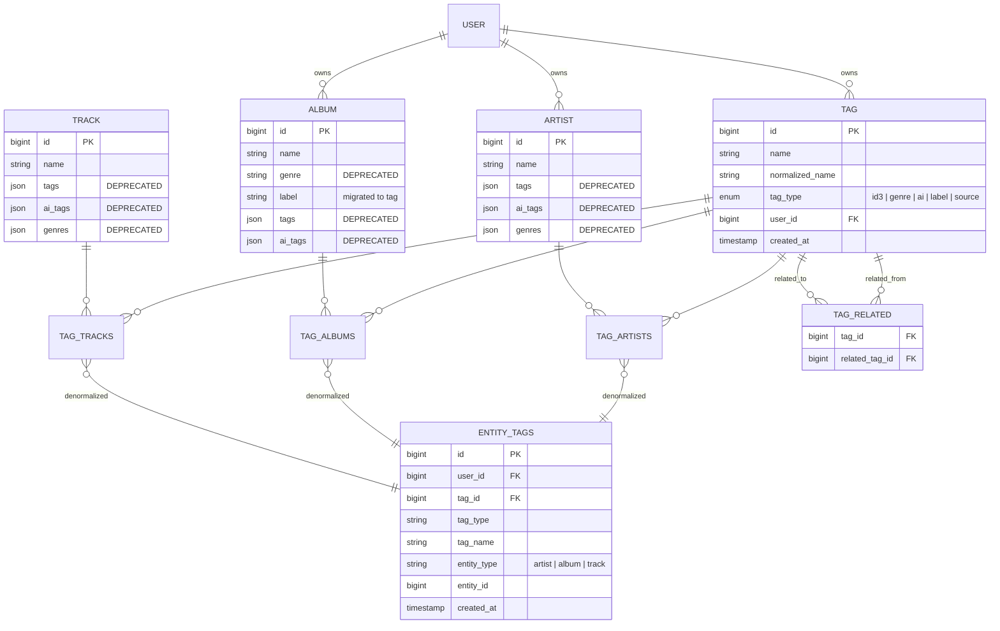

# ADR-0025: Unified Tag Taxonomy with Typed Tags and Denormalized Query Table

## Context and Problem Statement

Spotter currently stores tag-like data across multiple disjoint fields on Artist, Album, and Track entities: `genres` (from Spotify), `tags` (from Last.fm and other sources), and `ai_tags` (from OpenAI). Albums also carry a scalar `genre` field and a `label` field (record label). These fields lack a common type system -- there is no way to distinguish whether a tag originated from ID3 metadata, a record label, an AI enricher, or a streaming provider. This makes it impossible to filter the library by tag provenance (e.g., "show me all artists with the AI-generated tag 'dream pop'") and prevents the UI from visually differentiating tag sources.

ADR-0024 introduced a tag browsing page that queries these JSON arrays at runtime using PostgreSQL JSONB operators, but it treats all tags as untyped strings. As the library grows, the need for a proper tag taxonomy becomes clear: genres are just one form of tag, labels are another, and AI-generated tags should be visually branded to match Spotter's existing AI branding (sparkles icon, accent color). Additionally, the ability to relate tags to each other (e.g., "shoegaze" is related to "dream pop") would enable discovery features like "related tags" when browsing.

## Decision Drivers

* Tags currently live in 6+ separate JSON array fields across 3 entity tables, making unified queries verbose and error-prone (ADR-0024 requires a 6-way UNION)
* Each tag source (ID3, Spotify genres, Last.fm social tags, AI-generated tags, record labels) has different trust levels and semantic meanings that users should be able to distinguish
* The existing AI branding pattern (sparkles icon `icon-[heroicons--sparkles]`, `badge-accent` color, `text-accent` styling) is well-established in the UI (artist show, track show, album show pages) and should extend consistently to AI tags in the new taxonomy
* PostgreSQL's JSONB queries for tag aggregation are becoming the performance bottleneck identified in ADR-0024 -- a denormalized table would simplify queries significantly
* Tag relationships (e.g., "shoegaze" is related to "dream pop") are impossible to express with flat string arrays
* The enricher pipeline (ADR-0015) already distinguishes tag sources -- Last.fm returns `Tags`, Spotify returns `Genres`, OpenAI returns `AITags` -- but this provenance is lost when stored as undifferentiated `[]string` fields

## Considered Options

* **Option 1: First-class Tag entity with typed tags and a denormalized query table** -- create a `Tag` entity in Ent with a `tag_type` enum, many-to-many edges to Artist/Album/Track, a `tag_relations` self-referential edge for related tags, and a denormalized `entity_tags` materialized view or table for fast filtering
* **Option 2: Add a `tag_type` field to existing JSON arrays** -- change `tags []string` to `tags []TagEntry` where `TagEntry` has `name` and `type` fields, keeping the data on the entity schemas and querying with JSONB operators
* **Option 3: Separate typed JSON columns per tag type** -- add `id3_tags`, `label_tags`, `source_tags`, `ai_tags` as separate `[]string` JSON columns on each entity, querying them independently

## Decision Outcome

Chosen option: **Option 1 (First-class Tag entity with typed tags and denormalized query table)**, because it provides proper relational modeling for tags, enables tag relationships, normalizes tag names (solving the case-sensitivity issue identified in ADR-0024), and replaces verbose JSONB UNION queries with standard Ent query builder joins. The denormalized query table enables fast filtering by tag type without complex SQL.

### Tag Type Enum

| Type | Source | Description | UI Icon | UI Color |
|------|--------|-------------|---------|----------|
| `id3` | Navidrome sync, file metadata | Tags embedded in audio file ID3/Vorbis metadata | `icon-[heroicons--musical-note]` | `badge-neutral` |
| `genre` | Spotify, Last.fm, MusicBrainz | Genre classifications from music databases | `icon-[heroicons--tag]` | `badge-primary` |
| `ai` | OpenAI enricher | AI-generated descriptive tags | `icon-[heroicons--sparkles]` | `badge-accent` |
| `label` | Spotify, MusicBrainz | Record label associations | `icon-[heroicons--building-office]` | `badge-secondary` |
| `source` | Navidrome, Spotify, Lidarr | Source/provider-specific categorization tags | `icon-[heroicons--server]` | `badge-info` |

The `ai` tag type uses the existing AI branding: sparkles icon and accent color, consistent with `AISummaryCard`, AI biography toggle, and AI regeneration buttons already present in the UI.

### Consequences

* Good, because tag names are normalized at write time (lowercase, trimmed) -- resolves the "shoegaze" vs "Shoegaze" vs "shoe-gaze" inconsistency noted in ADR-0024
* Good, because tag provenance is preserved through the `tag_type` enum -- users can filter by "show me only AI tags" or "show me only ID3 tags"
* Good, because tag relationships enable discovery: browsing "shoegaze" can suggest "dream pop", "noise pop", "post-punk"
* Good, because the denormalized query table replaces the 6-way UNION query from ADR-0024 with a simple indexed lookup
* Good, because standard Ent query builder can be used for all tag operations -- no more raw SQL for tag aggregation
* Good, because AI tag branding remains consistent with existing UI patterns
* Bad, because requires a new Ent schema entity (`Tag`) and `go generate ./ent`, adding generated code
* Bad, because requires a data migration to backfill existing `tags`, `ai_tags`, `genres`, `genre`, and `label` fields into the new Tag entity
* Bad, because all enrichers (Last.fm, Spotify, OpenAI, Navidrome, MusicBrainz, Lidarr) must be updated to create/associate Tag entities instead of setting string array fields
* Bad, because adds 3 junction tables (tag-artist, tag-album, tag-track) plus the tag_relations table

### Confirmation

Compliance is confirmed by:
- A new `Tag` schema in `ent/schema/tag.go` with `name`, `normalized_name`, `tag_type`, and relation edges
- A new `TagRelation` schema or self-referential edge in `ent/schema/tag.go` for related tags
- Many-to-many edges from Tag to Artist, Album, and Track in the respective schema files
- A denormalized `entity_tags` table (or materialized view) with columns: `entity_type`, `entity_id`, `tag_id`, `tag_type`, indexed for fast lookups
- Enricher updates in `internal/enrichers/` to set `tag_type` when returning tags
- UI components using the tag type icon/color mapping table above
- A migration script or startup backfill that populates the Tag entity from existing JSON array fields
- Tag browsing page (ADR-0024) updated to query the new Tag entity instead of JSONB arrays

## Pros and Cons of the Options

### Option 1: First-Class Tag Entity with Denormalized Query Table (CHOSEN)

Create a `Tag` entity in Ent with fields: `name` (display name), `normalized_name` (lowercase for deduplication), `tag_type` (enum: id3, genre, ai, label, source). Add many-to-many edges to Artist, Album, and Track. Add a self-referential `related_tags` edge for tag relationships. Create a denormalized `entity_tags` table for fast filtered queries.

* Good, because proper relational modeling enables complex queries: "all artists with genre tags from Spotify", "all albums with AI tag 'atmospheric'"
* Good, because `normalized_name` with a unique constraint per `tag_type` prevents duplicate tags
* Good, because self-referential `related_tags` edge enables tag relationship features
* Good, because Ent query builder works natively -- `client.Tag.Query().Where(tag.TagTypeEQ("ai")).QueryArtists().All(ctx)`
* Good, because denormalized query table supports fast multi-entity filtering without JOINing through junction tables
* Good, because future features (user-created tags, tag descriptions, tag hierarchies) have a natural home
* Bad, because initial migration complexity is high -- must backfill from 6+ source fields across 3 entities
* Bad, because 3 junction tables + 1 relation table adds schema surface area
* Bad, because enricher pipeline must be updated to create Tag entities and manage associations
* Bad, because the legacy JSON fields must be maintained during a transition period for backward compatibility

### Option 2: Typed JSON Arrays on Existing Entities

Change `tags []string` to `tags []TagEntry` where `TagEntry` is `{Name string, Type string}`. Keep data on entity schemas, query with JSONB operators like `tags @> '[{"type":"ai","name":"shoegaze"}]'`.

* Good, because no new schema entities -- minimal Ent code generation changes
* Good, because tag type information is co-located with the entity
* Good, because migration is straightforward -- transform existing `[]string` to `[]TagEntry` in place
* Bad, because JSONB queries become more complex: nested object matching instead of simple string containment
* Bad, because tag relationships cannot be expressed -- still flat data
* Bad, because tag normalization must happen at query time (or with database triggers) since there is no unique constraint on JSON array elements
* Bad, because GIN indexes on `jsonb` arrays of objects are less efficient than on simple string arrays
* Bad, because duplicating the same tag name+type across thousands of entities wastes storage

### Option 3: Separate Typed JSON Columns Per Tag Type

Add `id3_tags []string`, `label_tags []string`, `source_tags []string` columns to each entity, keeping existing `genres []string` and `ai_tags []string`. Query each column independently.

* Good, because simple to understand -- each column has exactly one tag type
* Good, because existing `ai_tags` and `genres` columns are already in the right shape
* Good, because GIN indexes work well on simple `[]string` JSON arrays
* Bad, because 5 tag-type columns x 3 entities = 15 JSON columns to manage
* Bad, because adding a new tag type requires a schema migration to add columns to all 3 entities
* Bad, because tag aggregation still requires UNION queries (now across 15 columns instead of 6)
* Bad, because tag relationships still cannot be expressed
* Bad, because tag names are still not normalized across columns
* Bad, because this approach makes the ADR-0024 UNION problem worse, not better

## Ent Schema Design

### Tag Entity

```go
// Tag holds the schema definition for the Tag entity.
type Tag struct {
    ent.Schema
}

func (Tag) Fields() []ent.Field {
    return []ent.Field{
        field.String("name").
            NotEmpty().
            MaxLen(255).
            Comment("Display name of the tag"),
        field.String("normalized_name").
            NotEmpty().
            MaxLen(255).
            Comment("Lowercase normalized name for deduplication"),
        field.Enum("tag_type").
            Values("id3", "genre", "ai", "label", "source").
            Comment("Classification of tag origin"),
        field.Time("created_at").
            Default(time.Now).
            Immutable(),
    }
}

func (Tag) Edges() []ent.Edge {
    return []ent.Edge{
        edge.From("user", User.Type).
            Ref("tags").
            Unique().
            Required(),
        edge.To("artists", Artist.Type),
        edge.To("albums", Album.Type),
        edge.To("tracks", Track.Type),
        edge.To("related_tags", Tag.Type).
            From("related_from"),
    }
}

func (Tag) Indexes() []ent.Index {
    return []ent.Index{
        // Unique tag per type per user
        index.Fields("normalized_name", "tag_type").
            Edges("user").
            Unique(),
        // Fast lookup by type
        index.Fields("tag_type"),
        // Fast search by normalized name
        index.Fields("normalized_name"),
    }
}
```

### Denormalized Query Table

```sql
CREATE TABLE entity_tags (
    id BIGSERIAL PRIMARY KEY,
    user_id BIGINT NOT NULL REFERENCES users(id),
    tag_id BIGINT NOT NULL REFERENCES tags(id) ON DELETE CASCADE,
    tag_type VARCHAR(20) NOT NULL,
    tag_name VARCHAR(255) NOT NULL,
    entity_type VARCHAR(20) NOT NULL, -- 'artist', 'album', 'track'
    entity_id BIGINT NOT NULL,
    created_at TIMESTAMPTZ NOT NULL DEFAULT NOW()
);

-- Fast filtering: "all artists tagged 'jazz' where type = 'genre'"
CREATE INDEX idx_entity_tags_lookup
    ON entity_tags (user_id, tag_type, tag_name, entity_type);

-- Fast tag listing: "all tags for artist #42"
CREATE INDEX idx_entity_tags_entity
    ON entity_tags (entity_type, entity_id);

-- Uniqueness: prevent duplicate tag-entity associations
CREATE UNIQUE INDEX idx_entity_tags_unique
    ON entity_tags (tag_id, entity_type, entity_id);
```

This table is populated by triggers or application-level hooks when tag-entity associations are created/deleted via the Ent many-to-many edges. It denormalizes `tag_type` and `tag_name` from the `tags` table to avoid JOINs during filtered queries.

## Architecture Diagram



## UI Tag Rendering

Tags are rendered with type-specific icons and DaisyUI badge colors (ADR-0011):

```html
<!-- ID3 tag -->
<span class="badge badge-neutral gap-1">
  <span class="icon-[heroicons--musical-note] w-3 h-3"></span>
  rock
</span>

<!-- Genre tag -->
<span class="badge badge-primary gap-1">
  <span class="icon-[heroicons--tag] w-3 h-3"></span>
  shoegaze
</span>

<!-- AI tag (matches existing AI branding) -->
<span class="badge badge-accent gap-1">
  <span class="icon-[heroicons--sparkles] w-3 h-3"></span>
  dream pop
</span>

<!-- Label tag -->
<span class="badge badge-secondary gap-1">
  <span class="icon-[heroicons--building-office] w-3 h-3"></span>
  4AD
</span>

<!-- Source tag -->
<span class="badge badge-info gap-1">
  <span class="icon-[heroicons--server] w-3 h-3"></span>
  navidrome
</span>
```

This pattern is consistent with the existing tag rendering in `internal/views/artists/show.templ:264-278` (genres as `badge-neutral`, AI tags as `badge-accent` with sparkles icon) and `internal/views/tracks/show.templ:297-311` (genres as `badge-primary`, AI tags as `badge-accent` with sparkles icon).

## Migration Strategy

1. **Phase 1: Create Tag entity and backfill** -- Add the Tag Ent schema, run `go generate ./ent`, create a migration that reads existing `tags`, `ai_tags`, `genres`, `genre`, and `label` fields and creates corresponding Tag entities with appropriate `tag_type` values. Source mapping:
   - `artist.genres` (from Spotify) -> `tag_type: "genre"`
   - `artist.tags` (from Last.fm) -> `tag_type: "id3"`
   - `artist.ai_tags` (from OpenAI) -> `tag_type: "ai"`
   - `album.genre` (scalar, from enrichers) -> `tag_type: "genre"`
   - `album.tags` (from Last.fm/Spotify) -> `tag_type: "id3"`
   - `album.ai_tags` (from OpenAI) -> `tag_type: "ai"`
   - `album.label` -> `tag_type: "label"`
   - `track.genres` (from Navidrome) -> `tag_type: "genre"`
   - `track.tags` (from Last.fm) -> `tag_type: "id3"`
   - `track.ai_tags` (from OpenAI) -> `tag_type: "ai"`

2. **Phase 2: Update enrichers** -- Modify each enricher to create/associate Tag entities via Ent edges instead of setting JSON array fields. The enricher `Type()` maps to tag types: `TypeLastFM` -> `id3`, `TypeSpotify` -> `genre`, `TypeOpenAI` -> `ai`, `TypeNavidrome` -> `genre`/`id3`, `TypeMusicBrainz` -> `genre`.

3. **Phase 3: Update tag browsing** -- Rewrite the ADR-0024 tag browsing page to query the Tag entity and `entity_tags` table instead of JSONB arrays.

4. **Phase 4: Deprecate legacy fields** -- Mark `tags`, `ai_tags`, `genres`, `genre` fields as deprecated in schema comments. Remove in a future release after verifying no code references them.

## More Information

* Current tag storage: `ent/schema/artist.go:54` (`tags`), `ent/schema/artist.go:65` (`genres`), `ent/schema/artist.go:87` (`ai_tags`), `ent/schema/album.go:57` (`genre`), `ent/schema/album.go:60` (`tags`), `ent/schema/album.go:72` (`label`), `ent/schema/album.go:91` (`ai_tags`), `ent/schema/track.go:80` (`tags`), `ent/schema/track.go:83` (`genres`), `ent/schema/track.go:109` (`ai_tags`)
* AI branding pattern: `internal/views/components/ui.templ:158-170` (`AISummaryCard` with sparkles + accent), `internal/views/artists/show.templ:269-274` (AI tags with sparkles + `badge-accent`)
* Tag browsing (to be updated): ADR-0024
* Enricher pipeline: ADR-0015 (enricher registry), `internal/enrichers/enrichers.go` (type definitions)
* Enricher tag sources: Last.fm sets `Tags` (`internal/enrichers/lastfm/lastfm.go:248-264`), Spotify sets `Genres` (`internal/enrichers/spotify/spotify.go:407`), OpenAI sets `AITags` (`internal/enrichers/openai/openai.go:484-489`), Navidrome sets `Genres` (`internal/enrichers/navidrome/navidrome.go:672`)
* ORM: ADR-0004 (Ent ORM with code generation)
* Database: ADR-0023 (PostgreSQL)
* UI framework: ADR-0011 (Tailwind CSS + DaisyUI)
