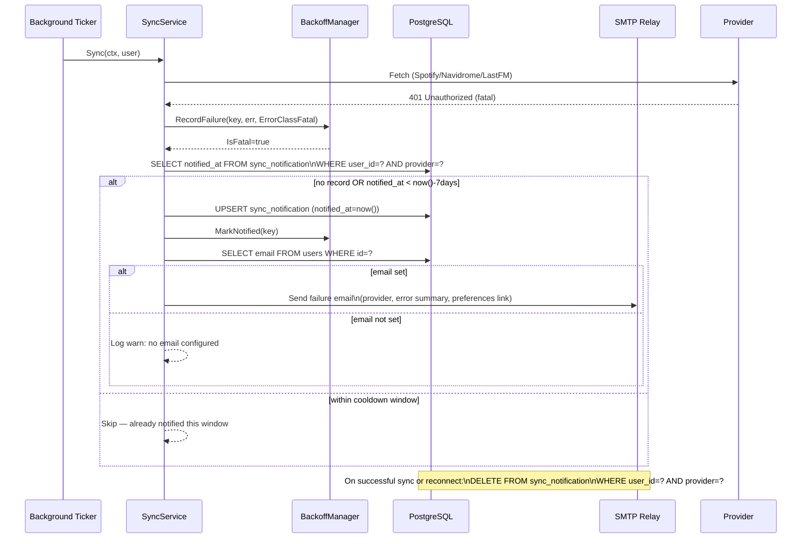

# ADR-0026: Sync Failure Email Notifications with 7-Day Cooldown

## Context and Problem Statement

When a provider sync fails fatally (e.g. invalid credentials, revoked OAuth token, provider
unreachable), the user currently receives an SSE toast notification — but only if their browser
is open and their session is active. Silent failures accumulate unnoticed: scheduled background
syncs fail repeatedly with no way to alert the user when they are offline.

How should Spotter notify users of fatal sync failures without spamming them on every retry?

## Decision Drivers

* Users are often offline when scheduled syncs run; SSE toasts are invisible to them
* `BackoffManager` already classifies `ErrorClassFatal` and tracks `NotifiedFatal` in memory,
  but this state is lost on restart and has no persistence or cooldown enforcement
* The personal/self-hosted nature of the app means email is the only reliable out-of-band
  channel (no push notifications, no mobile app)
* `User.email` is already defined in the schema (optional, RFC 5321 max 320 chars) but never
  populated — a source of truth for the address must be chosen
* Navidrome (primary identity) does not expose user email via any API it currently uses
* LLDAP is the backing directory but the app has no LDAP client and Spotter runs as a
  single-binary server; adding an LDAP dependency solely for email fetching is heavyweight
* Notification frequency must be bounded — a 7-day cooldown per provider per user prevents
  alert fatigue while ensuring failures do not go unnoticed indefinitely

## Considered Options

* **Option A**: User-provided email in Preferences + SMTP delivery + DB-persisted cooldown
* **Option B**: Fetch email from LLDAP at sync time + SMTP delivery + DB-persisted cooldown
* **Option C**: No email; enhance SSE with persistent unread-alert badge in UI only

## Decision Outcome

Chosen option: **Option A** (user-provided email + SMTP + DB-persisted cooldown), because it
requires no new external service dependencies beyond an SMTP relay, fits the self-hosted model,
and gives users explicit control over their notification address independent of directory changes.

The `User.email` field is populated by the user in Account Preferences. Email delivery uses
configurable SMTP (host/port/TLS/credentials in config). Notification state is persisted in a
new `sync_notification` table to survive restarts and enforce the 7-day cooldown accurately.

Notification is sent **at most once per provider per user per 7-day window**, triggered when
`BackoffManager` marks a sync key `IsFatal` and the DB cooldown has not fired in the last 7
days. On provider reconnect or successful sync the cooldown record is cleared so the next
failure starts a fresh window.

### Consequences

* Good, because users receive actionable failure alerts even when offline
* Good, because the existing `BackoffManager.NotifiedFatal` / `IsFatal` classification requires
  only a persistence layer, not a redesign
* Good, because SMTP is universally available in self-hosted environments; no SaaS dependency
* Good, because email address is user-controlled and decoupled from LLDAP credential changes
* Bad, because users must manually enter their email address (opt-in friction)
* Bad, because if SMTP is not configured, notifications silently do not send (must surface this
  clearly in the UI)
* Bad, because `User.email` is shared across all notification types; per-address granularity
  per provider is not supported

### Confirmation

Implementation is confirmed when:
- A user with a fatal Spotify credential failure receives exactly one email per 7-day window
- Logging into Spotter (which refreshes NavidromeAuth) clears the Navidrome cooldown record
- SMTP misconfiguration is surfaced as a warning on the Preferences page if email is set
- Existing `BackoffManager.MarkNotified()` / `NotifiedFatal` state continues to gate the
  in-session SSE toast independently of the email notification

## Pros and Cons of the Options

### Option A — User-provided email + SMTP + DB-persisted cooldown

User fills in their email in Account Preferences. Spotter sends via configurable SMTP relay.
Cooldown state stored in a `sync_notification` DB table (`user_id`, `provider`, `notified_at`).

* Good, because zero new runtime dependencies (SMTP is available in every self-hosted stack)
* Good, because email is user-controlled and survives LLDAP password resets or username changes
* Good, because DB persistence means cooldown survives server restarts accurately
* Good, because `sync_notification` table can later serve other notification types
* Neutral, because requires user to take action (enter email) before feature activates
* Bad, because two sources of truth exist if user changes LLDAP email and forgets to update

### Option B — Fetch email from LLDAP at sync time + SMTP delivery + DB-persisted cooldown

At notification time, perform an LDAP query to `ldap://lldap:3890` to look up the user's email
by `uid`. Requires adding `go-ldap/ldap/v3` dependency and LLDAP bind credentials to config.

* Good, because email stays in sync with the directory automatically
* Bad, because introduces an LDAP client dependency that only exists for this one feature
* Bad, because LLDAP bind credentials and host must be added to config (expanding the attack
  surface and operational complexity)
* Bad, because failure to reach LLDAP at notification time silently suppresses the alert —
  the very moment a sync is broken may also be a moment of infra instability
* Bad, because tightly couples Spotter to LLDAP; other identity backends become harder

### Option C — No email; persistent unread-alert badge in UI only

Add a `fatal_alerts` counter to the User record or a dedicated table. Show a persistent
warning badge in the dashboard nav when unacknowledged fatal failures exist. No email.

* Good, because no SMTP dependency, simplest implementation
* Good, because fully in-app, no PII email handling
* Bad, because user must open the app to see alerts — defeats the purpose for long-running
  background failures when the user is not actively logging in
* Bad, because provides no out-of-band signal; silent failure problem remains for offline users

## Architecture Diagram

## More Information

* **Related**: ADR-0005 (Navidrome primary identity — explains why we cannot rely on Navidrome
  for email), ADR-0006 (AES-256-GCM — `User.email` does not require encryption at rest as it
  is not a credential)
* **Existing infrastructure to reuse**:
  - `internal/services/resilience.go` — `BackoffManager`, `ErrorClassFatal`, `MarkNotified()`
  - `ent/schema/user.go` — `email` field (optional, already migrated)
  - `internal/config/config.go` — add `[smtp]` section: `host`, `port`, `username`,
    `password`, `from`, `tls` (optional, omit to disable email notifications)
* **New DB object**: `sync_notification` table — `(id, user_id FK, provider string,
  notified_at timestamptz)` with unique index on `(user_id, provider)`
* **Cooldown default**: 7 days, configurable via `notifications.failure_cooldown_days`
* **Spec to follow**: A SPEC should capture the exact requirements for the email template,
  cooldown logic, SMTP configuration, and UI flow for entering email address
