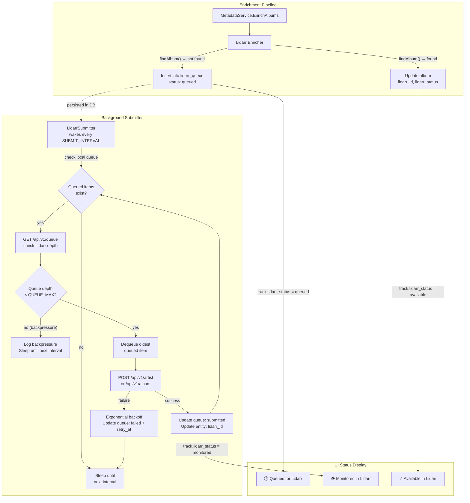

# ADR-0029: Rate-Limited Lidarr Submission Queue with Backpressure and Pending State Tracking

## Context and Problem Statement

When a new user connects their Spotify account to Spotter, the metadata enrichment pipeline (ADR-0015) processes their entire listening history and all playlist tracks. For users with large Spotify libraries (hundreds of playlists, thousands of unique albums), the Lidarr enricher submits every discovered artist and album to Lidarr in rapid succession during a single enrichment cycle. This floods Lidarr's download queue, overwhelming its indexer search capacity, saturating disk I/O, and potentially triggering rate limits from upstream indexers (Newznab/Torznab). Unlike MusicBrainz (which has a 1100ms inter-request delay), the Lidarr enricher currently has **no rate limiting, no backoff, and no queuing** — every `addArtist()` and `addAlbum()` call fires immediately during enrichment.

Additionally, the current status model only tracks items that have been submitted to Lidarr (`available`, `monitored`, `pending`, `grabbed`, `missing`). There is no concept of items that Spotter *intends* to submit but has not yet sent — making it impossible for users to see what is queued locally versus what has actually been requested in Lidarr.

How should Spotter throttle Lidarr submissions to prevent queue flooding while giving users visibility into the local submission backlog?

## Decision Drivers

* New users with large Spotify libraries trigger hundreds of Lidarr artist/album submissions in a single enrichment cycle
* Lidarr's indexer searches are expensive — each added artist/album triggers searches across configured indexers, which have their own rate limits and API hit caps
* The existing enrichment pipeline processes artists and albums in batches (up to 100), with no inter-request delay for Lidarr calls
* Users need to see which albums are "queued for Lidarr" versus "already in Lidarr" versus "not eligible for Lidarr" — the current UI only shows post-submission states
* The bottleneck is Lidarr's internal download queue depth — submissions should pause when the queue is full, not just slow down at a fixed rate
* Lidarr is a local service (same homelab network), so network latency is negligible — the constraint is Lidarr's processing and indexer pressure
* The solution must not block the enrichment pipeline — other enrichers (Spotify, Last.fm, OpenAI) should continue while Lidarr submissions are throttled

## Considered Options

* **Option 1: DB-persisted submission queue with Lidarr queue backpressure** — decouple submission from enrichment using a persistent queue table and a background goroutine that monitors Lidarr's queue depth, only submitting when the queue is below a configurable cap
* **Option 2: In-process mutex delay (MusicBrainz pattern)** — add a fixed inter-request delay to the Lidarr enricher, blocking enrichment until each submission completes
* **Option 3: Lidarr-side configuration only** — rely on Lidarr's built-in import list and indexer rate limit settings, submitting everything immediately

## Decision Outcome

Chosen option: **Option 1 (DB-persisted submission queue with Lidarr queue backpressure)**, because it decouples Lidarr submission from the enrichment pipeline, uses actual Lidarr queue depth as the throttling signal (rather than an arbitrary fixed rate), persists pending submissions across restarts, and introduces a `queued` status that gives users visibility into what Spotter intends to submit before it reaches Lidarr.

The enrichment pipeline will no longer call `addArtist()` / `addAlbum()` directly. Instead, it will insert a row into a `lidarr_queue` table (or Ent entity) with status `queued`. A dedicated background goroutine (`LidarrSubmitter`) wakes on a configurable interval (default: 30 seconds via `SPOTTER_LIDARR_SUBMIT_INTERVAL`), checks Lidarr's current queue depth via its API (e.g. `GET /api/v1/queue`), and only submits items if the queue is below the configured cap (`SPOTTER_LIDARR_QUEUE_MAX`, default: 20). When the Lidarr queue is at or above the cap, the submitter logs a backpressure event and sleeps until the next interval — no submissions are made until Lidarr has drained below the threshold. Failed submissions use exponential backoff (consistent with ADR-0020) before retry.

### Consequences

* Good, because enrichment cycles complete without blocking on Lidarr — the pipeline records intent and moves on
* Good, because backpressure is driven by Lidarr's actual queue depth, not an arbitrary timer — submissions automatically resume when Lidarr catches up
* Good, because the configurable cap (`SPOTTER_LIDARR_QUEUE_MAX`) lets operators tune to their indexer and disk capacity
* Good, because the configurable wake interval (`SPOTTER_LIDARR_SUBMIT_INTERVAL`) controls how frequently the submitter checks Lidarr and attempts to drain
* Good, because the persistent queue survives process restarts — no submissions are lost when the container updates
* Good, because the new `queued` status lets the UI show "Waiting for Lidarr" with a distinct icon, giving users visibility into the backlog
* Good, because backoff on submission failure (ADR-0020 pattern) prevents hammering Lidarr when it is unreachable
* Bad, because it introduces a new Ent entity (`LidarrQueue`) and a background goroutine, adding operational complexity
* Bad, because there is a delay between catalog discovery and Lidarr submission — users may need to wait minutes to hours for large backlogs to drain
* Bad, because the queue table grows and needs periodic cleanup of completed/failed entries
* Bad, because a Lidarr API call (queue depth check) is made every wake interval even when the local queue is empty (mitigated by skipping the check when no queued items exist)

### Confirmation

* The `lidarr_queue` table exists with `queued`, `submitted`, `failed` status values
* Enrichment no longer calls Lidarr's POST endpoints directly — only inserts queue rows
* The `LidarrSubmitter` goroutine checks Lidarr queue depth before submitting
* When Lidarr queue >= `SPOTTER_LIDARR_QUEUE_MAX`, zero submissions are made until the queue drains below the cap
* Track status UI shows a distinct `queued` state for items not yet sent to Lidarr
* Load test: enriching 500+ albums in one cycle does not push the Lidarr queue above the configured cap

## Pros and Cons of the Options

### Option 1: DB-Persisted Queue with Lidarr Queue Backpressure

Decouple Lidarr submission from enrichment by recording submission intent in a database queue table. A background goroutine wakes on a configurable interval, checks Lidarr's queue depth via its API, and only submits items when the queue is below a configurable cap. Items transition through `queued` → `submitted` → Lidarr status (`monitored`, `available`, etc.) or `failed` with retry backoff.

* Good, because enrichment is non-blocking — other enrichers are not delayed by Lidarr throttling
* Good, because backpressure is adaptive — submission rate responds to actual Lidarr load, not a fixed timer
* Good, because queue persists across restarts — no lost submissions on container recreation
* Good, because the `queued` status provides UI visibility into the pre-submission backlog
* Good, because the cap and interval are operator-configurable for different Lidarr/indexer capacities
* Good, because failed submissions use exponential backoff, preventing cascading failures
* Neutral, because requires a new Ent entity and background goroutine (consistent with existing patterns like ADR-0013)
* Bad, because introduces eventual consistency — album status in the UI may lag behind actual Lidarr state
* Bad, because queue table requires periodic cleanup of old completed entries
* Bad, because depends on Lidarr's queue API being available and accurate

### Option 2: In-Process Mutex Delay (MusicBrainz Pattern)

Add a `sync.Mutex` and `time.Sleep(interval)` between consecutive Lidarr API calls within the enricher, mirroring the MusicBrainz enricher's 1100ms delay pattern.

* Good, because minimal code change — add a mutex and sleep to existing `addArtist()` / `addAlbum()` methods
* Good, because no new database entity or background goroutine needed
* Bad, because blocks the entire enrichment pipeline while waiting — other enrichers for the same entity cannot proceed
* Bad, because no persistence — if the process restarts mid-enrichment, partially-submitted work is lost
* Bad, because no `queued` status — users cannot see what is waiting to be submitted
* Bad, because a fixed delay has no awareness of Lidarr's actual queue depth — it may still flood a slow Lidarr or under-utilize a fast one
* Bad, because the delay compounds across hundreds of submissions, making enrichment cycles take hours for large libraries (500 albums x 5s = 41 minutes of blocking)

### Option 3: Lidarr-Side Configuration Only

Submit everything immediately and rely on Lidarr's internal import list throttling and indexer rate limit settings to manage the load.

* Good, because zero code changes in Spotter — the problem is "solved" by configuring Lidarr
* Good, because Lidarr's download client integration handles prioritization natively
* Bad, because Lidarr's indexer rate limits are per-indexer, not per-submission — flooding 500 artists still triggers 500 indexer searches regardless of Lidarr config
* Bad, because Lidarr has no built-in submission rate limiting for its `/artist` and `/album` POST endpoints — all submissions are processed immediately
* Bad, because no visibility in Spotter's UI for what has been queued — users must check Lidarr directly
* Bad, because does not address the root cause — Spotter is the entity generating the flood

## Architecture Diagram

## More Information

* **Related ADRs**: ADR-0015 (enricher registry — Lidarr enricher registration), ADR-0013 (goroutine ticker — background submitter follows same pattern), ADR-0020 (error handling — backoff strategy for failed submissions), ADR-0023 (multi-database — queue table supports PostgreSQL/SQLite/MariaDB)
* **Existing rate limiting reference**: `internal/enrichers/musicbrainz/musicbrainz.go` implements a mutex-protected 1100ms delay between API calls — Option 2 would mirror this pattern
* **Configuration**:
  * `SPOTTER_LIDARR_QUEUE_MAX` (int, default `20`) — maximum Lidarr queue depth before backpressure pauses submissions
  * `SPOTTER_LIDARR_SUBMIT_INTERVAL` (Go duration string, default `"30s"`) — how often the submitter wakes to check Lidarr queue depth and attempt to drain
* **Lidarr queue API**: `GET /api/v1/queue` returns the current download queue with `totalRecords` — this is the backpressure signal
* **Queue cleanup**: Completed queue entries older than 7 days should be pruned by the existing metadata ticker or a dedicated cleanup pass
* **Lidarr enricher files**: `internal/enrichers/lidarr/lidarr.go` (610 lines) — `addArtist()` at ~L350 and `addAlbum()` at ~L450 are the submission methods that will be replaced with queue inserts
