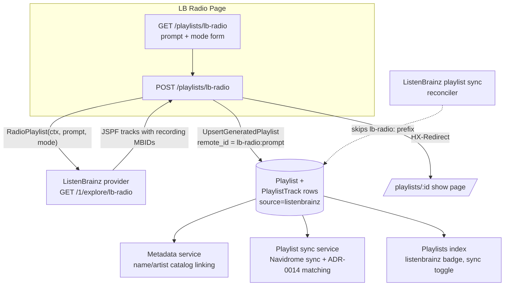

# ADR-0030: LB Radio Prompt-Driven Playlist Generation Through the Standard Playlist Pipeline

## Context and Problem Statement

ListenBrainz exposes [LB Radio](https://listenbrainz.readthedocs.io/en/latest/users/api-usage/lb-radio.html) (`GET /1/explore/lb-radio?prompt=...&mode=easy|medium|hard`), a track-list generator driven by a small prompt language (`artist:(radiohead)`, `tag:(jazz)`, weighted combinations, etc.). It returns a JSPF playlist whose tracks carry MusicBrainz recording MBIDs — the same JSPF shape the ListenBrainz playlist import (#56) already parses.

Spotter already has a complete pipeline for externally sourced playlists: persistence keyed by `(user, source, remote_id)`, playlist-track rows with `remote_id`, background catalog linking by name/artist, Navidrome sync with three-tier track matching ([ADR-0014](./ADR-0014-three-tier-track-matching-algorithm.md)), sync badges, and a `listenbrainz` source badge (added in #56). Spotter also has its own AI generator (the vibes/mixtape engine, [ADR-0017](./ADR-0017-vibes-generator-interface-abstraction.md)).

How should LB Radio be surfaced in Spotter without creating a second, parallel playlist or generation pipeline?

## Decision Drivers

* LB Radio is already a *generator* — Spotter should not wrap a generator in another generator
* Spotter is a playlist manager and metadata enricher, **not** a music player — it has no playback surface
* The playlist machinery (persist, match, badge, Navidrome sync) already handles ListenBrainz-sourced JSPF playlists end-to-end; new surface area should be minimal
* Regenerating a radio playlist for the same prompt must not litter the library with near-duplicate playlists
* The ListenBrainz playlist sync reconciler deactivates local `listenbrainz`-source playlists that the ListenBrainz server no longer returns — locally generated radio playlists are never returned by the server and must not be reaped
* The lb-radio endpoint is anonymous but rate limited; sending the user token when available raises the per-token rate limit

## Considered Options

* **Option 1: Prompt page under the playlists section, persisted as a regular playlist** — a small "LB Radio" page reachable from the playlists index; the POST calls lb-radio, and the result is persisted as an ordinary `source = "listenbrainz"` playlist that flows through all existing machinery
* **Option 2: Dedicated radio player surface** — an interactive "radio" page that plays the generated tracks
* **Option 3: Mixtape-engine integration** — feed LB Radio results into the vibes/mixtape generator as a seed or generation backend

## Decision Outcome

Chosen option: **Option 1 (prompt page persisted through the standard playlist pipeline)**, because it adds the least new surface: one provider method, one small page, and one exported persistence entry point — everything downstream (catalog linking, badges, sync-to-Navidrome toggle, track matching) is the existing pipeline, unchanged.

Concretely:

* The ListenBrainz provider gains `RadioPlaylist(ctx, prompt, mode)` calling `GET /1/explore/lb-radio`, reusing the JSPF parsing from #56 (recording MBIDs ride `providers.Track.ID` and persist as `PlaylistTrack.remote_id`) and the shared request layer (User-Agent, strict 429 Retry-After semantics per REQ-PROV-047). The endpoint is anonymous, but the user's token is sent when available for the higher authenticated rate limit.
* A "LB Radio" page lives under the playlists section (`GET/POST /playlists/lb-radio`) with a prompt input, mode select (easy/medium/hard), brief syntax help, and example chips. On success the browser is redirected to the persisted playlist's show page; success/failure raise toasts.
* The result persists as a **regular playlist**: `Source = "listenbrainz"`, `Name = "LB Radio: <prompt>"`, upserted through the same code path the playlist syncer uses (`Syncer.UpsertGeneratedPlaylist`, which wraps the shared per-playlist upsert and `persistPlaylistTracks`). No matching logic is duplicated: catalog linking stays with the metadata service's name/artist link pass, and Navidrome matching stays with the playlist sync service (ADR-0014).
* **Regenerate semantics**: the playlist's `remote_id` is the deterministic key `lb-radio:<prompt>` (trimmed prompt, verbatim). Regenerating with the same prompt — in any mode — updates the existing playlist in place (tracks replaced, playlist ID, sync toggle, and Navidrome pairing preserved) instead of creating a duplicate. Different prompts create distinct playlists. The mode used is recorded in the playlist description.
* The playlist sync reconciler is taught to skip locally generated radio playlists: rows whose `remote_id` starts with the `lb-radio:` prefix are exempt from "no longer returned by the provider" deactivation, since the provider never returns them.

### Non-Goals

* **No vibes/mixtape integration** — LB Radio results are not seeds for, nor products of, the AI mixtape engine. LB Radio is already a generator; chaining two generators produces confusing double-generation semantics.
* **No scheduling** — radio playlists are not regenerated on a timer. Users regenerate manually from the LB Radio page; the upsert semantics make that cheap and non-destructive.
* **No playback** — Spotter does not play the generated tracks; listening happens in Navidrome after the standard sync.

### Consequences

* Good, because generated playlists inherit everything for free: listenbrainz badge, sync-to-Navidrome toggle, match statistics, catalog linking, show page
* Good, because regeneration is idempotent per prompt — no playlist proliferation, and an established Navidrome pairing survives regeneration
* Good, because the provider change is one read-only method on the existing client with the existing 429/User-Agent discipline
* Good, because prompt syntax errors surface directly (ListenBrainz returns 400 with a human-readable message that is shown inline)
* Bad, because the synthetic `lb-radio:` remote-ID convention is invisible coupling between the handler and the sync reconciler (mitigated: the prefix is a single shared constant in `internal/providers` with governing comments on both sides)
* Bad, because prompt length must be capped (200 characters) so the derived `remote_id` fits the 255-character column — very long prompts are rejected
* Bad, because generation is synchronous in the request (typically a few seconds); acceptable for a manual, user-initiated action

### Confirmation

* `internal/providers/listenbrainz/radio.go` implements `RadioPlaylist` with tests for happy JSPF, prompt URL-encoding, empty results, malformed payloads, and 429 handling
* `POST /playlists/lb-radio` persists a `source = "listenbrainz"` playlist named `LB Radio: <prompt>` with `remote_id = lb-radio:<prompt>` and track rows carrying recording MBIDs in `remote_id`; repeating the POST updates the same row (asserted by handler tests)
* `reconcileInactivePlaylists` leaves `lb-radio:`-prefixed playlists active after a ListenBrainz playlist sync (asserted by service tests)
* No new matcher code: catalog linking and Navidrome matching call sites are unchanged

## Pros and Cons of the Options

### Option 1: Prompt Page Persisted Through the Standard Playlist Pipeline

* Good, because least new surface — one provider method, one page, one persistence entry point
* Good, because the result is a first-class playlist: badges, sync toggle, matching, statistics all reuse existing code
* Good, because deterministic remote IDs give clean regenerate-in-place semantics
* Neutral, because a reconciler exemption is required for locally generated rows under a provider-owned source
* Bad, because the user must hop to Navidrome to actually listen — but that is Spotter's model for every playlist

### Option 2: Dedicated Radio Player Surface

An interactive radio page that streams the generated recordings.

* Good, because it matches the "radio" mental model of continuous listening
* Bad, because Spotter is not a player — it has no audio pipeline, no transport controls, no streaming credentials for arbitrary recordings, and building one is a product pivot, not a feature
* Bad, because generated tracks would live outside the playlist pipeline: no Navidrome sync, no matching, no badges
* Bad, because most LB Radio recordings are identified by MBID, not by a playable stream URL — playback would require resolving against the local library anyway, which is exactly what the playlist pipeline already does

### Option 3: Mixtape-Engine Integration

Feed LB Radio output into the vibes engine as a seed, or add LB Radio as a mixtape generation backend (ADR-0017).

* Good, because it would reuse the mixtape UI (schedules, DJs, track reasons)
* Bad, because LB Radio is already a generator — routing its output through a second (LLM) generator makes the result attributable to neither and doubles cost and latency
* Bad, because mixtape semantics (DJ personas, prompts-as-personality, scheduling) do not fit a deterministic third-party API call, so the integration would be a special case throughout the vibes code
* Bad, because mixtapes reference catalog track IDs, so unmatched LB Radio recordings (the common case for discovery-oriented prompts) would be silently dropped before the user ever sees them

## Architecture Diagram

## More Information

* **Related ADRs**: [ADR-0014](./ADR-0014-three-tier-track-matching-algorithm.md) (track matching — unchanged, reused), [ADR-0016](./ADR-0016-pluggable-provider-factory-pattern.md) (provider factory — RadioPlaylist lives on the factory-built provider), [ADR-0017](./ADR-0017-vibes-generator-interface-abstraction.md) (mixtape engine — explicitly not integrated)
* **Spec**: SPEC music-provider-integration REQ-PROV-053 (LB Radio)
* **Prior slices**: #43 (foundation), #47 (listen history), #51 (enricher), #56 (read-only playlist sync — JSPF parsing and the `listenbrainz` badge this feature reuses)
* **API**: `GET /1/explore/lb-radio` returns `{"payload": {"jspf": {"playlist": {...}}, "feedback": [...]}}`; `mode` must be `easy`, `medium`, or `hard`; invalid prompts return 400 with a descriptive error
