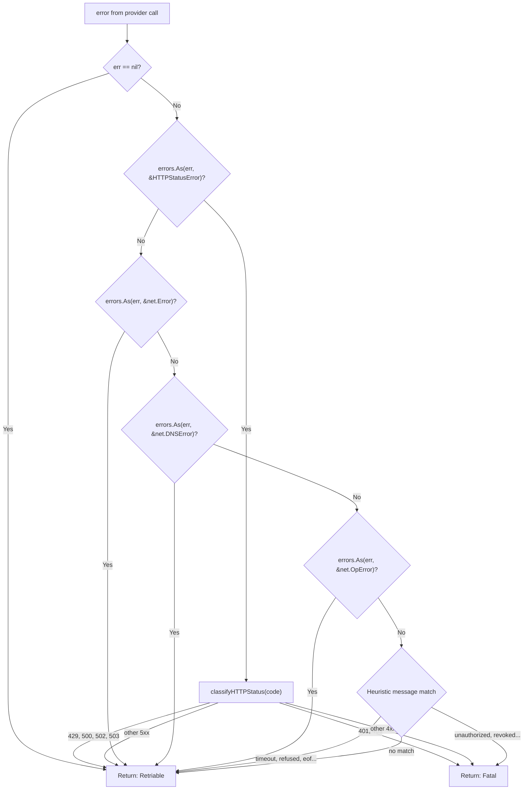
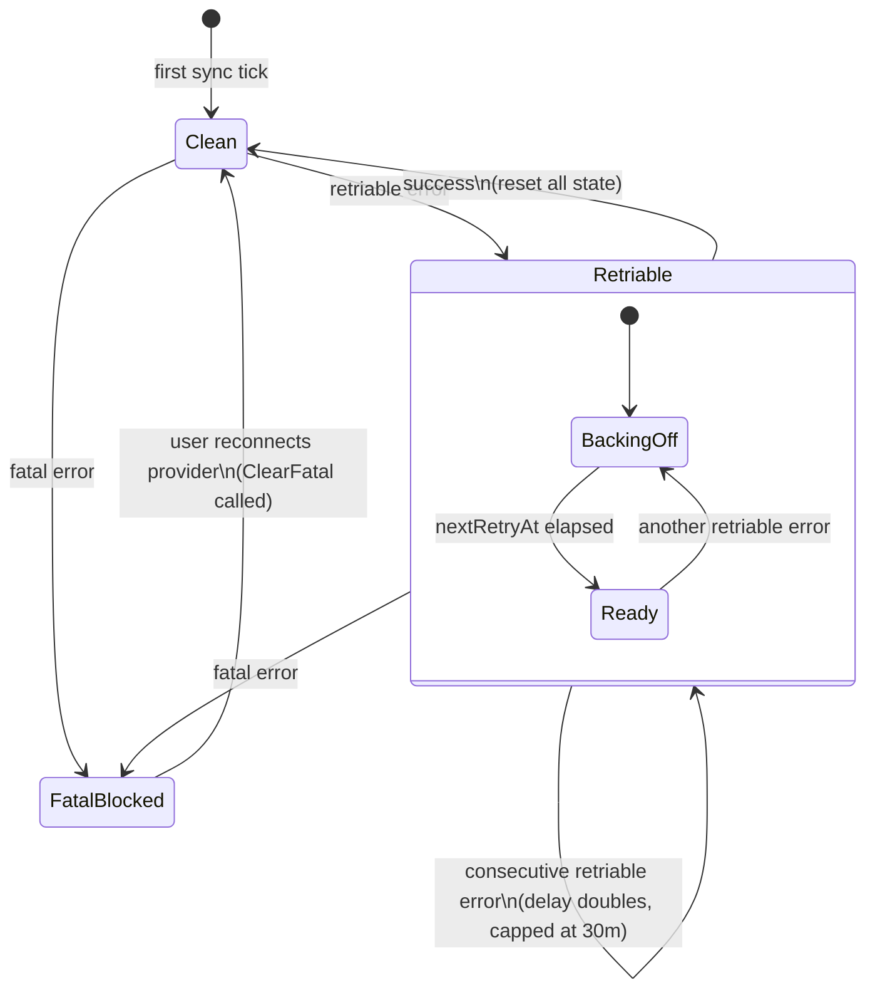
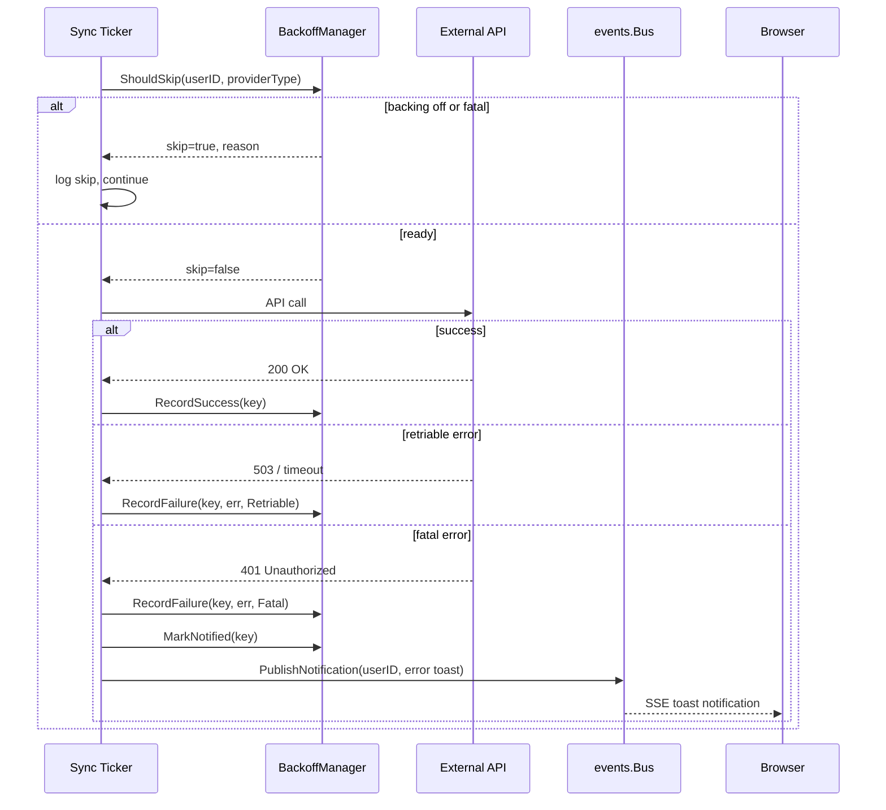

# Design: Error Handling and Resilience for External Service Calls

## Context

Spotter's background sync loops call six external APIs (Navidrome, Spotify, Last.fm, MusicBrainz,
Fanart.tv, OpenAI) on fixed timer intervals. Before this design, errors were logged and skipped
until the next tick -- transient failures waited the full sync interval (5 minutes to 1 hour)
before retry, and permanent failures (revoked credentials) generated noisy log entries indefinitely
with no user notification. The user had zero visibility into provider health without reading logs.

This design introduces a two-tier error classification system with exponential backoff for transient
errors and event bus notifications for permanent (fatal) errors, giving proportionate responses to
both failure modes.

Governing ADRs: [ADR-0020](../../adrs/ADR-0020-error-handling-resilience.md),
[ADR-0007](../../adrs/ADR-0007-in-memory-event-bus.md),
[ADR-0016](../../adrs/ADR-0016-pluggable-provider-factory-pattern.md),
[ADR-0013](../../adrs/ADR-0013-goroutine-ticker-background-scheduling.md).

## Goals / Non-Goals

### Goals

- Classify every external service error as exactly retriable or fatal
- Apply exponential backoff with jitter (30s base, 30m cap, +/-25%) for retriable errors
- Maintain per-provider per-user backoff state in memory with mutex protection
- Publish browser-visible toast notifications for fatal errors via the event bus
- Automatically reset backoff state on the next successful provider call
- Prevent duplicate fatal notifications across sync ticks

### Non-Goals

- Provider-specific API client implementation or HTTP transport-level retries
- Persistent error state across process restarts (in-memory only by design)
- Circuit breaker state machine (too heavy for a personal server; simple backoff suffices)
- Automatic remediation of fatal errors (user must reconnect the provider)

## Decisions

### Two-Tier Classification over Circuit Breaker

**Choice**: Classify errors into exactly two categories -- retriable and fatal -- using a shared
`ClassifyError()` utility function.

**Rationale**: A full circuit breaker (open/half-open/closed) is designed for high-throughput
microservice architectures. Spotter makes 3-5 provider calls per sync cycle. A simple counter
with a timestamp achieves the same goal in ~50 lines of Go with no external dependency.

**Alternatives considered**:
- `sony/gobreaker` library: well-tested but adds a dependency for a pattern trivially implemented in stdlib. The open/half-open model does not naturally distinguish retriable from fatal errors.
- Always retry immediately: hammers failing services, risks rate limiting, wastes resources on permanent failures.
- No retry (prior behavior): transient errors wait the full sync interval; fatal errors generate infinite log noise.

### In-Memory Backoff State over Database Persistence

**Choice**: Store backoff state in a `sync.RWMutex`-protected map keyed by `(userID, providerType)`.

**Rationale**: Backoff state is inherently ephemeral. If the process restarts, retrying immediately
is the correct behavior (the external service may have recovered). Persisting backoff adds database
writes on every sync tick for marginal benefit.

**Alternatives considered**:
- Database-backed state: survives restarts but adds write load and complexity for a single-user personal server.
- File-based state: simpler than database but introduces filesystem dependency and race conditions.

### Heuristic Error Message Matching as Fallback

**Choice**: After checking typed errors (`HTTPStatusError`, `net.Error`, `net.DNSError`), fall back
to string matching against known error message patterns.

**Rationale**: Not all providers wrap errors in structured types. Last.fm returns XML errors,
some providers include status codes in plain error messages (`"spotify API returned status 403"`).
The heuristic catches these without requiring every provider to implement a custom error type.

## Architecture

### Error Classification Flow

### Backoff State Machine

### Integration with Sync Loop

## Key Implementation Details

- **Error classifier**: `internal/services/resilience.go` -- `ClassifyError(err error) ErrorClass` inspects the error chain for `HTTPStatusError`, `net.Error`, `net.DNSError`, `net.OpError`, then falls back to heuristic message matching.
- **Backoff state**: `BackoffManager` struct with `sync.RWMutex`-protected `map[BackoffKey]*BackoffState`. Key is `(UserID int, ProviderType providers.Type)`.
- **Backoff formula**: `delay = min(30s * 2^consecutiveFailures, 30m) * jitter[0.75, 1.25]` using `math/rand/v2` for jitter.
- **Constants**: `backoffBaseDelay = 30s`, `backoffMaxDelay = 30m`.
- **Notification dedup**: `BackoffState.NotifiedFatal` flag prevents re-publishing the same fatal notification across ticks (REQ-NOTIFY-002). Cleared on `ClearFatal()` or `RecordSuccess()`.
- **Fatal recovery**: `ClearFatal(key)` resets all state fields -- called when a user reconnects a provider via OAuth.

Files:
- `internal/services/resilience.go` -- all error classification, backoff math, and state management
- `internal/services/resilience_test.go` -- unit tests for classification and backoff calculations
- `internal/events/bus.go` -- `PublishNotification()` convenience method used for fatal alerts

## Risks / Trade-offs

- **In-memory state lost on restart**: A provider backing off for 30 minutes will retry immediately after a process restart. This is acceptable -- the external service may have recovered, and a single retry is harmless. If the error persists, backoff re-engages from the first failure.
- **Error classification maintenance**: Each new provider may introduce unique error codes or message formats requiring updates to `ClassifyError()` or its heuristic patterns. Mitigated by defaulting unknown errors to retriable (prefer retry over silent failure).
- **Heuristic false positives**: String matching on error messages is fragile. A provider returning a message containing "timeout" in a non-transient context would be misclassified. Mitigated by checking typed errors first; heuristics are the last resort.
- **No notification for long-running retriable backoff**: REQ-NOTIFY-003 permits (but does not require) a warning notification when backoff reaches the 30-minute cap. This is not currently implemented -- the user sees nothing for persistent transient failures.

## Migration Plan

This feature was implemented incrementally:

1. Added `ErrorClass` type, `ClassifyError()`, and `classifyHTTPStatus()` in `internal/services/resilience.go`
2. Added `BackoffState`, `BackoffKey`, `BackoffManager` with mutex-protected map
3. Added `CalculateBackoff()` with exponential formula and jitter
4. Integrated `ShouldSkip()` check into sync loop before each provider call
5. Integrated `RecordFailure()` and `RecordSuccess()` after each provider call
6. Added `PublishNotification()` call for fatal errors with dedup via `MarkNotified()`
7. Added `ClearFatal()` call in OAuth reconnection handlers

No database migration required (all state is in-memory).

## Open Questions

- Should retriable backoff reaching the 30-minute cap trigger a user warning notification? The spec permits it (REQ-NOTIFY-003 MAY), but it is not implemented. Adding it risks notification fatigue for transient issues that resolve on their own.
- Should the backoff formula be configurable via environment variables (base delay, max delay, jitter range)? Currently hardcoded, which is simpler but less flexible.
- Should `ClassifyError` support provider-specific overrides (e.g., Subsonic error codes, Last.fm XML error codes)? The spec mentions wrapper functions (REQ-ERR-004 MAY) but none are implemented yet.
