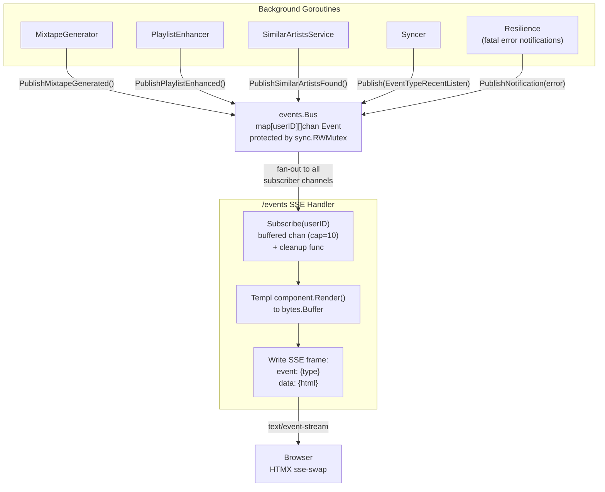
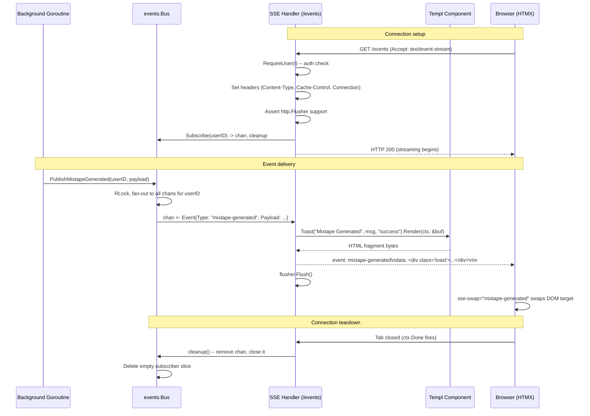
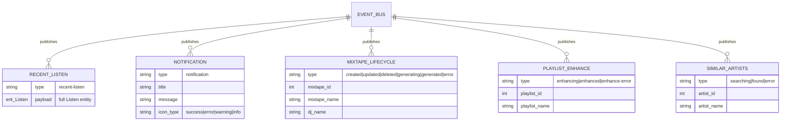

# Design: Real-Time Event Bus and SSE Streaming

## Context

Spotter runs several long-running asynchronous operations -- AI mixtape generation, playlist
enhancement, similar artist discovery, and background history sync. These operations execute in
background goroutines and need to communicate their progress and results to the browser in real
time. Without a pub/sub mechanism, handlers would either need to block (unacceptable for operations
taking seconds to minutes) or the UI would require polling.

This design provides an in-memory channel-based event bus that publishers (background goroutines)
write to and the SSE handler reads from, streaming Templ-rendered HTML fragments directly into the
DOM via HTMX's SSE extension -- no JavaScript state management, no JSON serialization, no external
message broker.

Governing ADRs: [ADR-0007](../../adrs/ADR-0007-in-memory-event-bus.md),
[ADR-0001](../../adrs/ADR-0001-htmx-templ-server-driven-ui.md).

## Goals / Non-Goals

### Goals

- Per-user in-memory pub/sub with fan-out to multiple browser tabs
- Strongly-typed Go event structs (14 event types) with convenience publish methods
- Non-blocking publish that drops events when a subscriber's buffer is full
- SSE endpoint that streams Templ-rendered HTML fragments as named SSE events
- HTMX `hx-sse` integration for zero-JavaScript DOM updates
- Clean subscriber lifecycle: subscribe on connection, cleanup on disconnect

### Non-Goals

- Event persistence or replay (events are ephemeral; missed events show on next page load)
- Horizontal scaling across multiple app instances (single-instance by design, per ADR-0007)
- Client-to-server messaging over the SSE connection (SSE is unidirectional)
- Custom subscriber filtering (all events for a user are delivered to all subscribers)

## Decisions

### In-Memory Channels over Redis Pub/Sub

**Choice**: `Bus` struct with `sync.RWMutex`-protected `map[int][]chan Event`.

**Rationale**: Spotter is a single-instance personal server. An external broker (Redis, NATS)
would require operating another service for zero benefit. Go channels provide zero-serialization
delivery of typed structs, natural cleanup semantics via `close()`, and integration with `select`
for context cancellation.

**Alternatives considered**:
- Redis pub/sub: enables horizontal scaling but events still lack persistence; adds infrastructure complexity and JSON serialization overhead.
- Database polling: SSE handlers poll for new events on an interval. Adds 1-5s latency and unnecessary read load.
- WebSockets: bidirectional but HTMX's SSE extension is already integrated; WebSockets would require a different extension and more JavaScript.

### Buffered Channels (Capacity 10) with Silent Drop

**Choice**: Each subscriber channel has a buffer of 10 events. If the buffer is full, `Publish()`
uses a non-blocking `select` with a `default` branch to silently drop the event.

**Rationale**: A slow or disconnected browser must never block publisher goroutines. Buffer
capacity 10 absorbs normal event bursts (e.g., multiple listens synced in rapid succession). If
a subscriber truly cannot keep up, dropping is acceptable -- the UI shows the latest state when
the user next loads the page.

**Alternatives considered**:
- Unbuffered channels: publisher blocks until subscriber reads -- unacceptable for background goroutines.
- Larger buffers (100+): wastes memory for the rare burst scenario.
- Oldest-event eviction: more complex than silent drop with marginal benefit.

### SSE over WebSockets

**Choice**: Server-Sent Events via `GET /events` with HTMX `hx-ext="sse"`.

**Rationale**: SSE is simpler than WebSockets for server-to-client streaming. HTMX's SSE extension
directly maps named SSE events to DOM swap targets using `sse-swap="{event-type}"`. No JavaScript
event handlers, no state management, no reconnection logic (browsers auto-reconnect SSE).

### Templ-Rendered HTML Fragments as SSE Payload

**Choice**: The SSE handler renders each event's Templ component to a buffer and sends the raw
HTML as the SSE `data:` payload.

**Rationale**: This eliminates the JSON serialization layer entirely. The server renders the exact
HTML fragment that HTMX swaps into the DOM. Components are the same Templ components used in
page renders -- no duplication between SSE and page-load rendering.

## Architecture

### Component Topology

### Event Lifecycle

### Event Type Catalog

## Key Implementation Details

- **Bus struct**: `internal/events/bus.go` -- `subscribers map[int][]chan Event` protected by `sync.RWMutex`. `NewBus()` creates the instance in `cmd/server/main.go` and injects it into handlers and all services.
- **Subscribe**: Creates a `make(chan Event, 10)`, appends to the user's subscriber slice. Returns the channel (read-only) and a cleanup function that removes and closes the channel under write lock.
- **Publish**: Acquires read lock, iterates all channels for the user, uses `select { case ch <- event: default: }` for non-blocking send. Zero subscribers is a no-op.
- **14 typed event constants**: `EventTypeRecentListen`, `EventTypeNotification`, 6 mixtape events, 3 playlist enhancement events, 3 similar artists events.
- **Convenience methods**: `PublishNotification()`, `PublishMixtapeGenerated()`, `PublishSimilarArtistsFound()`, etc. -- encapsulate payload struct construction to prevent call sites from building `Event{}` structs directly.
- **SSE handler**: `internal/handlers/sse.go` -- `Events()` method on `Handler`. Authenticates via `RequireUser()`, sets SSE headers, asserts `http.Flusher`, enters `select` loop on `ctx.Done()` and `eventChan`. Each event is matched by type, rendered to a `bytes.Buffer` via the appropriate Templ component, and written as named SSE frames with `event:` and multi-line `data:` fields.
- **Toast component**: `internal/views/components/toast.templ` -- renders `NotificationPayload` and most event types as toast notifications.
- **HTMX integration**: `internal/views/layouts/base.templ` loads the HTMX SSE extension from CDN. UI elements declare `hx-ext="sse"`, `sse-connect="/events"`, and `sse-swap="{event-type}"` to receive and swap fragments.

## Risks / Trade-offs

- **Events lost on process restart**: In-flight AI operations completing after restart will not notify the browser. Acceptable because the final state is visible on the next page load, and restarts during AI generation are rare.
- **Slow subscriber drops events silently**: If a browser tab falls behind and the 10-event buffer fills, events are dropped. The UI shows stale state until the user refreshes. Mitigated by the buffer absorbing normal bursts.
- **Single-instance constraint**: Multiple Spotter instances cannot share the in-memory bus. Consistent with the project's single-instance deployment model (ADR-0007).
- **No delivery guarantee**: The non-blocking `default` branch means events can be lost even during normal operation if a subscriber is momentarily slow. This is a deliberate trade-off -- publisher goroutines must never block.
- **SSE reconnection creates new subscription**: When a browser auto-reconnects after a network hiccup, it gets a new channel with no backfill of missed events. The user sees the current state on next page load.

## Migration Plan

The event bus was implemented as part of the initial architecture:

1. Created `internal/events/bus.go` with `Bus`, `Event`, typed constants, and payload structs
2. Created `internal/handlers/sse.go` with the `/events` SSE endpoint
3. Added `events.NewBus()` in `cmd/server/main.go`, injected into handler and all service constructors
4. Added HTMX SSE extension to `internal/views/layouts/base.templ`
5. Added `Toast` component to `internal/views/components/toast.templ`
6. Updated each service (MixtapeGenerator, PlaylistEnhancer, SimilarArtistsService, Syncer) to call the appropriate `Publish*` convenience method
7. Added `sse-connect="/events"` and `sse-swap` attributes to relevant UI components

No database migration required (the bus is purely in-memory).

## Open Questions

- Should the buffer capacity (10) be configurable? Currently hardcoded. If event bursts from rapid sync operations cause drops, increasing the buffer is a simple change but adds a config knob for a value most users will never tune.
- Should the SSE handler send periodic keep-alive comments (`: keep-alive\n\n`) to prevent intermediate proxies from closing idle connections? Currently not implemented; browser auto-reconnect handles connection drops.
- Should the bus expose a `SubscriberCount(userID)` method for observability? Would allow logging when no subscribers are connected (all published events are being dropped).
- Should the bus support event filtering per subscriber (e.g., a tab only cares about mixtape events)? Currently all events are delivered to all subscribers, which is simple but sends unnecessary data to tabs that don't use it.
