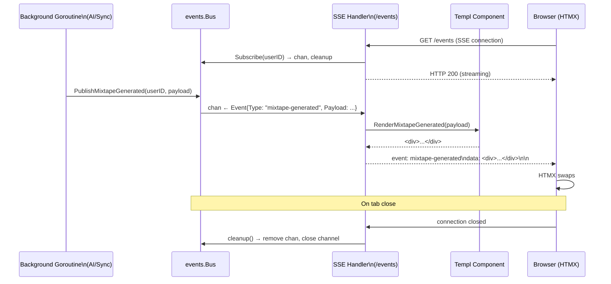

# Real-Time Event Bus and SSE Streaming for Async Operation Feedback

**Status:** draft
**Version:** 0.1.0
**Last Updated:** 2026-02-21
**Governing ADRs:** ADR-0007 (in-memory event bus), ADR-0001 (HTMX + Templ)

## Overview

The event bus and SSE subsystem provides real-time feedback to browser clients for long-running asynchronous operations (AI mixtape generation, playlist enhancement, similar artist discovery, history sync). Background goroutines publish strongly-typed events to a per-user in-memory channel bus. The SSE handler subscribes to that bus and streams Templ-rendered HTML fragments as Server-Sent Events, which HTMX swaps into the DOM without full-page reloads.

## Scope

This spec covers:
- The `events.Bus` pub/sub implementation (channels, mutex, subscribe/publish/cleanup)
- Typed event constants and payload structs
- The `/events` SSE endpoint
- HTML fragment rendering via Templ components
- HTMX `hx-sse` integration pattern
- Event lifecycle (publishing, delivery, drop behavior)

Out of scope: The AI operations that publish events (see Vibes spec), background sync (see Listen & Playlist Sync spec), Templ component design (UI concern).

---

## Requirements

### Event Bus

**REQ-BUS-001** — The `Bus` MUST maintain a map of `userID → []chan Event` protected by a `sync.RWMutex`. The map key is the integer user ID.

**REQ-BUS-002** — `Subscribe(userID int) (<-chan Event, func())` MUST:
- Create a new buffered channel with capacity 10
- Append it to the subscriber list for `userID`
- Return the channel (read-only) and a cleanup function
- The cleanup function MUST remove the channel from the subscriber list and close it

**REQ-BUS-003** — `Publish(userID int, event Event)` MUST:
- Acquire a read lock on the subscriber map
- Fan out to all channels for the given `userID`
- Use a non-blocking send (`select { case ch <- event: default: }`) for each channel
- Drop the event silently if a channel's buffer is full (subscriber is slow or disconnected)

**REQ-BUS-004** — The `Bus` MUST support multiple concurrent subscribers per user (e.g., multiple browser tabs). All active subscribers for a user MUST receive each published event.

**REQ-BUS-005** — The `Bus` MUST support zero subscribers gracefully — `Publish` to a user with no active subscribers MUST be a no-op without error.

### Typed Events

**REQ-BUS-010** — All events MUST use the `Event` struct:
```go
type Event struct {
    Type    EventType
    Payload any
}
```

**REQ-BUS-011** — The following `EventType` constants MUST be defined and used consistently across all publisher sites:

| EventType | Published by | Payload |
|-----------|-------------|---------|
| `recent-listen` | Syncer | `RecentListenPayload` |
| `notification` | Any service | `NotificationPayload` |
| `mixtape-created` | Handler | `MixtapeCreatedPayload` |
| `mixtape-updated` | Handler | `MixtapeUpdatedPayload` |
| `mixtape-deleted` | Handler | `MixtapeDeletedPayload` |
| `mixtape-generating` | MixtapeGenerator | `MixtapeGeneratingPayload` |
| `mixtape-generated` | MixtapeGenerator | `MixtapeGeneratedPayload` |
| `mixtape-error` | MixtapeGenerator | `MixtapeErrorPayload` |
| `playlist-enhancing` | PlaylistEnhancer | `PlaylistEnhancingPayload` |
| `playlist-enhanced` | PlaylistEnhancer | `PlaylistEnhancedPayload` |
| `playlist-enhance-error` | PlaylistEnhancer | `PlaylistEnhanceErrorPayload` |
| `similar-artists-searching` | SimilarArtistsService | `SimilarArtistsSearchingPayload` |
| `similar-artists-found` | SimilarArtistsService | `SimilarArtistsFoundPayload` |
| `similar-artists-error` | SimilarArtistsService | `SimilarArtistsErrorPayload` |

**REQ-BUS-012** — Each event type MUST have a corresponding typed payload struct. The `Bus` MUST provide convenience `Publish*` methods for each event type (e.g., `PublishMixtapeGenerated`, `PublishNotification`) to avoid call sites constructing `Event{}` structs directly.

**REQ-BUS-013** — `NotificationPayload` MUST include an `IconType` field with values `"success"`, `"error"`, `"warning"`, or `"info"` for UI rendering.

### SSE Endpoint

**REQ-SSE-001** — The `/events` endpoint MUST:
- Require an authenticated session (protected by `AuthMiddleware`)
- Set response headers: `Content-Type: text/event-stream`, `Cache-Control: no-cache`, `Connection: keep-alive`
- Call `bus.Subscribe(userID)` to obtain a channel and cleanup function
- Defer the cleanup function to run on connection close
- Block on the channel, rendering and streaming each received event

**REQ-SSE-002** — For each received `Event`, the SSE handler MUST:
1. Determine the appropriate Templ component for the event type
2. Render the component to a buffer using `component.Render(ctx, buf)`
3. Write an SSE data frame: `data: <html>\n\n`
4. Flush the response writer to push the data to the client immediately

**REQ-SSE-003** — The SSE handler MUST use `http.Flusher` to flush after each event. If the `ResponseWriter` does not support flushing, the handler MUST return a 500 error.

**REQ-SSE-004** — The SSE handler MUST detect client disconnection via `r.Context().Done()` and return cleanly, triggering the cleanup function to remove the subscriber.

**REQ-SSE-005** — Each SSE event MUST use the `EventType` string as the `event:` field in the SSE protocol:
```
event: mixtape-generated
data: <div id="mixtape-42" ...>...</div>

```

### HTMX Integration

**REQ-SSE-010** — The base HTML layout MUST load the HTMX SSE extension (`htmx.org/dist/ext/sse.js`).

**REQ-SSE-011** — UI components that respond to SSE events MUST declare `hx-ext="sse"` and `sse-connect="/events"` on an ancestor element.

**REQ-SSE-012** — Individual DOM targets MUST use `sse-swap="{event-type}"` and `hx-target` to receive and swap HTML fragments for specific event types.

---

## Event Flow Diagram



---

## Scenarios

### Scenario 1: Mixtape generation with real-time progress

```
Given a user requests mixtape generation from the vibes UI
When the handler starts the generation goroutine
Then it immediately publishes EventTypeMixtapeGenerating
And the SSE handler receives the event and renders a "Generating..." spinner component
And HTMX swaps the spinner into the mixtape card
When generation completes
Then MixtapeGenerator publishes EventTypeMixtapeGenerated with the result
And the SSE handler renders the completed mixtape component
And HTMX swaps the completed card, replacing the spinner
```

### Scenario 2: Multiple browser tabs receive same event

```
Given a user has two browser tabs open, both connected to /events
When a mixtape is generated
Then the Bus fans out to both subscriber channels
And both tabs receive the SSE event
And both update their UI simultaneously
```

### Scenario 3: Slow subscriber drops events

```
Given a user's browser tab is not consuming events quickly enough
And the subscriber channel buffer (capacity 10) is full
When MixtapeGenerator publishes an event
Then the non-blocking send uses the default branch
And the event is silently dropped for that subscriber
And the publisher goroutine does not block
And the tab shows stale state until the user refreshes
```

### Scenario 4: Client disconnects during generation

```
Given the user closes their browser tab while AI generation is in progress
When the SSE handler detects r.Context().Done()
Then the handler calls the cleanup function
And the channel is removed from the Bus subscriber map
And the channel is closed
And the generation goroutine continues in the background
And subsequent Publish calls for this user are no-ops (no subscribers)
```

---

## Implementation Notes

- Event bus: `internal/events/bus.go` — `Bus` struct, `Event`, typed constants and payload structs
- SSE handler: `internal/handlers/sse.go` — `/events` endpoint
- Base layout: `internal/views/layouts/base.templ:22-23` — loads HTMX + SSE extension from CDN
- Toast component: `internal/views/components/toast.templ` — renders notification events
- Bus initialization: `cmd/server/main.go` — `events.NewBus()`, injected into handlers and services
- Buffer capacity: 10 events per subscriber (hardcoded; increase if event bursts cause drops)
- Governing comment: `// Governing: ADR-0007 (in-memory event bus), ADR-0001 (HTMX+Templ), SPEC event-bus-sse`
