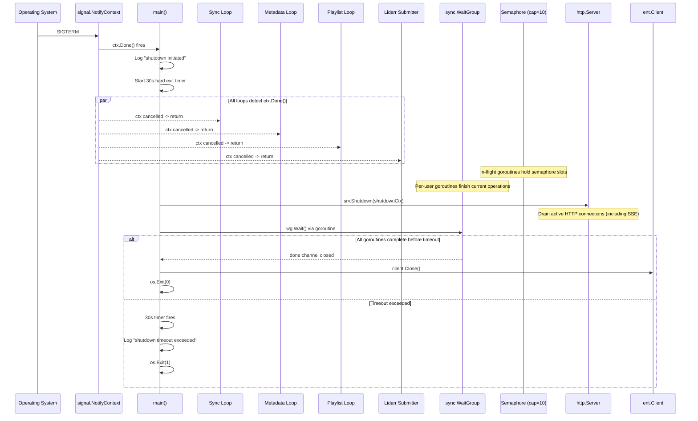
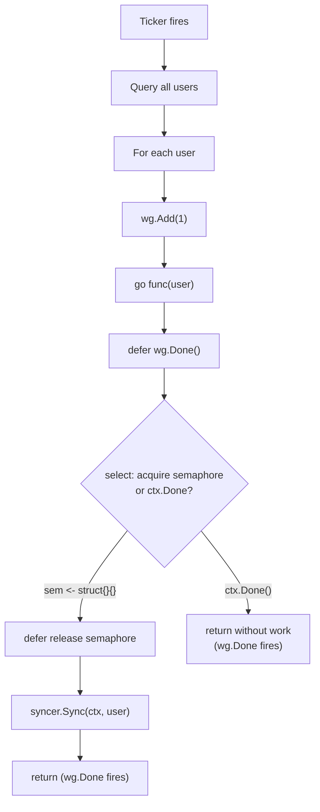
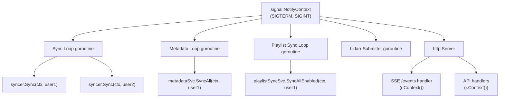

# Design: Graceful Shutdown with Context Cancellation and WaitGroup Drain

## Context

Spotter runs three (optionally four) background goroutine loops in `cmd/server/main.go` -- listen
sync, metadata enrichment, playlist sync, and (if configured) Lidarr queue submission. Each loop
spawns per-user goroutines on every tick. Before this design, the loops used `context.Background()`
and `for range ticker.C` with no shutdown path. When the container runtime sent SIGTERM, goroutines
were killed mid-execution, potentially leaving partial data in the database and dropping SSE
connections without cleanup.

This design ensures that on SIGTERM/SIGINT: (1) all background loops stop accepting new work,
(2) in-flight per-user goroutines complete or are cancelled, (3) HTTP connections drain gracefully,
and (4) the database connection is closed -- all within a 30-second timeout budget aligned with
Docker's default `stop_grace_period`.

Governing ADRs: [ADR-0018](../../adrs/ADR-0018-graceful-shutdown-context-cancellation.md),
[ADR-0013](../../adrs/ADR-0013-goroutine-ticker-background-scheduling.md),
[ADR-0023](../../adrs/ADR-0023-multi-database-support-postgresql-mariadb.md),
[ADR-0007](../../adrs/ADR-0007-in-memory-event-bus.md).

## Goals / Non-Goals

### Goals

- Intercept SIGTERM and SIGINT via `signal.NotifyContext` for a cancellable root context
- Propagate context cancellation to all background loops and per-user goroutines
- Track in-flight goroutines with `sync.WaitGroup` for drain-before-exit
- Bound per-user concurrency with a buffered channel semaphore (default capacity 10)
- Gracefully shut down the HTTP server via `http.Server.Shutdown()`
- Enforce a 30-second (configurable) hard exit timeout
- Support a second signal for immediate hard exit

### Non-Goals

- AI operation cancellation internals (context is propagated but OpenAI client behavior is opaque)
- Database migration rollback on unclean shutdown
- SSE client reconnection logic (client-side concern; browsers auto-reconnect)
- Persisting background loop state across restarts

## Decisions

### signal.NotifyContext over Raw os.Signal Channel

**Choice**: `signal.NotifyContext(context.Background(), syscall.SIGTERM, syscall.SIGINT)` as the
root context for all background work.

**Rationale**: `signal.NotifyContext` (Go 1.16+) returns a standard `context.Context` that
integrates directly with `select { case <-ctx.Done(): }` in ticker loops and with service methods
that accept `context.Context`. Manual signal channels require imperative shutdown orchestration;
context cancellation is declarative and propagates automatically.

**Alternatives considered**:
- Raw `os.Signal` channel: requires manual context creation, cancellation, and coordination with goroutine loops. More error-prone.
- `uber-go/fx` lifecycle manager: full DI framework for a problem solvable with 20 lines of stdlib code. Overkill.
- No shutdown: SQLite transactions are atomic per-row, but multi-transaction sync operations can leave partial data. Unacceptable.

### Shared WaitGroup for Per-User Goroutines

**Choice**: A single `sync.WaitGroup` shared across all background loops, tracking only per-user
work goroutines (not the loop goroutines themselves).

**Rationale**: Loop goroutines exit immediately on `ctx.Done()` -- they do not need tracking.
Per-user goroutines may be mid-operation (API call, database write) and must complete. A single
WaitGroup is the simplest mechanism to wait for all of them before exiting.

### Buffered Channel Semaphore for Concurrency Bounding

**Choice**: `make(chan struct{}, N)` where N defaults to 10 (configurable via
`SPOTTER_MAX_CONCURRENT_JOBS`).

**Rationale**: Without bounding, each tick could spawn one goroutine per user per loop. For
deployments with many users, this causes goroutine explosion. The semaphore limits total concurrent
per-user goroutines across all loops. Semaphore acquisition respects `ctx.Done()` -- if shutdown
fires while waiting for a slot, the goroutine returns without performing work.

### 30-Second Hard Exit Timeout

**Choice**: `time.AfterFunc(30*time.Second, func() { os.Exit(1) })` as a fallback.

**Rationale**: Docker's default `stop_grace_period` is 30 seconds. If the process does not exit
within this window, Docker sends SIGKILL. The hard exit timer ensures the process exits with a
logged error before SIGKILL arrives. The timeout is configurable via `SPOTTER_SHUTDOWN_TIMEOUT`.

## Architecture

### Shutdown Sequence

### Per-User Goroutine Lifecycle

### Context Propagation Tree

## Key Implementation Details

- **Root context**: `cmd/server/main.go:180` -- `ctx, stop := signal.NotifyContext(context.Background(), syscall.SIGTERM, syscall.SIGINT)` with `defer stop()`.
- **Shutdown timeout**: `cmd/server/main.go:186-191` -- defaults to 30s, configurable via `SPOTTER_SHUTDOWN_TIMEOUT` environment variable parsed with `time.ParseDuration`.
- **Semaphore**: `cmd/server/main.go:195-201` -- `sem := make(chan struct{}, maxJobs)` where `maxJobs` defaults to 10, configurable via `SPOTTER_MAX_CONCURRENT_JOBS`.
- **WaitGroup**: `cmd/server/main.go:204` -- `var wg sync.WaitGroup` shared across all loops. Loop goroutines themselves also call `wg.Add(1)` / `defer wg.Done()` so the main function waits for both loops and per-user goroutines.
- **Ticker loop pattern**: Each loop uses `select { case <-ctx.Done(): return; case <-ticker.C: ... }` instead of `for range ticker.C`.
- **Per-user goroutine pattern**: `wg.Add(1)` before spawn, `defer wg.Done()` first in goroutine, semaphore acquire with `select { case sem <- struct{}{}: ... case <-ctx.Done(): return }`.
- **HTTP server**: `cmd/server/main.go:597-613` -- `http.Server{}` with explicit `ReadHeaderTimeout`, `ReadTimeout`, `WriteTimeout`, `IdleTimeout`. Started in a goroutine. `srv.Shutdown(shutdownCtx)` called after context cancellation.
- **Second signal hard exit**: `cmd/server/main.go:620-627` -- a dedicated goroutine listens for a second SIGTERM/SIGINT and calls `os.Exit(1)` immediately.
- **Hard timer**: `cmd/server/main.go:631-634` -- `time.AfterFunc(shutdownTimeout, ...)` logs an error and calls `os.Exit(1)`.
- **Drain coordination**: `cmd/server/main.go:646-659` -- `wg.Wait()` runs in a goroutine writing to a `done` channel. Main `select` waits for either `done` or `shutdownCtx.Done()`.

## Risks / Trade-offs

- **Long-running AI operations may exceed timeout**: OpenAI streaming responses can take 60+ seconds. If a mixtape generation is in flight when shutdown fires, the context propagates to the HTTP client, which should abort the request. But if the OpenAI client does not respect context cancellation, the goroutine blocks until the hard timer kills the process.
- **Semaphore capacity tuning**: Too low (e.g., 2) starves throughput during normal operation. Too high (e.g., 100) provides insufficient back-pressure during shutdown. The default of 10 is a reasonable compromise for a personal server with 1-5 users.
- **WaitGroup used for both loops and goroutines**: Loop goroutines call `wg.Add(1)` before their `for` loop and `defer wg.Done()` on exit. This means `wg.Wait()` tracks both loop exits and per-user goroutines. This is slightly different from the spec's recommendation (REQ-WG-004 says the WaitGroup should NOT track loops), but functionally equivalent -- the loops exit immediately on `ctx.Done()`, adding negligible wait time.
- **Partial sync recovery depends on idempotent operations**: If a sync goroutine is killed mid-transaction, the next sync must resume correctly. This is enforced by timestamp watermarks (listen sync) and state tracking (metadata enrichment) rather than by the shutdown mechanism itself.

## Migration Plan

This feature was implemented as a refactor of `cmd/server/main.go`:

1. Replaced `context.Background()` with `signal.NotifyContext` for the root context
2. Refactored all `for range ticker.C` loops to `select { case <-ctx.Done(): case <-ticker.C: }`
3. Replaced `http.ListenAndServe` with `http.Server{}` + `srv.Shutdown()`
4. Added `sync.WaitGroup` shared across all loops with `wg.Add(1)` / `defer wg.Done()` on per-user goroutines
5. Added buffered channel semaphore with context-aware acquisition
6. Added shutdown timeout (30s default) with `time.AfterFunc` hard exit
7. Added second-signal hard exit goroutine
8. Added `SPOTTER_SHUTDOWN_TIMEOUT` and `SPOTTER_MAX_CONCURRENT_JOBS` environment variables

No database migration required. The only external-facing change is that the process now exits
cleanly on SIGTERM instead of being killed.

## Open Questions

- Should the shutdown sequence log the number of still-running goroutines if `wg.Wait()` has not returned within a threshold (e.g., 25 seconds)? REQ-TMO-004 recommends this but it is not implemented -- the WaitGroup does not expose a count.
- Should the Lidarr submitter goroutine use the same semaphore as the sync loops, or should it have its own concurrency control? Currently it runs as a single goroutine with its own internal ticker.
- Should the event bus stop accepting new subscriptions during shutdown? Currently it continues to work until the process exits. New SSE connections during the drain period would get a subscriber that is immediately cleaned up when the HTTP server closes.
