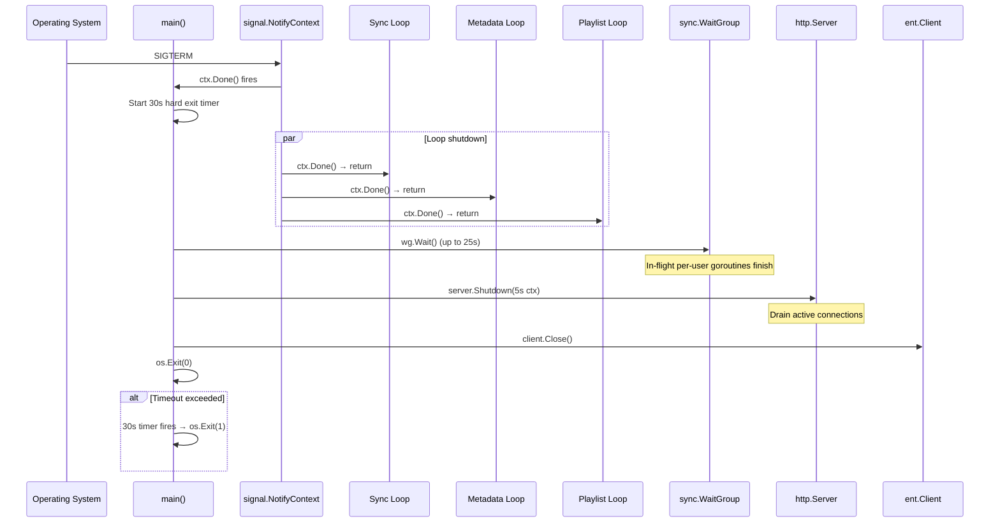

# Graceful Shutdown with Context Cancellation and WaitGroup Drain

**Status:** draft
**Version:** 0.1.0
**Last Updated:** 2026-02-21
**Governing ADRs:** ADR-0018 (graceful shutdown), ADR-0013 (goroutine ticker scheduling), ADR-0003 (SQLite atomicity), ADR-0007 (event bus cleanup)

## Overview

The graceful shutdown subsystem ensures that when Spotter receives a termination signal (SIGTERM or SIGINT), all background goroutines stop accepting new work, in-flight operations complete (or are cancelled), HTTP connections drain, and resources (database, event bus) are cleaned up before process exit. The shutdown sequence uses `signal.NotifyContext` for context cancellation, `sync.WaitGroup` for goroutine drain, and a hard timeout to guarantee exit within the container runtime's grace period.

## Scope

This spec covers:
- Signal interception and context cancellation via `signal.NotifyContext`
- Background loop shutdown (selecting on `ctx.Done()`)
- In-flight goroutine tracking via `sync.WaitGroup`
- Bounded per-user concurrency via buffered semaphore
- HTTP server graceful shutdown via `http.Server.Shutdown()`
- Timeout budget and hard exit fallback
- Partial sync recovery after unclean shutdown

Out of scope: AI operation cancellation internals (the context is propagated but OpenAI client behavior on cancellation is outside this spec), database migration rollback, SSE client reconnection logic (client-side concern).

---

## Requirements

### Shutdown Signal Handling

**REQ-SIG-001** — The application MUST intercept `SIGTERM` and `SIGINT` using `signal.NotifyContext(context.Background(), syscall.SIGTERM, syscall.SIGINT)` to create a cancellable root context.

**REQ-SIG-002** — The root context returned by `signal.NotifyContext` MUST be the parent context for all background goroutine loops. No background loop SHALL use `context.Background()` directly.

**REQ-SIG-003** — The `stop` function returned by `signal.NotifyContext` MUST be deferred in `main()` to release signal notification resources on normal exit.

**REQ-SIG-004** — On receiving the first signal, the application MUST log the shutdown initiation: `logger.Info("shutdown initiated", "signal", ...)`. A second signal SHOULD trigger an immediate hard exit via `os.Exit(1)`.

### Context Propagation

**REQ-CTX-001** — All three background ticker loops (sync, metadata enrichment, playlist sync) MUST replace `for range ticker.C` with a `select` statement:
```go
select {
case <-ctx.Done():
    logger.Info("loop shutting down", "loop", loopName)
    return
case <-ticker.C:
    // ... existing tick logic
}
```

**REQ-CTX-002** — The cancelled context MUST be passed to all service method calls within the loops (e.g., `syncer.Sync(ctx, user)`, `metadataSvc.SyncAll(ctx, user)`, `playlistSyncSvc.SyncAllEnabledPlaylists(ctx, user.ID)`). Services SHOULD respect context cancellation for early exit where possible.

**REQ-CTX-003** — Per-user goroutines spawned within each loop MUST receive the loop's context (derived from the root context) so that in-flight operations can detect cancellation.

**REQ-CTX-004** — The HTTP server MUST be configured with the root context for graceful shutdown. When the context is cancelled, `http.Server.Shutdown()` MUST be called to drain active connections.

### WaitGroup Drain

**REQ-WG-001** — A single `sync.WaitGroup` MUST be shared across all three background loops to track in-flight per-user goroutines.

**REQ-WG-002** — Before spawning each per-user goroutine, the loop MUST call `wg.Add(1)`. Inside each per-user goroutine, `defer wg.Done()` MUST be the first statement.

**REQ-WG-003** — After the root context is cancelled and all three loops have returned, the main function MUST call `wg.Wait()` to block until all in-flight per-user goroutines have completed.

**REQ-WG-004** — The WaitGroup MUST NOT be used to track the ticker loop goroutines themselves — only the per-user work goroutines they spawn. The loops exit via `ctx.Done()` and are tracked separately (e.g., via a second WaitGroup or explicit goroutine count).

### Timeout Budget

**REQ-TMO-001** — The total shutdown budget MUST be 30 seconds from the moment the first shutdown signal is received. This aligns with Docker's default `stop_grace_period`.

**REQ-TMO-002** — A hard exit timer MUST be started when shutdown begins:
```go
time.AfterFunc(30*time.Second, func() {
    logger.Error("shutdown timeout exceeded, forcing exit")
    os.Exit(1)
})
```

**REQ-TMO-003** — The shutdown sequence MUST allocate the timeout budget as follows:
1. Background loop exit: immediate (loops exit on next `select` iteration)
2. In-flight goroutine drain (`wg.Wait()`): up to 25 seconds
3. HTTP server shutdown: up to 5 seconds (using a context with 5-second deadline)
4. Database close: synchronous, no timeout (SQLite close is fast)

**REQ-TMO-004** — If `wg.Wait()` has not returned within 25 seconds, the application SHOULD log the number of still-running goroutines (if trackable) and proceed to HTTP shutdown anyway.

**REQ-TMO-005** — The timeout budget of 30 seconds SHOULD be configurable via an environment variable (e.g., `SPOTTER_SHUTDOWN_TIMEOUT`) with 30 seconds as the default.

### Bounded Concurrency (Semaphore)

**REQ-SEM-001** — A buffered channel semaphore (`make(chan struct{}, N)`) MUST limit the total number of concurrent per-user goroutines across all three background loops.

**REQ-SEM-002** — The default semaphore capacity SHOULD be 10. This value SHOULD be configurable via an environment variable (e.g., `SPOTTER_MAX_CONCURRENT_JOBS`).

**REQ-SEM-003** — Each per-user goroutine MUST acquire a semaphore slot before starting work and release it on completion:
```go
sem <- struct{}{}  // acquire
defer func() { <-sem }()  // release
```

**REQ-SEM-004** — Semaphore acquisition MUST respect context cancellation. If the context is cancelled while waiting to acquire a slot, the goroutine MUST return without performing work:
```go
select {
case sem <- struct{}{}:
    defer func() { <-sem }()
case <-ctx.Done():
    return
}
```

### Partial Sync Recovery

**REQ-REC-001** — Sync operations (listen sync, metadata enrichment, playlist sync) MUST be idempotent. Re-running a sync after an unclean shutdown MUST produce the same final state as if the sync had completed normally.

**REQ-REC-002** — Listen sync MUST use the last-synced timestamp watermark to avoid re-importing already-synced listens. A partial sync that imported some but not all listens MUST resume from the last successfully committed timestamp on the next run.

**REQ-REC-003** — Metadata enrichment MUST track per-entity enrichment state. Entities that were partially enriched (e.g., MusicBrainz data fetched but Spotify data not yet fetched) MUST be re-enriched from the incomplete enricher on the next run without re-fetching already-completed enrichers.

**REQ-REC-004** — Playlist sync MUST compare the desired playlist state with the current Navidrome state. A partial sync that added some tracks but not all MUST complete the remaining tracks on the next run without duplicating already-synced tracks.

---

## Shutdown Sequence Diagram



---

## Scenarios

### Scenario 1: Normal SIGTERM shutdown

```
Given Spotter is running with two in-flight sync goroutines
When the process receives SIGTERM
Then signal.NotifyContext cancels the root context
And all three ticker loops detect ctx.Done() and return
And the two in-flight sync goroutines complete their current operation
And wg.Wait() returns after both goroutines call wg.Done()
And http.Server.Shutdown() drains active HTTP connections
And the database connection is closed
And the process exits with code 0
And total shutdown time is under 30 seconds
```

### Scenario 2: Timeout exceeded (hard exit)

```
Given Spotter is running with a metadata enrichment goroutine
And the enrichment is making a slow external API call (e.g., MusicBrainz rate-limited)
When the process receives SIGTERM
Then signal.NotifyContext cancels the root context
And the ticker loops return immediately
But the enrichment goroutine is blocked on an HTTP request that does not respect context cancellation
And wg.Wait() blocks for 25 seconds without returning
Then the 30-second hard exit timer fires
And the process logs "shutdown timeout exceeded, forcing exit"
And the process exits with code 1
```

### Scenario 3: Shutdown during active AI generation

```
Given a user has requested mixtape generation
And the OpenAI API call is in progress (streaming response)
When the process receives SIGTERM
Then the root context is cancelled
And the cancelled context propagates to the OpenAI HTTP client
And the OpenAI client aborts the in-flight request
And the mixtape generation goroutine returns an error (context cancelled)
And the event bus publishes a mixtape-error event to any connected SSE subscribers
And the wg.Done() call decrements the WaitGroup
And shutdown proceeds normally
```

### Scenario 4: Restart after unclean shutdown

```
Given Spotter was killed with SIGKILL during a listen sync (no graceful shutdown)
And the sync had imported 300 of 500 new listens
When Spotter restarts and the next sync tick fires
Then the syncer queries for listens newer than the last-synced timestamp
And the last-synced timestamp reflects the 300th listen (the last committed transaction)
And the syncer imports listens 301-500
And no duplicate listens are created
And the final state matches what a complete uninterrupted sync would produce
```

---

## Implementation Notes

- Root context creation: `cmd/server/main.go` — replace `context.Background()` with `signal.NotifyContext`
- Background loops: `cmd/server/main.go:123-200` — refactor `for range ticker.C` to `select { case <-ctx.Done(): case <-ticker.C: }`
- HTTP server: `cmd/server/main.go:337-340` — replace `http.ListenAndServe` with `http.Server{}` + `Shutdown()`
- WaitGroup: shared across all three loops, passed via closure or explicit parameter
- Semaphore: `make(chan struct{}, 10)` created once in `main()`, shared across all loops
- Governing comment: `// Governing: ADR-0018 (graceful shutdown), ADR-0013 (ticker loops), SPEC graceful-shutdown`
