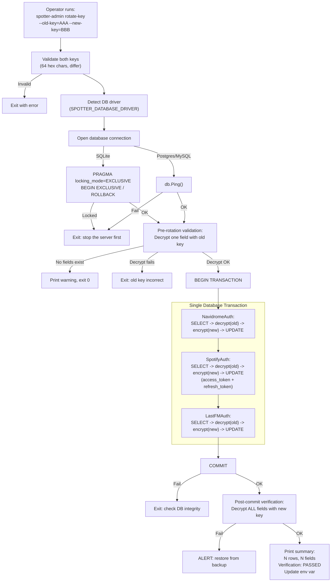
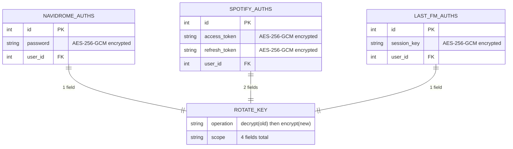
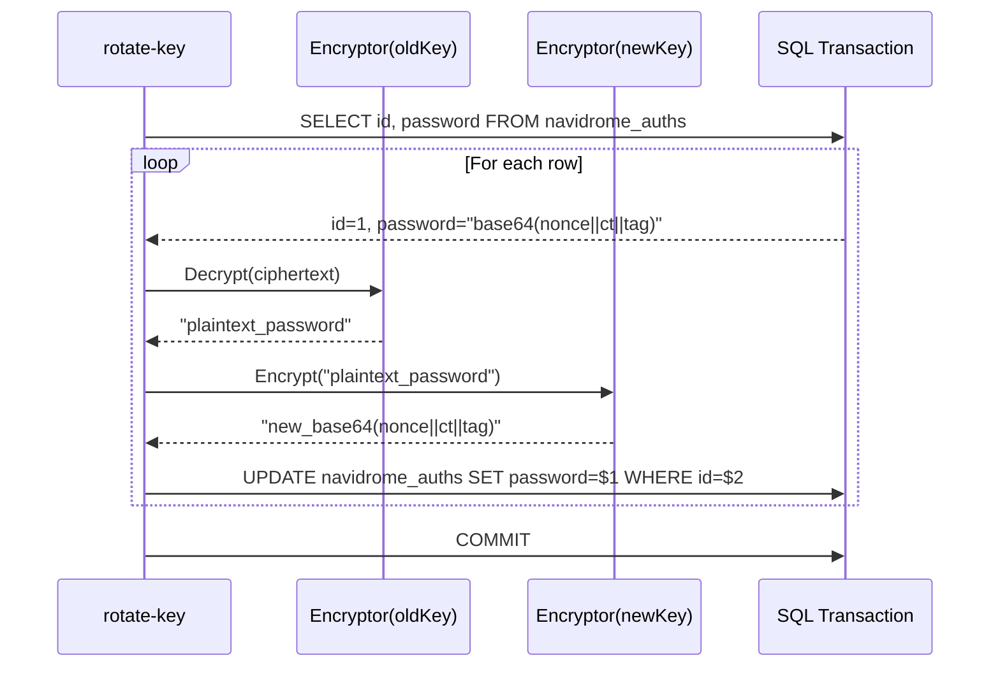

# Design: Encryption Key Rotation via Admin Subcommand

## Context

Spotter encrypts sensitive credentials at rest using AES-256-GCM
([ADR-0006](../../adrs/ADR-0006-aes256-gcm-application-layer-encryption.md)). Four fields across
three entity types store encrypted data: `NavidromeAuth.password`, `SpotifyAuth.access_token`,
`SpotifyAuth.refresh_token`, and `LastFMAuth.session_key`. If the encryption key
(`SPOTTER_SECURITY_ENCRYPTION_KEY`) is compromised -- leaked in a CI log, committed in a Docker
Compose file, or exposed in a backup -- all stored credentials must be re-encrypted with a new key.

Before this design, there was no supported rotation path. An operator would need to manually decrypt
and re-encrypt database rows using raw SQL and the Go encryption library, risking a mixed-key state
where some fields use the old key and others use the new key.

This design provides a `spotter-admin rotate-key` CLI subcommand that atomically re-encrypts all
fields in a single database transaction, with pre-rotation validation and post-commit verification.

Governing ADRs: [ADR-0021](../../adrs/ADR-0021-encryption-key-rotation.md),
[ADR-0006](../../adrs/ADR-0006-aes256-gcm-application-layer-encryption.md),
[ADR-0023](../../adrs/ADR-0023-multi-database-support-postgresql-mariadb.md).

## Goals / Non-Goals

### Goals

- Offline CLI subcommand (`spotter-admin rotate-key --old-key=... --new-key=...`) for atomic key rotation
- Pre-rotation validation: verify old key decrypts existing data before modifying anything
- Transaction-scoped re-encryption: all fields re-encrypted in a single BEGIN/COMMIT
- Post-commit verification: decrypt all fields with new key to confirm success
- Multi-database support: PostgreSQL, MySQL, and SQLite via driver-specific SQL placeholders
- Audit logging: print a summary of re-encrypted rows to stdout
- Never log old or new key values

### Non-Goals

- Automated key generation or key management recommendations
- Runtime hot-swap of encryption keys (server must be stopped)
- Encrypted field discovery (fields are enumerated statically in code)
- Automatic key rotation on a schedule
- GUI for key rotation

## Decisions

### Dedicated CLI Subcommand over API Endpoint

**Choice**: A separate `cmd/admin/main.go` binary invoked as `spotter-admin rotate-key`.

**Rationale**: Key rotation is an infrequent, high-risk operation. It requires the server to be
stopped to prevent race conditions (server reading with old key while rotation writes with new key).
A CLI subcommand is the natural interface for an offline admin operation. An API endpoint would
require authentication, authorization, and would be callable while the server is running -- all
undesirable.

**Alternatives considered**:
- API endpoint: callable while server is running, creating race conditions between reads (old key) and writes (new key).
- Manual SQL UPDATE: extremely error-prone, no atomicity guarantee, no verification step.
- Dual-key mode: zero downtime but permanent complexity in every decrypt path; fields never updated remain on the old key indefinitely.
- No rotation path: unacceptable -- forces users to disconnect and reconnect all providers after key compromise.

### Raw SQL over Ent ORM

**Choice**: Use `database/sql` directly with driver-determined placeholders, bypassing Ent hooks.

**Rationale**: Ent's encryption hooks (`internal/database/hooks.go`) automatically encrypt on
write and decrypt on read. If the rotation tool used Ent to read a field (decrypted by hook with
old key), then wrote it back (re-encrypted by hook with the same old key), the field would not
change. The rotation tool must read raw ciphertext, decrypt with old key, encrypt with new key,
and write raw ciphertext -- all without hooks interfering.

**Alternatives considered**:
- Ent with hooks disabled: Ent does not provide a mechanism to selectively disable hooks. Using `ent.WithoutHooks()` would require changes to the Ent client API.
- Ent with a special context key to skip hooks: adds complexity to the hook implementation for a feature used once.

### Single Transaction for Atomicity

**Choice**: All re-encryption operations execute within a single `BEGIN ... COMMIT`.

**Rationale**: If rotation fails mid-way (e.g., a corrupted ciphertext cannot be decrypted), the
entire transaction is rolled back, leaving the database in its original state. No mixed-key state
is possible. PostgreSQL, MySQL, and SQLite all support this transactional model.

## Architecture

### Rotation Workflow



### Encrypted Field Map



### Per-Row Re-Encryption



## Key Implementation Details

- **Entry point**: `cmd/admin/main.go` -- parses `rotate-key` subcommand with `--old-key`, `--new-key`, and optional `--db` flags.
- **Key validation**: `parseHexKey()` ensures exactly 64 hex characters, converts to 32-byte slice using `hex.DecodeString`. Keys must differ (REQ-ROT-003).
- **Database driver detection**: Reads `SPOTTER_DATABASE_DRIVER` env var (default `sqlite3`). Validates against `["sqlite3", "postgres", "mysql"]`. DSN from `SPOTTER_DATABASE_SOURCE` or `--db` flag.
- **Lock check**: SQLite uses `PRAGMA locking_mode=EXCLUSIVE` + `BEGIN EXCLUSIVE` to test for server lock. PostgreSQL/MySQL use `db.Ping()`.
- **Pre-validation**: `verifyOldKey()` queries the first non-empty encrypted field and attempts decryption with old key. If no fields exist, prints warning and exits 0.
- **Re-encryption**: `reencryptAll()` groups fields by table, queries all rows, decrypts each field with old encryptor, encrypts with new encryptor, updates the row. Uses `$1`/`$2` placeholders for PostgreSQL and `?` for SQLite/MySQL.
- **Verification**: `verifyNewKey()` reads all encrypted fields directly from the database (not cached) and decrypts with the new key.
- **Audit output**: Prints per-table row counts, total field count, verification status, and the env var update instruction. Never prints key values.

Files:
- `cmd/admin/main.go` -- complete rotation subcommand implementation (~365 lines)
- `cmd/admin/main_test.go` -- tests for key validation, rotation, and verification
- `internal/crypto/encrypt.go` -- `Encryptor.Encrypt()`, `Decrypt()`, `IsEncrypted()` (reused by both server and admin tool)

## Risks / Trade-offs

- **Operator must stop the server**: Brief downtime is required during rotation. For a personal music server, this is acceptable. The SQLite lock check (or PostgreSQL ping) catches the most common mistake of running rotation while the server is up.
- **Bypasses Ent ORM**: The admin tool uses raw SQL, which must be kept in sync with Ent schema changes. If a new encrypted field is added to the schema, `allEncryptedFields` in `cmd/admin/main.go` must be updated manually. A code review checklist or CI check could mitigate this.
- **Post-commit verification failure is catastrophic**: If the commit succeeds but verification fails, the database contains data encrypted with the new key but the operator has not yet updated the env var. The tool advises restoring from backup. Mitigated by the transaction ensuring consistency -- if commit succeeds, the data should be correctly encrypted.
- **No automatic env var update**: After rotation, the operator must manually update `SPOTTER_SECURITY_ENCRYPTION_KEY`. If they forget, the server will fail to decrypt on next startup with a clear error. The tool prints the required env var update as a reminder.
- **SQLite lock detection is heuristic**: The `BEGIN EXCLUSIVE` test may succeed if the server has no active transactions, even though it is running. For PostgreSQL/MySQL, `db.Ping()` only verifies connectivity, not that the server application is stopped.

## Migration Plan

The admin subcommand was implemented as a standalone binary:

1. Created `cmd/admin/main.go` with `flag.FlagSet` for `rotate-key` subcommand
2. Implemented `parseHexKey()` for key validation matching `config.GetEncryptionKeyBytes()`
3. Implemented `verifyOldKey()` for pre-rotation validation
4. Implemented `reencryptAll()` with driver-aware SQL placeholders
5. Implemented `verifyNewKey()` for post-commit verification
6. Added all three database drivers as side-effect imports (`mattn/go-sqlite3`, `lib/pq`, `go-sql-driver/mysql`)
7. Added `cmd/admin/main_test.go` with unit tests
8. Documented in `SECURITY.md` as the supported key rotation procedure

### Operator Workflow

```
# 1. Stop the server
docker stop spotter

# 2. Run rotation
spotter-admin rotate-key \
  --old-key=<current-64-hex-key> \
  --new-key=<new-64-hex-key>

# 3. Update environment variable
export SPOTTER_SECURITY_ENCRYPTION_KEY=<new-64-hex-key>

# 4. Restart the server
docker start spotter
```

## Open Questions

- Should the tool support `--dry-run` mode that validates the old key and counts fields without modifying data? Would increase operator confidence before committing.
- Should the tool automatically detect the current encryption key from the environment (avoiding `--old-key` flag)? This would simplify the command but reduces explicitness and could mask mistakes.
- Should the admin binary be merged into the main `spotter` binary as a subcommand (`spotter admin rotate-key`) instead of a separate `spotter-admin` binary? A single binary simplifies distribution but the admin tool imports `database/sql` directly without Ent, which may conflict with the main binary's Ent client.
- Should the `allEncryptedFields` list be generated from the Ent schema (e.g., by a `go generate` step) to prevent drift when new encrypted fields are added?
