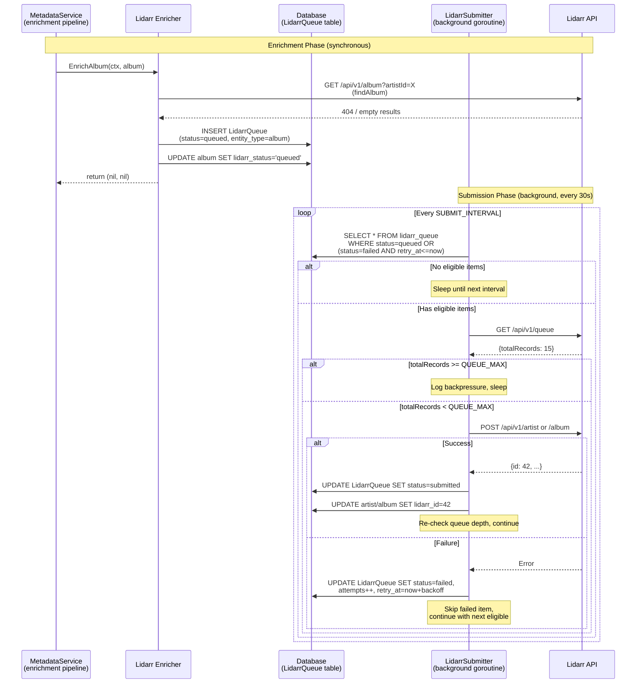
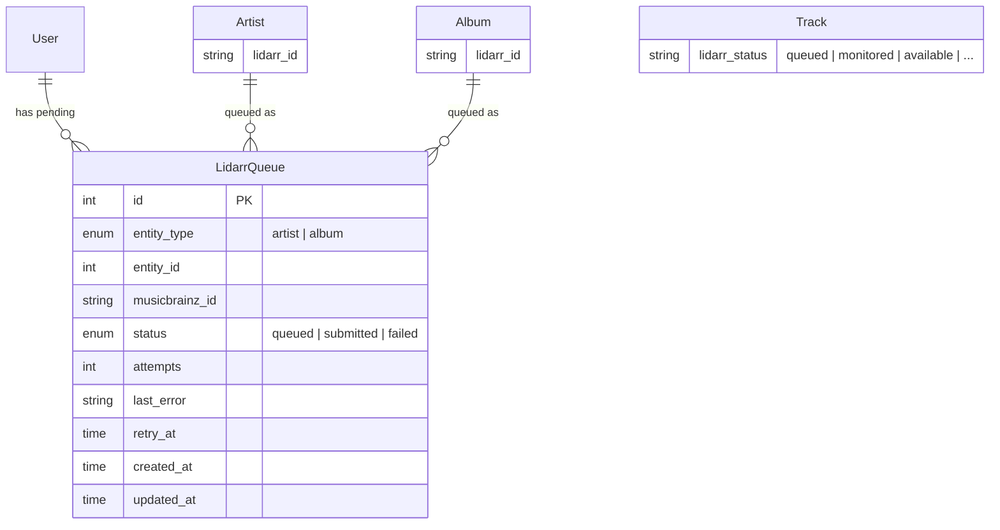
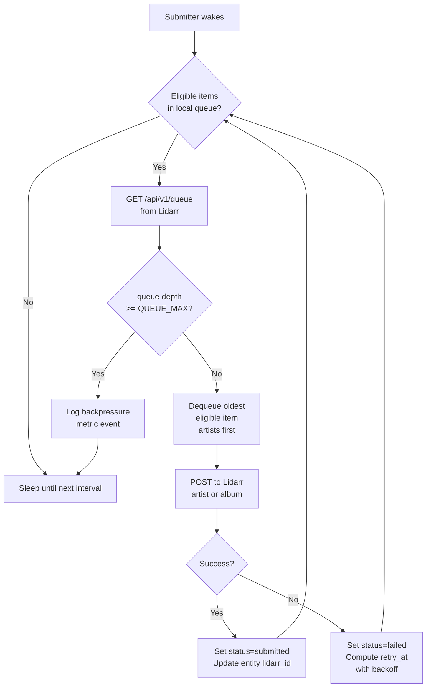

# Design: Lidarr Submission Queue with Backpressure

## Context

Spotter's Lidarr enricher (`internal/enrichers/lidarr/lidarr.go`) currently submits artists and
albums to Lidarr synchronously during the metadata enrichment pipeline. When a new user connects
a large Spotify library, the enrichment cycle can trigger hundreds of `addArtist()` and
`addAlbum()` POST requests in rapid succession, flooding Lidarr's download queue and
overwhelming upstream indexers (Newznab/Torznab).

This design introduces a DB-persisted submission queue with backpressure driven by Lidarr's
actual queue depth. The enricher records submission *intent* instead of submitting directly,
and a background goroutine drains the queue when Lidarr has capacity.

**Governing artifacts**: ADR-0029, ADR-0015, ADR-0013, ADR-0020, SPEC-0017.

## Goals / Non-Goals

### Goals
- Prevent Lidarr queue flooding regardless of catalog size
- Give users visibility into items waiting to be submitted (`queued` status)
- Use Lidarr's actual queue depth as the throttling signal (adaptive backpressure)
- Persist submission queue across process restarts
- Follow existing codebase patterns (Ent entities, goroutine tickers, slog metrics)

### Non-Goals
- Per-item priority or user-controlled ordering of the submission queue
- Real-time push notifications when items are submitted (existing enrichment cycle updates status)
- Lidarr queue management UI (viewing/cancelling Lidarr's own download queue)
- Rate limiting Lidarr read-only API calls (`findArtist`, `findAlbum`) — only submissions are queued
- Batched multi-item Lidarr API calls (Lidarr's API accepts one entity at a time)

## Decisions

### Backpressure Signal: Lidarr Queue Depth via API

**Choice**: Check Lidarr's `GET /api/v1/queue?page=1&pageSize=1` on each wake cycle to read
`totalRecords`, and compare against `SPOTTER_LIDARR_QUEUE_MAX`.

**Rationale**: Using Lidarr's actual queue depth makes throttling adaptive — a fast Lidarr
instance with few indexers drains quickly and gets more submissions, while a slow one
automatically gets fewer. A fixed time-based rate (e.g., "1 per 5 seconds") would either
under-utilize fast setups or still overwhelm slow ones.

**Alternatives considered**:
- Fixed token bucket (1 per N seconds): No awareness of Lidarr's actual load; still floods slow instances
- Lidarr webhook notifications: Lidarr supports webhooks but they require external HTTP endpoint configuration, adding deployment complexity

### Queue Entity in Ent vs. Separate Table

**Choice**: Define a `LidarrQueue` Ent entity with edges to `User`, following the existing
schema pattern.

**Rationale**: All other stateful data in Spotter uses Ent entities. A raw SQL table would
bypass Ent's type safety, code generation, and hook system. The queue is small (typically
hundreds of rows at peak) and does not need the performance of a raw queue table.

**Alternatives considered**:
- In-memory channel queue: Lost on restart; no visibility for UI status
- Redis queue: Adds external dependency, violates single-binary design (ADR-0007)
- Raw SQL table: Loses Ent type safety and code generation benefits

### Submission Order: Artists Before Albums

**Choice**: Within a wake cycle, submit artist entities before album entities, both ordered
by `created_at ASC`.

**Rationale**: Lidarr requires an artist to exist before albums can be added under it.
Submitting artists first ensures the Lidarr artist ID is available when dependent album
submissions run. If an album's artist hasn't been submitted yet, the album submission would
fail and be retried — processing artists first avoids unnecessary failures.

**Alternatives considered**:
- Random order: Would cause frequent album failures when artist doesn't exist yet
- Dependency graph: Over-engineered for a two-level hierarchy (artist → album)

### Enricher Writes Queue Row Instead of Calling Lidarr

**Choice**: The Lidarr enricher's `EnrichArtist()` and `EnrichAlbum()` methods insert a
`LidarrQueue` row when an entity is not found, instead of calling `addArtist()` / `addAlbum()`.

**Rationale**: This is the minimal change to the enricher — the `find` logic stays synchronous
(needed to set `lidarr_id` when entities already exist), but the `add` path becomes a queue
insert. The enricher remains stateless and testable.

**Alternatives considered**:
- Move all Lidarr logic to the submitter: Would duplicate find/add logic and break the enricher registry pattern
- Enricher calls submitter directly: Couples the enricher to the submitter; queue insert is simpler

## Architecture

### Component Interaction



### Entity Relationship



### Submitter Wake Cycle Flowchart



## Key Implementation Details

### Files to Create

| File | Purpose |
|------|---------|
| `ent/schema/lidarr_queue.go` | Ent schema for `LidarrQueue` entity |
| `internal/services/lidarr_submitter.go` | Background submitter goroutine and queue management |

### Files to Modify

| File | Change |
|------|--------|
| `internal/enrichers/lidarr/lidarr.go` | Replace `addArtist()`/`addAlbum()` calls with queue inserts in `EnrichArtist()`/`EnrichAlbum()` |
| `internal/config/config.go` | Add `QueueMax` and `SubmitInterval` to `Lidarr` struct |
| `cmd/server/main.go` | Launch `LidarrSubmitter` goroutine alongside existing tickers |
| `internal/views/components/track_status.templ` | Add `"queued"` status icon rendering |
| `ent/schema/syncevent.go` | Add `lidarr_artist_submitted` event type (if not present) |

### Submitter Startup in main.go

The submitter follows the same startup pattern as existing tickers (ADR-0013):

```go
// Only start if Lidarr is configured
if cfg.Lidarr.BaseURL != "" && cfg.Lidarr.APIKey != "" {
    submitter := services.NewLidarrSubmitter(db, cfg, logger, httpClient)
    wg.Add(1)
    go func() {
        defer wg.Done()
        submitter.Run(ctx)  // blocks until ctx cancelled
    }()
}
```

### Queue Insert in Enricher (Pseudocode)

```go
// In EnrichArtist(), after findArtist() returns nil:
func (e *Enricher) enqueueArtist(ctx context.Context, artist *ent.Artist) {
    _, err := e.db.LidarrQueue.Create().
        SetEntityType(lidarrqueue.EntityTypeArtist).
        SetEntityID(artist.ID).
        SetMusicbrainzID(artist.MusicbrainzID).
        SetStatus(lidarrqueue.StatusQueued).
        SetUser(e.user).
        OnConflictColumns(/* unique index */).
        DoNothing().
        Save(ctx)
}
```

### Lidarr Queue Depth Check

```go
// GET /api/v1/queue?page=1&pageSize=1
// Response: { "totalRecords": N, ... }
func (s *LidarrSubmitter) getQueueDepth(ctx context.Context) (int, error) {
    req, _ := http.NewRequestWithContext(ctx, "GET",
        s.baseURL+"/api/v1/queue?page=1&pageSize=1", nil)
    req.Header.Set("X-Api-Key", s.apiKey)
    resp, err := s.client.Do(req)
    // parse totalRecords from JSON response
}
```

## Risks / Trade-offs

- **Eventual consistency**: Album/track status in the UI lags behind actual Lidarr state until the next enrichment cycle runs after submission. Mitigated by the enrichment pipeline running on its normal schedule (default 1 hour).

- **Lidarr queue API accuracy**: The `GET /api/v1/queue` endpoint reflects Lidarr's download queue, not its indexer search queue. If Lidarr queues searches internally before they appear in the download queue, the backpressure signal may undercount. Mitigated by the conservative default cap (20).

- **Artist dependency ordering**: If an artist submission fails, dependent album submissions will also fail until the artist succeeds. Mitigated by the retry/backoff mechanism — the artist will be retried first (ordered by `created_at`), and once it succeeds, albums become submittable.

- **Queue growth during extended outages**: If Lidarr is offline for days while enrichment continues, the queue grows unbounded. Acceptable for personal use (thousands of rows at most). Could add a local queue cap in the future if needed.

## Migration Plan

1. **Schema migration**: Run `go generate ./ent` after adding the `LidarrQueue` schema. Ent's `client.Schema.Create()` auto-migrates on startup — no manual migration needed.

2. **Backward compatibility**: Existing albums with `lidarr_id` set are unaffected. The queue only applies to new submissions. No data migration is needed.

3. **Rollback**: If the feature causes issues, revert the enricher to call `addArtist()`/`addAlbum()` directly (the queue goroutine simply stops running). Queue rows can be dropped.

## Open Questions

- Should the UI expose a way to view the full submission queue (pending count, failed items, retry times)? A simple "N items queued for Lidarr" indicator on the library page may be sufficient initially.
- Should permanently failed items (10+ attempts) trigger an email notification (ADR-0026 pattern) or an SSE toast?
- Should album submissions be blocked entirely until their artist's queue entry reaches `submitted` status, or should they be allowed to fail and retry naturally?
