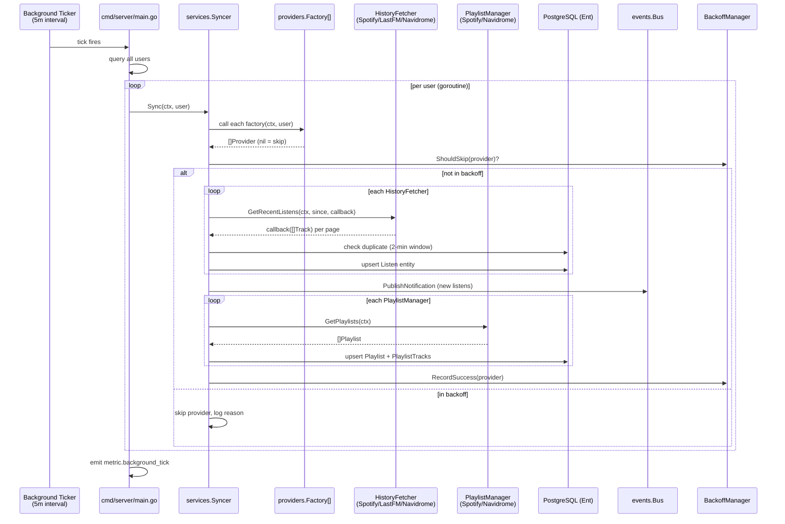
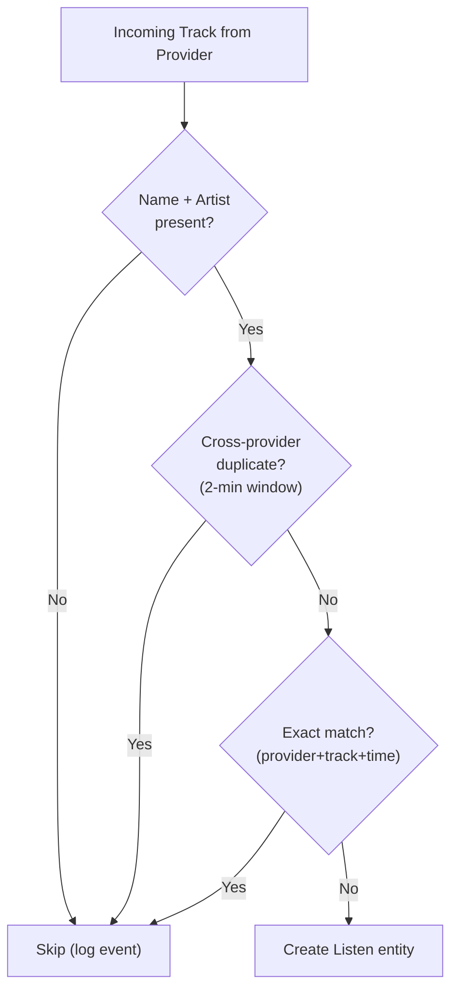

# Design: Listen and Playlist Synchronization Service

## Context

Spotter is a companion application for Navidrome that aggregates listening history and playlists
from multiple music providers (Spotify, Last.fm, Navidrome). Without a centralized sync service,
each provider would need its own ingestion pipeline, leading to duplicated logic for deduplication,
scheduling, and event notification. The sync service consolidates all provider data ingestion into
a single orchestration layer that runs on a configurable background ticker and supports on-demand
triggers from the HTTP layer.

Governing ADRs:
[ADR-0007](../../adrs/ADR-0007-in-memory-event-bus.md) (in-memory event bus for SSE notifications),
[ADR-0005](../../adrs/ADR-0005-navidrome-primary-identity-provider.md) (Navidrome as primary identity),
[ADR-0013](../../adrs/ADR-0013-goroutine-ticker-background-scheduling.md) (goroutine ticker scheduling),
[ADR-0016](../../adrs/ADR-0016-pluggable-provider-factory-pattern.md) (pluggable provider factory).

## Goals / Non-Goals

### Goals

- Unified orchestration of history and playlist ingestion from all configured providers
- Incremental history sync using a per-provider timestamp watermark (last `PlayedAt`)
- Cross-provider listen deduplication with a 2-minute time window
- Playlist upsert with track position preservation and removal of stale tracks
- Background scheduling on a configurable interval (default 5 minutes)
- On-demand sync triggered from HTTP handlers (returns 202, runs in background)
- Per-provider backoff and error classification for resilient retries
- Structured metric events (`metric.sync`, `metric.background_tick`) for observability
- Sync event audit logging to the database (`SyncEvent` entity)

### Non-Goals

- Metadata enrichment (delegated to the Metadata Enrichment Pipeline)
- Playlist write-back to Navidrome (delegated to the Playlist Sync to Navidrome spec)
- Provider OAuth token management (delegated to each provider's factory)
- Cross-user sync coordination or distributed locking

## Decisions

### Factory-Based Provider Discovery

**Choice**: Provider instances are created per-user at sync time via registered `providers.Factory` functions.

**Rationale**: Factories encapsulate per-user credential lookup (e.g., `user.Edges.SpotifyAuth`).
Returning `nil, nil` for unconfigured providers allows silent skipping without error logging.
This decouples the Syncer from provider-specific authentication details.

**Alternatives considered**:
- Direct provider construction in the Syncer: would couple Syncer to every provider's auth model
- Singleton providers shared across users: would require thread-safe token management per user

### Cross-Provider Deduplication via Time Window

**Choice**: Before persisting a listen, check for an existing listen with the same track name,
artist name, and a `PlayedAt` within a 2-minute window across all providers.

**Rationale**: The same song played once may be reported by both Spotify and Last.fm with
slightly different timestamps. A 2-minute window catches these duplicates without false positives
for genuinely separate plays of the same track.

**Alternatives considered**:
- Exact timestamp match per provider only: misses cross-provider duplicates
- ISRC-based matching: not all providers populate ISRC on history tracks
- Longer time windows (5+ minutes): risk of false positive dedup for repeated listens

### Error Classification with Backoff

**Choice**: Sync errors are classified into `Fatal` and `Retriable` categories. Fatal errors
trigger user notifications and email alerts; retriable errors use exponential backoff.

**Rationale**: A revoked OAuth token (fatal) requires user intervention, while a transient 503
(retriable) will resolve on its own. Distinguishing these prevents unnecessary user alerts
while ensuring real failures are surfaced promptly.

**Alternatives considered**:
- Uniform retry for all errors: would spam notifications on transient failures
- No backoff: would hammer failing providers every tick

## Architecture

### Sync Orchestration Flow

### Listen Deduplication Flow

## Key Implementation Details

**Primary file**: `internal/services/sync.go` (~920 lines)

- `Syncer` struct holds `[]providers.Factory`, `*BackoffManager`, `SyncNotifier`, and
  the Ent client, config, logger, and event bus.
- `Register(factory)` appends a factory to the slice. Called at startup in `cmd/server/main.go`
  for Navidrome, Spotify, and Last.fm.
- `getActiveProviders(ctx, user)` refreshes the user with all auth edges loaded
  (`WithSpotifyAuth`, `WithNavidromeAuth`, `WithLastfmAuth`), then calls each factory.
  `nil` returns are silently skipped; errors are logged and the factory is skipped.
- `syncHistory()` iterates HistoryFetcher providers, queries the most recent `Listen.PlayedAt`
  for the timestamp watermark, then calls `GetRecentListens` with a batched callback.
- `persistListens()` performs the two-layer deduplication: cross-provider (2-min window) and
  exact match (provider+track+played_at). New listens are published to the event bus.
- `syncPlaylists()` iterates PlaylistManager providers. Spotter-managed Navidrome playlists
  (those synced from other sources) are excluded from re-import.
- `persistPlaylistTracks()` uses a two-phase approach: move existing tracks to negative
  positions to avoid unique constraint conflicts, then upsert new positions.
- `logEvent()` persists structured `SyncEvent` records for audit logging.

**Background scheduler**: `cmd/server/main.go:206-262` — goroutine with `time.NewTicker`,
per-user goroutine fan-out with bounded concurrency via channel semaphore, emits
`metric.background_tick` after each tick.

**On-demand trigger**: HTTP handlers call `syncer.Sync(ctx, user)` in a background goroutine,
returning immediately.

## Risks / Trade-offs

- **Cross-provider dedup window is heuristic** — A 2-minute window may miss duplicates with
  larger timestamp drift (e.g., scrobbler delay). It may also false-positive on repeated
  plays of the same song within 2 minutes. The current window is a pragmatic balance.
- **No transaction around playlist track sync** — The two-phase position update (negative
  positions, then real positions) is not wrapped in a single transaction. A crash mid-sync
  could leave tracks with negative positions. Mitigation: the next sync will correct them.
- **Unbounded per-user goroutines** — While a semaphore limits concurrency, the goroutine
  count is still proportional to user count. For Spotter's personal-use deployment model,
  this is acceptable.
- **Backoff state is in-memory** — Process restart clears all backoff state. A provider
  with a persistent error will be retried immediately after restart.
- **History sync defaults to epoch for new users** — The `since` timestamp falls back to
  `time.Unix(0, 0)` rather than a configurable lookback. This imports the full available
  history, which may be very large for some providers.

## Migration Plan

The sync service was implemented as part of the initial Spotter architecture. No migration
from a prior system was required. Key implementation milestones:

1. **Core sync loop**: `Syncer.Sync()` with factory-based provider discovery
2. **Background scheduler**: goroutine + ticker in `main.go` with per-user fan-out
3. **Deduplication**: cross-provider time-window check added to prevent double-counting
4. **Backoff and error classification**: `BackoffManager` added for resilient retry behavior
5. **Observability**: `metric.sync` and `metric.background_tick` events added per ADR-0019
6. **Email notifications**: `SyncNotifier` interface added for fatal error alerting

## Open Questions

- Should the cross-provider dedup window (2 minutes) be configurable via environment variable?
  Currently hardcoded in `isDuplicateListen()`.
- Should the sync service support partial playlist sync (only playlists changed since last
  sync) rather than fetching all playlists every tick?
- Should backoff state be persisted to the database to survive process restarts?
- The `since` timestamp for new users defaults to epoch. Should this be configurable
  (e.g., `SPOTTER_SYNC_HISTORY_LOOKBACK`) to limit initial import size?
