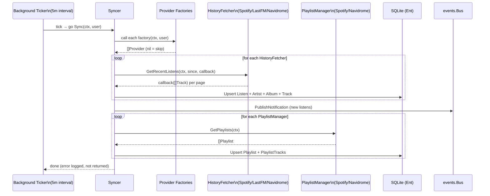

# Listen and Playlist Synchronization Service

**Status:** accepted
**Version:** 0.1.0
**Last Updated:** 2026-02-21
**Governing ADRs:** ADR-0007 (in-memory event bus), ADR-0005 (Navidrome auth)

## Overview

The sync service orchestrates ingestion of listening history and playlist data from all configured music providers into Spotter's local database. It runs on a configurable background ticker (default 5 minutes) and can also be triggered on-demand. The service discovers active providers per user via factory functions, fetches incremental history (since last sync), deduplicates listens, and caches playlists for downstream use by the playlist sync service.

## Scope

This spec covers:
- The `Syncer` service and its provider factory registry
- Full sync (`Sync`) and provider-scoped sync (`SyncProvider`) operations
- History synchronization: incremental fetch, deduplication, and upsert of `Listen` entities
- Playlist synchronization: fetching from providers and caching `Playlist`/`PlaylistTrack` entities
- Background scheduler integration (tick interval, per-user goroutines)
- On-demand sync from HTTP handlers
- Sync event logging

Out of scope: Metadata enrichment (see Metadata Enrichment spec), Navidrome playlist write-back (see Playlist Sync to Navidrome spec), provider OAuth details (see Music Provider Integration spec).

---

## Requirements

### Syncer Registration

**REQ-SYNC-001** — The `Syncer` MUST maintain a list of `providers.Factory` functions. Factories MUST be registered at startup via `Syncer.Register(factory)`.

**REQ-SYNC-002** — At sync time, the `Syncer` MUST call each registered factory with the current user context. Factories returning `nil, nil` MUST be silently skipped — this is the expected behavior for unconfigured providers.

**REQ-SYNC-003** — Provider instantiation errors (factory returning non-nil error) MUST be logged and that provider MUST be skipped for the current sync cycle.

### Full Sync

**REQ-SYNC-010** — `Sync(ctx, user)` MUST execute the following steps in order:
1. Instantiate all active providers for the user
2. Sync listening history from all `HistoryFetcher` providers
3. Sync playlists from all `PlaylistManager` providers

**REQ-SYNC-011** — History sync failure MUST be logged but MUST NOT abort playlist sync. Each step's error is independent.

**REQ-SYNC-012** — `SyncProvider(ctx, user, providerType)` MUST execute the same steps as full sync but filtered to a single provider type. Used for manual per-provider refresh from preferences UI.

### History Synchronization

**REQ-SYNC-020** — Before fetching history, the system MUST determine the `since` timestamp as the `PlayedAt` of the most recent `Listen` entity for this user from this provider. If no listens exist, MUST use a configurable lookback (e.g., 30 days).

**REQ-SYNC-021** — The `HistoryFetcher.GetRecentListens` callback MUST be called with batches of `providers.Track`. For each track in the batch, the system MUST upsert a `Listen` entity:
- MUST match an existing `Listen` by provider + provider track ID + played_at to avoid duplicates
- MUST create an `Artist`, `Album`, and `Track` entity if they do not already exist (by name/external ID)
- MUST link the `Listen` to the `Track`, `Artist`, `Album`, and `User`

**REQ-SYNC-022** — The system MUST NOT fail the entire history sync if a single track fails to upsert. Errors MUST be logged per-track and sync MUST continue.

**REQ-SYNC-023** — After history sync completes, the system MUST publish a `EventTypeRecentListen` notification event via the event bus if new listens were ingested.

### Playlist Synchronization (Read from Providers)

**REQ-SYNC-030** — For each `PlaylistManager` provider, the system MUST call `GetPlaylists()` and upsert each returned playlist as a `Playlist` entity in the local database, linked to the user.

**REQ-SYNC-031** — The system MUST upsert `PlaylistTrack` entities for each track in a fetched playlist, preserving track order (position).

**REQ-SYNC-032** — If a playlist previously existed and is no longer returned by the provider, the system MUST mark it as no longer active (or delete it, based on config). Playlists with sync enabled MUST NOT be automatically deleted.

### Background Scheduler

**REQ-SYNC-040** — The background scheduler MUST run `Sync` for all users on a configurable interval (`sync.interval`, default `5m`), using a `time.Ticker`.

**REQ-SYNC-041** — For each tick, the scheduler MUST spawn one goroutine per user to allow parallel syncs. Each goroutine's failure MUST be logged and MUST NOT affect other users' syncs.

**REQ-SYNC-042** — If a sync for a user is already running from the previous tick when the next tick fires, the new goroutine MUST run anyway (no lock). This accepts potential overlapping syncs for users with very slow providers.

### On-Demand Sync

**REQ-SYNC-050** — HTTP handlers MUST be able to trigger immediate sync for the current user via `Syncer.Sync(ctx, user)` in a background goroutine.

**REQ-SYNC-051** — On-demand sync MUST follow the same logic as scheduled sync. The HTTP handler MUST return immediately (202 Accepted) without waiting for sync to complete.

---

## Data Flow Diagram



---

## Scenarios

### Scenario 1: Incremental history sync

```gherkin
Given a user's last listen was 2 hours ago
When the 5-minute sync tick fires
Then the Syncer queries the most recent Listen.PlayedAt for this user
And calls Spotify.GetRecentListens(ctx, since=2h_ago, callback)
And Spotify paginates its Recently Played API
And for each page, callback is called with the batch
And new listens are upserted to the database
And a notification event is published
```

### Scenario 2: New user first sync

```gherkin
Given a user logs in for the first time
When PostLogin triggers an immediate go Sync(ctx, user)
Then since is set to now - 30 days (no existing listens)
And the full 30-day history is imported for all configured providers
```

### Scenario 3: Provider returns error mid-sync

```gherkin
Given the Last.fm API returns a 503 error during history fetch
When GetRecentListens returns an error
Then the Syncer logs the error with structured fields (user, provider, error)
And skips Last.fm for this tick
And continues with Navidrome history sync
And proceeds with playlist sync
```

---

## Configuration Reference

| Config Key | Default | Description |
|---|---|---|
| `sync.interval` | `"5m"` | Background sync ticker interval |
| `sync.history_lookback` | `"720h"` (30d) | Initial history window for new users |

---

## Implementation Notes

- Service: `internal/services/sync.go`
- Background scheduler: `cmd/server/main.go:115-141` (goroutine with `time.Ticker`)
- On-demand trigger: fired from `internal/handlers/auth.go:PostLogin` and preferences handlers
- Provider interfaces: `internal/providers/providers.go` (see Music Provider Integration spec)
- Event bus: `internal/events/bus.go` (see Event Bus & SSE spec)
- Governing comment: `// Governing: SPEC listen-playlist-sync, ADR-0007 (event bus)`
