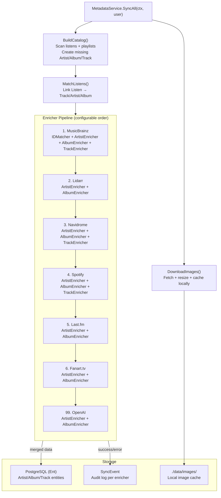
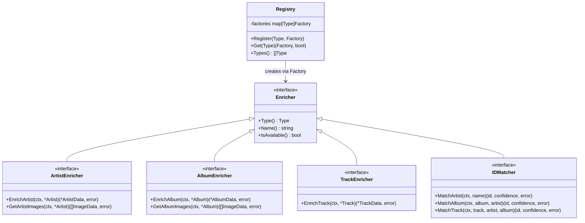

# Design: Metadata Enrichment Pipeline

## Context

Spotter aggregates music metadata from seven external sources (MusicBrainz, Lidarr, Navidrome,
Spotify, Last.fm, Fanart.tv, OpenAI) to build rich artist, album, and track profiles. Each
source provides different facets of metadata — MusicBrainz provides canonical IDs, Spotify
provides popularity metrics, Fanart.tv provides high-resolution artwork, and OpenAI generates
AI biographies. Without a structured pipeline, enrichment logic would be scattered across
services, making it difficult to add new sources or control execution order.

The pipeline design follows a registry pattern where enrichers are registered at startup and
executed in a configurable priority order. MusicBrainz runs first to establish cross-service
identifiers, and OpenAI runs last to generate summaries using data from all prior enrichers.

Governing ADRs:
[ADR-0015](../../adrs/ADR-0015-pluggable-enricher-registry-pattern.md) (type-keyed enricher registry),
[ADR-0004](../../adrs/ADR-0004-ent-orm-code-generation.md) (Ent ORM),
[ADR-0008](../../adrs/ADR-0008-openai-api-litellm-compatible-llm-backend.md) (OpenAI API).

## Goals / Non-Goals

### Goals

- Pluggable enricher registry with factory-based per-user instantiation
- Configurable execution order via `SPOTTER_METADATA_ORDER` environment variable
- Capability-based interfaces: `ArtistEnricher`, `AlbumEnricher`, `TrackEnricher`, `IDMatcher`
- Graceful degradation: `nil, nil` return from factory when enricher is not configured
- Error isolation: a single enricher failure does not abort the pipeline for an entity
- Image download and local caching with resize support (WebP, PNG, JPEG, GIF)
- Audit trail via `SyncEvent` records per enricher per entity
- Background scheduling on configurable interval (default 1 hour)
- Catalog building from listen and playlist data before enrichment

### Non-Goals

- Vibes/mixtape AI generation (separate subsystem in `internal/vibes/`)
- Playlist sync track matching (uses `TrackMatcher` but is a separate service)
- Provider history fetching (handled by the Listen & Playlist Sync spec)
- Real-time enrichment on entity creation (enrichment is batch-oriented)
- Concurrent enricher execution for a single entity (sequential by design)

## Decisions

### Type-Keyed Registry with Factory Pattern

**Choice**: A `Registry` struct mapping `enrichers.Type` to `enrichers.Factory` functions.
Factories are `func(ctx, user) (Enricher, error)` — they instantiate enrichers per-user
at runtime, checking credential availability.

**Rationale**: This decouples the `MetadataService` from individual enricher implementations.
Adding a new enricher requires only: implement the interface, write a `New()` factory, and
add one `Register()` call in `main.go`. The factory returning `nil, nil` when credentials
are missing provides graceful degradation without special-casing in the orchestrator.

**Alternatives considered**:
- Hardcoded ordered slice in MetadataService: violates open/closed principle, no runtime config
- Plugin system with `.so` shared libraries: Go `plugin` is Linux-only, excessive complexity
- Single monolithic enricher: violates single responsibility, thousands of lines in one file

### Configurable Execution Order over Priority Fields

**Choice**: Execution order is defined by `DefaultOrder()` (a static slice) overridable via
`SPOTTER_METADATA_ORDER` config. Enrichers do not carry a `Priority()` field.

**Rationale**: A config-driven order is more flexible than compile-time priorities. Operators
can disable enrichers by omitting them from the order string. The default order is:
MusicBrainz, Lidarr, Navidrome, Spotify, Last.fm, Fanart, OpenAI.

**Alternatives considered**:
- Integer priority fields on each enricher: less flexible, requires code changes to reorder
- No ordering (parallel execution): loses the ID-matching-first guarantee that downstream
  enrichers depend on

### Catalog-First Enrichment Strategy

**Choice**: Before enriching, `MetadataService.SyncAll()` builds the catalog by scanning
all `Listen` and `PlaylistTrack` records to create `Artist`, `Album`, and `Track` entities
that do not yet exist. Then enrichment runs against the catalog.

**Rationale**: Enrichment operates on catalog entities, not raw listen data. Building the
catalog first ensures enrichers have entities to work with, even for artists/albums that
were only seen in playlist imports.

**Alternatives considered**:
- Enrich inline during sync: would slow down the sync loop and mix concerns
- Event-driven enrichment on entity creation: adds complexity without clear benefit for
  a batch-oriented personal application

## Architecture

### Pipeline Execution Model

### Enricher Interface Hierarchy

## Key Implementation Details

**Interface definitions**: `internal/enrichers/enrichers.go` (~265 lines)
- `Type` constants: `TypeMusicBrainz`, `TypeLidarr`, `TypeNavidrome`, `TypeSpotify`,
  `TypeLastFM`, `TypeFanart`, `TypeOpenAI`
- `Registry` struct with `map[Type]Factory`, `Register()`, `Get()`, `Types()`
- `DefaultOrder()` returns the canonical execution sequence
- `ParseType()` validates enricher type strings from config
- Data structs: `ArtistData`, `AlbumData`, `TrackData`, `ImageData` with fields for
  all external IDs, metadata, AI-generated content, and typed tags

**Orchestrator**: `internal/services/metadata.go` (~1600+ lines)
- `MetadataService` struct holds `*enrichers.Registry`, Ent client, raw `*sql.DB`,
  config, logger, bus, and HTTP client
- `Register(type, factory)` delegates to `registry.Register()`
- `SyncAll(ctx, user)` executes: BuildCatalog → MatchListens → EnrichArtists →
  EnrichAlbums → EnrichTracks → DownloadImages
- `getActiveEnrichers(ctx, user)` iterates `config.MetadataEnricherOrder()`, looks up
  each factory via `registry.Get()`, calls it with user context, checks `IsAvailable()`
- Each `Enrich*` method iterates entities, runs enrichers in order, merges results,
  and persists. Enricher errors are logged and skipped (pipeline continues).
- `metric.enricher` events emitted per enricher run for observability

**Enricher implementations**: `internal/enrichers/{musicbrainz,lidarr,navidrome,spotify,lastfm,fanart,openai}/`
- Each package exports a `New()` function returning `enrichers.Factory`
- Enrichers implement capability interfaces via Go type assertions
- MusicBrainz implements `IDMatcher` for cross-service ID resolution
- OpenAI implements `ArtistEnricher` and `AlbumEnricher` for AI-generated content

**Registration**: `cmd/server/main.go:150-157` — seven `metadataSvc.Register()` calls

## Risks / Trade-offs

- **Sequential enricher execution** — Enrichers run sequentially per entity, not in parallel.
  This is deliberate (downstream enrichers depend on upstream IDs) but means enrichment
  of a large catalog is slow. Mitigation: enrichment runs in background, users are not blocked.
- **All enrichers instantiated every cycle** — `getActiveEnrichers()` calls every factory
  on every enrichment run, even when only one entity type needs work. The cost is negligible
  (factory calls are lightweight credential checks) but could be optimized.
- **No rate limiting coordination across enrichers** — Each enricher manages its own rate
  limiting internally. There is no global rate limiter preventing multiple enrichers from
  simultaneously hitting external APIs.
- **Image download is synchronous** — Images are downloaded one at a time during the
  `DownloadImages()` phase. A large backlog of missing images can slow the enrichment cycle.
- **AI enricher cost** — OpenAI enrichment consumes tokens for every un-enriched entity.
  A large initial import could incur significant API costs. Mitigation: OpenAI runs last
  and only for entities that lack AI-generated data.

## Migration Plan

The enrichment pipeline was built incrementally:

1. **Core interfaces**: `enrichers.go` with `Enricher`, `ArtistEnricher`, `AlbumEnricher`,
   `TrackEnricher`, `IDMatcher`, `Registry`, `Factory`
2. **MusicBrainz enricher**: first enricher, establishes ID matching pattern
3. **Metadata sources**: Lidarr, Navidrome, Spotify, Last.fm, Fanart.tv enrichers added
4. **OpenAI enricher**: AI-generated biographies and summaries, runs last in pipeline
5. **Image pipeline**: `DownloadImages()` with resize support via `nfnt/resize`
6. **Background scheduler**: goroutine + ticker in `main.go` with 30-second startup delay
7. **Observability**: `metric.enricher` events added per ADR-0019
8. **Typed tags**: `TypedTags` field added to data structs for unified tag taxonomy

## Open Questions

- Should enrichers support a "force refresh" mode that re-enriches entities even when
  data already exists? Currently, enrichment skips entities with existing data from that source.
- Should the pipeline support concurrent enrichment of different entities (e.g., artist A
  and artist B enriched in parallel)?
- Should there be a configurable limit on the number of entities enriched per tick to
  prevent very long enrichment runs?
- Should the `Registry` enforce that registered types appear in `DefaultOrder()`? Currently
  an unregistered type in the config order is silently skipped.
