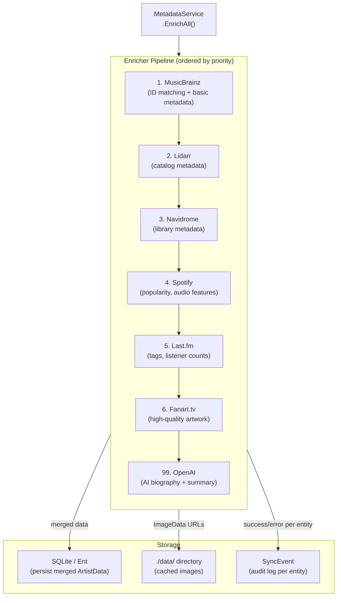

# Metadata Enrichment Pipeline

**Status:** draft
**Version:** 0.1.0
**Last Updated:** 2026-02-21
**Governing ADRs:** ADR-0009 (ordered sequential enricher pipeline)

## Overview

The metadata enrichment pipeline fetches and merges artist, album, and track metadata from multiple external sources into Spotter's local database. Enrichers are registered in a configurable ordered sequence, with earlier enrichers establishing identifiers (MusicBrainz IDs, Spotify IDs) that downstream enrichers use for precise lookups. An AI enricher runs last to generate summaries using fully-enriched data. The pipeline also manages image download and caching.

## Scope

This spec covers:
- The `Enricher`, `ArtistEnricher`, `AlbumEnricher`, `TrackEnricher`, and `IDMatcher` interfaces
- The enricher registry and ordered execution model
- Per-enricher data structures (`ArtistData`, `AlbumData`, `TrackData`, `ImageData`)
- Image selection and local caching strategy
- The `MetadataService` orchestration loop (background scheduler + on-demand)
- Sync event audit logging
- The `TrackMatcher` fuzzy matching utility (as used by metadata service)

Out of scope: Vibes AI generation (see Vibes spec), playlist sync track matching (see Playlist Sync spec), provider history fetching (see Listen & Playlist Sync spec).

---

## Requirements

### Enricher Interfaces

**REQ-ENRICH-001** — All enrichers MUST implement the base `Enricher` interface providing:
- `Type() Type` — returns the enricher identifier (e.g., `"musicbrainz"`, `"openai"`)
- `Priority() Priority` — returns an integer priority (lower = runs first)

**REQ-ENRICH-002** — Enrichers that fetch artist metadata MUST implement `ArtistEnricher`:
- `EnrichArtist(ctx, *ent.Artist) (*ArtistData, error)`
- Returns `nil, nil` if the enricher has no data for this artist (not an error condition)

**REQ-ENRICH-003** — Enrichers that fetch album metadata MUST implement `AlbumEnricher`:
- `EnrichAlbum(ctx, *ent.Album) (*AlbumData, error)`
- Returns `nil, nil` if no data is available

**REQ-ENRICH-004** — Enrichers that fetch track metadata MUST implement `TrackEnricher`:
- `EnrichTrack(ctx, *ent.Track) (*TrackData, error)`
- Returns `nil, nil` if no data is available

**REQ-ENRICH-005** — Enrichers that resolve external IDs before enrichment MUST implement `IDMatcher`:
- `MatchArtist(ctx, *ent.Artist) (*ArtistData, error)` — resolves only IDs, not full metadata
- `MatchAlbum(ctx, *ent.Album) (*AlbumData, error)`
- `MatchTrack(ctx, *ent.Track) (*TrackData, error)`
- ID matchers MUST run before regular enrichers in the pipeline

### Ordered Execution

**REQ-ENRICH-010** — The enricher pipeline MUST execute enrichers in ascending priority order (lowest priority number first). The execution order MUST be deterministic across runs.

**REQ-ENRICH-011** — The pipeline MUST ensure MusicBrainz runs first among enrichers (lowest priority), as downstream enrichers (Spotify, Last.fm, Fanart) use MusicBrainz IDs for precise lookups.

**REQ-ENRICH-012** — The OpenAI enricher MUST run last (highest priority number), as it generates AI summaries using data populated by all preceding enrichers.

**REQ-ENRICH-013** — If an enricher returns an error, the pipeline MUST log the error and continue with the remaining enrichers. A single enricher failure MUST NOT abort enrichment for the entire entity.

### Data Merging

**REQ-ENRICH-020** — The pipeline MUST merge results from all enrichers into a single entity update. Later enrichers in the sequence MUST NOT overwrite non-empty fields set by earlier enrichers, unless the later enricher's data is explicitly preferred (e.g., AI summaries always overwrite previous summaries).

**REQ-ENRICH-021** — `ArtistData`, `AlbumData`, and `TrackData` structs MUST contain both metadata fields (IDs, bio, genres, tags) and `[]ImageData` for image sourcing.

**REQ-ENRICH-022** — The pipeline MUST select the "best" image from all `ImageData` results using the following preference order:
1. `ImageData.IsPrimary == true`
2. Highest `ImageData.Likes` count
3. Largest dimensions (`Width × Height`)

### Image Management

**REQ-ENRICH-030** — When an enricher returns `ImageData` with a URL, the pipeline MUST download the image to the local `data/` directory and store its local path in the database. Remote URLs MUST NOT be stored as the primary image reference.

**REQ-ENRICH-031** — Downloaded images MUST be resized to a standard maximum dimension (configurable) using pure-Go image processing (`nfnt/resize`) to conserve storage.

**REQ-ENRICH-032** — The pipeline MUST support WebP, PNG, JPEG, and GIF formats via `golang.org/x/image/webp` and stdlib image packages.

**REQ-ENRICH-033** — If an image for an entity already exists locally, re-downloading SHOULD be skipped unless forced by an explicit refresh request.

### MetadataService Orchestration

**REQ-ENRICH-040** — The `MetadataService` MUST expose a method to enrich all un-enriched or stale artists, albums, and tracks for all users.

**REQ-ENRICH-041** — The background scheduler MUST invoke `MetadataService.EnrichAll()` on a configurable interval (`metadata.interval`, default `1h`). If a previous enrichment run is still in progress, the new tick MUST be skipped.

**REQ-ENRICH-042** — The `MetadataService` MUST also be invocable on-demand from HTTP handlers (e.g., "Enrich Now" button in preferences) without waiting for the next tick.

**REQ-ENRICH-043** — For each enriched entity, the service MUST create a `SyncEvent` record with: enricher type, entity type, entity ID, status (success/error), and a human-readable message.

### Enricher Registry

**REQ-ENRICH-050** — The enricher registry MUST allow enrichers to be registered with `Register(enricher Enricher)`. Duplicate type registrations MUST return an error.

**REQ-ENRICH-051** — The registry MUST support querying enrichers by capability: `ArtistEnrichers()`, `AlbumEnrichers()`, `TrackEnrichers()`, `IDMatchers()` — each returning enrichers sorted by priority.

---

## Enricher Inventory

| Enricher | Type | Implements | Priority | Requires |
|----------|------|-----------|----------|----------|
| MusicBrainz | `musicbrainz` | IDMatcher, ArtistEnricher, AlbumEnricher, TrackEnricher | 1 (lowest) | Artist name |
| Lidarr | `lidarr` | ArtistEnricher, AlbumEnricher | 2 | Lidarr API key |
| Navidrome | `navidrome` | ArtistEnricher, AlbumEnricher, TrackEnricher | 3 | NavidromeAuth |
| Spotify | `spotify` | ArtistEnricher, AlbumEnricher, TrackEnricher | 4 | SpotifyAuth, Spotify ID |
| Last.fm | `lastfm` | ArtistEnricher, AlbumEnricher | 5 | Last.fm API key |
| Fanart.tv | `fanart` | ArtistEnricher, AlbumEnricher | 6 | Fanart API key, MusicBrainz ID |
| OpenAI | `openai` | ArtistEnricher, AlbumEnricher | 99 (highest) | OpenAI API key, prior enriched data |

---

## Data Structures

```
ArtistData
├── MusicBrainzID: string
├── SpotifyID: string
├── LidarrID: string
├── NavidromeID: string
├── LastFMURL: string
├── SortName: string
├── Bio: string
├── Tags: []string
├── Genres: []string
├── Popularity: *int
├── FollowerCount: *int
├── AISummary: string
├── AIBiography: string
├── AITags: []string
└── Images: []ImageData

ImageData
├── URL: string
├── Width: int
├── Height: int
├── IsPrimary: bool
├── Likes: int
└── Source: string (enricher type)
```

---

## Pipeline Diagram



---

## Scenarios

### Scenario 1: Full artist enrichment pipeline

```
Given an artist "Miles Davis" with no enriched data
When MetadataService.EnrichAll() runs
Then MusicBrainz resolves the MusicBrainz ID
And Lidarr fetches catalog metadata using the name
And Navidrome provides the internal library ID
And Spotify fetches popularity and audio features using the Spotify ID
And Last.fm fetches tags and listener count
And Fanart.tv fetches high-resolution artwork using the MusicBrainz ID
And OpenAI generates an AI biography using all accumulated metadata
And all data is merged and saved to the artist entity
And a success SyncEvent is created for each enricher that returned data
```

### Scenario 2: Enricher failure does not halt pipeline

```
Given the Fanart.tv API is unavailable
When the pipeline processes an artist
Then Fanart.tv enricher returns an error
And the error is logged with artist ID and enricher type
And the pipeline continues with OpenAI enrichment
And a SyncEvent with status=error is created for Fanart.tv
And the artist is still saved with data from all other enrichers
```

### Scenario 3: Image selection from multiple sources

```
Given Spotify returns an image with isPrimary=false, likes=0
And Fanart.tv returns an image with isPrimary=true, likes=500
When the pipeline selects the best image
Then Fanart.tv's image is chosen (isPrimary=true wins)
And the image is downloaded and cached to ./data/artists/{id}.jpg
And the local path is stored in the database
```

---

## Configuration Reference

| Config Key | Default | Description |
|---|---|---|
| `metadata.enabled` | `true` | Enable/disable background enrichment |
| `metadata.interval` | `"1h"` | Background enrichment ticker interval |
| `metadata.enricher_order` | (all) | Ordered list of enricher types to enable |
| `metadata.fanart_api_key` | — | Fanart.tv API key |

---

## Implementation Notes

- Enricher implementations: `internal/enrichers/{musicbrainz,lidarr,navidrome,spotify,lastfm,fanart,openai}/`
- Interface definitions and data structs: `internal/enrichers/enrichers.go`
- Image download/resize: `internal/enrichers/images.go`
- MetadataService: `internal/services/metadata.go`
- TrackMatcher (shared with playlist sync): `internal/services/track_matcher.go`
- Governing comment for implementations: `// Governing: ADR-0009 (ordered enricher pipeline), SPEC metadata-enrichment-pipeline`
