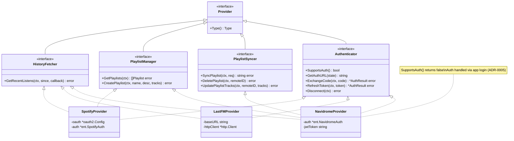
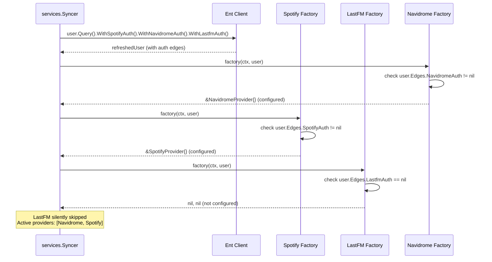

# Design: Pluggable Music Provider Integration Layer

## Context

Spotter integrates with three external music services — Spotify, Last.fm, and Navidrome — each
with different APIs, authentication models, and data formats. Without a common abstraction layer,
every service that consumes provider data (sync, enrichment, playlist write-back) would need
provider-specific code paths, creating tight coupling and making it difficult to add new providers.

The provider integration layer defines a family of interfaces (`Provider`, `HistoryFetcher`,
`PlaylistManager`, `PlaylistSyncer`, `Authenticator`) that abstract away service-specific details.
Provider instances are created per-user via factory functions, enabling nil-safe handling of
unconfigured providers and transparent credential management.

Governing ADRs:
[ADR-0005](../../adrs/ADR-0005-navidrome-primary-identity-provider.md) (Navidrome as primary identity provider),
[ADR-0016](../../adrs/ADR-0016-pluggable-provider-factory-pattern.md) (pluggable provider factory pattern).

## Goals / Non-Goals

### Goals

- Common interfaces for all provider interactions: history fetching, playlist reading,
  playlist write-back, and authentication
- Factory pattern for per-user provider instantiation with nil-safe unconfigured handling
- Normalized data types (`Track`, `Playlist`) shared across all providers
- ISRC field on `Track` for deterministic cross-provider track matching
- Three concrete implementations: Spotify (OAuth2), Last.fm (API key auth), Navidrome (Subsonic API)
- Separation of auth initiation (`AuthenticatorFactory`) from per-user usage (`Factory`)
- Navidrome explicitly excluded from the `Authenticator` flow (it is the primary app login)

### Non-Goals

- Sync orchestration (delegated to the Listen & Playlist Sync spec)
- Metadata enrichment from providers (delegated to the Metadata Enrichment Pipeline spec)
- Provider-specific API pagination strategies (internal to each implementation)
- Multi-provider token management or unified token store
- Adding new providers (Tidal, Apple Music, etc.) — architecture supports it but no implementations

## Decisions

### Interface-Per-Capability over Monolithic Provider Interface

**Choice**: Five interfaces (`Provider`, `HistoryFetcher`, `PlaylistManager`, `PlaylistSyncer`,
`Authenticator`) composed via Go interface embedding, rather than one large interface.

**Rationale**: Not all providers support all capabilities. Spotify supports history + playlists
+ auth but not playlist write-back. Last.fm supports history + auth but not playlists.
Navidrome supports history + playlists + write-back but not auth (it is the primary login).
Go type assertions (`provider.(HistoryFetcher)`) allow callers to check capabilities at
runtime without requiring providers to implement no-op methods.

**Alternatives considered**:
- Single `Provider` interface with all methods: forces Last.fm to implement no-op `GetPlaylists()`,
  Spotify to implement no-op `SyncPlaylist()`, etc.
- Separate unrelated interfaces: loses the ability to iterate a `[]Provider` and type-assert

### Factory Returns nil,nil for Unconfigured Providers

**Choice**: `Factory` functions return `(nil, nil)` when a user has not configured credentials
for a provider, rather than returning an error or a disabled provider instance.

**Rationale**: Missing provider configuration is the expected default state, not an error.
The Syncer and MetadataService iterate all registered factories per user; nil returns are
silently skipped without error logging. An explicit "disabled" provider instance would
require additional checks at every call site.

**Alternatives considered**:
- Return an error for unconfigured providers: clutters logs with expected conditions
- Return a no-op provider: callers would still need to check if work was done
- Check configuration before calling factory: moves auth-edge knowledge into callers

### Navidrome Implements Authenticator with SupportsAuth()=false

**Choice**: The Navidrome provider implements the `Authenticator` interface but returns
`false` from `SupportsAuth()`. Auth methods return errors indicating Navidrome auth is
handled via app login.

**Rationale**: The preferences UI queries all providers uniformly for connection status.
Having Navidrome implement the interface (with `SupportsAuth() = false`) allows the UI to
iterate providers without special-casing. The alternative — omitting the interface — would
require the UI to know which providers support auth and which do not.

**Alternatives considered**:
- Not implementing Authenticator: requires provider-specific UI logic
- Separate "connectable provider" interface: adds complexity for a three-provider system

### Batched Callback for History Fetching

**Choice**: `GetRecentListens` uses a callback pattern `func([]Track) error` called per
page, rather than returning the full history at once.

**Rationale**: Some providers (Spotify) return history in pages. Loading the full history
into memory before processing would spike memory usage for users with large histories.
The callback pattern allows the Syncer to process and persist each batch incrementally.

**Alternatives considered**:
- Return `[]Track` directly: simple API but memory-intensive for large histories
- Channel-based streaming: more complex, harder to propagate errors
- Iterator pattern: idiomatic in some languages but awkward in Go without generics

## Architecture

### Interface Hierarchy and Implementations



### Provider Instantiation Flow



## Key Implementation Details

**Interface definitions**: `internal/providers/providers.go` (~139 lines)
- Type constants: `TypeSpotify`, `TypeNavidrome`, `TypeLastFM`
- `Track` struct: ID, Name, Artist, Album, DurationMs, PlayedAt, URL, ISRC
- `Playlist` struct: ID, Name, Description, ImageURL, ExternalURL, TrackCount,
  UniqueArtists, UniqueAlbums, Tracks
- `Factory` type: `func(ctx context.Context, user *ent.User) (Provider, error)`
- `AuthenticatorFactory` type: `func() Authenticator` (no user context needed)
- `AuthResult` struct: AccessToken, RefreshToken, Expiry, DisplayName, UserID
- `SyncPlaylistRequest` struct: Name, Description, ImageURL, Tracks

**Spotify**: `internal/providers/spotify/spotify.go`
- Implements `HistoryFetcher`, `PlaylistManager`, `Authenticator`
- Uses `golang.org/x/oauth2` with `spotifyOAuth.Endpoint`
- Scopes: `user-read-recently-played`, `user-read-private`, `playlist-read-private`,
  `playlist-modify-public`, `playlist-modify-private`
- Factory checks `user.Edges.SpotifyAuth != nil`
- Token refresh handled transparently via `oauth2.Config.TokenSource`

**Last.fm**: `internal/providers/lastfm/lastfm.go`
- Implements `HistoryFetcher`, `Authenticator`
- API key authentication with `md5`-based request signing
- `user.getRecentTracks` endpoint with `from` parameter for incremental history
- Factory checks `user.Edges.LastfmAuth != nil`

**Navidrome**: `internal/providers/navidrome/navidrome.go`
- Implements `HistoryFetcher`, `PlaylistManager`, `PlaylistSyncer`, `Authenticator`
- Subsonic API protocol with per-request random salt generation
- `SupportsAuth()` returns `false` — auth handled by app login per ADR-0005
- Factory checks `user.Edges.NavidromeAuth != nil`

**Registration**: `cmd/server/main.go:140-143`
```
syncer.Register(navidrome.New(logger, cfg))
syncer.Register(spotify.New(logger, cfg))
syncer.Register(lastfm.New(logger, cfg))
```

## Risks / Trade-offs

- **Three providers hardcoded** — While the architecture supports new providers, the
  current implementation only supports three. Adding a provider (e.g., Tidal) requires
  implementing the interfaces, writing a factory, and adding a registration call. The
  interfaces are stable enough that this is straightforward.
- **No provider health checks** — Factories check credential existence but not credential
  validity. A revoked OAuth token is only detected when an API call fails. Mitigation:
  the Syncer's backoff and error classification handles this at the sync layer.
- **Spotify token refresh in factory** — The Spotify factory transparently refreshes expired
  tokens. If the refresh fails (e.g., revoked token), the factory returns an error, and
  the provider is skipped for the current cycle. The user must re-authenticate via preferences.
- **Navidrome Authenticator is a lie** — Navidrome implements `Authenticator` but does not
  actually support the auth flow. This is a pragmatic choice for UI uniformity but could
  confuse developers reading the code. The `SupportsAuth() = false` guard and code comments
  mitigate this.
- **ISRC availability varies** — The `Track.ISRC` field enables cross-provider matching,
  but not all providers populate it consistently. Spotify provides ISRC for most tracks;
  Last.fm and Navidrome often do not. Downstream matching falls back to fuzzy name matching.

## Migration Plan

The provider integration layer was designed as the foundational abstraction before any
provider-specific code was written. Implementation order:

1. **Interface definitions**: `providers.go` with `Provider`, `HistoryFetcher`, `PlaylistManager`,
   `PlaylistSyncer`, `Authenticator`, `Factory`, and data types
2. **Navidrome provider**: first implementation, using Subsonic API
3. **Spotify provider**: OAuth2 flow with `golang.org/x/oauth2`
4. **Last.fm provider**: API key auth with MD5 request signing
5. **PlaylistSyncer addition**: added when Navidrome playlist write-back was implemented
6. **ISRC field**: added to `Track` struct for cross-provider matching support

## Open Questions

- Should there be a `ProviderStatus()` method for health checking (testing credentials
  against the provider API before attempting a full sync)?
- Should provider factories accept a `*slog.Logger` parameter for per-provider log
  namespacing, or continue using the shared service logger?
- Should the `Authenticator` interface be split from `Provider` entirely, since Navidrome's
  implementation is largely a no-op?
- Should there be a `TrackEnricher` capability on providers (distinct from the enricher
  subsystem) for inline track metadata enrichment during sync?
