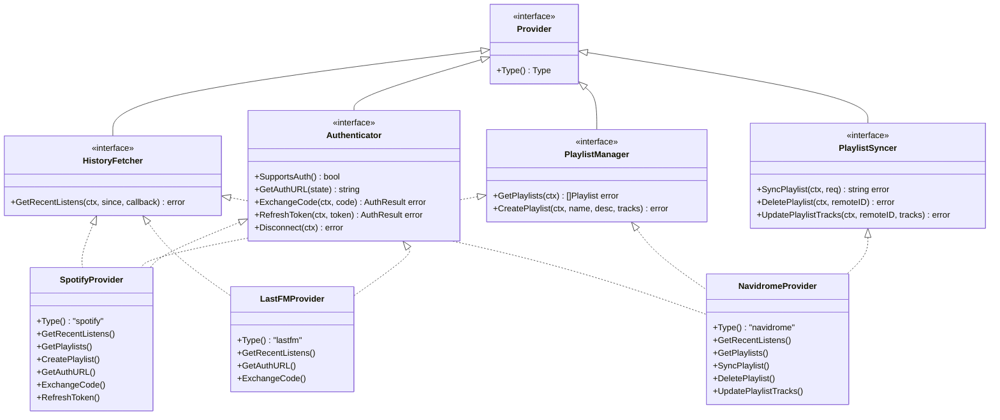

# Pluggable Music Provider Integration Layer

**Status:** accepted
**Version:** 0.1.0
**Last Updated:** 2026-02-21
**Governing ADRs:** ADR-0005 (Navidrome auth)

## Overview

The provider integration layer defines a family of interfaces for interacting with external music services (Spotify, Last.fm, Navidrome). It abstracts away service-specific API details behind pluggable, per-user provider instances created by factory functions. This architecture allows new providers to be added without modifying sync or enrichment orchestration logic.

## Scope

This spec covers:
- The `Provider`, `HistoryFetcher`, `PlaylistManager`, `PlaylistSyncer`, and `Authenticator` interfaces
- The `Factory` and `AuthenticatorFactory` function types
- Per-user provider instantiation and nil-safe handling
- Provider-specific implementations: Spotify, Last.fm, Navidrome
- OAuth flow patterns for Spotify and Last.fm
- Subsonic API usage for Navidrome

Out of scope: Sync orchestration (see Listen & Playlist Sync spec), Navidrome write-back (see Playlist Sync to Navidrome spec), metadata enrichment (see Metadata Enrichment Pipeline spec).

---

## Requirements

### Interface Contracts

**REQ-PROV-001** — Every provider implementation MUST implement the `Provider` base interface, which MUST provide a `Type() Type` method returning a stable string identifier (`"spotify"`, `"navidrome"`, `"lastfm"`).

**REQ-PROV-002** — Providers capable of retrieving listening history MUST implement `HistoryFetcher`:
- `GetRecentListens(ctx, since time.Time, callback func([]Track) error) error`
- The callback MUST be called in batches to avoid loading the full history into memory at once
- The `since` parameter MUST be used to fetch only incremental history since the last sync

**REQ-PROV-003** — Providers capable of reading playlists MUST implement `PlaylistManager`:
- `GetPlaylists(ctx) ([]Playlist, error)` — returns all user playlists
- `CreatePlaylist(ctx, name, description, tracks) error` — creates a new playlist

**REQ-PROV-004** — Providers capable of receiving playlist write-back MUST implement `PlaylistSyncer`:
- `SyncPlaylist(ctx, SyncPlaylistRequest) (remotePlaylistID string, error)` — creates or updates
- `DeletePlaylist(ctx, remotePlaylistID) error` — removes a playlist
- `UpdatePlaylistTracks(ctx, remotePlaylistID, tracks) error` — replaces all tracks

**REQ-PROV-005** — Providers supporting user authentication flows MUST implement `Authenticator`:
- `SupportsAuth() bool` — Navidrome MUST return `false` (used for app auth, not as a connected service)
- `GetAuthURL(state string) string` — returns OAuth authorization URL
- `ExchangeCode(ctx, code) (*AuthResult, error)` — exchanges authorization code for tokens
- `RefreshToken(ctx, refreshToken) (*AuthResult, error)` — refreshes expired access tokens
- `Disconnect(ctx) error` — performs cleanup on provider disconnection

### Factory Pattern

**REQ-PROV-010** — Each provider MUST be registered as a `Factory` function with the signature:
```go
type Factory func(ctx context.Context, user *ent.User) (Provider, error)
```

**REQ-PROV-011** — A `Factory` MUST return `nil, nil` (not an error) if the user has not configured credentials for that provider. This allows callers to safely check for nil without treating missing configuration as an error.

**REQ-PROV-012** — A `Factory` MUST read user credentials from the database (e.g., `user.QuerySpotifyAuth()`) and MUST NOT accept credentials as function parameters.

**REQ-PROV-013** — OAuth token refresh MUST be handled transparently within the factory or provider — callers MUST receive a ready-to-use provider with valid tokens.

### Normalized Data Types

**REQ-PROV-020** — All providers MUST normalize their data to the shared `Track` struct:
```go
type Track struct {
    ID         string    // Provider-specific ID
    Name       string
    Artist     string
    Album      string
    DurationMs int
    PlayedAt   time.Time // UTC
    URL        string    // Deep link
    ISRC       string    // For cross-provider matching
}
```

**REQ-PROV-021** — All providers MUST normalize playlist data to the shared `Playlist` struct. Providers that do not support cover art MUST leave `ImageURL` empty.

**REQ-PROV-022** — The `ISRC` field on `Track` MUST be populated whenever the underlying API provides it, as it enables deterministic cross-provider track matching.

### Spotify Provider

**REQ-PROV-030** — The Spotify provider MUST implement `HistoryFetcher`, `PlaylistManager`, and `Authenticator`.

**REQ-PROV-031** — The Spotify provider MUST use the OAuth2 authorization-code flow via `golang.org/x/oauth2`, with the client secret held server-side. PKCE is NOT required: Spotter is a self-hosted confidential client that can keep a client secret, and the state-cookie CSRF protection (SPEC user-authentication) covers the authorization redirect. The redirect URI MUST be configurable via `spotify.redirect_uri`.

**REQ-PROV-032** — The Spotify provider MUST automatically refresh expired access tokens using the stored refresh token before making API calls.

**REQ-PROV-033** — The Spotify provider's `GetRecentListens` MUST use the Spotify "Recently Played" API, paginating until the `since` timestamp is reached.

### Last.fm Provider

**REQ-PROV-040** — The Last.fm provider MUST implement `HistoryFetcher` and `Authenticator`.

**REQ-PROV-041** — The Last.fm provider MUST use the Last.fm API key authentication (not OAuth2). The session key obtained during `ExchangeCode` MUST be stored encrypted as `LastFMAuth.SessionKey`.

**REQ-PROV-042** — The Last.fm provider's `GetRecentListens` MUST use the `user.getRecentTracks` API endpoint with the `from` parameter set to `since.Unix()`.

### Navidrome Provider

**REQ-PROV-050** — The Navidrome provider MUST implement `HistoryFetcher`, `PlaylistManager`, and `PlaylistSyncer`.

**REQ-PROV-051** — The Navidrome provider MUST communicate using the Subsonic API protocol. The Subsonic `salt` MUST be randomly generated per request (not static).

**REQ-PROV-052** — The Navidrome provider MUST NOT implement `Authenticator` — Navidrome credentials are managed by the primary login flow (see ADR-0005), not as a connected service.

---

## Interface Diagram



---

## Scenarios

### Scenario 1: Factory returns nil for unconfigured provider

```gherkin
Given a user has not connected Spotify
When the Spotify factory is called for this user
Then it queries user.QuerySpotifyAuth() and finds no record
And returns nil, nil
And the sync service skips Spotify for this user without logging an error
```

### Scenario 2: Spotify token refresh

```gherkin
Given a user's Spotify access token has expired
When the Spotify factory is called
Then it reads the stored encrypted refresh token from SpotifyAuth
And calls the Spotify token endpoint to get a new access token
And updates SpotifyAuth with the new access and refresh tokens
And returns a ready-to-use provider with the refreshed token
```

### Scenario 3: Last.fm history fetch with pagination

```gherkin
Given a user's last sync was 7 days ago
When GetRecentListens is called with since=7_days_ago
Then the provider calls user.getRecentTracks with from=since.Unix()
And paginates through all pages of results
And calls the callback once per page with the batch of tracks
And stops when the oldest track in a page is before the since timestamp
```

---

## Implementation Notes

- Provider packages: `internal/providers/spotify/`, `internal/providers/lastfm/`, `internal/providers/navidrome/`
- Interface definitions: `internal/providers/providers.go`
- Factory registration: `cmd/server/main.go` wires factory functions into `services.Syncer`
- Encrypted credential storage uses Ent hooks (see ADR-0006)
- The `ISRC` field is key for the playlist sync track matching algorithm (see Playlist Sync spec)
