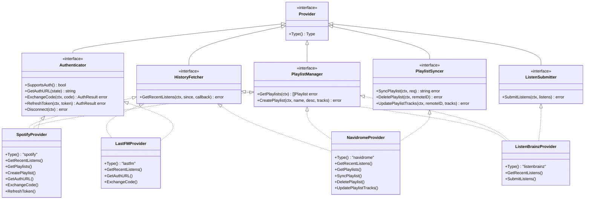

# Pluggable Music Provider Integration Layer

**Status:** accepted
**Version:** 0.1.0
**Last Updated:** 2026-02-21
**Governing ADRs:** ADR-0005 (Navidrome auth)

## Overview

The provider integration layer defines a family of interfaces for interacting with external music services (Spotify, Last.fm, Navidrome). It abstracts away service-specific API details behind pluggable, per-user provider instances created by factory functions. This architecture allows new providers to be added without modifying sync or enrichment orchestration logic.

## Scope

This spec covers:
- The `Provider`, `HistoryFetcher`, `PlaylistManager`, `PlaylistSyncer`, and `Authenticator` interfaces
- The `Factory` and `AuthenticatorFactory` function types
- Per-user provider instantiation and nil-safe handling
- Provider-specific implementations: Spotify, Last.fm, Navidrome
- OAuth flow patterns for Spotify and Last.fm
- Subsonic API usage for Navidrome

Out of scope: Sync orchestration (see Listen & Playlist Sync spec), Navidrome write-back (see Playlist Sync to Navidrome spec), metadata enrichment (see Metadata Enrichment Pipeline spec).

---

## Requirements

### Interface Contracts

**REQ-PROV-001** — Every provider implementation MUST implement the `Provider` base interface, which MUST provide a `Type() Type` method returning a stable string identifier (`"spotify"`, `"navidrome"`, `"lastfm"`).

**REQ-PROV-002** — Providers capable of retrieving listening history MUST implement `HistoryFetcher`:
- `GetRecentListens(ctx, since time.Time, callback func([]Track) error) error`
- The callback MUST be called in batches to avoid loading the full history into memory at once
- The `since` parameter MUST be used to fetch only incremental history since the last sync

**REQ-PROV-003** — Providers capable of reading playlists MUST implement `PlaylistManager`:
- `GetPlaylists(ctx) ([]Playlist, error)` — returns all user playlists
- `CreatePlaylist(ctx, name, description, tracks) error` — creates a new playlist

**REQ-PROV-004** — Providers capable of receiving playlist write-back MUST implement `PlaylistSyncer`:
- `SyncPlaylist(ctx, SyncPlaylistRequest) (remotePlaylistID string, error)` — creates or updates
- `DeletePlaylist(ctx, remotePlaylistID) error` — removes a playlist
- `UpdatePlaylistTracks(ctx, remotePlaylistID, tracks) error` — replaces all tracks

**REQ-PROV-005** — Providers supporting user authentication flows MUST implement `Authenticator`:
- `SupportsAuth() bool` — Navidrome MUST return `false` (used for app auth, not as a connected service)
- `GetAuthURL(state string) string` — returns OAuth authorization URL
- `ExchangeCode(ctx, code) (*AuthResult, error)` — exchanges authorization code for tokens
- `RefreshToken(ctx, refreshToken) (*AuthResult, error)` — refreshes expired access tokens
- `Disconnect(ctx) error` — performs cleanup on provider disconnection

### Factory Pattern

**REQ-PROV-010** — Each provider MUST be registered as a `Factory` function with the signature:
```go
type Factory func(ctx context.Context, user *ent.User) (Provider, error)
```

**REQ-PROV-011** — A `Factory` MUST return `nil, nil` (not an error) if the user has not configured credentials for that provider. This allows callers to safely check for nil without treating missing configuration as an error.

**REQ-PROV-012** — A `Factory` MUST read user credentials from the database (e.g., `user.QuerySpotifyAuth()`) and MUST NOT accept credentials as function parameters.

**REQ-PROV-013** — OAuth token refresh MUST be handled transparently within the factory or provider — callers MUST receive a ready-to-use provider with valid tokens.

### Normalized Data Types

**REQ-PROV-020** — All providers MUST normalize their data to the shared `Track` struct:
```go
type Track struct {
    ID         string    // Provider-specific ID
    Name       string
    Artist     string
    Album      string
    DurationMs int
    PlayedAt   time.Time // UTC
    URL        string    // Deep link
    ISRC       string    // For cross-provider matching
}
```

**REQ-PROV-021** — All providers MUST normalize playlist data to the shared `Playlist` struct. Providers that do not support cover art MUST leave `ImageURL` empty.

**REQ-PROV-022** — The `ISRC` field on `Track` MUST be populated whenever the underlying API provides it, as it enables deterministic cross-provider track matching.

### Spotify Provider

**REQ-PROV-030** — The Spotify provider MUST implement `HistoryFetcher`, `PlaylistManager`, and `Authenticator`.

**REQ-PROV-031** — The Spotify provider MUST use the OAuth2 authorization-code flow via `golang.org/x/oauth2`, with the client secret held server-side. PKCE is NOT required: Spotter is a self-hosted confidential client that can keep a client secret, and the state-cookie CSRF protection (SPEC user-authentication) covers the authorization redirect. The redirect URI MUST be configurable via `spotify.redirect_uri`.

**REQ-PROV-032** — The Spotify provider MUST automatically refresh expired access tokens using the stored refresh token before making API calls.

**REQ-PROV-033** — The Spotify provider's `GetRecentListens` MUST use the Spotify "Recently Played" API, paginating until the `since` timestamp is reached.

### Last.fm Provider

**REQ-PROV-040** — The Last.fm provider MUST implement `HistoryFetcher` and `Authenticator`.

**REQ-PROV-041** — The Last.fm provider MUST use the Last.fm API key authentication (not OAuth2). The session key obtained during `ExchangeCode` MUST be stored encrypted as `LastFMAuth.SessionKey`.

**REQ-PROV-042** — The Last.fm provider's `GetRecentListens` MUST use the `user.getRecentTracks` API endpoint with the `from` parameter set to `since.Unix()`.

### ListenBrainz Provider

**REQ-PROV-045** — The ListenBrainz provider MUST be registered with the syncer via the provider factory pattern (ADR-0016), returning `nil, nil` when the user has no `ListenBrainzAuth` edge. It MAY register before implementing `HistoryFetcher`; capability interfaces are discovered at sync time via type assertion.

**REQ-PROV-046** — ListenBrainz authentication MUST use the user's static user token (no OAuth flow; users paste the token from listenbrainz.org/settings). On connect, the token MUST be validated via `GET /1/validate-token` with the `Authorization: Token <token>` header before it is persisted, and the persisted token MUST be encrypted at rest (ADR-0006) as `ListenBrainzAuth.Token`.

**REQ-PROV-047** — All ListenBrainz API requests MUST send a descriptive `User-Agent` header, and the provider MUST respect ListenBrainz rate limiting: a 429 response MUST NOT be retried before the interval advertised by the `Retry-After` (or `X-RateLimit-Reset-In`) header has elapsed.

**REQ-PROV-048** — The ListenBrainz provider MUST implement `HistoryFetcher`. `GetRecentListens` MUST use the `GET /1/user/{username}/listens` API endpoint with `count` set to at most 100, paginating backwards via `max_ts` until the `since` timestamp is reached or no more listens remain. Because `max_ts` is exclusive (the endpoint returns only listens with `listened_at` strictly less than it), the next page's `max_ts` MUST be set to the oldest `listened_at` of the previous page **plus one** — setting it to the oldest value itself would permanently drop listens that share the boundary timestamp but fell past the page cut. The resulting re-delivery of boundary-second listens is safe because listen persistence de-duplicates idempotently (SPEC listen-playlist-sync REQ-SYNC-021). Because the endpoint rejects requests combining `min_ts` and `max_ts`, the `since` bound MUST be enforced client-side: listens with `listened_at` strictly before `since` MUST NOT be delivered to the callback, while listens with `listened_at` equal to `since` MUST be delivered (the watermark second may hold ties that were never synced; idempotent persistence absorbs the duplicate). Pagination MUST terminate when a page is empty or shorter than the requested count, when a listen strictly before `since` appears, or when the new cursor fails to strictly decrease relative to the previous `max_ts` (e.g. 100 or more listens sharing one timestamp, or a misbehaving server re-serving a page) — the strict-decrease guard MUST end the fetch rather than loop.

**REQ-PROV-049** — The ListenBrainz provider MUST implement the read side of `PlaylistManager`; ListenBrainz playlist sync is **read-only INTO Spotter**:

- `GetPlaylists` MUST fetch playlist stubs from BOTH `GET /1/user/{username}/playlists` (playlists the user created) AND `GET /1/user/{username}/playlists/createdfor` (playlists generated FOR the user by ListenBrainz, e.g. Weekly Jams, Weekly Exploration, Daily Jams — these MUST be included; they are the most valuable playlists to import and are absent from the created-by listing). Both listing endpoints paginate via `count`/`offset` and MUST be paged until a short/empty page is returned or the advertised `playlist_count` is reached. A playlist appearing in both listings MUST be imported once (deduplicated by playlist MBID).
- The listing endpoints return JSPF stubs without tracks; full contents MUST be fetched per playlist via `GET /1/playlist/{playlist_mbid}`, where the playlist MBID is parsed from the JSPF playlist `identifier` (`https://listenbrainz.org/playlist/<mbid>`). The playlist MBID (not the full URL) is the remote ID used for upserts. Stubs without a parseable, well-formed playlist MBID MUST be skipped. If fetching one playlist's full contents fails, the provider SHOULD degrade gracefully by returning the stub without tracks (so the sync reconciler does not deactivate it) rather than failing the entire fetch.
- JSPF tracks identify recordings by MusicBrainz MBID carried in `identifier` URIs of the form `http(s)://musicbrainz.org/recording/<mbid>`. The `identifier` field MUST be accepted in both encodings: a single URI string (the JSPF spec form) and a list of URI strings (the form ListenBrainz emits for tracks). The recording MBID MUST be parsed out of the identifier URI, validated as a well-formed UUID, and carried as the provider track ID (`providers.Track.ID`, persisted as `PlaylistTrack.remote_id`). The track-matching pipeline has no MBID tier (ADR-0014: ISRC → normalized exact → fuzzy), so catalog linking of ListenBrainz playlist tracks relies on title/creator (name/artist) matching; the MBID remains available in `remote_id` for de-duplication and future MBID-assisted matching. Tracks without a recording identifier MUST still be delivered (title/creator only). Any other JSON shape for `identifier` is a malformed response (SPEC error-handling REQ-ERR-003).
- Playlist writes MUST NOT be implemented: the provider MUST NOT implement `PlaylistSyncer`, and because `PlaylistManager` bundles `CreatePlaylist` with `GetPlaylists`, `CreatePlaylist` MUST fail with the sentinel `ErrPlaylistWriteNotSupported` (it is never invoked by the sync system, which only reads via `GetPlaylists`).

**REQ-PROV-053** — The ListenBrainz provider MUST support LB Radio playlist generation (ADR-0030) via `RadioPlaylist(ctx, prompt, mode)`:

- `RadioPlaylist` MUST call `GET /1/explore/lb-radio` with the `prompt` and `mode` query parameters URL-encoded. `mode` MUST be one of `easy`, `medium`, or `hard`; an empty mode defaults to `easy` and any other value MUST be rejected before the request is made. An empty prompt MUST be rejected. The endpoint is anonymous, but the user's token MUST be sent when available (authenticated requests get a higher rate limit); all requests follow the shared request discipline (REQ-PROV-047: User-Agent, strict 429 Retry-After semantics).
- The response payload (`payload.jspf.playlist`) is JSPF and MUST be parsed with the same rules as REQ-PROV-049: recording MBIDs are extracted from `identifier` URIs (string or list form), validated as UUIDs, and carried as `providers.Track.ID` (persisted as `PlaylistTrack.remote_id`); tracks without a recording identifier MUST still be delivered. A response with zero usable tracks is NOT an error at the provider layer — the caller decides how to surface it. Unparseable payloads are malformed responses (SPEC error-handling REQ-ERR-003).
- Generated playlists MUST be persisted as regular playlists with `Source = "listenbrainz"`, `Name = "LB Radio: <prompt>"`, and the deterministic remote ID `lb-radio:<prompt>` (the shared prefix constant `providers.ListenBrainzRadioRemoteIDPrefix`), flowing through the same upsert + track-persist path as provider playlist sync (`Syncer.UpsertGeneratedPlaylist`). Regenerating with the same trimmed prompt — in any mode — MUST update the existing playlist row in place (tracks replaced; playlist ID, sync-to-Navidrome toggle, and Navidrome pairing preserved) rather than create a duplicate. The prompt MUST be capped at 200 characters so the derived remote ID fits the 255-character column.
- The playlist sync reconciler MUST NOT deactivate locally generated radio playlists: `listenbrainz`-source rows whose `remote_id` starts with `lb-radio:` are exempt from missing-from-provider deactivation, because the provider never returns them.
- Non-goals (ADR-0030): no vibes/mixtape integration, no scheduled regeneration, no playback surface. Catalog linking and Navidrome matching MUST reuse the existing pipelines (no duplicated matcher code).

### Navidrome Provider

**REQ-PROV-050** — The Navidrome provider MUST implement `HistoryFetcher`, `PlaylistManager`, and `PlaylistSyncer`.

**REQ-PROV-051** — The Navidrome provider MUST communicate using the Subsonic API protocol. The Subsonic `salt` MUST be randomly generated per request (not static).

**REQ-PROV-052** — The Navidrome provider MUST NOT implement `Authenticator` — Navidrome credentials are managed by the primary login flow (see ADR-0005), not as a connected service.

### ListenBrainz Listen Submission

**REQ-PROV-054** — The ListenBrainz provider MUST implement `ListenSubmitter` and push listens to ListenBrainz via `POST /1/submit-listens` with `listen_type: "import"`, subject to ALL of the following rules:

- **Opt-in (default OFF)**: Listens MUST only be submitted for users whose `ListenBrainzAuth.submit_listens` flag is true. The flag MUST default to false — both for new connections (the connect-form checkbox starts unchecked) and for pre-existing connections upgraded by migration (the column carries a constant SQL `DEFAULT false`). The user MUST be able to change the flag from the preferences UI without reconnecting.
- **Batch limit**: A single `submit-listens` request MUST carry at most 1000 listens (the documented ListenBrainz `MAX_LISTENS_PER_REQUEST`). `SubmitListens` MUST split larger inputs into batches of at most this size. Retries of a failed request (429/5xx) MUST resend the complete request body, rebuilt per attempt, and MUST preserve the REQ-PROV-047 rate-limit semantics (never retry a 429 before the advertised interval).
- **Provenance (never echo)**: Only listens that originated from OTHER sources (e.g. navidrome, spotify, lastfm) are eligible. A listen whose `source` is `listenbrainz` MUST NEVER be submitted back to ListenBrainz — echoing would duplicate the user's own history upstream.
- **Idempotent resubmission safety**: The syncer MUST track submission state per listen via the nullable `Listen.submitted_to_listenbrainz_at` timestamp: only listens where it is NULL are submitted, and it is set only AFTER ListenBrainz accepts the containing batch. Repeat syncs therefore never resubmit accepted listens, and a listen resubmitted because the flag write failed (or a mixed-outcome run was retried) is safe because ListenBrainz de-duplicates identical listens (user + `listened_at` + track metadata) server-side.
- **Failure tolerance**: A submission failure MUST NOT fail the surrounding sync run — it is logged and recorded as a sync event, the affected listens keep a NULL submission timestamp, and the next sync run retries them.
- Listens that ListenBrainz cannot represent (missing track name, artist name, or played-at timestamp) MUST be skipped, not submitted.

---

## Interface Diagram



---

## Scenarios

### Scenario 1: Factory returns nil for unconfigured provider

```gherkin
Given a user has not connected Spotify
When the Spotify factory is called for this user
Then it queries user.QuerySpotifyAuth() and finds no record
And returns nil, nil
And the sync service skips Spotify for this user without logging an error
```

### Scenario 2: Spotify token refresh

```gherkin
Given a user's Spotify access token has expired
When the Spotify factory is called
Then it reads the stored encrypted refresh token from SpotifyAuth
And calls the Spotify token endpoint to get a new access token
And updates SpotifyAuth with the new access and refresh tokens
And returns a ready-to-use provider with the refreshed token
```

### Scenario 3: Last.fm history fetch with pagination

```gherkin
Given a user's last sync was 7 days ago
When GetRecentListens is called with since=7_days_ago
Then the provider calls user.getRecentTracks with from=since.Unix()
And paginates through all pages of results
And calls the callback once per page with the batch of tracks
And stops when the oldest track in a page is before the since timestamp
```

### Scenario 4: ListenBrainz playlist import (read-only)

```gherkin
Given a user has connected ListenBrainz
And ListenBrainz has generated a Weekly Jams playlist for them
When the sync service calls GetPlaylists on the ListenBrainz provider
Then the provider fetches stubs from /1/user/{username}/playlists and /1/user/{username}/playlists/createdfor
And fetches each playlist's full JSPF via /1/playlist/{playlist_mbid}
And extracts each track's recording MBID from its musicbrainz.org/recording identifier URI
And returns playlists whose tracks carry the recording MBID as the provider track ID
And no playlist is ever created or modified on ListenBrainz
```

### Scenario 5: LB Radio generation persisted as a regular playlist

```gherkin
Given a user has connected ListenBrainz
When they submit the prompt "artist:(nina simone)" in easy mode on /playlists/lb-radio
Then the provider calls GET /1/explore/lb-radio with the URL-encoded prompt and mode
And the JSPF tracks are normalized with recording MBIDs as provider track IDs
And a playlist named "LB Radio: artist:(nina simone)" with source "listenbrainz"
    and remote_id "lb-radio:artist:(nina simone)" is upserted
And submitting the same prompt again updates that playlist instead of creating a new one
And the ListenBrainz playlist sync reconciler never deactivates it
```

---

## Implementation Notes

- Provider packages: `internal/providers/spotify/`, `internal/providers/lastfm/`, `internal/providers/navidrome/`, `internal/providers/listenbrainz/`
- Interface definitions: `internal/providers/providers.go`
- Factory registration: `cmd/server/main.go` wires factory functions into `services.Syncer`
- Encrypted credential storage uses Ent hooks (see ADR-0006)
- The `ISRC` field is key for the playlist sync track matching algorithm (see Playlist Sync spec)
- LB Radio: `internal/providers/listenbrainz/radio.go`, `internal/handlers/listenbrainz_radio.go`, `internal/views/playlists/radio.templ` (ADR-0030)
