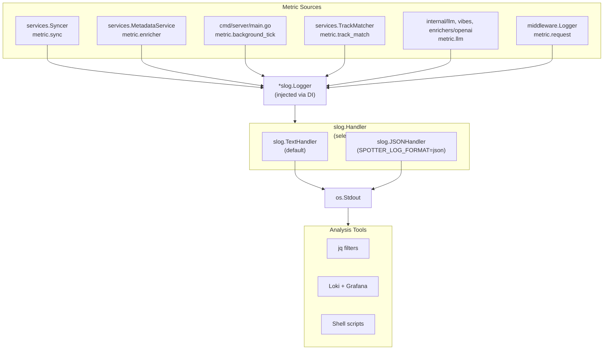
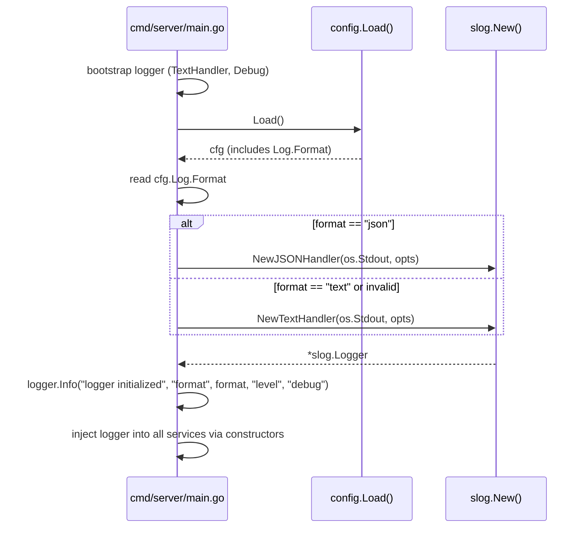

# Design: Structured Metrics via slog JSON Events

## Context

Spotter runs three background loops (sync, metadata enrichment, playlist sync), makes
external API calls to seven enricher sources and an LLM provider, matches tracks across
providers using a three-tier algorithm, and serves HTTP requests — all without any
operational metrics. Before this design, the only observability was unstructured error
logging. There was no way to answer questions like "how long does a sync take?", "what is
the track matching success rate?", or "how many LLM tokens are consumed per mixtape?".

Rather than adding external metrics infrastructure (Prometheus, StatsD, Datadog) — which
would be excessive for a personal, single-instance application — this design reuses the
existing `slog` logger to emit well-defined `metric.*` events with standardized attribute
keys. In JSON mode, these events are directly parseable by `jq`, Loki, or shell scripts.

Governing ADRs:
[ADR-0019](../../adrs/ADR-0019-structured-metrics-observability.md) (slog-based structured metrics),
[ADR-0010](../../adrs/ADR-0010-stdlib-slog-structured-logging.md) (stdlib slog structured logging),
[ADR-0013](../../adrs/ADR-0013-goroutine-ticker-background-scheduling.md) (goroutine ticker scheduling),
[ADR-0008](../../adrs/ADR-0008-openai-api-litellm-compatible-llm-backend.md) (OpenAI API).

## Goals / Non-Goals

### Goals

- Log format selection via `SPOTTER_LOG_FORMAT` (`text` default, `json` opt-in)
- Six standardized metric event categories: `metric.sync`, `metric.enricher`,
  `metric.background_tick`, `metric.track_match`, `metric.llm`, `metric.request`
- Consistent attribute schema: `duration_ms` (int64), `success` (bool), `error` (string)
- Zero additional dependencies — built entirely on `log/slog` from the standard library
- Machine-parseable JSON output for automated analysis with `jq` or log aggregation
- Human-readable text output unchanged from pre-observability behavior
- Metric events emitted at `Info` level regardless of success/failure

### Non-Goals

- Log aggregation infrastructure (Loki, Grafana, ELK stack)
- Alerting rules or notification pipelines
- Pre-computed aggregations (counters, histograms, percentiles)
- Log rotation, retention policies, or disk management
- Dashboard templates or visualization tooling
- Rate limiting on metric event emission

## Decisions

### slog-Based Events over Prometheus Client Library

**Choice**: Emit metric events as `slog.Info("metric.*", key, value, ...)` calls using
the existing `*slog.Logger` already injected into every service.

**Rationale**: Spotter is a personal application — running a Prometheus server and Grafana
dashboard alongside it would be infrastructure overkill. The slog approach requires zero
additional dependencies, integrates with the existing logger injection pattern, and produces
events that are both human-readable (text mode) and machine-parseable (JSON mode). Operators
who want aggregation can pipe JSON logs through `jq` or feed them into Loki.

**Alternatives considered**:
- Prometheus client library: requires running a Prometheus server, adds dependencies
- Datadog/StatsD: requires a collection agent, adds network dependencies
- No metrics: leaves operators blind to operational health and cost (LLM tokens)

### Configurable Log Format via Environment Variable

**Choice**: `SPOTTER_LOG_FORMAT` controls handler selection. `text` (default) uses
`slog.NewTextHandler`, `json` uses `slog.NewJSONHandler`. Invalid values default to `text`.

**Rationale**: Text output preserves backward compatibility and human readability.
JSON output enables machine parsing without changing any call sites — only the handler
is swapped at startup. Invalid values defaulting to text (not erroring) follows the
principle of least surprise for a personal application.

**Alternatives considered**:
- JSON-only output: loses human readability for casual log tailing
- Dual output (text + JSON): adds complexity for a narrow use case
- Config file only (no env var): less container-friendly

### Duration Attributes as Millisecond Integers

**Choice**: All duration attributes use the `_ms` suffix and are emitted as `int64`
millisecond values via `time.Since(start).Milliseconds()`.

**Rationale**: Integer milliseconds are trivially aggregated with `jq` arithmetic
(`select(.msg == "metric.sync") | .duration_ms`). Go's `time.Duration` string format
(`1.234567s`) requires parsing for aggregation. The `_ms` suffix convention makes the
unit unambiguous across all metric events.

**Alternatives considered**:
- `slog.Duration("latency", ...)`: human-readable but requires parsing for aggregation
- Floating-point seconds: ambiguous precision, harder to compare
- Both formats (keep `latency` + add `duration_ms`): done for `metric.request` to
  preserve backward compatibility with existing request logging

## Architecture

### Metric Event Flow

### Logger Initialization Sequence

### Metric Event Schema

```mermaid
erDiagram
    METRIC_SYNC {
        string provider "navidrome|spotify|lastfm"
        int listens_synced "count"
        int playlists_synced "count"
        int64 duration_ms "milliseconds"
        bool success "true|false"
        string error "empty on success"
    }
    METRIC_ENRICHER {
        string enricher "musicbrainz|lidarr|etc"
        string entity_type "artist|album|track"
        int entities_processed "count (optional)"
        int64 duration_ms "milliseconds"
        bool success "true|false"
        string error "empty on success"
    }
    METRIC_BACKGROUND_TICK {
        string loop "sync|metadata|playlist_sync"
        int users_processed "count"
        int64 duration_ms "milliseconds"
        int errors "count (optional)"
    }
    METRIC_TRACK_MATCH {
        string strategy "isrc|exact|fuzzy"
        bool matched "true|false"
        float confidence "0.0-1.0"
        int64 duration_ms "milliseconds"
        string source_provider "optional"
        string target_provider "optional"
    }
    METRIC_LLM {
        string model "gpt-4o etc"
        string operation "mixtape_generate|artist_bio|etc"
        int tokens_used "total"
        int prompt_tokens "optional"
        int completion_tokens "optional"
        int64 duration_ms "milliseconds"
        bool success "true|false"
        string error "empty on success"
    }
    METRIC_REQUEST {
        string method "GET|POST|etc"
        string path "request path"
        int status "HTTP status code"
        string remote_ip "client IP"
        duration latency "human-readable"
        int64 duration_ms "milliseconds"
        string request_id "middleware ID"
    }
```

## Key Implementation Details

**Logger initialization**: `cmd/server/main.go:46-69`
- Bootstrap logger with `TextHandler` before config is loaded
- After `config.Load()`, re-initialize with configured format
- Invalid `SPOTTER_LOG_FORMAT` values silently default to `text`
- `logger.Info("logger initialized", "format", format, "level", "debug")` emitted on startup

**Config**: `internal/config/config.go:96-99`
- `Log.Format` field mapped to `SPOTTER_LOG_FORMAT` via Viper
- Default: `v.SetDefault("log.format", "text")`

**Request middleware**: `internal/middleware/logging.go` (~33 lines)
- Uses `metric.request` message prefix
- Emits both `slog.Duration("latency", ...)` (human-readable) and
  `slog.Int64("duration_ms", ...)` (machine-parseable)
- Wraps `chi/middleware.WrapResponseWriter` to capture status code

**Sync metrics**: `internal/services/sync.go:96-105`
- `metric.sync` emitted after each provider sync with `provider`, `listens_synced`,
  `playlists_synced`, `duration_ms`, `success`, `error` attributes

**Background tick metrics**: `cmd/server/main.go:255-259, 311-315, 365-369`
- `metric.background_tick` emitted after each tick of all three loops
- Attributes: `loop`, `users_processed`, `duration_ms`, `errors`

**Enricher metrics**: `internal/services/metadata.go`
- `metric.enricher` emitted after each enricher completes processing an entity batch

**LLM metrics**: `internal/llm/client.go`, `internal/vibes/generator.go`,
`internal/enrichers/openai/openai.go`
- `metric.llm` emitted after each LLM API call with token counts from `ChatUsage`

**Track matching metrics**: `internal/services/` (track matching code)
- `metric.track_match` emitted per matching attempt with strategy, matched, confidence

## Risks / Trade-offs

- **No built-in aggregation** — Log-based metrics lack pre-computed counters, histograms,
  or percentiles. Operators must derive these by parsing logs. Acceptable for personal use;
  fleet deployment would need Prometheus.
- **High-frequency events possible** — Per-track matching events could produce thousands
  of log lines during a playlist sync. Mitigated by these events only occurring during
  batch sync/enrichment cycles, not continuously.
- **No alerting integration** — Anomaly detection requires external log-tailing tooling.
- **Dual duration format on metric.request** — Emits both `latency` (Duration) and
  `duration_ms` (int64) for backward compatibility. Other events use only `duration_ms`.
- **No metric versioning** — Attribute schema changes break existing `jq` filters silently.

## Migration Plan

Implementation was completed across these files:

1. **Config**: `Log.Format` field + Viper binding in `internal/config/config.go`
2. **Logger init**: Format-based handler selection in `cmd/server/main.go:46-69`
3. **Request middleware**: `metric.request` message + `duration_ms` in `internal/middleware/logging.go`
4. **Sync**: `metric.sync` events in `internal/services/sync.go`
5. **Background ticks**: `metric.background_tick` in `cmd/server/main.go` for all three loops
6. **Enricher**: `metric.enricher` events in `internal/services/metadata.go`
7. **LLM**: `metric.llm` events in vibes, enricher, and similar artists services
8. **Track matching**: `metric.track_match` events with strategy and confidence

Operators adopt JSON output by setting `SPOTTER_LOG_FORMAT=json` and piping to `jq` or Loki.

## Open Questions

- Should there be a `SPOTTER_LOG_LEVEL` environment variable to control log level
  independently of format? Currently hardcoded to `Debug`.
- Should high-frequency metric events (per-track matching) be gated by a config flag
  to reduce log volume in production?
- Should metric events include a `version` field for schema evolution?
- Should there be a `/metrics` HTTP endpoint that returns the most recent metric events
  in JSON format, as a lighter alternative to full log parsing?
- Should the `metric.request` middleware omit certain paths (e.g., `/static/`, `/events`)
  to reduce noise from SSE long-polls and static asset requests?
