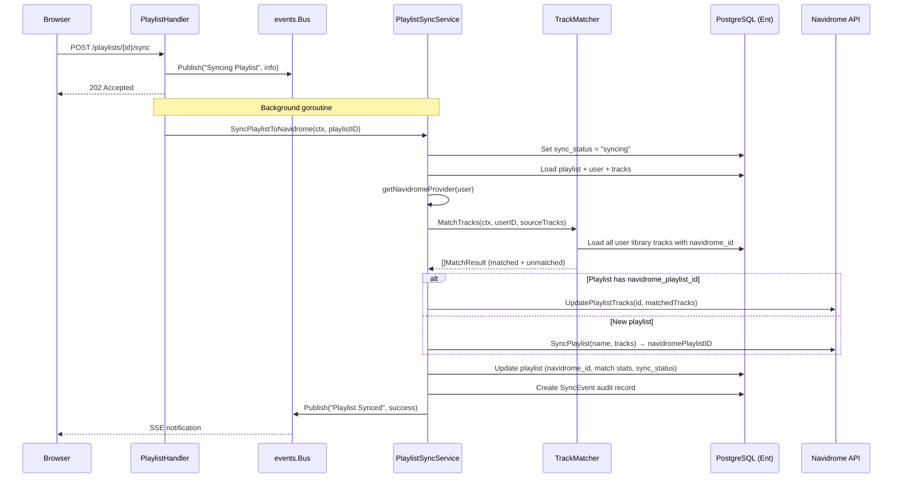
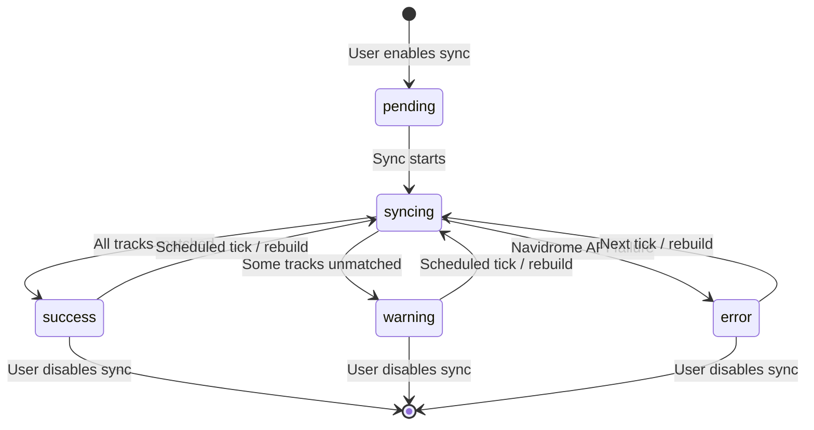
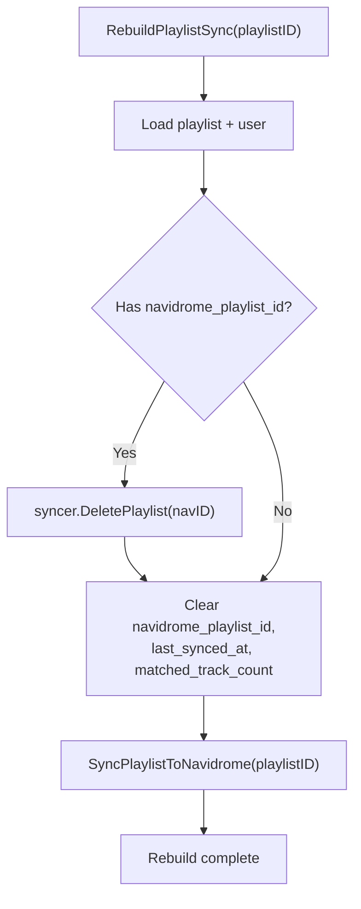

# Design: Playlist Sync Service with Fuzzy Track Matching and Navidrome Write-Back

## Context

Spotter ingests playlists from external providers (Spotify, Last.fm) and generates AI-powered
mixtapes, but these playlists only exist inside Spotter's database. Users want to listen to
them in Navidrome, their actual music player. The playlist sync service closes this loop by
writing playlists back to Navidrome, matching external track references to the user's local
library via a three-tier track matcher, and keeping the synced playlists up to date on a
configurable schedule.

Without this service, users would have to manually recreate playlists in Navidrome — defeating
the purpose of Spotter's AI curation and provider aggregation.

Governing ADRs: [ADR-0005](../../adrs/ADR-0005-navidrome-primary-identity-provider.md) (Navidrome auth),
[ADR-0007](../../adrs/ADR-0007-in-memory-event-bus.md) (event bus),
[ADR-0014](../../adrs/ADR-0014-three-tier-track-matching-algorithm.md) (track matching).

## Goals / Non-Goals

### Goals

- Write Spotter playlists (provider-sourced and AI-generated) to Navidrome via the Subsonic API
- Match external tracks to local library entries using ISRC, exact, and fuzzy strategies
- Track sync state per playlist with a five-state machine (pending/syncing/success/warning/error)
- Provide scheduled background sync (hourly default) and on-demand sync/rebuild triggers
- Record match statistics and audit every sync operation via SyncEvent entities
- Publish real-time UI notifications via the event bus during sync operations
- Support playlist pairing — link an existing Navidrome playlist to a Spotter playlist

### Non-Goals

- Syncing playlists FROM Navidrome back into Spotter (read direction handled by provider sync)
- Implementing the TrackMatcher algorithm itself (see track-matching spec)
- Managing Navidrome authentication (delegated to ADR-0005 and the provider factory)
- Handling provider-specific playlist fetching (covered by the listen & playlist sync spec)

## Decisions

### Provider Factory Pattern for Navidrome Access

**Choice**: Use registered `providers.Factory` functions to obtain a Navidrome `providers.Provider`
at runtime, then assert it implements `providers.PlaylistSyncer`.

**Rationale**: The sync service does not know Navidrome connection details. The factory pattern
(from ADR-0016) allows the service to obtain an authenticated provider instance for any user
without coupling to Navidrome-specific configuration. The `PlaylistSyncer` interface provides
`SyncPlaylist`, `UpdatePlaylistTracks`, and `DeletePlaylist` methods.

**Alternatives considered**:
- Direct Navidrome HTTP client: would duplicate auth logic and couple the service to Navidrome internals.
- Passing the provider at construction time: would not support multi-user scenarios where each user
  has different Navidrome credentials.

### Sync State Machine on the Playlist Entity

**Choice**: Store `sync_status` as an Ent enum field directly on the `Playlist` entity with five
states: `pending`, `syncing`, `success`, `warning`, `error`.

**Rationale**: The state is queried on every playlist list/detail page load. Storing it on the
entity avoids a join to a separate sync tracking table. The `syncing` state is set at the start
of each operation and always replaced on completion, preventing stale in-progress states.

**Alternatives considered**:
- Separate `PlaylistSync` entity: more normalized but adds a join to every playlist query.
- Boolean `is_synced` flag: insufficient to distinguish warning (partial match) from error states.

### Background Goroutines for On-Demand Sync

**Choice**: HTTP handlers return immediately (HTTP 202) and spawn background goroutines for
sync operations. Progress is communicated via the event bus.

**Rationale**: Playlist sync involves network calls to Navidrome (create/update/delete) and
potentially expensive track matching. Blocking the HTTP response would create poor UX and
risk timeouts. The event bus (ADR-0007) delivers real-time status updates to the browser via SSE.

**Alternatives considered**:
- Synchronous sync in the handler: blocks the browser, risk of HTTP timeout on large playlists.
- Job queue (Redis/NATS): unnecessary infrastructure for a single-instance app.

## Architecture

### Sync Flow



### State Machine



### Rebuild Flow



## Key Implementation Details

### Files

- **Service**: `internal/services/playlist_sync.go` — `PlaylistSyncService` struct with `SyncPlaylistToNavidrome`, `SyncAllEnabledPlaylists`, `RemovePlaylistFromNavidrome`, `RebuildPlaylistSync`, `PairWithNavidrome`
- **Track matcher**: `internal/services/track_matcher.go` — shared `TrackMatcher` (see track-matching spec)
- **Providers interface**: `internal/providers/` — `PlaylistSyncer` interface with `SyncPlaylist`, `UpdatePlaylistTracks`, `DeletePlaylist`
- **Scheduler**: `cmd/server/main.go` — hourly ticker spawning per-user goroutines

### Service Construction

```go
trackMatcher := NewTrackMatcher(client, logger, cfg.PlaylistSync.MinMatchConfidence)
svc := &PlaylistSyncService{client, config, logger, bus, trackMatcher, factories}
```

The `TrackMatcher` is created internally with the configured confidence threshold. Provider
factories are registered after construction via `svc.Register(factory)`.

### Navidrome Provider Resolution

The `getNavidromeProvider` method reloads the user with the `NavidromeAuth` edge (encrypted
credentials per ADR-0005/ADR-0006), iterates registered factories, and returns the first
provider whose `Type() == providers.TypeNavidrome`. The provider is then asserted to implement
`providers.PlaylistSyncer`.

### Playlist Pairing

`PairWithNavidrome` links a Spotter playlist to an existing Navidrome playlist by its remote ID.
It sets `navidrome_playlist_id`, finds and deletes any Navidrome-source duplicate playlist from
Spotter's DB, then triggers a sync to update the Navidrome playlist with the Spotter playlist's
tracks.

### Audit Logging

Every sync operation creates a `SyncEvent` entity with event type, provider, message, and
JSON metadata containing playlist ID, track counts, match rate, and duration. Events are
created for start, completion, failure, and removal operations.

### Error Handling

The `handleSyncError` helper:
1. Sets `sync_status = error` and stores the error message on the playlist
2. Creates a `SyncEvent` with `EventTypePlaylistSyncFailed`
3. Publishes an error notification via the event bus
4. Returns the original error to the caller

## Risks / Trade-offs

- **Factory iteration on every sync** — The service iterates all registered factories to find
  a Navidrome provider. With only 2-3 providers this is negligible, but a direct lookup map
  would be more efficient.
- **No retry on Navidrome API failure** — A single failed API call sets the playlist to error
  state. The next scheduled tick will re-attempt, but there is no immediate retry with backoff.
  Rate limiting and retry logic was added to enrichers (commit e46ea92) but not yet to sync.
- **Entire library loaded for matching** — The `TrackMatcher` loads all user tracks into memory.
  For personal libraries this is acceptable (<50K tracks), but very large libraries could cause
  memory pressure.
- **No concurrent sync for the same playlist** — If a scheduled sync and manual sync overlap,
  both will run. The `syncing` state is set non-fatally (a warning is logged on failure), so
  there is no mutex protection. In practice the race is harmless since the last write wins.
- **Navidrome playlist names** — If the user renames a playlist in Spotter, the Navidrome
  playlist keeps its original name until a rebuild. The `navidrome_playlist_name` field allows
  overriding the display name for pairing scenarios.

## Migration Plan

This feature was implemented as part of the playlist sync specification:

1. **Schema**: Added `sync_to_navidrome`, `navidrome_playlist_id`, `sync_status`, `sync_error`,
   `matched_track_count`, `last_synced_at`, `navidrome_playlist_name` fields to the `Playlist`
   Ent schema. `sync_status` is an enum with values `pending`, `syncing`, `success`, `warning`,
   `error`.
2. **Service**: Created `PlaylistSyncService` in `internal/services/playlist_sync.go` with
   provider factory registration pattern.
3. **Handlers**: Added toggle-sync, sync, rebuild-sync, sync-status, and sync-progress
   endpoints to the playlist handler.
4. **Scheduler**: Added hourly sync ticker in `cmd/server/main.go` that calls
   `SyncAllEnabledPlaylists` for each user.
5. **UI**: Added sync controls (toggle, sync now, rebuild) and status badges to the playlist
   detail page via HTMX partials.

## Open Questions

- Should the scheduler use smarter timing (e.g., only sync if playlist tracks have changed since
  last sync) rather than blindly re-syncing all enabled playlists?
- Should playlist pairing support bidirectional sync — pushing Spotter changes to Navidrome AND
  pulling Navidrome changes back?
- Should there be a maximum number of unmatched tracks before the service refuses to sync
  (to prevent creating a nearly-empty Navidrome playlist)?
- Should the service support syncing to multiple Navidrome instances (multi-server users)?
