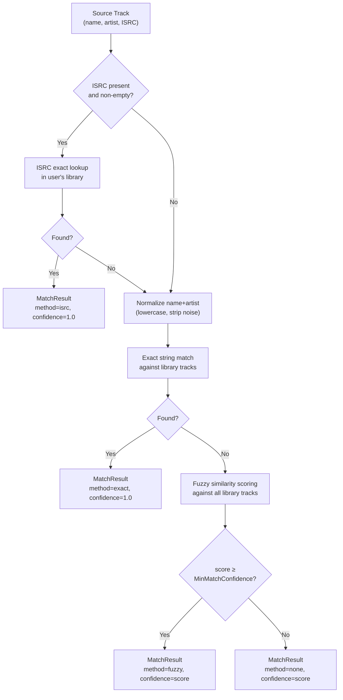
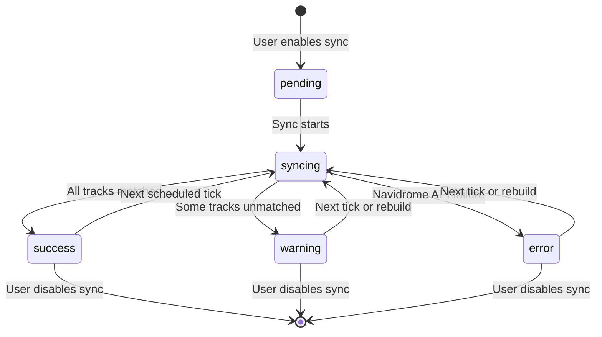

# Playlist Sync Service with Fuzzy Track Matching and Navidrome Write-Back

**Status:** accepted
**Version:** 0.1.0
**Last Updated:** 2026-02-21
**Governing ADRs:** ADR-0005 (Navidrome auth), ADR-0007 (event bus)

## Overview

The playlist sync service writes playlists from external providers (Spotify, Last.fm) and AI-generated Mixtapes to Navidrome, making them available in the user's music player. It matches external tracks to the user's local Navidrome library using a multi-strategy track matcher (ISRC → exact → fuzzy), enforces a configurable confidence threshold, tracks per-playlist sync state, and supports manual rebuild. This creates a complete read-write loop: Spotify playlists are read by the sync service, enhanced by AI, and written back to Navidrome.

## Scope

This spec covers:
- The `PlaylistSyncService` and its Navidrome write-back operations
- The `TrackMatcher` and its three matching strategies (ISRC, exact, fuzzy)
- Sync state machine (`pending` → `syncing` → `success` / `warning` / `error`)
- Scheduled background sync (hourly)
- On-demand sync and rebuild triggers from handlers
- Unmatched track handling (skip vs. placeholder)
- `SyncEvent` audit logging

Out of scope: Provider history fetch (see Listen & Playlist Sync spec), Vibes generation (see Vibes spec), Navidrome provider protocol (see Music Provider Integration spec).

---

## Requirements

### Track Matching

**REQ-PLSYNC-001** — The `TrackMatcher` MUST attempt to match each source `providers.Track` to a local Navidrome track using three strategies in priority order:
1. **ISRC match** — if `Track.ISRC` is non-empty, perform an exact ISRC lookup against tracks in the user's library
2. **Exact name match** — normalize track name and artist name (lowercase, strip punctuation, trim whitespace), then search for exact string equality
3. **Fuzzy match** — compute a similarity score (e.g., Levenshtein distance or Jaccard similarity) between normalized name+artist strings and all library tracks

**REQ-PLSYNC-002** — The `TrackMatcher` MUST return a `MatchResult` for every source track containing:
- `SourceTrack` — the original provider track
- `NavidromeTrackID` — the matched local track ID, or empty string if no match
- `MatchConfidence` — 0.0 to 1.0 (1.0 for ISRC/exact, computed for fuzzy)
- `MatchMethod` — one of `"isrc"`, `"exact"`, `"fuzzy"`, `"none"`

**REQ-PLSYNC-003** — Fuzzy matches with `MatchConfidence < MinMatchConfidence` (default 0.7) MUST be treated as `MatchMethod="none"`.

**REQ-PLSYNC-004** — ISRC matching MUST take precedence over all other strategies. If an ISRC match is found, exact and fuzzy matching MUST NOT be attempted for that track.

**REQ-PLSYNC-005** — Track name normalization MUST:
- Convert to lowercase
- Strip leading/trailing whitespace
- Remove common noise suffixes (e.g., `(Remaster)`, `(feat. ...)`, `[Live]`)
- Collapse multiple spaces to single space

### Sync State Machine

**REQ-PLSYNC-010** — Each `Playlist` entity that has `sync_to_navidrome=true` MUST have a sync status field tracking its current state. Valid states:
- `pending` — sync has not yet run
- `syncing` — sync is currently in progress
- `success` — last sync completed with all tracks matched
- `warning` — last sync completed but some tracks were unmatched
- `error` — last sync failed with an error

**REQ-PLSYNC-011** — The system MUST transition to `success` when all tracks are matched above the confidence threshold.

**REQ-PLSYNC-012** — The system MUST transition to `warning` when at least one track could not be matched, but the sync was otherwise successful.

**REQ-PLSYNC-013** — The system MUST transition to `error` when the Navidrome API call fails or the playlist cannot be created/updated.

**REQ-PLSYNC-014** — The `syncing` state MUST be set at the start of each sync operation and MUST be replaced by the final state upon completion. The system MUST NOT leave a playlist permanently in `syncing` state — if a goroutine crashes, the next sync tick MUST re-attempt it.

### Unmatched Track Handling

**REQ-PLSYNC-020** — The system MUST support two modes for unmatched tracks, configurable via `playlist_sync.include_unmatched_tracks`:
- `false` (default) — unmatched tracks are excluded from the synced playlist
- `true` — unmatched tracks are included as placeholder entries in the Navidrome playlist

**REQ-PLSYNC-021** — Match statistics MUST be persisted to the playlist entity: total tracks, matched count, unmatched count, and match rate percentage.

### Navidrome Write-Back

**REQ-PLSYNC-030** — When syncing a playlist to Navidrome, the system MUST:
1. Resolve the `PlaylistSyncer` for the user's Navidrome provider
2. Match all playlist tracks via `TrackMatcher`
3. Build a `SyncPlaylistRequest` with matched tracks
4. Call `SyncPlaylist(ctx, req)` — creates the playlist if it doesn't exist, updates if it does
5. Store the returned `remotePlaylistID` on the playlist entity for future updates

**REQ-PLSYNC-031** — If a playlist already has a `navidrome_playlist_id`, the system MUST call `UpdatePlaylistTracks` to update the existing playlist rather than creating a new one.

**REQ-PLSYNC-032** — If `playlist_sync.delete_on_unsync=true` (default `false`), when a user disables sync on a playlist, the system MUST call `DeletePlaylist` to remove it from Navidrome.

### Scheduled Sync

**REQ-PLSYNC-040** — The background scheduler MUST sync all playlists with `sync_to_navidrome=true` for all users on a configurable interval (`playlist_sync.sync_interval`, default `1h`).

**REQ-PLSYNC-041** — Each scheduled sync MUST spawn per-user goroutines. Failure for one user MUST NOT block sync for other users.

### On-Demand Operations

**REQ-PLSYNC-050** — HTTP handlers MUST expose:
- `POST /playlists/{id}/toggle-sync` — enable or disable Navidrome sync for a playlist
- `POST /playlists/{id}/sync` — immediately trigger sync for a single playlist
- `POST /playlists/{id}/rebuild-sync` — force re-sync (re-match all tracks, update Navidrome)
- `GET /playlists/{id}/sync-status` — poll-able status endpoint for HTMX partial updates
- `GET /playlists/{id}/sync-progress` — progress display during active sync

**REQ-PLSYNC-051** — All on-demand sync operations MUST run in background goroutines. The HTTP response MUST be returned before sync completes.

### Audit Logging

**REQ-PLSYNC-060** — After each sync, the system MUST create a `SyncEvent` record containing:
- playlist ID and name
- sync duration
- matched count, unmatched count, match rate
- final status
- any error message

---

## Track Matching Strategy Diagram



---

## Sync State Diagram



---

## Scenarios

### Scenario 1: Sync Spotify playlist to Navidrome

```
Given a user has enabled sync on their Spotify "Road Trip" playlist (50 tracks)
When the hourly scheduler fires
Then the system loads all PlaylistTracks for "Road Trip"
And calls TrackMatcher.MatchTracks() for all 50 tracks
And ISRC matching resolves 30 tracks exactly
And exact name matching resolves 12 more
And fuzzy matching resolves 5 more (above 0.7 threshold)
And 3 tracks cannot be matched
And SyncPlaylistRequest is built with 47 matched tracks
And Navidrome.SyncPlaylist() creates or updates the Navidrome playlist
And the playlist status is set to "warning" (3 unmatched)
And match statistics are persisted
And a SyncEvent audit record is created
```

### Scenario 2: Rebuild sync after new tracks added to library

```
Given a user has added new albums to Navidrome since the last sync
When the user clicks "Rebuild Sync" for a playlist
Then the system re-runs TrackMatcher against the updated library
And previously unmatched tracks are now matched to new library entries
And the Navidrome playlist is updated with all newly matched tracks
And status transitions from "warning" to "success" if all tracks now match
```

### Scenario 3: Track name normalization

```
Given a Spotify track "Bohemian Rhapsody (2011 Remaster)" by "Queen"
And the Navidrome library has "Bohemian Rhapsody" by "Queen"
When exact matching is attempted after normalization
Then "(2011 Remaster)" is stripped from the Spotify track name
And the normalized name matches exactly
And MatchMethod is "exact" with confidence=1.0
```

---

## Configuration Reference

| Config Key | Default | Description |
|---|---|---|
| `playlist_sync.sync_interval` | `"1h"` | Scheduled sync interval |
| `playlist_sync.min_match_confidence` | `0.7` | Fuzzy match threshold (0.0–1.0) |
| `playlist_sync.include_unmatched_tracks` | `false` | Include unmatched as placeholders |
| `playlist_sync.delete_on_unsync` | `false` | Delete Navidrome playlist when sync disabled |

---

## Implementation Notes

- Service: `internal/services/playlist_sync.go`
- Track matcher: `internal/services/track_matcher.go`
- Match methods: `MatchMethodISRC`, `MatchMethodExact`, `MatchMethodFuzzy`, `MatchMethodNone`
- Background scheduler: `cmd/server/main.go` (hourly ticker, per-user goroutines)
- Navidrome provider write interface: `providers.PlaylistSyncer` (see Music Provider Integration spec)
- Governing comment: `// Governing: SPEC playlist-sync-navidrome, ADR-0005 (Navidrome auth)`
