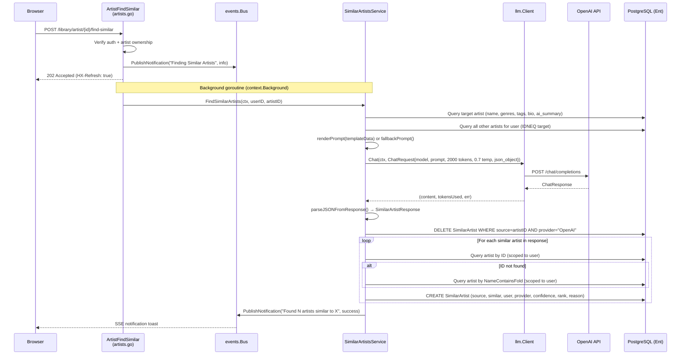
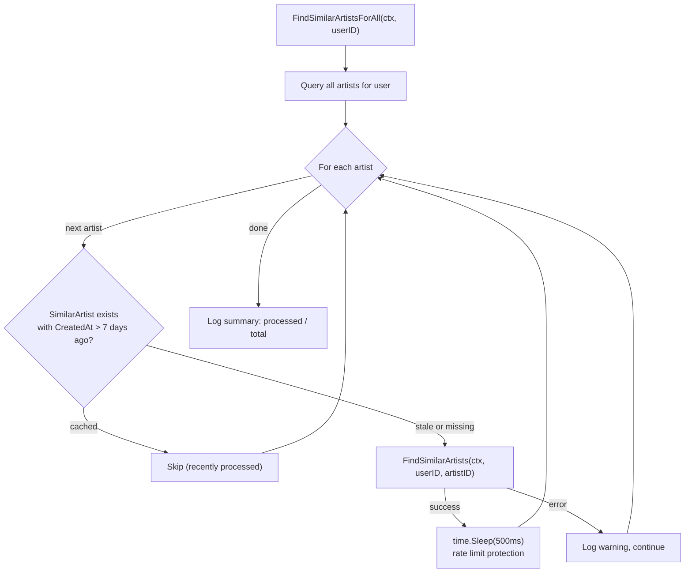
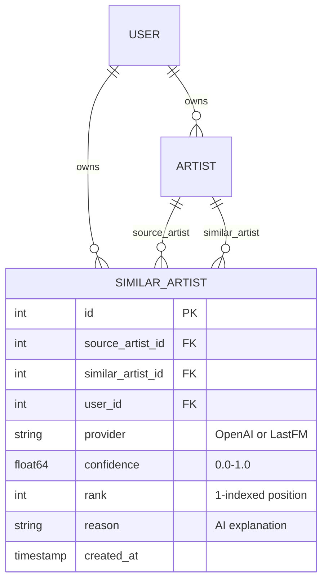

# Design: Similar Artists Discovery Service

## Context

Spotter enriches artist pages with AI-discovered relationships between artists in the user's
local Navidrome library. Unlike Last.fm's global similar artists (which suggests artists the
user may not own), this service identifies similar artists **from the user's own library** — so
every suggestion is immediately playable. The service sends artist metadata and the full library
roster to an OpenAI-compatible LLM, which returns a ranked list of similar artists with
confidence scores and natural language explanations.

This powers the "Similar Artists" section on artist detail pages and enables the weekly bulk
enrichment job that pre-populates similarities for the entire library.

Governing ADRs: [ADR-0004](../../adrs/ADR-0004-ent-orm-code-generation.md) (Ent ORM),
[ADR-0007](../../adrs/ADR-0007-in-memory-event-bus.md) (event bus),
[ADR-0008](../../adrs/ADR-0008-openai-api-litellm-compatible-llm-backend.md) (OpenAI API).

## Goals / Non-Goals

### Goals

- On-demand discovery: user clicks "Find Similar" on an artist page and receives results via SSE
- Bulk enrichment: weekly background job processes all artists in the library
- 7-day cache with staleness check to avoid redundant LLM calls
- Store `SimilarArtist` Ent entities with provider, confidence, rank, and reason fields
- Support both template-based and fallback prompt generation
- Real-time UI feedback via event bus notifications (info/success/error)
- Shared `llm.Client` for all OpenAI interactions (extracted per issue #119)

### Non-Goals

- Suggesting artists not in the user's library (that is Last.fm's domain)
- Using multiple LLM providers simultaneously (single provider per deployment)
- Automatic playlist generation from similar artists (handled by the Vibes engine)
- UI rendering of similar artist cards (covered by the artist show Templ component)
- Persisting the raw LLM prompt/response for debugging (only results are stored)

## Decisions

### Library-Scoped Similarity via LLM

**Choice**: Send the full list of available artists (ID, name, genres) to the LLM and ask it
to identify similar artists only from that list.

**Rationale**: The user can only play music they own. Suggesting external artists creates
friction ("you should listen to X" when X is not in the library). By constraining the LLM to
the user's library, every suggestion is immediately actionable. The LLM can leverage its
training knowledge of music relationships while respecting the local constraint.

**Alternatives considered**:
- Last.fm similar artists API: returns global similarities, mostly artists the user does not own.
- Embedding-based vector similarity on audio features: requires audio analysis infrastructure
  and embedding storage, massive overkill for a personal library.
- Genre overlap scoring: too simplistic — "jazz" and "jazz" would score 1.0 regardless of
  subgenre nuance. The LLM understands that Miles Davis and John Coltrane are similar despite
  different subgenre tags.

### Idempotent Storage with Delete-Then-Insert

**Choice**: Delete all existing `SimilarArtist` entries for the source artist and provider
before inserting new entries.

**Rationale**: The LLM may return a different set of similar artists on each call (different
confidence scores, different reasoning). Rather than diffing old vs. new entries and updating
in place, a clean delete + insert is simpler and ensures the stored results exactly reflect
the latest LLM response. The `ProviderOpenAI` scope prevents accidentally deleting Last.fm
results if those are added later.

**Alternatives considered**:
- Upsert by (source_artist, similar_artist, provider): requires a unique index and conflict
  resolution logic. The rank field would need careful handling since rank positions shift.
- Append-only with versioning: would grow unboundedly and complicate queries for the latest results.

### ID-First with Name-Fallback Artist Matching

**Choice**: Match each AI-returned artist by exact ID first, then fall back to case-insensitive
name containment matching (`NameContainsFold`).

**Rationale**: The prompt includes artist IDs, so the LLM usually returns valid IDs. However,
LLMs sometimes hallucinate IDs or return IDs from a different context. The name fallback catches
these cases. `NameContainsFold` handles "The Beatles" matching "Beatles, The" or partial name
matches gracefully.

**Alternatives considered**:
- ID-only matching: would drop valid suggestions where the LLM returned a wrong ID but correct name.
- Fuzzy Levenshtein name matching: overkill for artist names (which are shorter and less variant
  than track titles). `ContainsFold` is sufficient.

### Shared LLM Client

**Choice**: Use the shared `internal/llm/client.go` (`llm.Client`) for all OpenAI interactions
rather than building HTTP requests directly.

**Rationale**: The `llm.Client` was extracted (issue #119) to centralize base URL resolution,
API key handling, timeout configuration, and response parsing. Both `SimilarArtistsService` and
the Vibes engine use the same client, ensuring consistent behavior across all LLM consumers.

**Alternatives considered**:
- Direct `net/http` calls (the original implementation): duplicated base URL logic, timeout
  handling, and error parsing across services.

## Architecture

### On-Demand Discovery Flow



### Bulk Enrichment Flow



### Entity Relationships



## Key Implementation Details

### Files

- **Service**: `internal/services/similar_artists.go` — `SimilarArtistsService` with `FindSimilarArtists`, `GetSimilarArtists`, `FindSimilarArtistsForAll`, `ClearSimilarArtists`
- **Handler**: `internal/handlers/artists.go` — `ArtistFindSimilar` (POST), `ArtistShow` (display results)
- **LLM client**: `internal/llm/client.go` — shared `Chat()` method
- **Prompt template**: `{vibes_prompts_dir}/enrich_artist.txt`

### Prompt Construction

The `SimilarArtistTemplateData` struct provides:
- Target artist metadata: Name, Genres, Tags, Bio, AISummary
- `AvailableArtists` list: all other artists in the user's library with ID, Name, Genres

The template renders these into a prompt asking the LLM to return JSON:
```json
{"similar_artists": [{"name": "...", "id": 123, "confidence": 0.9, "reason": "..."}]}
```

If the template fails to load or execute, `fallbackPrompt()` generates a minimal prompt.

### LLM Configuration

- Model: `config.GetVibesModel()` (shared with Vibes engine)
- Max tokens: 2000 (lower than Vibes's 4096 since the response is simpler)
- Temperature: 0.7 (moderate creativity)
- Response format: `json_object` (forces structured output)
- Timeout: 60 seconds (`defaultSimilarArtistsTimeout`)

### JSON Parsing

The `parseJSONFromResponse` function handles common LLM output quirks:
1. Strips markdown code fence markers (` ```json ` / ` ``` `)
2. Finds the outermost `{...}` JSON object
3. Unmarshals into the target struct

### Observability

LLM calls emit structured `metric.llm` log entries with model, operation, tokens_used,
duration_ms, and success fields — consistent with the observability spec.

## Risks / Trade-offs

- **Full artist list in prompt** — For large libraries (1000+ artists), the artist list could
  exceed context window limits. Currently no truncation is applied. A future improvement could
  send only artists in related genres.
- **LLM hallucination** — The LLM may return artist IDs that do not exist in the user's library.
  The ID-then-name fallback mitigates this, but `NameContainsFold` could match wrong artists
  (e.g., "The XX" matching "Exxon" if such an entry existed). The warning log helps surface
  these cases.
- **500ms fixed delay** — Bulk enrichment uses a fixed 500ms delay between artists rather than
  adaptive backoff based on API rate limit headers. This is conservative but could be slow for
  large libraries (1000 artists = 8+ minutes) or wasteful for APIs with generous rate limits.
- **No Last.fm integration yet** — The `ProviderLastFM` constant exists but no implementation
  uses it. Adding Last.fm similar artists would require a separate API client and merge logic.
- **Cache invalidation** — The 7-day TTL is time-based only. If the user adds new artists to
  their library, existing similarity results will not reflect the new options until the cache
  expires. `ClearSimilarArtists` provides manual invalidation.

## Migration Plan

The similar artists feature was implemented incrementally:

1. **Schema**: Added `SimilarArtist` Ent entity with `source_artist`, `similar_artist`, `user`,
   `provider`, `confidence`, `rank`, `reason` fields and appropriate edges.
2. **Service**: Created `SimilarArtistsService` in `internal/services/similar_artists.go`.
3. **LLM extraction**: Migrated from inline HTTP calls to the shared `llm.Client` (issue #119).
4. **Handler**: Added `ArtistFindSimilar` POST endpoint and updated `ArtistShow` to display
   results with artist images and confidence badges.
5. **Bulk enrichment**: Added `FindSimilarArtistsForAll` for scheduled background processing.
6. **Observability**: Added `metric.llm` structured logging per the observability spec.

## Open Questions

- Should the service support combining OpenAI and Last.fm results into a unified similarity
  ranking, or keep them as separate providers with separate display sections?
- Should the prompt include audio features (energy, valence, BPM) from the user's tracks to
  improve similarity quality, or is artist-level metadata sufficient?
- Should `FindSimilarArtistsForAll` be exposed as an HTTP endpoint (e.g., "Enrich All Artists")
  or remain scheduler-only?
- Should the 7-day cache TTL be configurable via `SPOTTER_SIMILAR_ARTISTS_CACHE_DAYS`?
- Should the service limit the number of similar artists returned (currently unbounded by the
  service — the LLM decides how many to return)?
