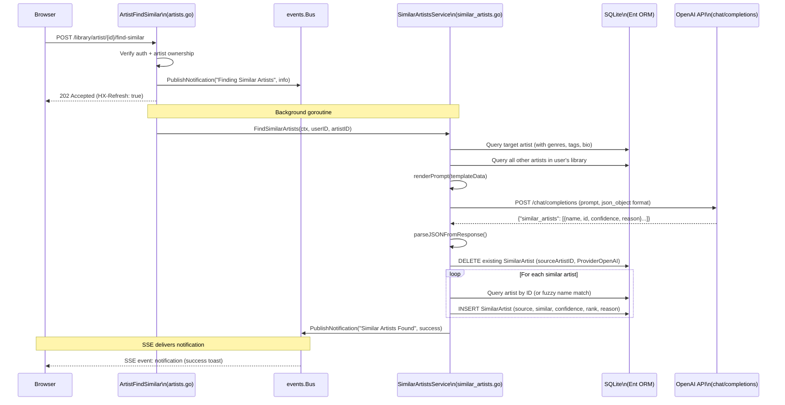
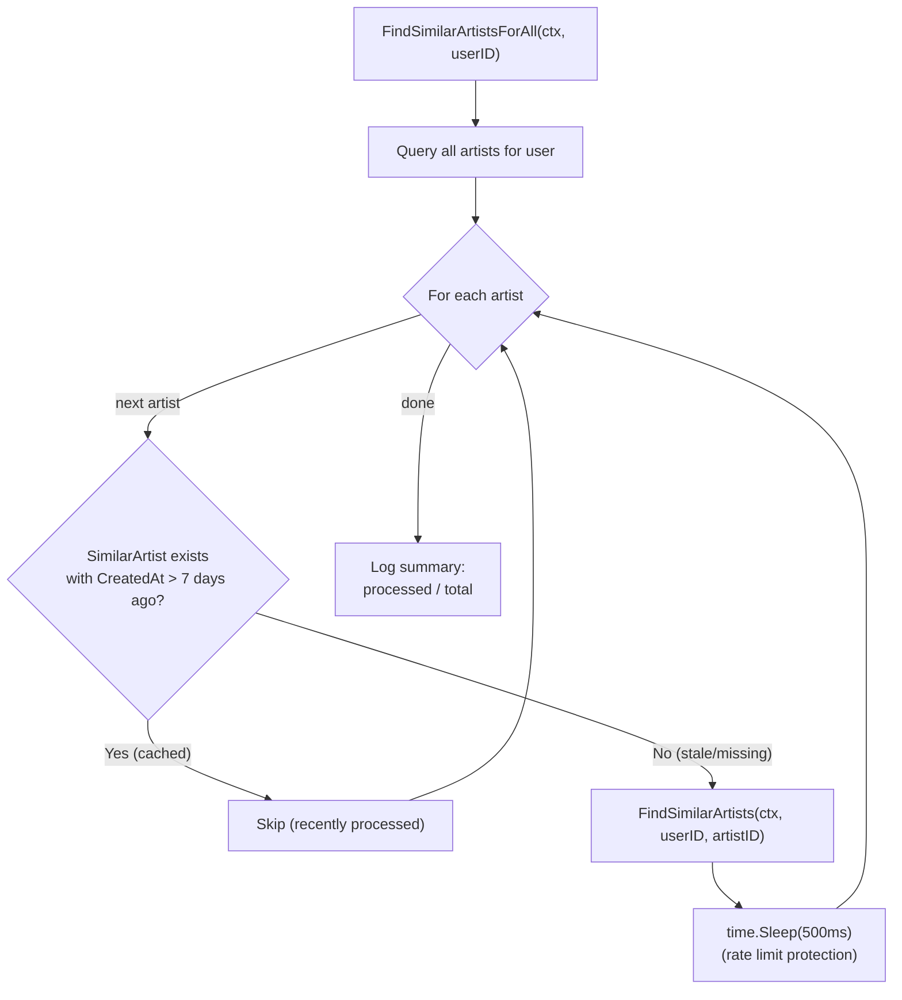

# Similar Artists Discovery Service

**Status:** accepted
**Version:** 0.1.0
**Last Updated:** 2026-02-21
**Governing ADRs:** ADR-0007 (in-memory event bus), ADR-0008 (OpenAI API), ADR-0004 (Ent ORM)

## Overview

The Similar Artists Discovery service uses AI (OpenAI's chat completion API) to identify artists in a user's local Navidrome library that are musically similar to a given target artist. The service constructs a prompt containing the target artist's metadata (name, genres, tags, bio, AI summary) and a list of all other artists in the user's library, then asks the LLM to return a ranked JSON list of similar artists with confidence scores and reasoning.

Results are stored as `SimilarArtist` Ent entities linking a source artist to similar artists with provider, confidence, rank, and reason fields. The service supports both on-demand discovery (triggered by the user clicking "Find Similar" on an artist page) and bulk background enrichment (processing all artists in the library weekly). A caching mechanism skips re-discovery if results were generated within the last 7 days.

The HTTP handler (`ArtistFindSimilar`) runs the discovery in a background goroutine and uses the event bus to publish real-time notifications to the browser. The user sees immediate feedback ("Finding Similar Artists...") followed by either a success notification or an error notification when the operation completes.

## Scope

This spec covers:
- The `SimilarArtistsService` struct and its public methods
- AI prompt construction via Go `text/template`
- OpenAI chat completion API integration for similarity detection
- JSON response parsing from AI output
- Storage of `SimilarArtist` relationships in the database via Ent ORM
- Caching and staleness logic (7-day TTL)
- HTTP handler integration and background goroutine execution
- Event bus notifications for real-time UI feedback
- Bulk enrichment for all artists in a user's library

Out of scope: The OpenAI API client configuration (see ADR-0008), Ent schema definitions for `SimilarArtist` entity (see ADR-0004), event bus internals (see event-bus-sse spec), artist metadata enrichment (see metadata enrichment spec), HTMX UI rendering of similar artist cards.

---

## Requirements

### Service Initialization

**REQ-SIM-001** — The `SimilarArtistsService` MUST be initialized via `NewSimilarArtistsService(client, cfg, logger, bus)` in `cmd/server/main.go` and injected into the `Handler` struct as `SimilarArtistsSvc`.

**REQ-SIM-002** — On initialization, the service MUST attempt to load the prompt template from `{config.GetVibesPromptsDirectory()}/enrich_artist.txt` via `loadTemplates()`. If the template fails to load, the service MUST log a warning but continue operating with the fallback prompt.

**REQ-SIM-003** — The service MUST create an `http.Client` with a timeout of 60 seconds (`defaultSimilarArtistsTimeout`) for OpenAI API calls.

### AI Prompt Construction

**REQ-SIM-010** — The `renderPrompt()` method MUST render the `enrich_artist` template with a `SimilarArtistTemplateData` struct containing:
- `Name`: the target artist's name
- `Genres`: the target artist's genre list
- `Tags`: the target artist's tag list
- `Bio`: the target artist's biography
- `AISummary`: the target artist's AI-generated summary
- `AvailableArtists`: a list of all other artists in the user's library (ID, Name, Genres)

**REQ-SIM-011** — If the template is nil or fails to execute, the service MUST use `fallbackPrompt()` which constructs a minimal prompt containing the artist name, genres, the full list of available artists with their IDs, and instructions to respond with JSON in the format `{"similar_artists": [{"name": "...", "id": 123, "confidence": 0.9, "reason": "..."}]}`.

**REQ-SIM-012** — The `AvailableArtists` list MUST exclude the target artist (`artist.IDNEQ(artistID)`) and MUST only include artists belonging to the current user (`artist.HasUserWith(user.ID(userID))`).

### OpenAI Integration

**REQ-SIM-020** — The `callOpenAI()` method MUST send a POST request to `{config.OpenAI.BaseURL}/chat/completions` (defaulting to `https://api.openai.com/v1` if `BaseURL` is empty) with:
- Model: from `config.GetVibesModel()`
- Messages: a single user message containing the rendered prompt
- MaxTokens: 2000
- Temperature: 0.7
- ResponseFormat: `{"type": "json_object"}`

**REQ-SIM-021** — The request MUST include `Authorization: Bearer {config.OpenAI.APIKey}` and `Content-Type: application/json` headers.

**REQ-SIM-022** — If `config.OpenAI.APIKey` is empty, `callOpenAI()` MUST return an error immediately without making a network request.

**REQ-SIM-023** — The method MUST check for API errors in the response body (`error` field) and non-200 status codes, returning descriptive errors in both cases.

### Response Parsing

**REQ-SIM-030** — The `parseJSONFromResponse()` function MUST extract JSON from the AI response by:
1. Stripping markdown code fence markers (` ```json ` and ` ``` `)
2. Finding the outermost `{...}` JSON object
3. Unmarshaling into the target struct

**REQ-SIM-031** — The parsed `SimilarArtistResponse` MUST contain a `similar_artists` array where each entry has: `name` (string), `id` (int, referencing an artist in the user's library), `confidence` (float64, 0.0-1.0), and `reason` (string explaining the similarity).

### Storage

**REQ-SIM-040** — The `storeSimilarArtists()` method MUST delete all existing `SimilarArtist` entries for the source artist and `ProviderOpenAI` provider before inserting new entries. This ensures idempotent re-runs.

**REQ-SIM-041** — For each similar artist in the AI response, the service MUST:
1. First attempt to find the artist by exact ID (`artist.ID(sa.ID)`) scoped to the user
2. If not found by ID, fall back to case-insensitive name containment matching (`artist.NameContainsFold(sa.Name)`) scoped to the user
3. If neither lookup succeeds, skip the entry and log a warning

**REQ-SIM-042** — Each `SimilarArtist` entity MUST be created with:
- `SourceArtist`: the target artist being analyzed
- `SimilarArtist`: the matched library artist
- `User`: the current user
- `Provider`: `"OpenAI"` (constant `ProviderOpenAI`)
- `Confidence`: the AI's confidence score
- `Rank`: 1-indexed position in the response array (`rank + 1`)
- `Reason`: the AI's explanation string

### Retrieval

**REQ-SIM-050** — `GetSimilarArtists(ctx, userID, artistID)` MUST return all `SimilarArtist` entries for the given source artist and user, ordered by rank ascending, with the `SimilarArtist` edge eagerly loaded (including `Images`).

**REQ-SIM-051** — The `ArtistShow` handler (`internal/handlers/artists.go`) MUST call `GetSimilarArtists()` when rendering the artist detail page and pass the results to the `artists.Show()` Templ component as `SimilarArtistInfo` structs containing `Artist`, `Provider`, `Confidence`, and `Reason`.

### Caching and Staleness

**REQ-SIM-060** — `FindSimilarArtistsForAll()` MUST skip artists that have existing `SimilarArtist` entries with `CreatedAt` within the last 7 days (`time.Now().Add(-24 * time.Hour * 7)`).

**REQ-SIM-061** — `FindSimilarArtistsForAll()` MUST add a 500ms delay between processing each artist to avoid OpenAI API rate limiting.

**REQ-SIM-062** — `ClearSimilarArtists(ctx, userID, artistID)` MUST delete all `SimilarArtist` entries for the given source artist and user, enabling forced re-discovery.

### HTTP Handler Integration

**REQ-SIM-070** — The `ArtistFindSimilar` handler (`internal/handlers/artists.go:655-712`) MUST:
1. Require an authenticated session via `h.GetUser()`
2. Parse the artist ID from the URL parameter `{id}` using `chi.URLParam()`
3. Verify the artist exists and belongs to the authenticated user
4. Check that `h.SimilarArtistsSvc` is not nil (HTTP 503 if unavailable)
5. Launch `FindSimilarArtists()` in a background goroutine with `context.Background()`
6. Immediately publish a "Finding Similar Artists" info notification via the event bus
7. Return HTTP 202 Accepted with `HX-Refresh: true` header

**REQ-SIM-071** — If the background `FindSimilarArtists()` call fails, the handler's goroutine MUST publish an error notification via `h.Bus.PublishNotification()` with the error message and `IconType: "error"`.

**REQ-SIM-072** — On success, the `FindSimilarArtists()` method MUST publish a success notification via `s.bus.PublishNotification()` with the count of similar artists found and `IconType: "success"`.

### Event Bus Integration

**REQ-SIM-080** — The service MUST use the `events.Bus` for all real-time notifications. The following notification events MUST be published at the appropriate lifecycle points:

| Lifecycle Point | Title | Message Pattern | IconType |
|----------------|-------|-----------------|----------|
| Search initiated (handler) | "Finding Similar Artists" | "Searching for artists similar to {name}..." | `info` |
| Search completed (service) | "Similar Artists Found" | "Found {count} artists similar to {name}" | `success` |
| Search failed (handler goroutine) | "Similar Artists Failed" | "Failed to find similar artists for {name}: {error}" | `error` |

**REQ-SIM-081** — All event bus calls MUST be nil-guarded (`if s.bus != nil` / `if h.Bus != nil`) to allow the service and handler to operate without a bus in testing contexts.

---

## Discovery Flow Diagram



## Bulk Enrichment Flow Diagram



---

## Scenarios

### Scenario 1: On-demand similar artist discovery

```gherkin
Given user "alice" is viewing the artist page for "Radiohead" (ID=42)
And no SimilarArtist entries exist for Radiohead
When alice clicks "Find Similar Artists"
Then the handler publishes an info notification "Searching for artists similar to Radiohead..."
And returns HTTP 202 with HX-Refresh: true
And a background goroutine calls FindSimilarArtists(ctx, alice.ID, 42)
And the service queries all other artists in alice's library
And renders a prompt including Radiohead's metadata and the available artist list
And sends the prompt to OpenAI with response_format: json_object
And parses the JSON response to extract similar artists with confidence scores
And stores SimilarArtist entries (e.g., Muse at rank 1, Portishead at rank 2)
And publishes a success notification "Found 5 artists similar to Radiohead"
```

### Scenario 2: Cached results prevent re-discovery

```gherkin
Given SimilarArtist entries for "Pink Floyd" were created 3 days ago
When FindSimilarArtistsForAll processes "Pink Floyd"
Then the service finds existing entries with CreatedAt > 7-day cutoff
And skips Pink Floyd without making an OpenAI API call
And moves to the next artist after zero delay
```

### Scenario 3: AI suggests an artist not in library

```gherkin
Given the OpenAI response includes {"name": "Unknown Band", "id": 999, "confidence": 0.85}
And no artist with ID 999 exists in the user's library
And no artist with a name containing "Unknown Band" exists in the user's library
When storeSimilarArtists processes this entry
Then the service logs a warning "similar artist not found in library"
And skips this entry without creating a SimilarArtist record
And continues processing the remaining entries
```

### Scenario 4: OpenAI API failure during discovery

```gherkin
Given the OpenAI API key is valid but the API returns HTTP 429 (rate limited)
When FindSimilarArtists calls callOpenAI
Then callOpenAI returns an error "API returned status 429: ..."
And FindSimilarArtists returns the error to the handler goroutine
And the handler goroutine publishes an error notification "Failed to find similar artists for Radiohead: ..."
And no SimilarArtist entries are modified
```

### Scenario 5: Service unavailable (no SimilarArtistsSvc)

```gherkin
Given h.SimilarArtistsSvc is nil (OpenAI not configured)
When a user clicks "Find Similar Artists"
Then ArtistFindSimilar returns HTTP 503 "Similar artists service not available"
And no background goroutine is launched
And no event bus notifications are published
```

### Scenario 6: Artist ID fallback to name matching

```gherkin
Given the AI response includes {"name": "The Beatles", "id": 50, "confidence": 0.95}
And artist ID 50 does not belong to the current user
But an artist named "The Beatles" exists in the user's library with ID 73
When storeSimilarArtists processes this entry
Then the service falls back to NameContainsFold("The Beatles")
And finds artist ID 73
And creates a SimilarArtist entry linking to artist 73
```

---

## Implementation Notes

- Service: `internal/services/similar_artists.go` — `SimilarArtistsService`, `FindSimilarArtists()`, `GetSimilarArtists()`, `FindSimilarArtistsForAll()`, `ClearSimilarArtists()`
- HTTP handler: `internal/handlers/artists.go` — `ArtistFindSimilar()` (POST `/library/artist/{id}/find-similar`), `ArtistShow()` (display results)
- Prompt template: `{vibes_prompts_dir}/enrich_artist.txt` loaded via `loadTemplates()`
- Template data: `SimilarArtistTemplateData` struct with artist metadata and available artist list
- AI response: `SimilarArtistResponse` struct with `similar_artists` array and `analysis` field
- OpenAI request: `similarArtistChatRequest` struct sent to `/chat/completions` with `json_object` response format
- Storage: `SimilarArtist` Ent entity with `SourceArtist`, `SimilarArtist`, `User`, `Provider`, `Confidence`, `Rank`, `Reason` fields
- Provider constants: `ProviderOpenAI = "OpenAI"`, `ProviderLastFM = "LastFM"`
- Service initialization: `cmd/server/main.go:109` — `services.NewSimilarArtistsService(client, cfg, logger, bus)`
- Handler injection: `cmd/server/main.go:113` — passed to `handlers.New()` as `similarArtistsSvc`
- Governing comment: `// Governing: ADR-0007 (event bus), ADR-0008 (OpenAI), ADR-0004 (Ent ORM), SPEC similar-artists-discovery`
