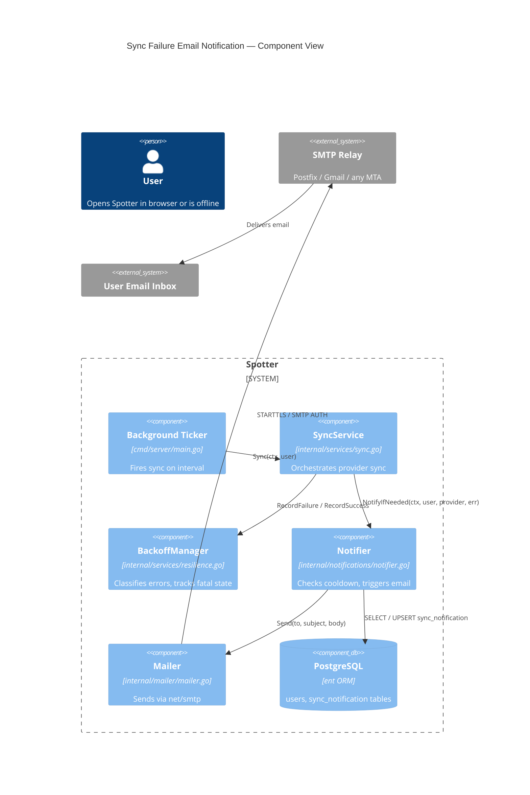
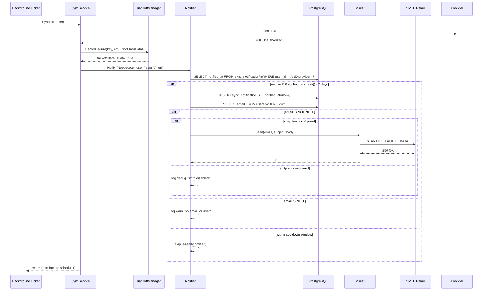
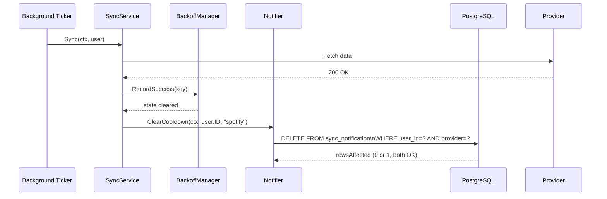
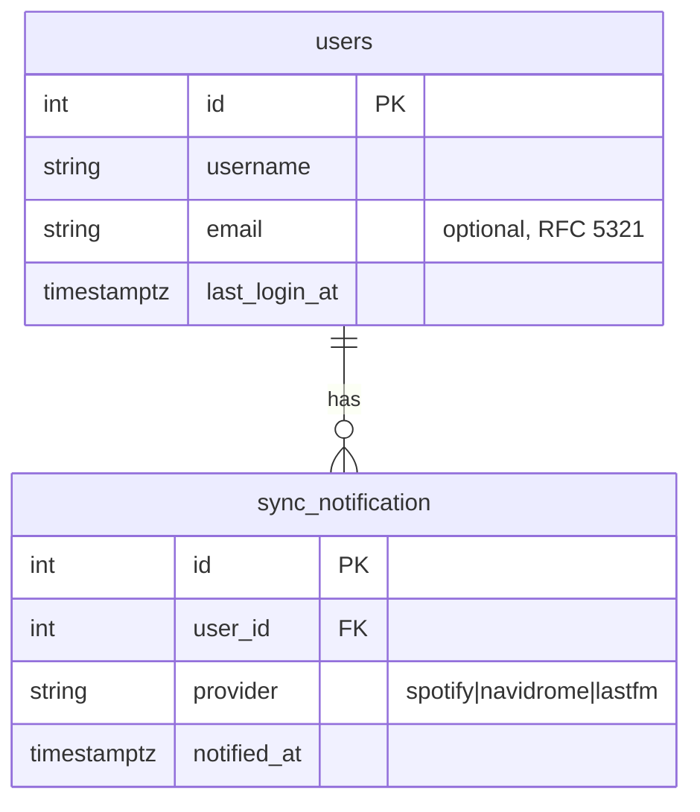

# Design: Sync Failure Email Notifications

## Context

Spotter runs scheduled background syncs for all users on a configurable ticker (ADR-0013).
When a provider fails with a fatal error (401, 403, revoked token), the sync is blocked and
the user receives an SSE toast — but only if they have an active browser session. Users who
are offline have no way to learn their sync is broken until they next open the app.

This design realises SPEC-0015 and implements the decision from ADR-0026: user-provided email
address, configurable SMTP delivery, and DB-persisted 7-day cooldown per provider per user.

Related: ADR-0005 (Navidrome primary identity), ADR-0006 (AES-256-GCM), ADR-0013 (goroutine
ticker scheduling), ADR-0026 (decision rationale for this feature).

---

## Goals / Non-Goals

### Goals

- Deliver one actionable email per fatal sync failure per provider per 7-day window
- Reuse existing `BackoffManager` error classification (`ErrorClassFatal`) with no redesign
- Survive app restarts without duplicate notifications (DB-persisted state)
- Require no SaaS dependencies — plain SMTP only
- Degrade gracefully when SMTP is unconfigured or email is not set

### Non-Goals

- Push notifications, Slack, webhooks, or any channel other than email
- Fetching email from LLDAP, OIDC userinfo, or Navidrome (user provides it explicitly)
- Per-provider cooldown durations (one global `failure_cooldown_days` setting)
- Email delivery receipts, bounce handling, or unsubscribe flows
- Encrypting `User.email` at rest (not a credential per ADR-0006)

---

## Decisions

### Notification Service as a Thin Coordinator

**Choice**: A new `internal/notifications/` package with a `Notifier` struct injected into
`SyncService` at construction time.

**Rationale**: Keeps email logic out of `sync.go` and keeps `BackoffManager` pure (no delivery
concern). `Notifier` is the single place that checks cooldown, writes `sync_notification`, and
calls the mailer.

**Alternatives considered**:
- Inline in `sync.go`: Couples sync logic to email; harder to test independently
- Goroutine watching the event bus: Adds latency and requires the browser SSE path to stay
  healthy; defeats the purpose of out-of-band notification

### DB-Persisted Cooldown Over In-Memory

**Choice**: New `sync_notification` ent schema table, unique on `(user_id, provider)`.

**Rationale**: `BackoffManager` state is in-memory and lost on restart. A restart mid-cooldown
would re-trigger an email on the next tick without DB persistence. The table is small (one row
per user per active failure), queries are indexed, and it survives deploys.

**Alternatives considered**:
- Extend `BackoffManager` with a persistence layer: Overcomplicates the resilience package
- Add a column to `User`: Doesn't support per-provider granularity

### SMTP via `net/smtp` (stdlib)

**Choice**: Use Go's standard library `net/smtp` with a thin wrapper in `internal/mailer/`.

**Rationale**: Zero new dependencies. Self-hosted environments always have an SMTP relay
available (Postfix, Gmail relay, Mailgun SMTP bridge). The mailer wrapper is easily swapped
for a richer client (e.g. `gopkg.in/mail.v2`) later without touching `Notifier`.

**Alternatives considered**:
- Transactional SaaS (Resend, SendGrid): Requires API keys and external accounts; conflicts
  with self-hosted philosophy
- `gopkg.in/mail.v2` now: Adds a dependency for minimal gain at this stage

### Email Address Source: User-Provided Only

**Choice**: `User.email` populated explicitly in Account Preferences UI.

**Rationale**: Navidrome's Subsonic API does not return email. LLDAP LDAP queries would add
an LDAP client dependency and bind credentials only for this feature; LLDAP unavailability at
notification time would silently suppress the alert. User-provided email is decoupled from
directory state and requires no new config surface.

**See**: ADR-0026 Option B rejection for full analysis.

### Cooldown Reset on Recovery

**Choice**: Delete `sync_notification` row on successful sync or provider reconnect.

**Rationale**: If a user fixes their Spotify credentials and syncs cleanly, the old cooldown
row should not silently suppress a *new* failure weeks later. Deletion gives a clean slate.
This is slightly more aggressive than "reset the timer" but avoids the confusing case where a
brief recovery extends a user's notification blackout.

---

## Architecture

### Component Overview



### Fatal Failure Notification Flow



### Recovery / Reset Flow



### Data Model



---

## New Packages and Files

| Path | Purpose |
|------|---------|
| `internal/mailer/mailer.go` | SMTP wrapper (`Mailer` interface + `SMTPMailer` impl) |
| `internal/notifications/notifier.go` | `Notifier` struct: cooldown check, DB write, mail dispatch |
| `internal/notifications/templates.go` | `text/template` email subject+body templates |
| `ent/schema/syncnotification.go` | New ent schema for `sync_notification` table |

### `Notifier` Interface

```go
type Notifier interface {
    // NotifyIfNeeded sends an email if the provider failure is fatal,
    // the user has an email set, SMTP is configured, and the cooldown has
    // not fired within the last N days.
    NotifyIfNeeded(ctx context.Context, user *ent.User, provider string, err error) error

    // ClearCooldown deletes the sync_notification record for (userID, provider),
    // resetting the window so the next failure triggers a fresh notification.
    ClearCooldown(ctx context.Context, userID int, provider string) error
}

// NoopNotifier satisfies the interface when SMTP is not configured.
type NoopNotifier struct{}
```

### `sync_notification` Schema (ent)

```go
// Fields: id (auto), user_id (FK), provider (string), notified_at (timestamptz)
// Edges: user (many-to-one, required)
// Indexes: unique(user_id, provider)
```

### Config Addition

```toml
[smtp]
host     = "smtp.example.com"
port     = 587
username = "spotter@example.com"
password = "..."
from     = "Spotter <spotter@example.com>"
tls      = true   # STARTTLS; default true

[notifications]
failure_cooldown_days = 7   # default
```

### Integration Point in `SyncService`

`SyncService` gains a `notifier Notifier` field. After `BackoffManager.RecordFailure` returns
`IsFatal = true`, it calls `notifier.NotifyIfNeeded`. After `RecordSuccess`, it calls
`notifier.ClearCooldown`. No other changes to `sync.go` logic.

```go
// internal/services/sync.go (existing RecordFailure block)
state := h.backoff.RecordFailure(key, err, errClass)
if state.IsFatal {
    // Governing: SPEC-0015 REQ "Notification Trigger"
    if nErr := h.notifier.NotifyIfNeeded(ctx, user, providerName, err); nErr != nil {
        s.logger.Error("failed to send failure notification", "error", nErr)
    }
}

// ... on success:
h.backoff.RecordSuccess(key)
// Governing: SPEC-0015 REQ "Cooldown Reset on Recovery"
if nErr := h.notifier.ClearCooldown(ctx, user.ID, providerName); nErr != nil {
    s.logger.Warn("failed to clear notification cooldown", "error", nErr)
}
```

### Provider Reconnect Integration Points

| Provider | Where to call `ClearCooldown` |
|----------|-------------------------------|
| Navidrome | `PostLogin` (auth.go) — after successful `NavidromeAuth` update |
| Spotify | `SpotifyCallback` (auth.go / oauth handler) — after token exchange |
| Last.fm | `LastFMCallback` — after session key saved |

---

## Email Template

**Subject**: `[Spotter] {Provider} sync error — action required`

**Plain-text body**:
```
Hi {username},

Your {Provider} sync on Spotter has stopped working.

  Error: {sanitised error class — e.g. "Authentication failed (401)"}
  First seen: {timestamp UTC}
  Provider: {Provider}

To fix this, visit your provider settings:
  {base_url}/preferences/providers

You will not receive another email about this issue for 7 days.

— Spotter
```

Error messages MUST be sanitised before inclusion: strip any token, password, salt, or raw
response body. Only the `ErrorClass` string and HTTP status code (if available) are included.

---

## Risks / Trade-offs

- **SMTP credentials in config** → Mitigate by documenting env-var overrides
  (`SPOTTER_SMTP_PASSWORD`) and noting that `smtp.password` should never be committed to VCS
- **No delivery confirmation** → If SMTP accepts the message but the relay drops it, the user
  never knows. The cooldown row is still written. Acceptable trade-off for a personal app.
- **User forgets to set email** → Notification silently skipped with a `warn` log. UI should
  make the email field discoverable (e.g. prompt on first fatal failure if email is unset)
- **Cooldown row not cleaned up on account delete** → Add `ON DELETE CASCADE` on the
  `sync_notification.user_id` FK to handle this automatically

---

## Migration Plan

1. Add `ent/schema/syncnotification.go` → run `go generate ./ent/...` → new DB migration
2. Add `internal/mailer/` package (SMTP wrapper)
3. Add `internal/notifications/` package (`Notifier`, `NoopNotifier`, templates)
4. Wire `Notifier` into `SyncService` constructor in `cmd/server/main.go`
5. Add SMTP + notifications config sections; add env var mappings
6. Add UI: email field to Account Preferences, SMTP status badge, test-notification button
7. Add `ClearCooldown` calls to OAuth callback handlers and `PostLogin`

Rollback: Remove the `Notifier` field from `SyncService` (no-op interface used in tests
already), drop the `sync_notification` table. No other schema changes.

---

## Open Questions

- Should the "no email configured" state be surfaced in the dashboard nav (e.g. a subtle
  settings prompt) the first time a fatal failure is detected? Could drive email adoption.
- Should a future iteration support per-provider cooldown overrides, or is global enough?
- Is `text/plain` sufficient, or should we ship a minimal HTML template from day one?
