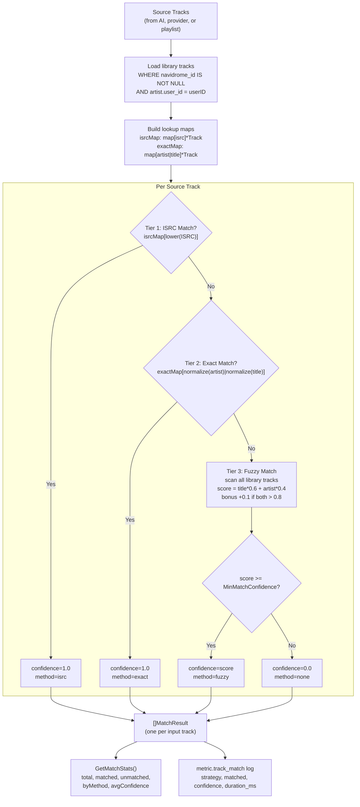
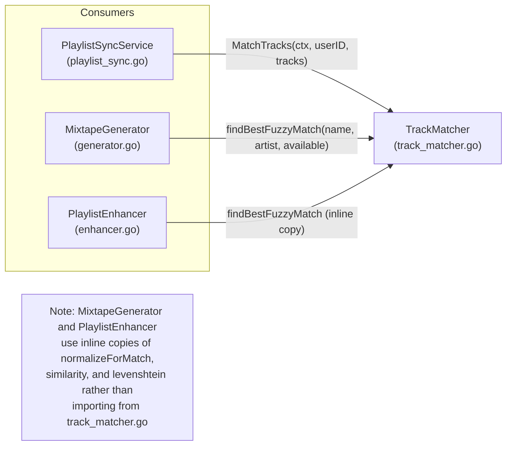

# Design: Three-Tier Track Matching

## Context

External track references — from AI-generated mixtapes, Spotify playlists, Last.fm history,
or enhanced playlists — arrive as metadata strings (artist name, track title, optional ISRC).
These must be resolved to local Navidrome library entries (Ent `Track` entities with a
`NavidromeID`) so that playlists can be written to Navidrome and actually played. The challenge
is that track titles vary significantly across sources: remastered editions add suffixes,
providers differ in punctuation and capitalization, and AI-generated suggestions may use
slightly different names than what is in the library.

The track matcher is a shared subsystem consumed by both the playlist sync service and the
Vibes mixtape/enhancement engine.

Governing ADR: [ADR-0014](../../adrs/ADR-0014-three-tier-track-matching-algorithm.md)
(three-tier ISRC/exact/fuzzy track matching).

## Goals / Non-Goals

### Goals

- Resolve external track references to local Navidrome tracks with high accuracy
- Three-tier cascade: ISRC exact match, normalized exact match, fuzzy Levenshtein match
- Configurable minimum confidence threshold for fuzzy matches (default 0.7)
- Return a `MatchResult` for every input track with method, confidence, and Navidrome track ID
- Provide aggregate statistics (total, matched, unmatched, per-method counts, avg confidence)
- Helper functions for filtering matched/unmatched results
- Comprehensive normalization stripping 30+ common suffixes

### Non-Goals

- Matching tracks to external services (Spotify, MusicBrainz) — this is local-only
- Audio fingerprint matching (too heavy for a personal server)
- Transliteration or Unicode normalization beyond case folding
- Caching match results across calls (each call loads fresh library state)
- Handling album-level matching (only track + artist are matched)

## Decisions

### Three-Tier Cascade over Single Strategy

**Choice**: ISRC exact match (tier 1), normalized exact match (tier 2), fuzzy Levenshtein
match (tier 3), applied in strict priority order with early exit.

**Rationale**: Each tier has different accuracy and cost characteristics. ISRC is a globally
unique identifier — a match is guaranteed correct. Normalized exact matching catches the 60-70%
of tracks where titles match after stripping version suffixes. Fuzzy matching handles the
remaining edge cases (minor spelling variations, missing articles). The cascade stops at the
first successful tier, avoiding unnecessary computation.

**Alternatives considered**:
- ISRC only: would match <10% of tracks since most personal libraries lack ISRC metadata and
  AI suggestions never include ISRCs.
- Exact string matching only: fails on "Bohemian Rhapsody (2011 Remaster)" vs "Bohemian
  Rhapsody" — the most common variation pattern.
- ML/embedding similarity: massive overkill for string matching; adds model dependencies and
  complexity for marginal improvement over Levenshtein.

### Lookup Maps for O(1) Tier 1 and Tier 2

**Choice**: Pre-build `isrcMap` (map[isrc]*Track) and `exactMap` (map[normalized_key]*Track)
before iterating source tracks.

**Rationale**: Tiers 1 and 2 become O(1) lookups per source track instead of O(n) scans.
Only tier 3 (fuzzy) requires O(m) iteration over the library per unmatched track, where m is
the library size. This keeps matching fast even for large playlists.

**Alternatives considered**:
- Database queries per track: would be O(n) database round-trips, much slower than in-memory maps.
- Pre-computed similarity index: adds complexity and memory for marginal benefit over the
  linear scan on personal library sizes (<50K tracks).

### Weighted Fuzzy Scoring with Bonus

**Choice**: Fuzzy score = (title\_similarity \* 0.6) + (artist\_similarity \* 0.4), with a +0.1
bonus (capped at 1.0) when both components exceed 0.8.

**Rationale**: Track title is more discriminating than artist name for identity — many artists
have unique track titles, but artist names overlap (e.g., "The" prefix). The 60/40 weighting
reflects this. The bonus rewards high confidence on both dimensions, pushing borderline matches
over the threshold when both title and artist are strong matches.

**Alternatives considered**:
- Equal weighting (50/50): under-weights the more informative signal (title).
- Title-only matching: would match "Yesterday" by Paul McCartney to "Yesterday" by Atmosphere.
- Jaro-Winkler distance: better for short strings but Levenshtein is simpler to implement and
  understand. The difference is negligible for typical track title lengths.

### Aggressive Suffix Normalization

**Choice**: Strip 30+ common suffixes including remastered, deluxe, live, acoustic, remix,
radio edit, bonus track, explicit, clean — in both parenthesized and bracketed forms, plus
dash-separated variants.

**Rationale**: Streaming services append version metadata that local files lack. A Spotify
track "Bohemian Rhapsody (2011 Remaster)" must match a local file "Bohemian Rhapsody". The
suffix list covers the vast majority of observed variations from Spotify, Apple Music, and
Tidal metadata.

**Alternatives considered**:
- Regex-based suffix stripping: more flexible but harder to maintain and debug.
- No normalization (rely on fuzzy matching): fuzzy would catch these but at lower confidence,
  causing more tracks to fall below the threshold.

## Architecture

### Matching Pipeline



### Consumer Relationships



## Key Implementation Details

### Files

- **Core matcher**: `internal/services/track_matcher.go` — `TrackMatcher`, `MatchTracks`, `findBestFuzzyMatch`, `normalizeForMatch`, `similarity`, `levenshtein`
- **Helper types**: `MatchResult`, `MatchStats`, `MatchMethod` constants
- **Helper functions**: `GetMatchedTracks`, `GetUnmatchedTracks`, `GetMatchStats`
- **Tests**: `internal/services/track_matcher_test.go`

### TrackMatcher Struct

```go
type TrackMatcher struct {
    Client             *ent.Client
    Logger             *slog.Logger
    MinMatchConfidence float64  // default 0.7
}
```

Created via `NewTrackMatcher(client, logger, minConfidence)`. The `PlaylistSyncService`
creates its own instance internally during construction.

### Library Loading

Tracks are loaded with the filter chain `Track -> Artist -> User(userID)` and
`navidrome_id IS NOT NULL`. The `WithArtist()` eager load ensures artist names are available
for matching without additional queries.

### Normalization Pipeline

```text
Input: "Don't Stop Me Now - Remastered 2011"
  1. ToLower:     "don't stop me now - remastered 2011"
  2. TrimSuffix:  "don't stop me now" (strips " - remastered")
  3. Strip punct: "dont stop me now" (removes apostrophe)
  4. Collapse ws: "dont stop me now"
```

Note: The suffix stripping uses `strings.TrimSuffix` which only matches at the end of the
string. Year-qualified suffixes like "- Remastered 2011" are not in the suffix list — they
will be partially stripped ("- remastered" is removed but "2011" remains). Fuzzy matching
compensates for this.

### Levenshtein Distance

Standard dynamic programming implementation operating on `[]rune` for Unicode correctness.
Similarity is computed as `1.0 - (distance / max(len(a), len(b)))`.

### Observability

Each track match emits a `metric.track_match` structured log entry with strategy, matched
(bool), confidence, and duration_ms. The summary log at the end of `MatchTracks` reports
total counts and per-method breakdown.

## Risks / Trade-offs

- **O(n*m) fuzzy matching** — For each unmatched track (n), the fuzzy tier scans every library
  track (m). With 100 playlist tracks and 50K library tracks, this is 5M string comparisons.
  Each comparison involves Levenshtein distance (O(len_a * len_b)). For typical personal
  libraries this completes in under a second, but it is the performance bottleneck.
- **Full library in memory** — All tracks with `navidrome_id` are loaded into memory at the
  start of each `MatchTracks` call. No pagination or streaming. Acceptable for personal use
  but would not scale to shared/multi-user setups with millions of tracks.
- **Duplicated code in vibes package** — `internal/vibes/generator.go` contains its own
  `normalizeForMatch`, `similarity`, and `levenshtein` functions rather than importing from
  `track_matcher.go`. This means bug fixes or normalization improvements must be applied in
  two places. A shared `internal/matching/` package would resolve this.
- **Short title sensitivity** — Levenshtein similarity for very short titles (e.g., "Go") can
  produce misleadingly high scores against other short titles. No minimum length check is
  applied before fuzzy matching.
- **No Unicode normalization** — Accented characters (e.g., "Beyonce" vs "Beyonce") are handled
  by case folding but not by NFD/NFC normalization. A track titled "Noel" would not match "Noel"
  if one uses a combining diaeresis and the other uses a precomposed character.
- **Hardcoded suffix list** — New streaming service suffixes (e.g., "(Taylor's Version)",
  "(Dolby Atmos)") require a code change. A configuration-driven suffix list would be more
  flexible.

## Migration Plan

The track matcher was implemented as a foundational service:

1. **Initial implementation**: Created `TrackMatcher` in `internal/services/track_matcher.go`
   with three-tier matching, normalization, and Levenshtein distance.
2. **Integration with playlist sync**: `PlaylistSyncService` creates a `TrackMatcher` internally
   and calls `MatchTracks` during each sync operation.
3. **Integration with vibes**: `MixtapeGenerator` and `PlaylistEnhancer` use inline copies of
   the matching functions for matching AI suggestions to the available track list.
4. **ADR-0014**: Documented the three-tier algorithm decision with analysis of alternatives.
5. **Observability**: Added per-track `metric.track_match` structured logging.

## Open Questions

- Should the duplicated matching code in `internal/vibes/generator.go` be refactored to import
  from `track_matcher.go`, or is the slight divergence (vibes matches against `[]AvailableTrack`
  while sync matches against `[]*ent.Track`) sufficient reason to keep them separate?
- Should the suffix list be loaded from a configuration file or database table rather than
  being hardcoded?
- Should the matcher support weighted ISRC confidence (e.g., 0.99 instead of 1.0) to account
  for the rare case of ISRC conflicts across different releases?
- Should there be a tier 1.5 that tries MusicBrainz recording IDs if available, between ISRC
  and exact matching?
- Should the fuzzy matcher short-circuit if it finds a score above 0.95 rather than scanning
  the entire library?
