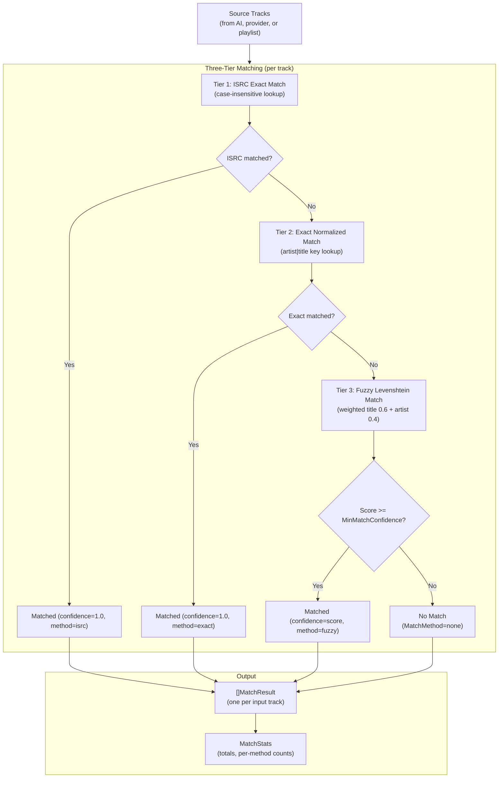

# Track Matching

**Status:** accepted
**Version:** 0.1.0
**Last Updated:** 2026-03-02
**Governing ADRs:** ADR-0014 (three-tier ISRC/exact/fuzzy track matching algorithm)

## Overview

The track matching subsystem resolves external track references (from AI-generated mixtapes, provider playlists, or enhanced playlists) to local Navidrome library entries. It uses a three-tier cascade: ISRC exact match, normalized exact match (artist + title), and fuzzy Levenshtein similarity matching with a configurable confidence threshold. The matcher returns a `NavidromeTrackID` for each matched track and an empty string for unmatched tracks, along with confidence scores and match method metadata.

## Scope

This spec covers:
- The `TrackMatcher` service and its `MatchTracks` method
- The three-tier matching strategy: ISRC, exact normalized, and fuzzy Levenshtein
- String normalization for matching (suffix stripping, punctuation removal, case folding)
- Match confidence scoring and the minimum confidence threshold
- The `MatchResult` data structure and helper functions (`GetMatchedTracks`, `GetUnmatchedTracks`, `GetMatchStats`)

Out of scope: Playlist sync write-back to Navidrome (see playlist-sync-navidrome spec), mixtape generation (see vibes-ai-mixtape-engine spec), metadata enrichment that populates ISRC fields (see metadata-enrichment-pipeline spec).

---

## Requirements

### TrackMatcher Service

**REQ-TM-001** -- The `TrackMatcher` MUST be initialized with an Ent database client, a structured logger, and a configurable minimum match confidence threshold (float64, range 0.0-1.0).

**REQ-TM-002** -- The `MatchTracks` method MUST accept a context, a user ID, and a slice of source tracks, and MUST return a `MatchResult` for every input track. The length of the result slice MUST equal the length of the input slice.

**REQ-TM-003** -- The matcher MUST load all tracks with a non-nil `navidrome_id` for the given user from the database before matching. Tracks MUST be filtered to the user through the `Track -> Artist -> User` edge chain.

**REQ-TM-004** -- If the user's library contains no tracks with a `navidrome_id`, the matcher MUST return all results with `MatchMethod = "none"`, `MatchConfidence = 0.0`, and an empty `NavidromeTrackID`.

### ISRC Matching (Tier 1)

**REQ-TM-010** -- When a source track has a non-empty ISRC, the matcher MUST attempt an ISRC exact match first, before any other strategy. ISRC comparison MUST be case-insensitive.

**REQ-TM-011** -- A successful ISRC match MUST set `MatchConfidence = 1.0` and `MatchMethod = "isrc"`.

**REQ-TM-012** -- If the ISRC match succeeds, the matcher MUST skip the exact and fuzzy matching tiers for that track.

### Exact Normalized Matching (Tier 2)

**REQ-TM-020** -- If ISRC matching did not produce a result (no ISRC available, or ISRC not found in library), the matcher MUST attempt an exact match using the normalized concatenation of artist name and track title (`normalized_artist + "|" + normalized_title`).

**REQ-TM-021** -- A successful exact match MUST set `MatchConfidence = 1.0` and `MatchMethod = "exact"`.

**REQ-TM-022** -- If the exact match succeeds, the matcher MUST skip the fuzzy matching tier for that track.

### Fuzzy Levenshtein Matching (Tier 3)

**REQ-TM-030** -- If neither ISRC nor exact matching produces a result, the matcher MUST perform fuzzy matching by computing a similarity score against every track in the user's library.

**REQ-TM-031** -- The fuzzy match score MUST be a weighted average of title similarity (weight 0.6) and artist similarity (weight 0.4), where similarity is computed as `1.0 - (levenshtein_distance / max_string_length)`.

**REQ-TM-032** -- When both title similarity and artist similarity exceed 0.8, the matcher MUST apply a bonus of 0.1 to the combined score, capped at 1.0.

**REQ-TM-033** -- The fuzzy match MUST only be accepted if the best score meets or exceeds the configured `MinMatchConfidence` threshold. Matches below the threshold MUST be rejected and the track MUST be reported as unmatched (`MatchMethod = "none"`).

**REQ-TM-034** -- A successful fuzzy match MUST set `MatchMethod = "fuzzy"` and `MatchConfidence` to the computed score.

### String Normalization

**REQ-TM-040** -- Normalization MUST convert the input string to lowercase.

**REQ-TM-041** -- Normalization MUST strip common version suffixes including but not limited to: `(remastered)`, `(deluxe)`, `(live)`, `(acoustic)`, `(remix)`, `(radio edit)`, `(bonus track)`, `(explicit)`, `(clean)`, and their bracket equivalents, as well as dash-separated variants (e.g., ` - remastered`).

**REQ-TM-042** -- Normalization MUST remove punctuation and collapse consecutive whitespace into a single space. Only Unicode letters and numbers MUST be preserved.

### Match Result

**REQ-TM-050** -- Each `MatchResult` MUST contain: the source track, the matched `NavidromeTrackID` (empty string if unmatched), the `MatchConfidence` (0.0 to 1.0), and the `MatchMethod` ("isrc", "exact", "fuzzy", or "none").

**REQ-TM-051** -- The service MUST return a `NavidromeTrackID` for matched tracks and an empty string for unmatched tracks.

**REQ-TM-052** -- The matcher MUST log a summary after completing all matches, including total tracks, matched count, unmatched count, match rate, and per-method counts (ISRC, exact, fuzzy).

---

## Data Structures

```
TrackMatcher
+-- Client: *ent.Client
+-- Logger: *slog.Logger
+-- MinMatchConfidence: float64

MatchResult
+-- SourceTrack: providers.Track
+-- NavidromeTrackID: string      (empty if unmatched)
+-- MatchConfidence: float64      (0.0 to 1.0)
+-- MatchMethod: MatchMethod      ("isrc", "exact", "fuzzy", "none")

MatchStats
+-- Total: int
+-- Matched: int
+-- Unmatched: int
+-- ByMethod: map[MatchMethod]int
+-- AvgConfidence: float64
```

---

## Matching Pipeline Diagram



---

## Scenarios

### Scenario 1: ISRC exact match

```
Given a source track with ISRC "USAT21301011"
And the user's library contains a track with ISRC "USAT21301011" and navidrome_id "nd-123"
When MatchTracks is called
Then the result has NavidromeTrackID="nd-123", MatchConfidence=1.0, MatchMethod="isrc"
And tier 2 and tier 3 matching are skipped for this track
```

### Scenario 2: Exact normalized match

```
Given a source track with artist "Miles Davis" and title "So What"
And no ISRC is available on the source track
And the user's library contains a track "So What" by "Miles Davis" with navidrome_id "nd-456"
When MatchTracks is called
Then the normalized key "miles davis|so what" matches the library track
And the result has NavidromeTrackID="nd-456", MatchConfidence=1.0, MatchMethod="exact"
```

### Scenario 3: Fuzzy match with remastered suffix

```
Given a source track with artist "Queen" and title "Don't Stop Me Now - Remastered 2011"
And the user's library contains "Don't Stop Me Now" by "Queen" with navidrome_id "nd-789"
And MinMatchConfidence is 0.7
When MatchTracks is called
Then normalization strips " - remastered 2011" and punctuation
And the fuzzy score exceeds 0.7
And the result has NavidromeTrackID="nd-789", MatchMethod="fuzzy"
```

### Scenario 4: No match found

```
Given a source track with artist "Unknown Artist" and title "Obscure Track"
And the user's library contains no tracks by "Unknown Artist"
And the best fuzzy score is 0.3 (below MinMatchConfidence of 0.7)
When MatchTracks is called
Then the result has NavidromeTrackID="", MatchConfidence=0.0, MatchMethod="none"
```

### Scenario 5: Empty library

```
Given the user's library contains no tracks with a navidrome_id
When MatchTracks is called with 10 source tracks
Then all 10 results have MatchMethod="none", MatchConfidence=0.0, NavidromeTrackID=""
And a warning is logged about no tracks being available for matching
```

---

## Configuration Reference

| Config Key | Default | Description |
|---|---|---|
| `vibes.min_match_confidence` | 0.7 | Minimum fuzzy match threshold (0.0-1.0) for the vibes/mixtape context |

---

## Implementation Notes

- Implementation: `internal/services/track_matcher.go`
- The `TrackMatcher` is shared by both the vibes/mixtape generator and the playlist sync service
- Fuzzy matching is O(n*m) where n=source tracks and m=library tracks; acceptable for personal library sizes (<50K tracks)
- Normalization strips 30+ common suffixes covering remastered, deluxe, live, acoustic, remix, radio edit, bonus track, explicit, and clean variants
- Governing comment for implementation: `// Governing: ADR-0014 (three-tier track matching), SPEC track-matching`
