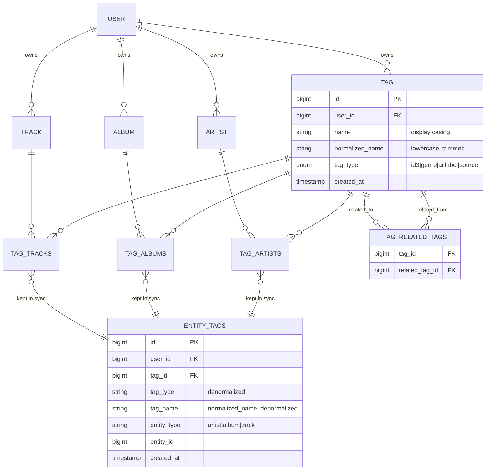
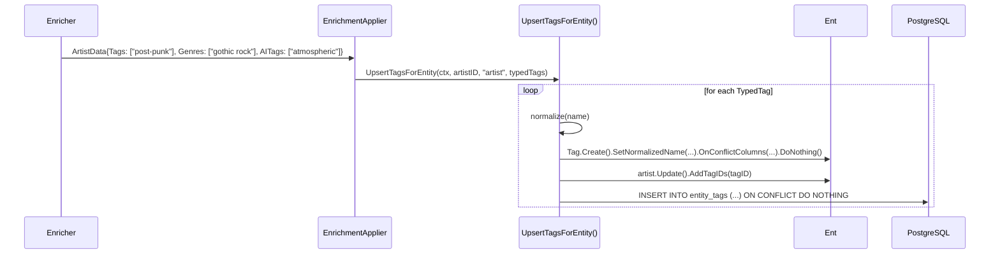
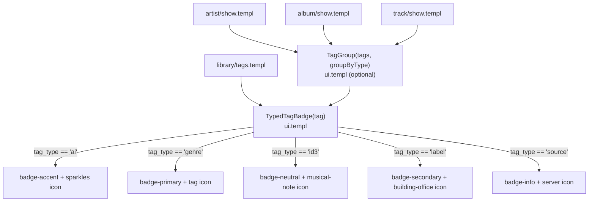

# Design: Unified Tag Taxonomy

## Context

Spotter currently stores tag-like metadata across six or more separate JSON array fields spread
across three entity tables:

| Entity | Field | Source |
|--------|-------|--------|
| Artist | `tags []string` | Last.fm social tags |
| Artist | `genres []string` | Spotify genre list |
| Artist | `ai_tags []string` | OpenAI-generated tags |
| Album | `genre string` | Scalar primary genre |
| Album | `tags []string` | Last.fm / Spotify tags |
| Album | `ai_tags []string` | OpenAI-generated tags |
| Album | `label string` | Record label |
| Track | `tags []string` | Last.fm tags |
| Track | `genres []string` | Navidrome genres from file metadata |
| Track | `ai_tags []string` | OpenAI-generated tags |

This approach loses tag provenance (you can't tell a Spotify genre from a Last.fm social tag
once stored), prevents library filtering by tag source type, and requires verbose PostgreSQL
JSONB UNION queries for aggregation (ADR-0024). Tags cannot be related to each other for
discovery, and the same tag string is duplicated across thousands of entity rows.

Governing ADRs: ADR-0004 (Ent ORM), ADR-0011 (Tailwind + DaisyUI), ADR-0015 (enricher registry),
ADR-0023 (PostgreSQL), ADR-0024 (tag browsing), ADR-0025 (this decision).

## Goals / Non-Goals

### Goals

- First-class `Tag` Ent entity with a typed `tag_type` enum (`id3`, `genre`, `ai`, `label`, `source`)
- Normalize tag names to prevent duplicate variants ("Shoegaze" / "shoegaze" / " shoegaze ")
- Denormalized `entity_tags` table for O(1) filtered lookups by tag type and entity type
- Self-referential `related_tags` edge for discovery (suggest related genres when browsing)
- Typed UI badge rendering: each tag type gets a unique icon and DaisyUI badge color
- AI tag branding consistent with existing AI UI patterns (sparkles + accent color)
- One-time idempotent migration from legacy JSON fields
- All enrichers write to Tag entities instead of JSON fields post-migration

### Non-Goals

- User-created custom tags (may be added in a future spec)
- Hierarchical tag trees or parent/child genre taxonomies
- Full-text search across tag names (covered by the existing search spec)
- Tag editing or merging UI (post-MVP)
- Automatic tag relationship inference (relationship links are manually curated or left empty initially)
- Removing legacy JSON fields in this release (deprecated but retained for rollback safety)

## Decisions

### Tag Entity vs. JSONB Typed Objects

**Choice**: First-class `Tag` Ent entity with relational edges.

**Rationale**: A proper relational entity enables unique constraints on `(normalized_name, tag_type, user_id)`, self-referential edges for related tags, standard Ent query builder support, and foreign key integrity for the denormalized `entity_tags` table. JSONB typed objects would retain the flat-storage problem and prevent tag relationships.

**Alternatives considered**:
- `tags []TagEntry` (typed JSON): simpler migration but JSONB query complexity grows, no unique constraint, no relationships, GIN index less efficient on nested objects.
- Separate columns per type (`id3_tags`, `genre_tags`, etc.): 5 columns × 3 entities = 15 columns; UNION queries become worse, not better; still no relationships.

### Denormalized `entity_tags` Table vs. Ent Junction Joins

**Choice**: Maintain a denormalized `entity_tags` table in parallel with the Ent junction tables.

**Rationale**: The Ent many-to-many junctions require a three-table JOIN (entity → junction → tag)
for every filtered query. A denormalized table with `tag_type` and `tag_name` pre-copied enables
single-table indexed lookups: `SELECT entity_id FROM entity_tags WHERE user_id=? AND tag_type=? AND tag_name=? AND entity_type=?`. This is especially important for the library/tag browsing page
(ADR-0024) that issues these queries on every page load.

**Alternatives considered**:
- Query Ent junction tables with JOINs: correct but slower; GIN indexes don't help across the junction.
- PostgreSQL materialized view: avoids application-layer sync but adds REFRESH complexity and makes inserts non-immediately-consistent.

**Sync strategy**: Application-level sync in the same transaction as the Ent edge mutation, using Ent hooks or explicit `entity_tags` inserts in service methods. This keeps the sync atomic without requiring triggers.

### Tag Normalization in Application vs. Database

**Choice**: Normalize in the application layer (Go) before Ent upsert.

**Rationale**: `strings.ToLower` + `strings.TrimSpace` + `strings.Fields` join in Go is deterministic,
testable, Unicode-aware, and keeps the schema simple. Database-generated columns or triggers add
portability concerns across PostgreSQL / MariaDB (ADR-0023 supports both).

### UI: Shared TypedTagBadge Component

**Choice**: A single `TypedTagBadge(tag ent.Tag)` Templ component in `internal/views/components/ui.templ`.

**Rationale**: Centralizes the icon/color mapping table. If a badge style changes, one component
is updated. All pages (artist show, album show, track show, tag browse) automatically pick up
the change. Avoids the current divergence where artist show uses `badge-neutral` for genres and
album show uses `badge-primary`.

### Enricher Output: New Typed Tag Slice

**Choice**: Extend `EnrichmentResult` types to carry typed tag information via a new `TypedTag` struct.

**Rationale**: Enrichers already return `ArtistData.Tags`, `ArtistData.Genres`, and `ArtistData.AITags`
as separate slices — they already know the provenance. The applier layer (which writes enrichment
results to the DB) will be updated to call a shared `UpsertTagsForEntity()` helper that maps
each slice to its tag type and writes to the Tag entity + `entity_tags` table.

## Architecture

### Data Flow: Enrichment → Tag Write

### UI Component Hierarchy

## Risks / Trade-offs

- **Migration complexity** → The backfill must handle null/empty JSON arrays gracefully and be
  idempotent. Use a dedicated `cmd/migrate-tags` subcommand or startup hook with a completion
  flag in the database to ensure it only runs once.
- **entity_tags sync correctness** → If an Ent edge mutation succeeds but the `entity_tags`
  insert fails, the tables diverge. Mitigate by wrapping both in a single database transaction.
  A periodic reconciliation job can be added later for safety.
- **Junction table growth** → Three junction tables (tag_artists, tag_albums, tag_tracks) plus
  `entity_tags` adds ~4 rows per tag association. For a large library this is negligible but
  should be monitored.
- **Enricher re-enrichment clears old tags** → When an enricher re-runs for an entity, old tags
  that are no longer returned by the source should be dissociated. The UpsertTagsForEntity
  helper should diff old vs new tags per type and remove stale associations. This prevents tag
  accumulation over time.
- **related_tags initial state is empty** → Tag relationships are not populated during migration.
  The "related tags" browsing feature will return empty suggestions until relationships are
  populated. This is acceptable for the initial release.

## Migration Plan

### Phase 1: Schema

1. Add `ent/schema/tag.go` — `Tag` entity with fields, edges to User/Artist/Album/Track, self-referential `related_tags` edge, and unique index on `(normalized_name, tag_type, user_id)`
2. Add `entity_tags` table via a raw SQL atlas migration (or Ent custom migration hook)
3. Run `go generate ./ent` to regenerate Ent code
4. Add many-to-many edge fields to `ent/schema/artist.go`, `album.go`, `track.go`

### Phase 2: Service Layer

5. Add `internal/tags/` package with:
   - `Normalize(name string) string` — normalization function
   - `UpsertTagsForEntity(ctx, tx, userID, entityType, entityID string, tags []TypedTag) error`
6. Add `TypedTag` struct to `internal/enrichers/enrichers.go` and update `ArtistData`, `AlbumData`, `TrackData` to include a `TypedTags []TypedTag` field

### Phase 3: Enricher Updates

7. Update each enricher to populate `TypedTags` using the enricher-to-type mapping
8. Update the enrichment applier to call `UpsertTagsForEntity` instead of setting JSON fields

### Phase 4: UI Updates

9. Add `TypedTagBadge` Templ component to `internal/views/components/ui.templ`
10. Update `internal/views/artists/show.templ`, `albums/show.templ`, `tracks/show.templ` to use `TypedTagBadge`
11. Update the tag browsing page (ADR-0024) to query `entity_tags` table instead of JSONB arrays

### Phase 5: Migration

12. Add a one-time backfill in `internal/migrations/` that reads legacy fields and calls `UpsertTagsForEntity` for each entity
13. Mark legacy fields deprecated in schema comments: `// Deprecated: migrated to Tag entity (SPEC-0014)`

### Rollback

Legacy JSON fields are retained during this release. If the migration causes issues, the tag
browsing and enricher writes can be reverted to the JSON-field path while the new Tag entities
are cleaned up. Remove rollback path in the subsequent major version.

## Open Questions

- Should `entity_tags` be maintained via Ent hooks (registered on Tag edge mutations) or via
  explicit service-layer calls in `UpsertTagsForEntity`? Ent hooks are more automatic but harder
  to test; explicit calls are more visible. **Tentative**: explicit calls in the service layer.
- Should the tag browsing page (ADR-0024) be implemented simultaneously with this spec or as a
  follow-on after the schema is stable?
- Should `related_tags` be seeded from a static genre graph (e.g., from MusicBrainz genre
  relationships) or left empty for now? **Tentative**: left empty; populate via a future enricher.
- Should tracks be included in the denormalized `entity_tags` table? Track tags are less
  commonly filtered on in the UI. **Tentative**: include tracks for completeness; remove later
  if performance is a concern.
