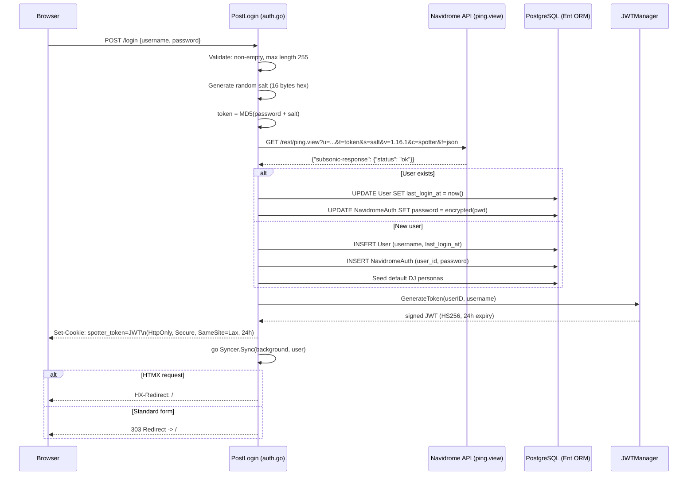
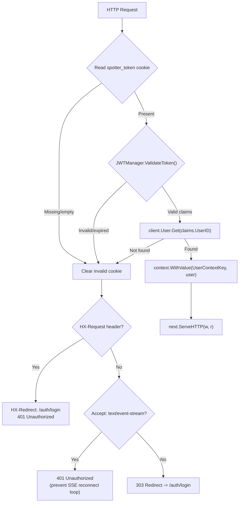
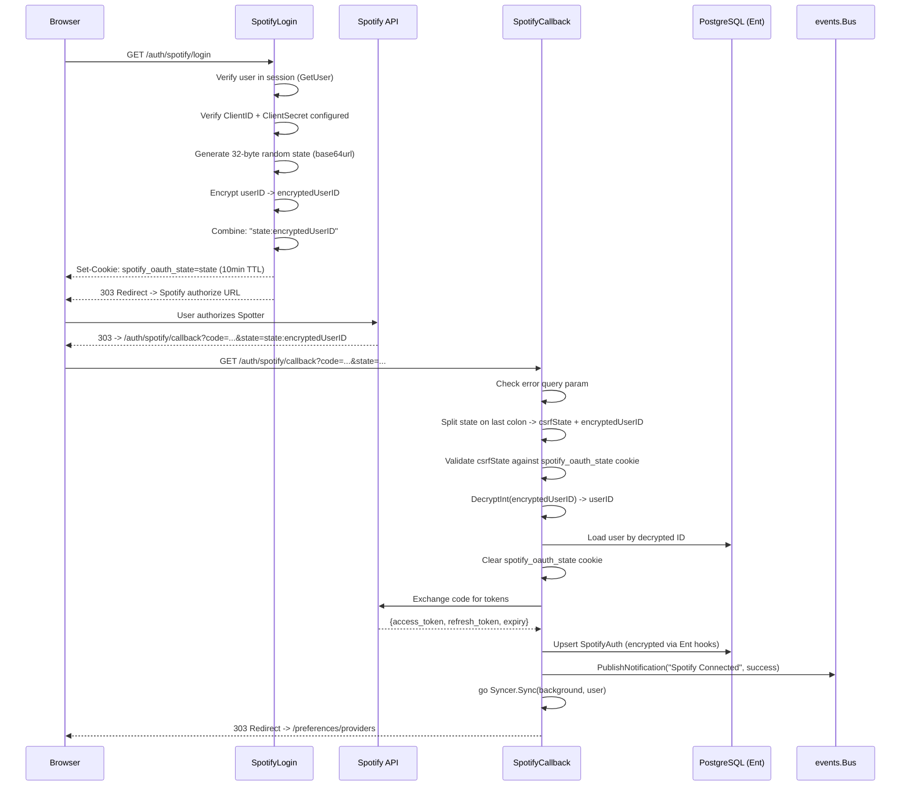
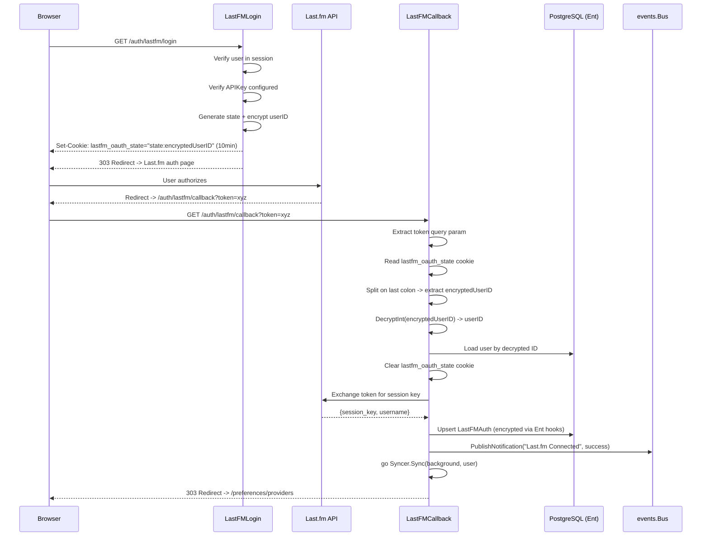

# Design: User Authentication and Session Management

## Context

Spotter is a companion application for Navidrome, a self-hosted music server. Every Spotter user
already has a Navidrome account. Rather than maintaining a separate credential store (with password
hashing, reset flows, and registration), Spotter delegates primary authentication to Navidrome's
Subsonic API. Users log in with their Navidrome username and password, which are validated via the
`ping.view` endpoint using token-salt authentication. On success, Spotter creates a local session
via a JWT cookie.

Beyond the primary login, Spotter supports two OAuth provider integrations -- Spotify (standard
OAuth2 authorization code flow) and Last.fm (token-based non-standard flow). Both use encrypted
user ID embedding in the OAuth state parameter for session recovery across the redirect chain, and
store their tokens encrypted at rest via AES-256-GCM Ent hooks.

Governing ADRs: [ADR-0005](../../adrs/ADR-0005-navidrome-primary-identity-provider.md),
[ADR-0006](../../adrs/ADR-0006-aes256-gcm-application-layer-encryption.md),
[ADR-0002](../../adrs/ADR-0002-chi-http-router.md).

## Goals / Non-Goals

### Goals

- Navidrome passthrough login: validate credentials via Subsonic API `ping.view` with token-salt auth
- Session management: JWT cookie (`spotter_token`) with 24-hour TTL, HttpOnly, Secure, SameSite=Lax
- AuthMiddleware: protect all routes except login, logout, and OAuth callbacks
- Spotify OAuth2: authorization code flow with CSRF state cookie and encrypted user ID
- Last.fm authentication: token exchange flow with encrypted user ID in state cookie
- Encrypted token storage: AES-256-GCM via Ent ORM hooks for all provider credentials
- Background sync trigger: initiate provider sync on successful login or OAuth connection
- Input validation: non-empty checks, max length enforcement on login inputs

### Non-Goals

- Password hashing or local credential storage (delegated to Navidrome)
- Password reset flows, email verification, or user registration
- Multi-factor authentication
- Token refresh within the session (JWT is stateless, 24h expiry, re-login required)
- Rate limiting on login endpoint (handled by separate middleware, not this spec)

## Decisions

### Navidrome Passthrough over Native Accounts

**Choice**: Validate credentials against Navidrome's Subsonic API, store only an encrypted copy
of the password for background API calls.

**Rationale**: Every Spotter user already has a Navidrome account. Maintaining a separate credential
store doubles the security surface (password hashing, breach handling) for zero user benefit.
The Navidrome password stored in `NavidromeAuth` is used only by background sync services, not
for login validation.

**Alternatives considered**:
- Native accounts with bcrypt: adds password management, reset flows, and a second set of credentials for users to manage.
- OAuth2/OIDC with external IdP: adds an external dependency (Google, GitHub, or self-hosted Authentik) inappropriate for a personal homelab tool.

### JWT Session Cookie over Server-Side Sessions

**Choice**: Stateless JWT stored in an HttpOnly cookie with 24-hour expiry.

**Rationale**: A personal server with 1-5 users does not need server-side session storage. The JWT
contains `UserID` and `Username`, is signed with `HS256` using a configurable secret, and is
validated on every request by the middleware. No session database, no session cleanup, no session
invalidation complexity (except logout, which clears the cookie).

**Alternatives considered**:
- Server-side sessions (Redis/database): adds infrastructure for session storage that is unnecessary for a personal deployment.
- Session ID cookie with database lookup: requires a session table and cleanup job.

### Encrypted User ID in OAuth State Parameter

**Choice**: Combine a random CSRF token with an AES-256-GCM-encrypted user ID in the OAuth state
parameter (`"state:encryptedUserID"`).

**Rationale**: OAuth callbacks are public endpoints (the user's browser follows a redirect from
Spotify/Last.fm). The session cookie may not be present in the callback request due to SameSite
restrictions during cross-site redirects. Embedding the encrypted user ID in the state parameter
ensures the callback handler can identify the user even without an active session. The CSRF token
(stored in a separate cookie) prevents state injection attacks.

**Alternatives considered**:
- Rely on session cookie in callback: fails when SameSite=Strict; requires Lax mode which allows the cookie but only for top-level navigations -- fragile across browser implementations.
- Database-backed OAuth state: store state in a table, look up on callback. Adds database writes for a transient operation.

### SameSite=Lax over Strict

**Choice**: All session and OAuth state cookies use `SameSite=Lax`.

**Rationale**: `SameSite=Strict` would prevent the session cookie from being sent during OAuth
redirect chains (Spotify/Last.fm redirect back to Spotter). `SameSite=Lax` allows the cookie
for top-level navigations (GET requests) while still protecting against CSRF on POST requests.

## Architecture

### Login Flow

### AuthMiddleware Pipeline

### Spotify OAuth Flow

### Last.fm Authentication Flow

## Key Implementation Details

- **Login handler**: `internal/handlers/auth.go` -- `PostLogin()` validates inputs, calls `authenticateNavidrome()`, upserts User + NavidromeAuth, generates JWT via `JWTManager.GenerateToken()`, sets cookie, triggers background sync.
- **authenticateNavidrome()**: Constructs Subsonic API request with MD5(password+salt) token-salt auth, 10-second HTTP client timeout, sanitized URL logging (strips `t=` and `s=` params).
- **JWT cookie**: Name `spotter_token`, HttpOnly, Secure (configurable), SameSite=Lax, 24h expiry. Value is HS256-signed JWT with `uid` (user ID), `usr` (username), standard registered claims.
- **JWTManager**: `internal/auth/jwt.go` -- `GenerateToken()` creates JWT with `SpotterClaims` struct. `ValidateToken()` verifies signature, expiry, and claims validity.
- **AuthMiddleware**: `cmd/server/main.go:663-717` -- reads cookie, validates JWT via `JWTManager.ValidateToken()`, looks up user by `claims.UserID`, injects `*ent.User` into context via `handlers.UserContextKey`. Handles HTMX, SSE, and standard browser redirect cases for unauthenticated requests.
- **Spotify OAuth**: `internal/handlers/spotify_auth.go` -- `SpotifyLogin()` generates 32-byte random state, encrypts user ID with `Encryptor.EncryptInt()`, stores CSRF state in `spotify_oauth_state` cookie (10min TTL). `SpotifyCallback()` splits state on last colon, validates CSRF, decrypts user ID, exchanges code, upserts `SpotifyAuth`.
- **Last.fm OAuth**: `internal/handlers/lastfm_auth.go` -- similar pattern to Spotify but adapted for Last.fm's token-based flow (uses `token` query param instead of `code`, state stored entirely in cookie since Last.fm does not support state in its URL).
- **Encryption hooks**: `internal/database/hooks.go` -- `RegisterEncryptionHooks()` registers mutation hooks (encrypt on write) and query interceptors (decrypt on read) for `NavidromeAuth`, `SpotifyAuth`, and `LastFMAuth`. Uses `crypto.IsEncrypted()` heuristic for backward compatibility with previously unencrypted values.
- **Handler base**: `internal/handlers/handlers.go` -- `GetUser()` extracts user from context, `RequireUser()` returns 401 if missing, `RequireUserRedirect()` redirects to login.
- **Input validation**: `ValidateMaxLength()`, `ValidateRequired()` in `internal/handlers/handlers.go`.

Files:
- `internal/handlers/auth.go` -- login, logout, Navidrome authentication
- `internal/handlers/spotify_auth.go` -- Spotify OAuth login and callback
- `internal/handlers/lastfm_auth.go` -- Last.fm authentication login and callback
- `internal/handlers/handlers.go` -- Handler struct, GetUser, validation helpers
- `internal/handlers/auth_helpers.go` -- RequireUser, RequireUserRedirect
- `cmd/server/main.go:663-717` -- AuthMiddleware function
- `internal/auth/jwt.go` -- JWTManager, SpotterClaims, token generation/validation
- `internal/crypto/encrypt.go` -- Encryptor with EncryptInt/DecryptInt for OAuth state
- `internal/database/hooks.go` -- Ent encryption hooks and query interceptors

## Risks / Trade-offs

- **Navidrome dependency for login**: If Navidrome is unreachable, new logins fail (existing sessions continue to work since JWT validation is local). This is an inherent trade-off of passthrough authentication. For a personal deployment where Navidrome and Spotter run side-by-side, this is rarely an issue.
- **Session not invalidated on Navidrome password change**: A user who changes their Navidrome password remains logged into Spotter until the 24-hour JWT expires. The middleware checks the local database, not Navidrome, on every request. Mitigated by the short TTL.
- **Encrypted password stored locally**: `NavidromeAuth.password` is stored encrypted for background sync use. If the encryption key is compromised, the Navidrome password is exposed. Mitigated by AES-256-GCM and key rotation support (SPEC key-rotation).
- **OAuth state cookie expiry (10 minutes)**: If a user takes more than 10 minutes to complete the OAuth flow (e.g., creating a Spotify account mid-flow), the state cookie expires and the callback fails with `session_expired`. The 10-minute window is generous for normal use.
- **Encrypted user ID in state prevents replay but not theft**: If an attacker intercepts the OAuth callback URL (containing the state with encrypted user ID), they could complete the OAuth flow for the victim user. Mitigated by the CSRF cookie validation (attacker would need the victim's browser cookies) and HTTPS.
- **MD5 for Subsonic token-salt auth**: The Subsonic API specification requires MD5(password+salt). This is not Spotter's design choice -- it is the Subsonic protocol. The salt is per-request (16 random bytes), limiting the exposure.

## Migration Plan

Authentication was part of Spotter's initial architecture. The implementation evolved through
several iterations:

1. Initial login flow with Navidrome `ping.view` validation
2. JWT session cookie with configurable `SecureCookies` flag
3. AuthMiddleware with Chi router group separation (public vs protected routes)
4. Spotify OAuth with state cookie CSRF protection
5. Last.fm authentication with adapted token-based flow
6. Encrypted user ID embedding in OAuth state for session recovery
7. Ent encryption hooks for transparent credential encryption
8. Input validation (max length, non-empty checks) added for security hardening
9. HTMX-aware auth redirects (HX-Redirect header for HTMX requests)
10. SSE-aware auth handling (return 401 instead of redirect for EventSource requests)

No database migration is required for the authentication flow itself. The `User`, `NavidromeAuth`,
`SpotifyAuth`, and `LastFMAuth` entities are part of the core schema.

## Open Questions

- Should the JWT expiry be configurable via environment variable? Currently hardcoded to 24 hours. Shorter expiry increases security but requires more frequent re-login.
- Should the AuthMiddleware periodically re-validate the Navidrome credentials (e.g., on every Nth request or hourly)? This would catch revoked Navidrome access but adds latency and Navidrome dependency to normal requests.
- Should OAuth state use HMAC signing instead of AES encryption for the user ID? HMAC is simpler (no nonce, no ciphertext expansion) and sufficient for integrity verification, but AES encryption prevents the user ID from being visible even in the state parameter.
- Should the login handler implement account lockout after N failed attempts? Currently rate limiting is handled by middleware, but there is no per-account lockout mechanism.
