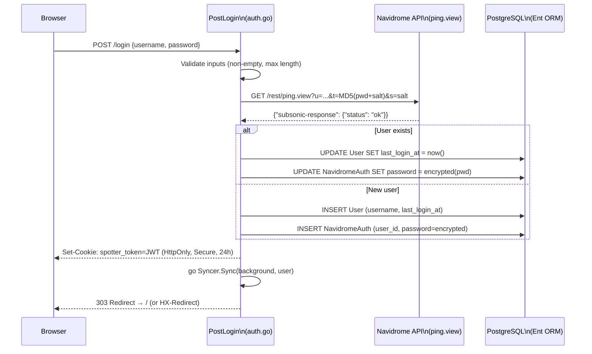
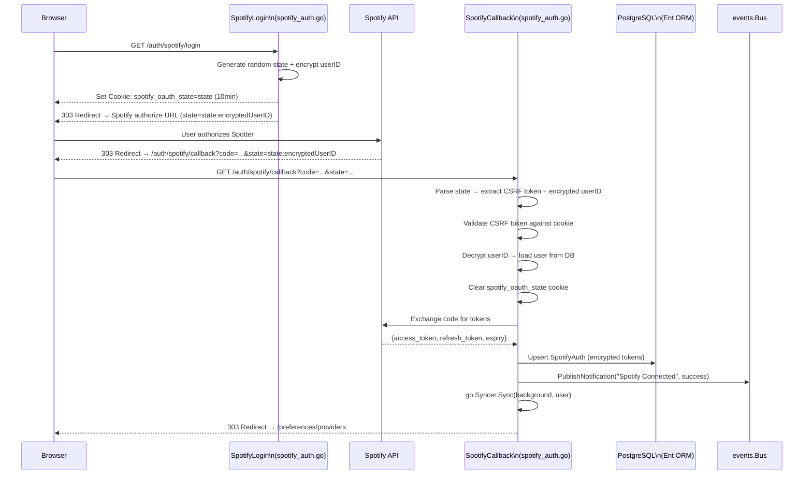

# User Authentication and Session Management

**Status:** accepted
**Version:** 0.1.0
**Last Updated:** 2026-02-21
**Governing ADRs:** ADR-0005 (Navidrome primary identity), ADR-0006 (AES-256-GCM encryption), ADR-0002 (Chi router)

## Overview

Spotter delegates primary authentication to Navidrome's Subsonic API, avoiding a separate credential store. Users log in with their Navidrome username and password, which are validated via the Subsonic `ping.view` endpoint using token-salt authentication. On success, Spotter creates or updates a local `User` record, stores the Navidrome password encrypted (AES-256-GCM) in a `NavidromeAuth` entity for background sync, and sets a session cookie (`spotter_token`) with a 24-hour TTL.

Beyond the primary login, Spotter supports two OAuth provider integrations. Spotify uses a standard OAuth2 authorization code flow with PKCE-less redirect, CSRF protection via a state cookie containing a random token, and an encrypted user ID embedded in the state parameter for session recovery in the callback. Last.fm uses a similar flow adapted to its non-standard auth API (token-based rather than authorization code). Both flows store their respective tokens/session keys in encrypted Ent entities (`SpotifyAuth`, `LastFMAuth`).

The `AuthMiddleware` function (defined in `cmd/server/main.go`) protects all routes except the login page, logout, and OAuth callbacks. It reads the `spotter_token` cookie, queries the PostgreSQL (Ent ORM) for the user, and injects the `*ent.User` into the request context via `handlers.UserContextKey`.

## Scope

This spec covers:
- Navidrome passthrough login flow (credential validation, user upsert, cookie setting)
- Session cookie configuration and lifecycle
- `AuthMiddleware` request authentication
- Spotify OAuth2 authorization code flow with CSRF state protection
- Last.fm authentication flow with token exchange
- OAuth token storage in encrypted Ent entities
- Logout and session invalidation

Out of scope: Navidrome Subsonic API internals, background sync behavior after login, AES-256-GCM encryption implementation details (see ADR-0006), HTMX-specific UI rendering, route definitions (see ADR-0002).

---

## Requirements

### Login Flow

**REQ-AUTH-001** — The `PostLogin` handler (`internal/handlers/auth.go`) MUST accept `username` and `password` form values from `POST /login`.

**REQ-AUTH-002** — The handler MUST validate that both `username` and `password` are non-empty, returning HTTP 400 if either is missing.

**REQ-AUTH-003** — The handler MUST validate that `username` does not exceed `MaxNameLength` (255 characters) using `ValidateMaxLength()`, returning HTTP 400 on violation.

**REQ-AUTH-004** — The handler MUST call `authenticateNavidrome(username, password)` to validate credentials against the Navidrome Subsonic API before creating any session state.

**REQ-AUTH-005** — `authenticateNavidrome()` MUST construct a Subsonic API request to `{baseURL}/rest/ping.view` with the following parameters:
- `u`: username
- `t`: MD5 hash of `password + salt` (hex-encoded)
- `s`: a cryptographically random salt (16 bytes, hex-encoded, generated via `crypto/rand`)
- `v`: Subsonic API version `1.16.1`
- `c`: client identifier `spotter`
- `f`: response format `json`

**REQ-AUTH-006** — `authenticateNavidrome()` MUST verify the JSON response contains `subsonic-response.status == "ok"`. Any other status or HTTP error MUST result in authentication failure.

**REQ-AUTH-007** — On successful authentication, the handler MUST upsert the `User` entity:
- If the user does not exist: create a new `User` with `Username` and `LastLoginAt`, then create a `NavidromeAuth` entity with the password
- If the user exists: update `LastLoginAt` and update the `NavidromeAuth` password

**REQ-AUTH-008** — On successful authentication, the handler MUST trigger a background sync by calling `h.Syncer.Sync()` in a new goroutine with `context.Background()`.

**REQ-AUTH-009** — On successful authentication, the handler MUST set the `spotter_token` session cookie (see Session Management requirements).

**REQ-AUTH-010** — If the request includes the `HX-Request: true` header (HTMX request), the handler MUST respond with an `HX-Redirect: /` header. Otherwise, it MUST issue a standard HTTP 303 redirect to `/`.

### Session Management

**REQ-SESSION-001** — The session cookie MUST have the following properties:
- Name: `spotter_token`
- Value: a signed JWT containing user ID and username, generated by `auth.JWTManager.GenerateToken()`
- Path: `/`
- HttpOnly: `true`
- Secure: determined by `config.Security.SecureCookies`
- SameSite: `Lax`
- Expires: 24 hours from login time

**REQ-SESSION-002** — The `Logout` handler MUST clear the session by setting the `spotter_token` cookie with an empty value and an expiry in the past, then redirect to `/auth/login`.

**REQ-SESSION-003** — The logout cookie MUST preserve the same `Path`, `HttpOnly`, `Secure`, and `SameSite` settings as the login cookie to ensure proper cookie clearing.

### AuthMiddleware

**REQ-MIDDLEWARE-001** — The `AuthMiddleware` function (`cmd/server/main.go:360-389`) MUST be applied to all protected route groups via `r.Use(AuthMiddleware(client))`.

**REQ-MIDDLEWARE-002** — The middleware MUST read the `spotter_token` cookie from the request. If the cookie is missing or its value is empty, the middleware MUST redirect to `/auth/login` with HTTP 303.

**REQ-MIDDLEWARE-003** — The middleware MUST query the Ent `User` entity by `username` from the cookie value. If no user is found (or a database error occurs), the middleware MUST redirect to `/auth/login`.

**REQ-MIDDLEWARE-004** — On successful user lookup, the middleware MUST inject the `*ent.User` into the request context using `handlers.UserContextKey` (a typed `contextKey` string `"user"`) and call `next.ServeHTTP()`.

**REQ-MIDDLEWARE-005** — Handlers MUST retrieve the authenticated user via `h.GetUser(r.Context())`, which extracts the `*ent.User` from the context. A `nil` return value indicates no authenticated user.

### Spotify OAuth

**REQ-SPOTIFY-001** — The `SpotifyLogin` handler (`internal/handlers/spotify_auth.go`) MUST require an existing authenticated session (via `h.GetUser()`). If no user is in session, it MUST redirect to `/auth/login?error=session_required`.

**REQ-SPOTIFY-002** — The handler MUST verify that `Config.Spotify.ClientID` and `Config.Spotify.ClientSecret` are configured. If either is empty, it MUST return HTTP 503.

**REQ-SPOTIFY-003** — The handler MUST generate a cryptographically random state string (32 bytes, base64url-encoded via `crypto/rand`) for CSRF protection.

**REQ-SPOTIFY-004** — The handler MUST encrypt the current user's ID using `h.Encryptor.EncryptInt()` and combine it with the CSRF state in the format `"{state}:{encryptedUserID}"` to form the OAuth state parameter.

**REQ-SPOTIFY-005** — The handler MUST store the CSRF state (without the encrypted user ID) in a cookie named `spotify_oauth_state` with the following properties:
- HttpOnly: `true`
- Secure: determined by `r.TLS != nil`
- SameSite: `Lax`
- Expires: 10 minutes (`spotifyStateTTL`)

**REQ-SPOTIFY-006** — The handler MUST redirect the user to the Spotify authorization URL with the combined state parameter.

**REQ-SPOTIFY-007** — The `SpotifyCallback` handler MUST:
1. Check for an `error` query parameter from Spotify; if present, redirect to `/preferences/providers?error=spotify_denied`
2. Parse the `state` parameter to extract the CSRF token and encrypted user ID (split on the last colon)
3. Validate the CSRF token against the `spotify_oauth_state` cookie value
4. Decrypt the user ID using `h.Encryptor.DecryptInt()`
5. Load the user from the database by decrypted ID
6. Clear the state cookie
7. Exchange the authorization `code` for tokens using `authenticator.ExchangeCode()`
8. Upsert the `SpotifyAuth` entity with `AccessToken`, `RefreshToken`, `Expiry`, and `DisplayName`
9. Publish a success notification via the event bus
10. Trigger a background sync for the user
11. Redirect to `/preferences/providers`

**REQ-SPOTIFY-008** — If any validation step fails (missing state, state mismatch, decryption failure, missing code, exchange failure), the handler MUST redirect to an appropriate error URL and log the failure with the remote IP.

### Last.fm OAuth

**REQ-LASTFM-001** — The `LastFMLogin` handler (`internal/handlers/lastfm_auth.go`) MUST require an existing authenticated session. If no user is in session, it MUST redirect to `/auth/login?error=session_required`.

**REQ-LASTFM-002** — The handler MUST verify that `Config.LastFM.APIKey` is configured. If empty, it MUST return HTTP 503.

**REQ-LASTFM-003** — The handler MUST generate a random state string (32 bytes, base64url-encoded) and encrypt the user ID. The combined `"{state}:{encryptedUserID}"` value MUST be stored in a cookie named `lastfm_oauth_state` with:
- HttpOnly: `true`
- Secure: determined by `r.TLS != nil`
- SameSite: `Lax`
- Expires: 10 minutes (`lastfmStateTTL`)

**REQ-LASTFM-004** — The handler MUST redirect the user to the Last.fm authentication URL. Note: Last.fm does not use the state parameter in its URL; the state is stored solely in the cookie for session recovery.

**REQ-LASTFM-005** — The `LastFMCallback` handler MUST:
1. Extract the `token` query parameter (Last.fm uses `token` instead of `code`); if missing, redirect to `/auth/login?error=missing_token`
2. Read the `lastfm_oauth_state` cookie and parse it to extract the encrypted user ID (split on the last colon)
3. Decrypt the user ID using `h.Encryptor.DecryptInt()`
4. Load the user from the database by decrypted ID
5. Clear the state cookie
6. Exchange the token for a session key using `authenticator.ExchangeCode()`
7. Upsert the `LastFMAuth` entity with `SessionKey` (stored in `AccessToken` field of `AuthResult`) and `Username` (stored in `DisplayName` field)
8. Publish a success notification via the event bus
9. Trigger a background sync for the user
10. Redirect to `/preferences/providers`

**REQ-LASTFM-006** — If the state cookie is missing or the user ID decryption fails, the handler MUST redirect to `/auth/login?error=session_expired`.

---

## Authentication Flow Diagram



## Spotify OAuth Flow Diagram



---

## Scenarios

### Scenario 1: Successful first-time login

```
Given a user has a valid Navidrome account with username "alice" and password "pass123"
And no Spotter User record exists for "alice"
When the user submits POST /login with username="alice" and password="pass123"
Then authenticateNavidrome calls Navidrome ping.view with token-salt auth and receives status "ok"
And a new User entity is created with Username="alice" and LastLoginAt=now
And a new NavidromeAuth entity is created with the encrypted password
And a background Syncer.Sync goroutine is started for the user
And the response sets cookie spotter_token=JWT with HttpOnly, SameSite=Lax, 24h expiry
And the user is redirected to /
```

### Scenario 2: Failed Navidrome authentication

```
Given a user submits POST /login with username="alice" and password="wrong"
When authenticateNavidrome calls Navidrome ping.view
Then Navidrome returns subsonic-response.status != "ok"
And authenticateNavidrome returns an error
And the handler responds with HTTP 401 "Invalid credentials or Navidrome error"
And no User or NavidromeAuth records are created or updated
And no session cookie is set
```

### Scenario 3: AuthMiddleware rejects unauthenticated request

```
Given a browser sends GET / without a spotter_token cookie
When AuthMiddleware processes the request
Then it detects the missing cookie
And redirects the browser to /auth/login with HTTP 303
And the downstream handler is never called
```

### Scenario 4: Spotify OAuth with CSRF validation

```
Given user "alice" (ID=42) is logged in and clicks "Connect Spotify"
When SpotifyLogin handles the request
Then it generates a 32-byte random state and encrypts userID 42
And stores the CSRF state in spotify_oauth_state cookie (10min TTL)
And redirects to Spotify with state="randomState:encryptedUserID42"
When Spotify calls back with code="abc" and state="randomState:encryptedUserID42"
Then SpotifyCallback parses the state, validates CSRF against the cookie
And decrypts userID 42, loads user from DB
And exchanges the code for access/refresh tokens
And upserts SpotifyAuth with encrypted tokens
And publishes a "Spotify Connected" notification
And triggers a background sync
And redirects to /preferences/providers
```

### Scenario 5: OAuth callback with expired state cookie

```
Given a Spotify OAuth callback arrives but the spotify_oauth_state cookie has expired (>10 minutes)
When SpotifyCallback attempts to read the cookie
Then it fails with a missing cookie error
And the handler redirects to /auth/login?error=session_expired
And no token exchange or database writes occur
```

### Scenario 6: Last.fm token exchange

```
Given user "bob" (ID=7) is logged in and initiates Last.fm connection
When LastFMLogin generates state and encrypts userID 7
Then the combined state:encryptedUserID is stored in lastfm_oauth_state cookie
And the user is redirected to Last.fm auth page
When Last.fm calls back with token="xyz"
Then LastFMCallback reads the state cookie, decrypts userID 7
And exchanges the token for a session key via authenticator.ExchangeCode()
And upserts LastFMAuth with SessionKey and Username
And publishes a "Last.fm Connected" notification
And triggers a background sync
```

---

## Implementation Notes

- Login handler: `internal/handlers/auth.go` — `PostLogin()`, `authenticateNavidrome()`, `Login()`, `Logout()`
- Spotify OAuth: `internal/handlers/spotify_auth.go` — `SpotifyLogin()`, `SpotifyCallback()`, `generateState()`
- Last.fm OAuth: `internal/handlers/lastfm_auth.go` — `LastFMLogin()`, `LastFMCallback()`
- Auth middleware: `cmd/server/main.go:360-389` — `AuthMiddleware()` function
- Handler base: `internal/handlers/handlers.go` — `GetUser()`, `UserContextKey`, `Handler` struct
- Input validation: `internal/handlers/handlers.go` — `ValidateMaxLength()`, `ValidateRequired()`
- Encryption: `internal/crypto/encryptor.go` — `Encryptor.EncryptInt()`, `Encryptor.DecryptInt()`
- Spotify auth factory: `internal/providers/spotify/auth.go` — `NewAuthenticator()`
- Last.fm auth factory: `internal/providers/lastfm/auth.go` — `NewAuthenticator()`
- Route groups: `cmd/server/main.go:221-333` — public routes (login, callbacks) and protected routes (everything else)
- Governing comment: `// Governing: ADR-0005 (Navidrome auth), ADR-0006 (AES-256-GCM), ADR-0002 (Chi router), SPEC user-authentication`
