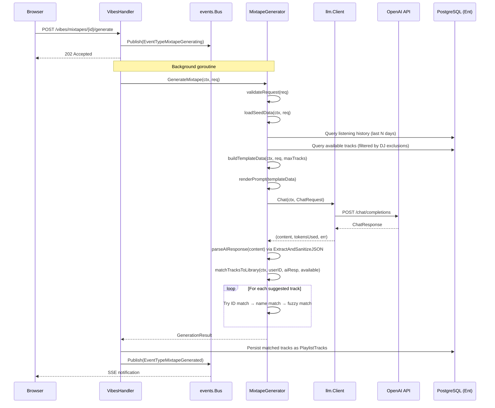
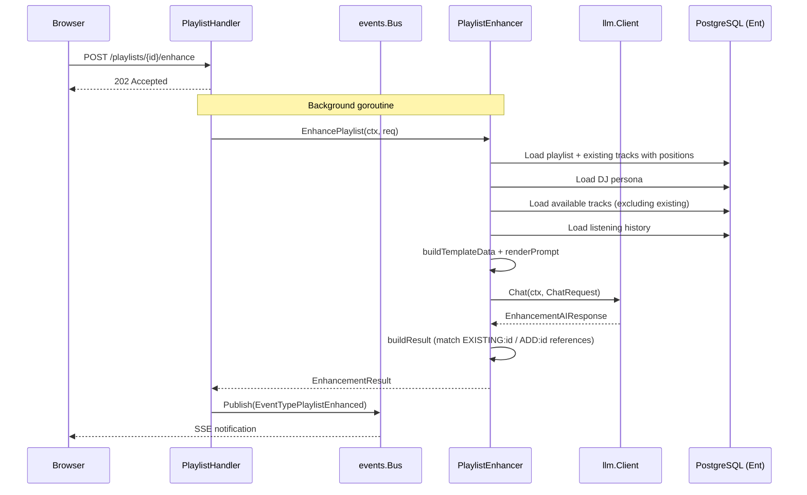
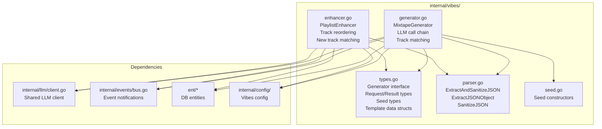
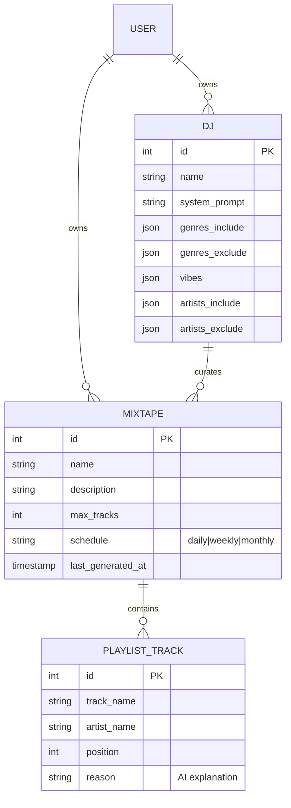

# Design: Vibes AI Mixtape Generation and Playlist Enhancement Engine

## Context

Spotter's core differentiator is AI-powered music curation. The Vibes engine is the subsystem
that makes this possible: it takes a DJ persona (with genre preferences, mood vibes, and a
personality prompt), combines it with the user's listening history and local library catalog,
and asks an LLM to curate a playlist. The result is a mixtape that feels like it was assembled
by a human DJ who knows the user's music collection intimately.

The engine supports two operations: **generation** (create a new mixtape from scratch) and
**enhancement** (reorder and augment an existing playlist). Both are asynchronous — HTTP
handlers return immediately while the LLM call runs in a background goroutine, with progress
delivered via the event bus.

Governing ADRs: [ADR-0007](../../adrs/ADR-0007-in-memory-event-bus.md) (event bus),
[ADR-0008](../../adrs/ADR-0008-openai-api-litellm-compatible-llm-backend.md) (OpenAI API),
[ADR-0017](../../adrs/ADR-0017-vibes-generator-interface-abstraction.md) (Generator interface).

## Goals / Non-Goals

### Goals

- Generate AI-curated mixtapes from DJ personas with optional artist/album/track seeds
- Enhance existing playlists by reordering tracks and adding new ones from the library
- Load and render prompts from external template files (Go `text/template`)
- Match AI track suggestions to the user's Navidrome library using fuzzy matching
- Record token usage and model name for cost visibility
- Publish event bus notifications for real-time UI feedback
- Support configurable parameters: max tracks, temperature, timeout, history window
- Define a `Generator` interface for future provider swappability

### Non-Goals

- Writing generated playlists to Navidrome (handled by the playlist sync service)
- Implementing the track matching algorithm (see track-matching spec, though vibes has an inline copy)
- Streaming LLM responses to the browser in real-time (responses are collected in full)
- Supporting multiple concurrent LLM providers (single provider per deployment)
- DJ persona CRUD operations (handled by Ent schema and basic handler operations)
- Mixtape scheduling execution (the scheduler triggers generation; this spec covers the engine)

## Decisions

### Separate Generator and Enhancer Services

**Choice**: Two concrete structs — `MixtapeGenerator` and `PlaylistEnhancer` — each with their
own LLM client, template set, and prompt rendering logic.

**Rationale**: Generation and enhancement have fundamentally different prompt structures.
Generation starts from a blank slate with DJ preferences and seed data. Enhancement requires
the full existing track list with positions and must produce a response that includes all
original tracks plus new additions. Separate structs keep each concern focused and allow
independent prompt template evolution.

**Alternatives considered**:
- Unified `VibesService` with mode parameter: would bloat a single struct and make prompt
  rendering conditional. Harder to test each operation in isolation.
- Shared `Generator` interface for both: the response schemas differ (`AIResponse` vs
  `EnhancementAIResponse`), so a shared interface would require type assertions.

### External Prompt Templates over Hardcoded Strings

**Choice**: Load prompt templates from `{vibes.prompts_directory}/*.tmpl` files using Go's
`text/template` engine. Fall back to a hardcoded minimal prompt if templates are missing.

**Rationale**: Prompt engineering is iterative. External templates allow modifying prompts
without recompiling the binary — critical for a deployed Docker container. The fallback ensures
the system degrades gracefully if the template directory is misconfigured or the container
lacks the template files.

**Alternatives considered**:
- Embedded templates via `//go:embed`: requires recompilation for prompt changes; poor for
  iterative tuning.
- Database-stored templates: adds unnecessary complexity for a single-user system.
- No templates (inline strings): makes prompts harder to read, edit, and version control.

### In-Library Track Matching with Inline Fuzzy Logic

**Choice**: The `MixtapeGenerator` includes its own `findBestFuzzyMatch`, `normalizeForMatch`,
`similarity`, and `levenshtein` functions that operate on `[]AvailableTrack` rather than
importing from `internal/services/track_matcher.go`.

**Rationale**: The vibes matching operates on `AvailableTrack` structs (which include
pre-filtered library tracks with genre/energy/BPM metadata), while the track matcher operates
on `*ent.Track` entities. The matching logic is intentionally duplicated to avoid a dependency
on the services package and to keep the vibes package self-contained.

**Alternatives considered**:
- Import shared matching functions from track_matcher.go: would create a circular or awkward
  dependency between packages. The `AvailableTrack` vs `*ent.Track` mismatch would require
  adapter code.
- Shared `internal/matching/` package: the cleanest solution architecturally, but not yet
  implemented. This is a known tech debt item.

### Generator Interface with Single Implementation

**Choice**: Define a `Generator` interface in `types.go` with `GenerateMixtape(ctx, req) (result, error)`.
`MixtapeGenerator` is the sole implementation.

**Rationale**: The interface enables future swappability (e.g., an Anthropic-backed generator
or a rule-based generator for testing). Handler tests can mock the interface. Currently the
`Handler` struct still holds concrete types (`*vibes.MixtapeGenerator`), so the decoupling
benefit is not yet fully realized — but the interface is positioned for the migration.

**Alternatives considered**:
- No interface: simpler but couples handlers permanently to the OpenAI implementation.
- Function callbacks: lightweight but lose discoverability and cannot carry shared state.

### ID-First Track Resolution

**Choice**: When matching AI responses to the library, first try exact integer ID match (since
the prompt includes track IDs), then exact name match, then fuzzy Levenshtein match.

**Rationale**: The prompt explicitly includes track IDs (e.g., `42: "So What" by Miles Davis`).
A well-behaved LLM will return these IDs in its response. ID matching is O(1) and perfectly
accurate. Name and fuzzy matching serve as fallbacks for when the LLM hallucinates or formats
IDs incorrectly.

## Architecture

### Generation Flow



### Enhancement Flow



### Component Structure



### Data Model



## Key Implementation Details

### Files

- **Types**: `internal/vibes/types.go` — `Generator` interface, `GenerationRequest`, `GenerationResult`, `GeneratedTrack`, `Seed`, `SeedType`, `TemplateData`, `AIResponse`, `EnhancementRequest`, `EnhancementResult`, `EnhancedTrack`, `EnhancementAIResponse`
- **Generator**: `internal/vibes/generator.go` — `MixtapeGenerator`, `GenerateMixtape`, prompt rendering, LLM calling, track matching
- **Enhancer**: `internal/vibes/enhancer.go` — `PlaylistEnhancer`, `EnhancePlaylist`, existing track loading, result building
- **Parser**: `internal/vibes/parser.go` — `ExtractAndSanitizeJSON`, `ExtractJSONObject`, `SanitizeJSON`, trailing comma handling
- **Seeds**: `internal/vibes/seed.go` — `NewArtistSeed`, `NewAlbumSeed`, `NewTracksSeed`, `NewTrackIDsSeed`
- **Tests**: `internal/vibes/generator_test.go`, `enhancer_test.go`, `parser_test.go`, `seed_test.go`

### Prompt Template Data

The `TemplateData` struct provides the template with:
- DJ attributes: name, system prompt, genre/artist include/exclude lists, vibes/moods
- Seed data: artist (name, genres, bio, AI summary), album (name, artist, year, genre), or tracks
- Listening history: recent plays aggregated by track with play counts
- Available tracks: up to 500 tracks from the library with ID, name, artist, album, genres, energy, valence, BPM
- Mixtape settings: name, description, max tracks

### JSON Parsing Pipeline

LLM responses are parsed through a robust pipeline:
1. `ExtractAndSanitizeJSON` → `extractJSONFromText` + `SanitizeJSON`
2. `extractJSONFromText` tries: markdown ` ```json ` blocks, plain ` ``` ` blocks, raw `{...}` extraction
3. `SanitizeJSON` strips trailing commas before `}` or `]` (common LLM output error)
4. `ExtractJSONObject` provides an alternative parser using brace-depth matching with proper string escaping

### Enhancement Track ID Protocol

The enhancement prompt uses a prefixed ID protocol:
- `EXISTING:42` — refers to an existing playlist track with internal ID 42
- `ADD:99` — refers to a new track from the available library with ID 99

The `buildResult` method parses these prefixes using a regex (`^(EXISTING|ADD):(\d+)$`) and
resolves them against lookup maps. Plain numeric IDs are also accepted as a fallback.

### LLM Configuration Hierarchy

```text
Model:       config.GetVibesModel() → SPOTTER_VIBES_MODEL → SPOTTER_OPENAI_MODEL → "gpt-4o"
Temperature: config.Vibes.Temperature → 0.8 (default)
Max Tokens:  config.Vibes.MaxTokens → 4000 (default, ~4096 in spec)
Timeout:     config.Vibes.TimeoutSeconds → 120s (default)
Base URL:    config.OpenAI.BaseURL → "https://api.openai.com/v1" (default)
```

### Event Bus Notifications

| Event | Title | IconType |
|-------|-------|----------|
| Generation started | Published by handler before goroutine | info |
| Generation succeeded | "Mixtape Generated" with track count and tokens | success |
| Generation failed | "Mixtape Generation Failed" with error message | error |
| Enhancement succeeded | Published via `PublishPlaylistEnhanced` | success |
| Enhancement failed | Published via `PublishPlaylistEnhancementError` | error |

All bus calls are nil-guarded for testing contexts.

## Risks / Trade-offs

- **Duplicated matching logic** — `generator.go` contains its own `normalizeForMatch`,
  `similarity`, and `levenshtein` functions that are nearly identical to those in
  `track_matcher.go`. Bug fixes must be applied in both locations. This is a known tech debt.
- **500-track library cap** — `getAvailableTracks` limits to 500 tracks to avoid exceeding
  LLM context windows. For libraries with 10K+ tracks, the LLM only sees a fraction of what
  is available. A smarter selection strategy (e.g., prioritize genre-relevant tracks) would
  improve quality.
- **No streaming** — The LLM response is collected in full before parsing. For large responses
  (100-track playlists with reasons), this can take 30-60 seconds with no progress feedback
  beyond the initial "generating" notification.
- **Single-shot generation** — If the LLM returns fewer tracks than requested or many unmatched
  tracks, there is no retry or follow-up prompt asking for replacements. The user must
  regenerate manually.
- **Fallback prompt quality** — The fallback prompts are minimal and lack the nuance of the
  template-based prompts. If the template directory is missing, generation quality degrades
  significantly.
- **No prompt caching** — Each generation call re-renders the prompt from scratch, including
  re-querying the library and listening history. For scheduled regeneration of the same mixtape,
  this duplicates work.
- **Handler still uses concrete types** — Per ADR-0017, the `Handler` struct holds
  `*vibes.MixtapeGenerator` and `*vibes.PlaylistEnhancer` rather than the `Generator`
  interface. The decoupling benefit is not yet realized at the wiring level.

## Migration Plan

The Vibes engine was built incrementally:

1. **Types and interface**: Defined `Generator` interface, request/result types, seed types,
   and template data structures in `types.go`.
2. **MixtapeGenerator**: Implemented generation with template rendering, LLM calling, and
   track matching in `generator.go`. Wired into handlers via `cmd/server/main.go`.
3. **PlaylistEnhancer**: Implemented enhancement with existing track loading, `EXISTING:/ADD:`
   ID protocol, and result building in `enhancer.go`.
4. **Parser hardening**: Added `ExtractAndSanitizeJSON`, `ExtractJSONObject`, and `SanitizeJSON`
   in `parser.go` to handle markdown fences, trailing commas, and malformed JSON.
5. **LLM client extraction**: Migrated from inline `net/http` calls to the shared `llm.Client`
   (issue #119).
6. **Seed support**: Added artist, album, and track seed types with Ent entity loading.
7. **Observability**: Added `metric.llm` structured logging for all LLM calls.

## Open Questions

- Should the 500-track available library cap be configurable, or should the engine use a smarter
  selection strategy (e.g., prioritize tracks in the DJ's included genres)?
- Should failed generations retry automatically with a modified prompt (e.g., asking for
  replacement tracks for unmatched suggestions)?
- Should the `PlaylistEnhancer` implement a second `Enhancer` interface alongside `Generator`
  for unified handler abstraction?
- Should prompt templates be versioned (e.g., `generate_mixtape_v2.tmpl`) to allow A/B testing
  different prompt strategies?
- Should the engine support "negative feedback" — tracks the user explicitly dislikes — as
  input to the prompt? The `DislikedTracks` field exists in `TemplateData` but is not yet
  populated.
- Should generation results (prompt used, model, tokens) be persisted to the database for
  debugging and cost tracking, or is structured logging sufficient?
