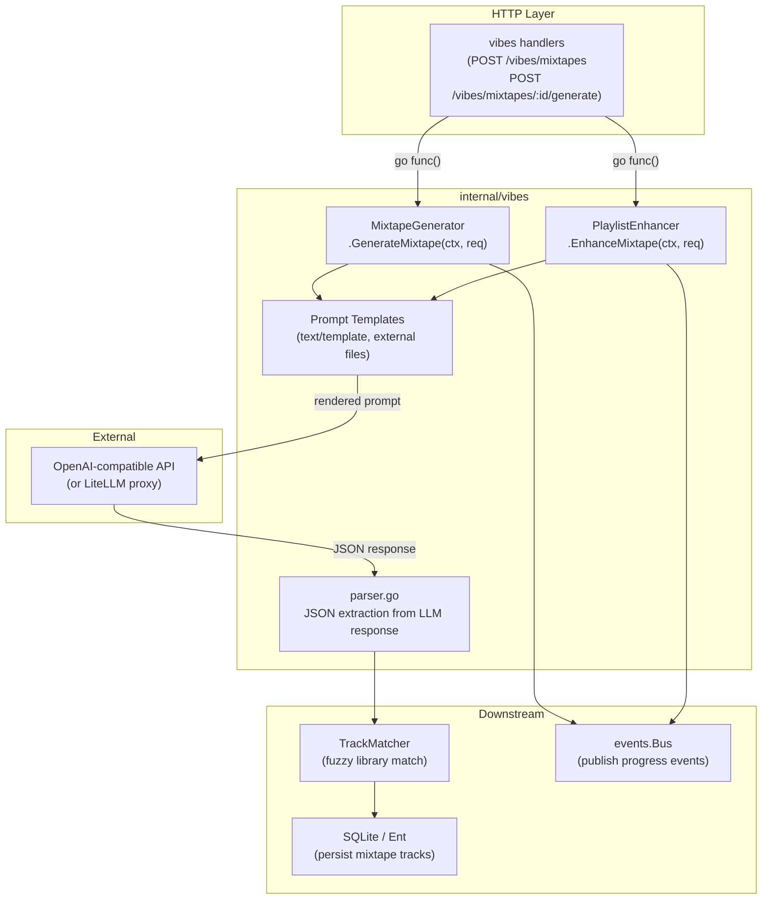

# Vibes AI Mixtape Generation and Playlist Enhancement Engine

**Status:** accepted
**Version:** 0.1.0
**Last Updated:** 2026-02-21
**Governing ADRs:** ADR-0007 (in-memory event bus)

## Overview

The Vibes engine is Spotter's AI-powered music curation subsystem. It generates new mixtapes using LLM-driven track selection guided by DJ personas, and enhances existing playlists by reordering and augmenting them with AI-suggested additions. All operations are asynchronous — they run in background goroutines and communicate progress through the event bus.

## Scope

This spec covers:
- DJ persona management (create, read, update, delete)
- Mixtape generation from a DJ persona with optional seed (artist, album, or tracks)
- Playlist enhancement (reorder + add tracks) using a DJ persona
- Prompt template loading and rendering
- Track matching from AI suggestions to the user's Navidrome library
- Event publication for real-time UI feedback
- Mixtape scheduling (daily/weekly/monthly regeneration)

Out of scope: SSE streaming (see Event Bus & SSE spec), Navidrome write-back (see Playlist Sync spec), track matching algorithm details (see Playlist Sync spec).

---

## Requirements

### DJ Persona Management

**REQ-VIBES-001** — The system MUST allow users to create DJ personas with the following configurable attributes:
- Name (required, max 255 characters)
- System prompt (optional, max 10,000 characters) — free-form personality description
- Genres to include (optional list)
- Genres to exclude (optional list)
- Vibes/moods (optional list)
- Artists to include (optional list)
- Artists to exclude (optional list)

**REQ-VIBES-002** — The system MUST enforce that DJ personas belong to a specific user and MUST NOT be shared across users.

**REQ-VIBES-003** — The system MUST allow users to delete DJ personas. Deletion SHOULD cascade to associated Mixtapes or require explicit confirmation.

### Mixtape Generation

**REQ-VIBES-010** — The system MUST support generating a mixtape given a DJ persona. Generation MUST be asynchronous — the HTTP handler MUST return immediately and results MUST be delivered via the event bus.

**REQ-VIBES-011** — The system MUST support optional generation seeds:
- **No seed** — DJ generates freely from user's full library
- **Artist seed** — generation is anchored to a specific artist's style
- **Album seed** — generation reflects the mood/genre of a specific album
- **Track list seed** — generation is seeded from a provided list of tracks

**REQ-VIBES-012** — The generation prompt MUST include:
- DJ persona attributes (name, system prompt, genres, vibes, artist preferences)
- Seed data (if provided) with AI-enriched metadata (bio, genres, summary)
- A sample of the user's recent listening history (configurable: `vibes.history_days`, `vibes.max_history_tracks`)
- The list of available tracks in the user's library (with genres, energy, valence, BPM where available)
- The desired track count (`vibes.default_max_tracks`, bounded by `vibes.min_tracks` and `vibes.max_tracks`)

**REQ-VIBES-013** — Prompts MUST be loaded from external template files in the configured `vibes.prompts_directory`. The system MUST use Go's `text/template` engine with the `TemplateData` struct as context. Hardcoded prompt strings are NOT permitted.

**REQ-VIBES-014** — The system MUST call an OpenAI-compatible API endpoint (configurable via `openai.base_url`) using the configured model (`vibes.model` or `openai.model`). The system MUST support LiteLLM-compatible proxies as drop-in replacements.

**REQ-VIBES-015** — The AI response MUST be parsed as JSON conforming to the `AIResponse` schema:
```json
{
  "tracks": [{"id": "str", "name": "str", "artist": "str", "reason": "str"}],
  "flow_description": "str",
  "opening_thoughts": "str",
  "closing_thoughts": "str"
}
```

**REQ-VIBES-016** — Each AI-suggested track MUST be fuzzy-matched against the user's library. The system MUST apply the configured `vibes.min_match_confidence` threshold. Tracks below threshold MUST be excluded from the final mixtape. The system MUST record both matched and unmatched counts in `GenerationResult`.

**REQ-VIBES-017** — Upon successful generation, the system MUST persist the mixtape tracks to the database and MUST publish a `EventTypeMixtapeGenerated` event. On failure, MUST publish `EventTypeMixtapeError`.

**REQ-VIBES-018** — The system MUST record token usage (`TokensUsed`) and model name (`ModelUsed`) in the `GenerationResult` for cost visibility.

### Playlist Enhancement

**REQ-VIBES-020** — The system MUST support enhancing an existing playlist using a DJ persona. Enhancement MUST be asynchronous.

**REQ-VIBES-021** — Enhancement MUST support two modes:
- `one_time` — apply changes directly to Navidrome without creating a persistent Mixtape entity
- `convert_to_mixtape` — convert the playlist into a DJ-managed Mixtape for recurring regeneration

**REQ-VIBES-022** — The enhancement prompt MUST include:
- DJ persona attributes
- All existing playlist tracks with their current positions, genres, energy, and BPM
- Available library tracks for potential addition
- Maximum number of new tracks to add (`max_new_tracks`, default 5)
- User's recent listening history

**REQ-VIBES-023** — The AI response for enhancement MUST conform to the `EnhancementAIResponse` schema, providing reordered existing tracks with new positions and new tracks to add.

**REQ-VIBES-024** — Upon successful enhancement, the system MUST publish `EventTypePlaylistEnhanced`. On failure, MUST publish `EventTypePlaylistEnhanceError`.

### Generation Timeout and Error Handling

**REQ-VIBES-030** — The system MUST enforce a configurable HTTP timeout for AI API calls (`vibes.timeout_seconds`, default 120 seconds). Requests exceeding the timeout MUST be cancelled and MUST publish an error event.

**REQ-VIBES-031** — If the AI response cannot be parsed as valid JSON, the system MUST attempt to extract a JSON block from the response body before failing. This handles models that emit markdown code fences around JSON.

**REQ-VIBES-032** — Generation errors MUST be logged with structured fields including user ID, DJ ID, mixtape ID, and error message. Errors MUST NOT crash the background goroutine.

---

## Data Model

```
DJ
├── id: int (primary key)
├── name: string
├── system_prompt: string (optional)
├── genres_include: []string
├── genres_exclude: []string
├── vibes: []string
├── artists_include: []string
├── artists_exclude: []string
└── edges → User, Mixtapes[]

Mixtape
├── id: int (primary key)
├── name: string
├── description: string (optional)
├── max_tracks: int
├── schedule: string (optional: "daily"|"weekly"|"monthly")
├── last_generated_at: time
└── edges → User, DJ, PlaylistTracks[]

GenerationRequest
├── Mixtape: *ent.Mixtape
├── DJ: *ent.DJ
├── Seed: *Seed (optional)
├── MaxTracks: int
└── UserID: int

GenerationResult
├── Tracks: []GeneratedTrack
├── FlowDescription: string
├── OpeningThoughts: string
├── ClosingThoughts: string
├── PromptUsed: string
├── ModelUsed: string
├── TokensUsed: int
├── MatchedCount: int
└── UnmatchedCount: int
```

---

## Component Diagram



---

## Configuration Reference

| Config Key | Default | Description |
|---|---|---|
| `vibes.default_max_tracks` | 25 | Default tracks per mixtape |
| `vibes.min_tracks` | 5 | Minimum tracks for a valid result |
| `vibes.max_tracks` | 100 | Hard upper limit |
| `vibes.history_days` | 30 | Days of listening history to include in prompt |
| `vibes.max_history_tracks` | 50 | Max history entries in prompt |
| `vibes.model` | (uses `openai.model`) | AI model override for vibes |
| `vibes.temperature` | 0.8 | AI creativity (0.0–2.0) |
| `vibes.max_tokens` | 4096 | Max response tokens |
| `vibes.timeout_seconds` | 120 | HTTP timeout for AI calls |
| `vibes.prompts_directory` | `./prompts` | Directory containing `.tmpl` prompt files |
| `vibes.min_match_confidence` | 0.7 | Minimum fuzzy match threshold (0.0–1.0) |

---

## Scenarios

### Scenario 1: Generate a mixtape from a DJ persona

```
Given a user has a DJ persona "Late Night Jazz" with genres_include=["jazz", "soul"]
And the user's library contains 500 tracks
When the user requests mixtape generation
Then the system publishes EventTypeMixtapeGenerating immediately
And loads the generation prompt template from prompts_directory
And renders it with DJ attributes + listening history + available tracks
And calls the OpenAI API with the rendered prompt
And parses the JSON response into an AIResponse
And fuzzy-matches each suggested track against the library
And persists matched tracks as PlaylistTracks on the Mixtape
And publishes EventTypeMixtapeGenerated with matched/unmatched counts
```

### Scenario 2: Generation with an artist seed

```
Given a DJ persona and an artist seed for "Miles Davis"
When generation is requested
Then the prompt template receives SeedType=artist and SeedArtist with name, genres, bio, AI summary
And the generated mixtape reflects the artist's sonic neighborhood
```

### Scenario 3: AI response contains markdown code fences

```
Given the LLM returns ```json\n{...}\n```
When the parser processes the response
Then it strips the markdown fences and parses the inner JSON
And generation succeeds without error
```

### Scenario 4: Generation timeout

```
Given the AI API does not respond within vibes.timeout_seconds
When the HTTP client times out
Then the system logs the timeout with structured fields
And publishes EventTypeMixtapeError with a descriptive message
And the background goroutine exits cleanly
```

---

## Implementation Notes

- `MixtapeGenerator` and `PlaylistEnhancer` are separate service structs injected at startup (`cmd/server/main.go`)
- Prompt templates are loaded once at service initialization with a warning if the directory is missing
- The `AvailableTrack` list passed to the LLM SHOULD be truncated to avoid exceeding context length limits
- `GeneratedTrack.ExternalID` preserves the AI's track ID string for debugging even after library matching
- The `generator.go` file contains the full LLM call chain; `parser.go` handles JSON extraction
